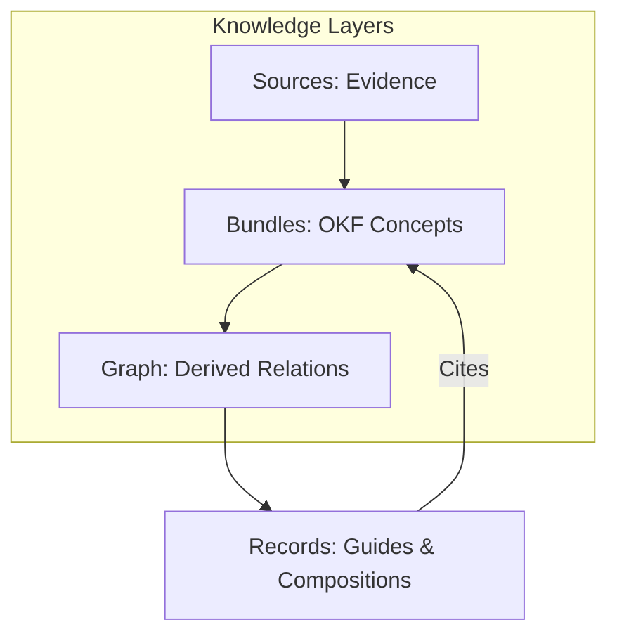
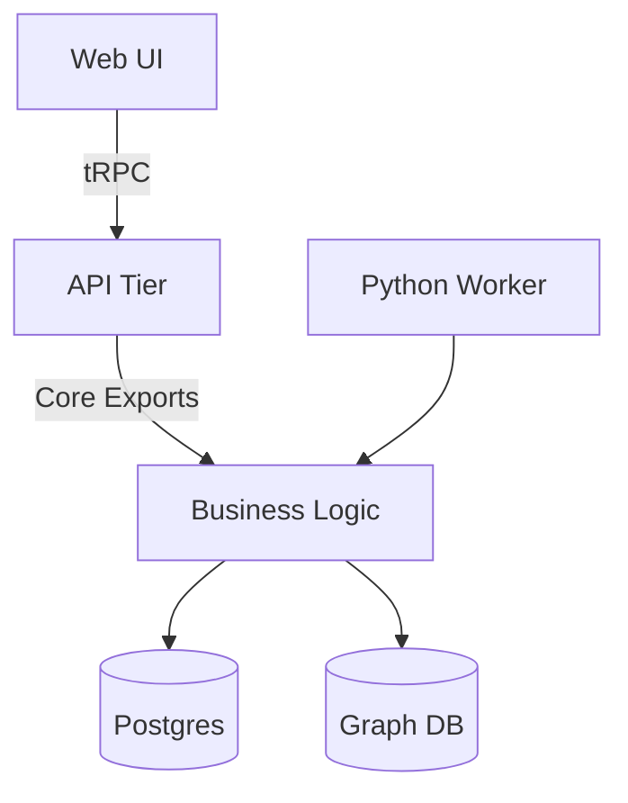

Relevant source files

The following files were used as context for generating this wiki page:

- [README.md](README.md)
- [AGENTS.md](AGENTS.md)
- [CODING_RULES.md](CODING_RULES.md)
- [packages/design-system/readme.md](packages/design-system/readme.md)
- [apps/docs-site/specs/T-022.md](apps/docs-site/specs/T-022.md)
- [apps/docs-site/specs/T-064.md](apps/docs-site/specs/T-064.md)

# Introduction & Project Goals

Better Answers is a living company knowledge map designed for UK Small and Medium-sized Businesses (SMBs). It utilizes the Open Knowledge Framework (OKF) v0.2 to provide permission-aware, explainable, and cited answers to user queries. The system organizes data into three distinct layers: sources (evidence), bundles (OKF concepts), and a derived graph. The project aims to provide a "blueprint-like" interface that is precise, confident, and grounded in evidence.

Sources: [README.md:3-5](README.md#L3-L5), [packages/design-system/readme.md:6-10](packages/design-system/readme.md#L6-L10), [AGENTS.md:15-18](AGENTS.md#L15-L18)

## Core Knowledge Architecture

The system processes data through three sequential knowledge layers. These layers ensure that every answer the platform provides is linked directly to primary evidence.

*  **Sources**: Raw evidence and documents that serve as the foundation.
*  **Bundles**: OKF concepts that form the map of the knowledge.
*  **Graph**: A derived layer that connects concepts and sources.

The diagram shows the flow from raw evidence to the final derived graph and the records that cite these concepts.
Sources: [AGENTS.md:15-18](AGENTS.md#L15-L18), [packages/design-system/readme.md:47-50](packages/design-system/readme.md#L47-L50)

## Project Objectives & Tiers

The project operates across two runtime tiers sharing four distinct data stores. The objective is to maintain a strict separation between the API (transport) and the Worker (knowledge processing).

| Store | Purpose |
| :--- | :--- |
| **Postgres** | Primary relational data and identity set |
| **Object Store** | Storage for source documents |
| **Git Repository** | Version control per workspace |
| **Derived Graph** | Relationships derived from bundles |

Sources: [AGENTS.md:18-20](AGENTS.md#L18-L20), [CODING_RULES.md:39-41](CODING_RULES.md#L39-L41)

## System Principles

The platform follows a set of "Constitutional" coding and design rules to ensure maintainability and security.

### Design and Seams
The project prioritizes "deep modules" where a small interface hides complex implementation details. Seams are introduced only when logic actually varies, such as supporting a second storage provider.

This flow illustrates the separation between the transport (API/tRPC) and the business logic located in `packages/core`.
Sources: [CODING_RULES.md:7-18](CODING_RULES.md#L7-L18), [AGENTS.md:36-45](AGENTS.md#L36-L45)

### Security and Principals
Every function reading or writing tenant data requires a `Principal` object. This object contains the `workspaceId`, `userId`, and `role`. The system enforces Row Level Security (RLS) at the database level to prevent cross-tenant data access.

| Principal Type | Description |
| :--- | :--- |
| **User** | A signed-in person within a specific workspace. |
| **Platform** | The platform acting as itself for automated tasks. |
| **Operator** | System administrator with cross-workspace authority. |

Sources: [CODING_RULES.md:144-162](CODING_RULES.md#L144-L162), [apps/docs-site/specs/T-022.md:126-135](apps/docs-site/specs/T-022.md#L126-L135)

## Design System Goals

The design system provides a "Blueprint" register rather than a traditional dashboard. It emphasizes square corners, hairline borders, and a modular 32px grid.

*  **Glossary-Driven UI**: Interface labels must match the `CONTEXT.md` glossary exactly (e.g., "Workspace" instead of "Organization").
*  **Trust Words**: Accuracy is signaled via a closed set of specific trust words (e.g., "Checked by <person>", "Out of date").
*  **Accessibility**: The system targets WCAG 2.2 AA compliance, using native controls and proper ARIA roles.

Sources: [packages/design-system/readme.md:75-90](packages/design-system/readme.md#L75-L90), [packages/design-system/readme.md:118-125](packages/design-system/readme.md#L118-L125), [CODING_RULES.md:237-245](CODING_RULES.md#L237-L245)

## Workspace Layout

The monorepo is structured to separate deployable applications from shared logic and design assets.

| Path | Component | Responsibility |
| :--- | :--- | :--- |
| `apps/api/` | Node 24 (Hono) | Handles transports: tRPC, MCP, OpenAPI. |
| `apps/web/` | Vite/React SPA | Single-page application for human users. |
| `apps/worker/` | Python 3.13 | Knowledge worker for indexing and enrichment. |
| `packages/core/` | TypeScript | Core business logic and "store doors". |
| `packages/design-system/` | CSS/Tokens | Visual register and design tokens. |

Sources: [AGENTS.md:36-50](AGENTS.md#L36-L50), [apps/docs-site/specs/T-064.md:204-215](apps/docs-site/specs/T-064.md#L204-L215)

Better Answers aims to transform raw company evidence into a structured, verifiable knowledge map. By adhering to strict architectural seams and principal-based security, the project ensures that business knowledge remains accurate, permission-aware, and easily auditable.

Sources: [README.md:3-5](README.md#L3-L5), [packages/design-system/readme.md:6-10](packages/design-system/readme.md#L6-L10)
