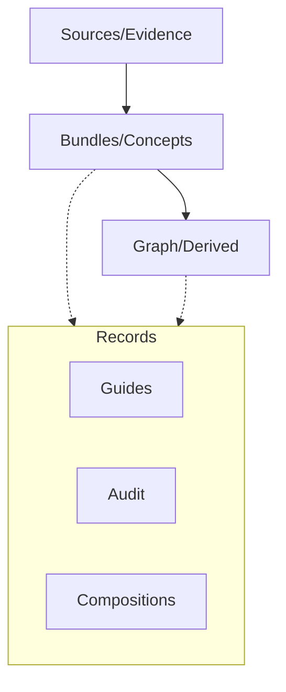
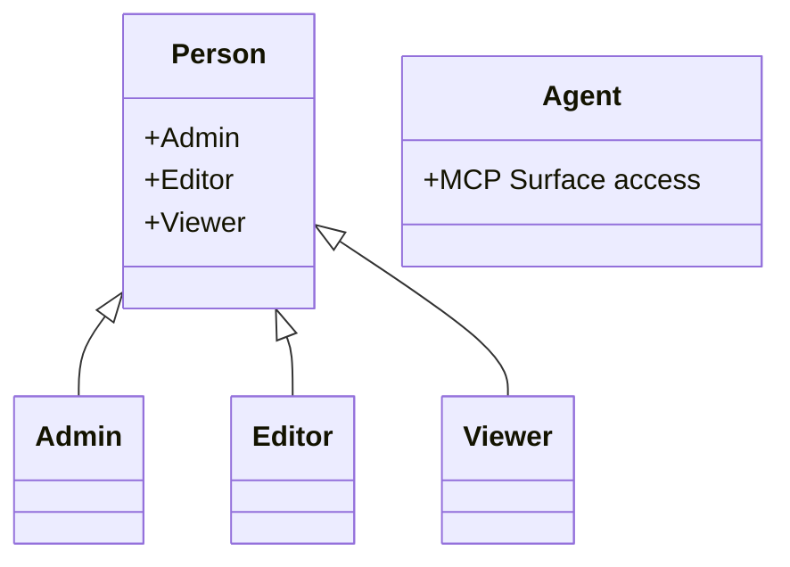

Relevant source files

The following files were used as context for generating this wiki page:

- [packages/design-system/readme.md](packages/design-system/readme.md)
- [AGENTS.md](AGENTS.md)
- [CODING_RULES.md](CODING_RULES.md)
- [apps/docs-site/specs/T-022.md](apps/docs-site/specs/T-022.md)
- [apps/docs-site/specs/T-006.md](apps/docs-site/specs/T-006.md)
- [apps/api/tests/coding-rules-tags.test.ts](apps/api/tests/coding-rules-tags.test.ts)

# Domain Glossary

The Domain Glossary serves as the authoritative source of truth for terminology within the Better Answers project. It defines the specific vocabulary that code, documentation, and user interfaces must obey to maintain consistency across the platform. By centralizing these definitions, the project ensures that every word on a screen is binding and that developers use the same terms for identical concepts throughout the codebase.

The glossary is not merely a documentation artifact; it is a system that code obeys. Terms marked as "Avoid" are banned from the interface, while specific "Trust words" and "Knowledge layers" form the backbone of the platform's information architecture. This ensures that the platform remains precise, confident, and grounded in its presentation of company knowledge.

Sources: [packages/design-system/readme.md:65-72](packages/design-system/readme.md#L65-L72), [AGENTS.md:30-34](AGENTS.md#L30-L34)

## Knowledge Layers and Core Entities

The platform organizes information into three distinct knowledge layers. Data flows from raw evidence to structured concepts, eventually forming a derived graph.

*  **Sources (Evidence):** The raw input and proof for knowledge.
*  **Bundles (OKF Concepts):** Structured maps of knowledge based on the Open Knowledge Format (OKF) v0.2.
*  **Graph:** Derived relationships and connections between concepts.

### Knowledge Structure

The platform maintains **Records** (guides, compositions, usage, audit) over these layers, citing concepts by IRI rather than restating them.

Sources: [packages/design-system/readme.md:46-52](packages/design-system/readme.md#L46-L52), [AGENTS.md:21-25](AGENTS.md#L21-L25)

### Core Definitions Table

| Term | Definition | Requirement |
| :--- | :--- | :--- |
| **Workspace** | A single company instance within the platform. | Use instead of "organisation", "account", "team", or "site". |
| **Map** | The visual and structural representation of knowledge. | Use instead of "graph" on user-facing screens. |
| **Client** | An MCP (Model Context Protocol) host. | Use instead of "connector". |
| **Screen** | A specific functional area of the Control Centre. | Use instead of "section". |
| **Principal** | The authority context for a call (User, Platform, or Operator). | Must be present on every core function call. |

Sources: [packages/design-system/readme.md:65-72](packages/design-system/readme.md#L65-L72), [CODING_RULES.md:154-165](CODING_RULES.md#L154-L165)

## Trust and Sensitivity

Trust words are a closed set. They must appear verbatim in the interface to communicate the status of knowledge accurately.

### Mandatory Trust Phrases
*  Checked by &lt;person&gt;
*  Checked by the platform
*  Unchecked
*  Changed since checked
*  Out of date
*  Draft
*  Restricted
*  Left
*  Deprecated

Two riders are permitted: `imported` and `source moved on`. The platform explicitly avoids terms like "verified", "trusted", or "confidence scores".

Sources: [packages/design-system/readme.md:74-79](packages/design-system/readme.md#L74-L79)

## User and Actor Roles

The platform distinguishes between various actors and their levels of authority through a strict hierarchy of Principals and Roles.

### Principal Types
1.  **User Principal:** A signed-in person associated with one workspace.
2.  **Platform Principal:** The platform acting as itself with a specific actor ID.
3.  **Operator:** The platform administrator with authority over every workspace.
4.  **Deferred Principal:** Authority borrowed from a person for work that outlives a session.

### Actor Identity Format
Actor IDs are derived from the Principal using the kernel's derivation function.
*  `human:<person id>`
*  `process:better-answers-<purpose>`
*  `human:<email>` (Used specifically in concept files for `generated.by` fields).

Sources: [CODING_RULES.md:167-175](CODING_RULES.md#L167-L175), [CODING_RULES.md:197-205](CODING_RULES.md#L197-L205), [apps/docs-site/specs/T-006.md:200-205](apps/docs-site/specs/T-006.md#L200-L205)

### User Roles

Sources: [packages/design-system/readme.md:54-58](packages/design-system/readme.md#L54-L58)

## Interface and Navigation Terms

The design system enforces specific naming conventions for the administrative and user-facing surfaces.

### Control Centre Screens
The Control Centre consists of exactly six screens:
*  **Sources:** Management of evidence.
*  **Suggestions:** Review of proposed knowledge changes.
*  **Knowledge:** The map of bundles and concepts.
*  **Questions:** History and management of user queries.
*  **People:** User and role management.
*  **System:** Platform-level configuration and routes.

### Design Tone and Grammar
*  **Casing:** Use sentence case for headings, buttons, and tabs. Proper nouns (Admin, Control Centre, etc.) retain their case.
*  **Person:** Use second person for user actions ("you asked") and third person for the platform ("the platform confirmed").
*  **Dates:** Use UK long form (e.g., 3 March 2026).

Sources: [packages/design-system/readme.md:59-64](packages/design-system/readme.md#L59-L64), [packages/design-system/readme.md:94-106](packages/design-system/readme.md#L94-L106)

## Summary of Usage Rules

The glossary is binding on all development activities. Developers must follow these guidelines:
1.  **Name First:** Settle new domain words in `CONTEXT.md` before they appear in code.
2.  **No Synonyms:** Use the exact term defined (e.g., always "Workspace", never "Team").
3.  **Banned Terms:** Never use terms marked as "Avoid".
4.  **Audit Consistency:** Acts must be named using the `family.subject.verb` template (e.g., `knowledge.suggestion.accepted`).

Sources: [AGENTS.md:30-34](AGENTS.md#L30-L34), [CODING_RULES.md:144-146](CODING_RULES.md#L144-L146), [CODING_RULES.md:189-195](CODING_RULES.md#L189-L195)

The significance of this glossary lies in its role as a "living company knowledge map." By enforcing these definitions at the code level, Better Answers maintains the explainability and precision required for governed knowledge management.
