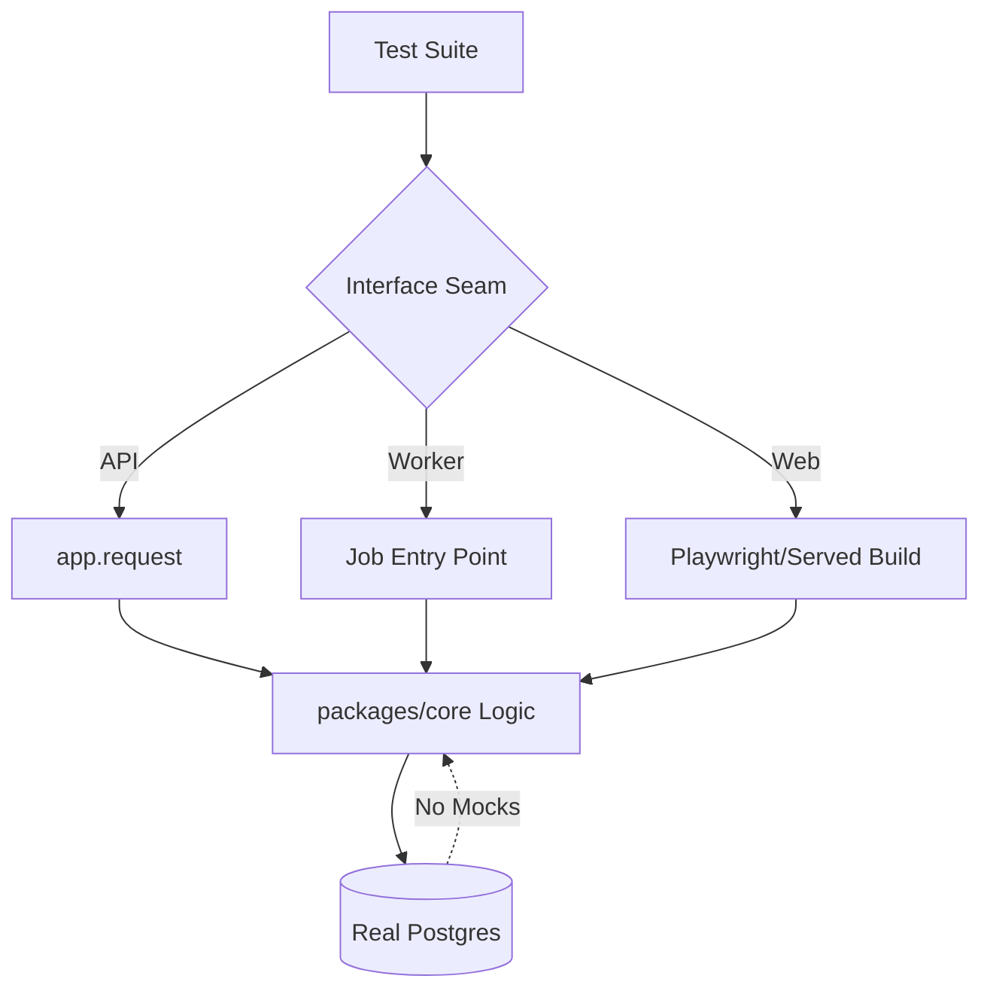
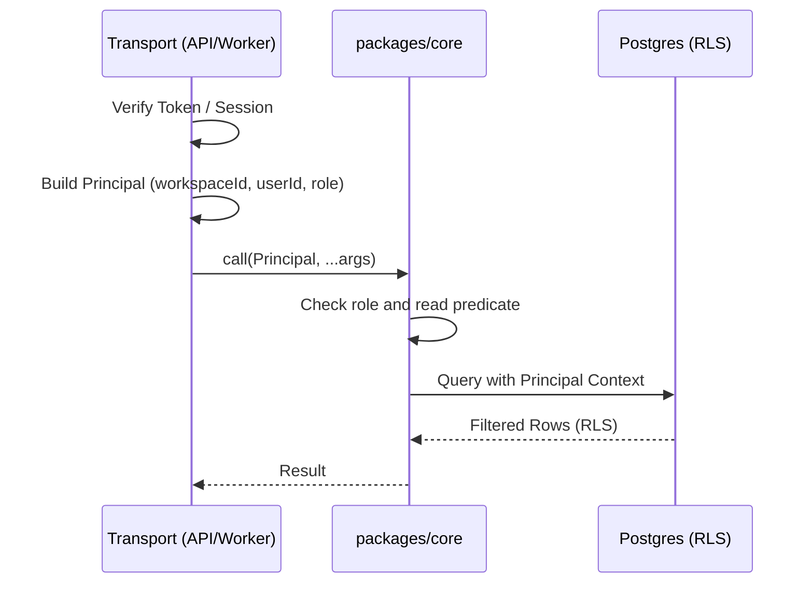

Relevant source files

The following files were used as context for generating this wiki page:

- [CODING\_RULES.md](CODING_RULES.md)
- [apps/api/CODING\_RULES.md](apps/api/CODING_RULES.md)
- [apps/web/CODING\_RULES.md](apps/web/CODING_RULES.md)
- [apps/worker/CODING\_RULES.md](apps/worker/CODING_RULES.md)
- [AGENTS.md](AGENTS.md)
- [cubic.yaml](cubic.yaml)
- [apps/api/tests/coding-rules-tags.test.ts](apps/api/tests/coding-rules-tags.test.ts)

# Coding Rules & Engineering Standards

Coding Rules & Engineering Standards constitute the "constitution" of the Better Answers repository. These rules bind all work within the repository, ensuring deep modules, pragmatic testing, and strict security across all workspace tiers. Every rule is tagged (e.g., `[DESIGN1]`, `[SEC2]`) and is enforced through automated gates, linting, and manual AI-assisted reviews.

These standards prioritize technical accuracy, maintainability, and security over cosmetic concerns. The core philosophy favors small interfaces over large implementations and mandates that tests exercise modules through their public interfaces against real infrastructure rather than mocks.

Sources: [CODING\_RULES.md:1-5](CODING\_RULES.md#L1-L5), [AGENTS.md:24-27](AGENTS.md#L24-L27), [cubic.yaml:31-41](cubic.yaml#L31-L41)

## Core Design Principles

The architecture emphasizes "deep modules" where complex implementation details stay hidden behind small, stable interfaces. Developers must design for deletion: if a module is removed, its complexity should vanish rather than reappear in its callers.

| Rule Tag | Title | Principle |
| :--- | :--- | :--- |
| `[DESIGN1]` | Deep modules | Favor small interfaces over large implementations. |
| `[DESIGN2]` | Interface test surface | Tests must cross the same seam as callers. |
| `[DESIGN3]` | Real Seams | Introduce adapters only where variation already exists. |

Sources: [CODING\_RULES.md:7-19](CODING\_RULES.md#L7-L19), [cubic.yaml:52-54](cubic.yaml#L52-L54)

### Dependency Management
Rules mandate that dependencies arrive as parameters and results return as values rather than side effects. Pinned values for images, models, and versions must exist as exported constants in the package that owns the decision.

Sources: [CODING\_RULES.md:16-19](CODING\_RULES.md#L16-L19), [CODING\_RULES.md:214-220](CODING\_RULES.md#L214-L220)

## Testing Standards

The project rejects module mocking (`vi.mock`, `jest.mock`) for internal code. Tests must interact with real infrastructure, specifically a real Postgres database via Testcontainers, and exercise modules through their defined public interfaces.

### Testing Hierarchy
The following diagram illustrates the testing flow from the interface down to the real data layer.

The diagram shows that all test types (API, Worker, Web) bypass internal function calls to hit the public interface, eventually interacting with a non-mocked database.

Sources: [CODING\_RULES.md:21-47](CODING\_RULES.md#L21-L47), [apps/api/CODING\_RULES.md:16-19](apps/api/CODING\_RULES.md#L16-L19)

### General Testing Rules
*  **[TEST2] Real Postgres:** The database is never mocked.
*  **[TEST3] No Internal Mocking:** Lint rules (`anti-slop/no-module-mocking`) enforce the ban on mocking repository code.
*  **[TEST4] Factories:** Use domain object factories for test state instead of raw SQL inserts.
*  **[TEST6] Mutation Testing:** Stryker and mutmut run on a schedule to maintain a high mutation score.
*  **[TEST7] Two-Way Pairs:** When matching sets exist (e.g., migrations vs directories), tests must assert membership in both directions to find orphans.

Sources: [CODING\_RULES.md:37-64](CODING\_RULES.md#L37-L64), [apps/api/tests/coding-rules-tags.test.ts:16-23](apps/api/tests/coding-rules-tags.test.ts#L16-L23)

## Security & Tenancy [SEC]

Security is anchored by the `Principal` object and Row-Level Security (RLS) within the database. Every function in `packages/core` that interacts with tenant data must accept a `Principal` as its first parameter.

This flow demonstrates that security context is established at the transport layer and strictly carried through to the database.

Sources: [CODING\_RULES.md:107-113](CODING\_RULES.md#L107-L113), [cubic.yaml:86-105](cubic.yaml#L86-L105)

### Security Constraints
*  **[SEC1] Secret Seams:** Secrets are read once by a typed config module and never from `env` at call sites.
*  **[SEC2] Principal Requirement:** Functions must not take bare `workspaceId` strings in place of a `Principal`.
*  **[SEC3] RLS Guarantee:** Every tenant table is created `withRLS()` and includes a "zero-rows" test to prove security policies function correctly.

Sources: [CODING\_RULES.md:98-142](CODING\_RULES.md#L98-L142), [cubic.yaml:107-111](cubic.yaml#L107-L111)

## Workspace-Specific Rules

Engineering standards vary slightly by workspace, though all are bound by the root constitution.

### apps/api (TypeScript)
*  Runs from source using Node 24 (no build step).
*  Imports must carry `.ts` extensions for Node resolution.
*  `src/config.ts` is the only module permitted to read environment variables.
*  Tests must use `server.request()` to simulate HTTP calls.

Sources: [apps/api/CODING\_RULES.md:5-23](apps/api/CODING\_RULES.md#L5-L23)

### apps/web (React/Vite)
*  **[WEB1] Directory Direction:** Imports must flow `app` → `features` → `shared`. Cross-feature imports are banned.
*  **[WEB2] Auth Isolation:** Only `src/features/auth/` may import `better-auth`.
*  **[WEB3] Kebab-Case:** All files and folders under `src/` must use kebab-case.
*  **[WEB4] API Seam:** Only `src/shared/api/trpc.ts` may reference `@better-answers/api`, and only via `import type`.

Sources: [apps/web/CODING\_RULES.md:6-26](apps/web/CODING\_RULES.md#L6-L26)

### apps/worker (Python)
*  Uses Python 3.13 and `uv` workspace.
*  Enforces `mypy` strict and `ruff` for formatting.
*  Every public function must be typed; `Any` is discouraged.

Sources: [CODING\_RULES.md:88-92](CODING\_RULES.md#L88-L92)

## Documentation & Auditing

Documentation follows a "GLOSSARY first" approach. A new domain word must be settled in `CONTEXT.md` before it appears in code.

*  **[COMMENT1] Why, not What:** Comments explain constraints and trade-offs that cannot be inferred from the code.
*  **[COMMENT2] Tag Usage:** Rule tags (e.g., `[SEC2]`) must not appear in source code; they are reserved for rules files, ADRs, specs, and tests.
*  **[AUDIT1] Transactional Audit:** Every governed act must write an audit event within the same database transaction.
*  **[AUDIT2] Family Naming:** Audit acts use a strict `family.subject.verb` template (e.g., `people.member.role_changed`).

Sources: [CODING\_RULES.md:73-82](CODING\_RULES.md#L73-L82), [CODING\_RULES.md:149-165](CODING\_RULES.md#L149-L165), [apps/api/tests/coding-rules-tags.test.ts:31-41](apps/api/tests/coding-rules-tags.test.ts#L31-L41)

## Conclusion

The Better Answers Engineering Standards enforce a high-integrity environment by linking architectural decisions (ADRs) directly to code through automated gates. By mandating real infrastructure testing, strict tenancy controls via the `Principal` pattern, and deep module design, the project maintains a maintainable and secure codebase suitable for UK public sector requirements. Every developer must verify changes against `check` scripts, which aggregate linting, type-checking, and tests into a single mandatory gate.

Sources: [CODING\_RULES.md:71-72](CODING\_RULES.md#L71-L72), [CODING\_RULES.md:195-200](CODING\_RULES.md#L195-L200), [AGENTS.md:24-27](AGENTS.md#L24-L27)
