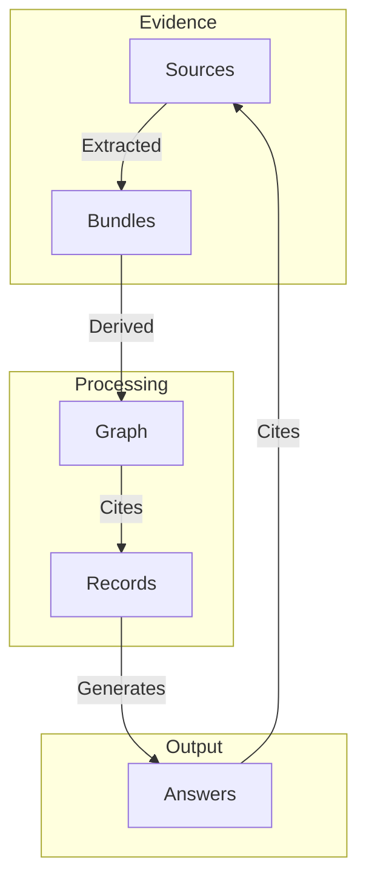
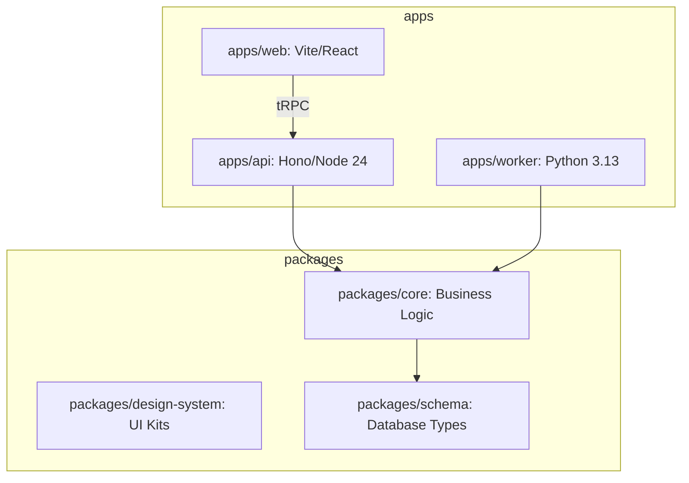

Relevant source files

The following files were used as context for generating this wiki page:

- [README.md](README.md)
- [AGENTS.md](AGENTS.md)
- [CODING_RULES.md](CODING_RULES.md)
- [packages/design-system/readme.md](packages/design-system/readme.md)
- [packages/design-system/ui_kits/platform/README.md](packages/design-system/ui_kits/platform/README.md)
- [apps/api/CODING_RULES.md](apps/api/CODING_RULES.md)

# Introduction & Domain Glossary

Better Answers is a living company knowledge map for UK small and medium businesses (SMBs). The project implements the Open Knowledge Format (OKF) v0.2 to provide cited, permission-aware, and explainable answers. It organizes information into structured layers to ensure every claim is grounded in evidence.

The system serves two primary users: **people** (Admins, Editors, Viewers) who curate knowledge and **agents** that access the platform via the Model Context Protocol (MCP). The project emphasizes technical precision, using a binding domain glossary to maintain consistency across code, interfaces, and documentation.

Sources: [README.md:3-5](README.md#L3-L5), [packages/design-system/readme.md:3-6](packages/design-system/readme.md#L3-L6), [packages/design-system/readme.md:31-33](packages/design-system/readme.md#L31-L33)

## Project Architecture & Layers

The platform architecture transforms raw evidence into a derived knowledge graph through three distinct layers.

### Knowledge Layers

| Layer | Description |
| :--- | :--- |
| **Sources** | The base evidence layer containing raw data and documents. |
| **Bundles** | OKF concepts representing the structured map of knowledge. |
| **Graph** | The derived layer that connects concepts and governs access. |

Sources: [packages/design-system/readme.md:27-29](packages/design-system/readme.md#L27-L29), [AGENTS.md:16-16](AGENTS.md#L16)

### Component Relationship

The following diagram illustrates the flow from raw evidence to the final user-facing answer.

The flow ensures that every generated Answer points back to the original source evidence through structured records and bundles.
Sources: [packages/design-system/readme.md:27-30](packages/design-system/readme.md#L27-L30), [AGENTS.md:16-16](AGENTS.md#L16)

## Domain Glossary

The domain glossary is the authoritative source for terminology. Developers and designers must use these terms verbatim in code and interfaces. Terms marked as "Avoid" are prohibited.

### Core Terminology

| Term | Usage Rule | Definition/Context |
| :--- | :--- | :--- |
| **Workspace** | Mandatory | Represents a single company deployment. Never use "organisation" or "team". |
| **Map** | Mandatory | Refers to the knowledge structure. Never use "graph" on a screen. |
| **Screen** | Mandatory | A section within the Control Centre. |
| **Client** | Mandatory | A host for the Model Context Protocol (MCP). |
| **Answer** | Mandatory | A specific concept kind representing a cited response. |

Sources: [packages/design-system/readme.md:38-44](packages/design-system/readme.md#L38-L44), [packages/design-system/readme.md:46-51](packages/design-system/readme.md#L46-L51)

### Trust Vocabulary

The system uses a closed set of "Trust Words" to describe the state of knowledge. These appear verbatim and never rely on color alone for meaning.

*  **Checked by [person]**
*  **Checked by the platform**
*  **Unchecked**
*  **Changed since checked**
*  **Out of date**
*  **Draft**
*  **Restricted**
*  **Deprecated**

Sources: [packages/design-system/readme.md:46-51](packages/design-system/readme.md#L46-L51)

## System Surfaces

The user interface is divided into functional surfaces, each governed by specific design and content rules.

*  **Ask**: Handles questions and provides cited answers, including what the system could not answer.
*  **Search**: Displays hits categorized by knowledge layer, showing trust and sensitivity metadata.
*  **Guides**: Assembles *Brief* and *Detail* layers over concepts to show coverage.
*  **Control Centre**: The administrative surface containing six screens: Sources, Suggestions, Knowledge, Questions, People, and System.
*  **Account**: A personal management page for users.

Sources: [packages/design-system/readme.md:53-61](packages/design-system/readme.md#L53-L61), [packages/design-system/ui_kits/platform/README.md:7-15](packages/design-system/ui_kits/platform/README.md#L7-L15)

## Technical Framework & Tier Layout

The project is organized as a monorepo with distinct tiers for API, web, and background processing.

The architecture separates the transport-agnostic business logic in `packages/core` from the specific execution tiers.
Sources: [AGENTS.md:25-40](AGENTS.md#L25-L40), [apps/api/CODING_RULES.md:5-9](apps/api/CODING_RULES.md#L5-L9)

### Repository Structure Summary

*  **apps/api**: TypeScript Hono server handling tRPC, MCP, and OpenAPI.
*  **apps/web**: React SPA communicating solely via tRPC.
*  **apps/worker**: Python-based knowledge worker for indexing, conversion, and graph derivation.
*  **packages/core**: Shared business logic and data access (the "store doors").
*  **packages/design-system**: Brand and interface system, including reusable primitives.

Sources: [AGENTS.md:25-40](AGENTS.md#L25-L40), [packages/design-system/readme.md:143-156](packages/design-system/readme.md#L143-L156)

## Summary

The Introduction & Domain Glossary establishes the foundational rules for the Better Answers project. By strictly adhering to the specified glossary and knowledge layers, the system ensures that all company knowledge is explainable and verifiable. This structure supports a unified experience across human-facing interfaces and automated agent interactions.

Sources: [packages/design-system/readme.md:38-44](packages/design-system/readme.md#L38-L44), [AGENTS.md:16-23](AGENTS.md#L16-L23)
