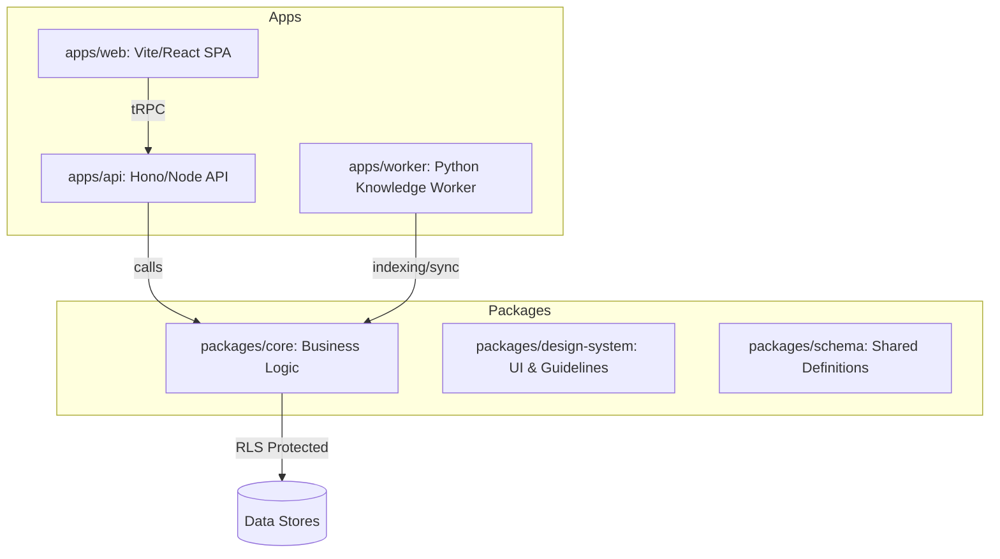
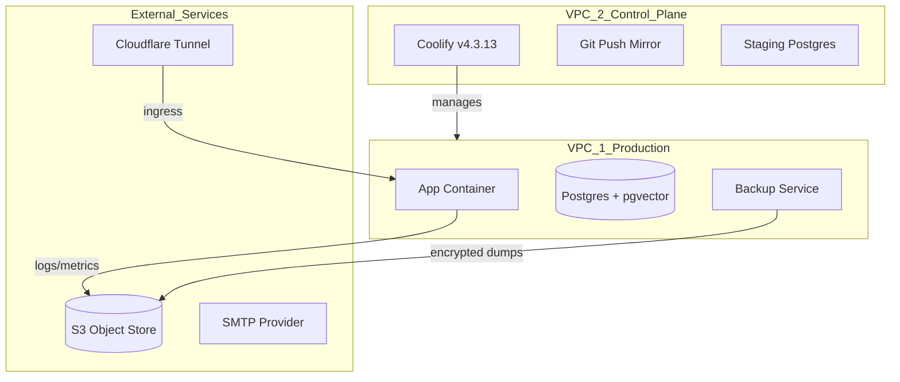

Relevant source files

The following files were used as context for generating this wiki page:

- [AGENTS.md](AGENTS.md)
- [packages/design-system/readme.md](packages/design-system/readme.md)
- [CODING_RULES.md](CODING_RULES.md)
- [apps/api/CODING_RULES.md](apps/api/CODING_RULES.md)
- [deploy/wizard-41.sh](deploy/wizard-41.sh)
- [README.md](README.md)

# System Architecture Overview

Better Answers is a living company knowledge map for UK SMBs built on the Open Knowledge Format (OKF) v0.2. The system provides cited, permission-aware, and explainable answers derived from a multi-layered knowledge structure. It serves two primary user types: people (Admin, Editor, Viewer) managing business activities, and agents interacting through the Model Context Protocol (MCP) surface.
Sources: [README.md:3](README.md#L3), [packages/design-system/readme.md:4-5, 29-30](packages/design-system/readme.md#L4-L5), [AGENTS.md:12-14](AGENTS.md#L12-L14)

The architecture separates the platform into two runtime tiers sharing four data stores: Postgres, an object store, a git repository per workspace, and a derived graph. The system follows a "blueprint" design philosophy, emphasizing a quiet, mechanical interface over traditional dashboards.
Sources: [AGENTS.md:14-15](AGENTS.md#L14-L15), [packages/design-system/readme.md:92-95](packages/design-system/readme.md#L92-L95)

## Core Knowledge Layers

The platform organizes information into three distinct knowledge layers. This structure ensures every answer is grounded in evidence and explainable through a derived graph.
Sources: [AGENTS.md:13-14](AGENTS.md#L13-L14), [packages/design-system/readme.md:25-27](packages/design-system/readme.md#L25-L27)

| Layer | Description |
| :--- | :--- |
| **Sources** | The raw evidence and original documents provided to the system. |
| **Bundles** | OKF concepts forming the core map of company knowledge. |
| **Graph** | The derived relationship layer that connects concepts and evidence. |

Additionally, the platform maintains **records** over these layers, including guides, compositions, usage statistics, bindings, and audit logs.
Sources: [packages/design-system/readme.md:26-27](packages/design-system/readme.md#L26-L27), [AGENTS.md:13-14](AGENTS.md#L13-L14)

## System Components and Layout

The codebase is organized into a monorepo structure where `apps/` contains deployable units and `packages/` contains shared logic and schemas.
Sources: [AGENTS.md:20-33](AGENTS.md#L20-L33)

The diagram above shows the relationship between the main application tiers and shared packages.
Sources: [AGENTS.md:22-33](AGENTS.md#L22-L33), [apps/api/CODING_RULES.md:5-7](apps/api/CODING_RULES.md#L5-L7), [CODING_RULES.md:9-11](CODING_RULES.md#L9-L11)

### Application Tiers
- **API Tier (`apps/api`):** A TypeScript application using Hono on Node 24. It handles transports including tRPC, MCP, and OpenAPI. It functions as the control plane for workers and the interface for the web frontend.
- **Web Tier (`apps/web`):** A Vite-based React single-page application that communicates exclusively with the API via tRPC.
- **Worker Tier (`apps/worker`):** A Python 3.13 application responsible for heavy-lifting tasks such as connectors, document conversion, indexing, and graph derivation.
Sources: [AGENTS.md:22-26](AGENTS.md#L22-L26), [apps/api/CODING_RULES.md:5-7](apps/api/CODING_RULES.md#L5-L7)

### Shared Packages
- **Core (`packages/core`):** Contains the primary business logic. It provides "store doors" for transport-agnostic data access.
- **Design System (`packages/design-system`):** Defines the brand, interface rules, and reusable UI primitives.
- **Schema (`packages/schema`):** Shared TypeScript type and database schema definitions.
Sources: [AGENTS.md:27-29](AGENTS.md#L27-L29), [packages/design-system/readme.md:4-6](packages/design-system/readme.md#L4-L6), [CODING_RULES.md:17-19](CODING_RULES.md#L17-L19)

## Data Security and Multi-tenancy

The system enforces strict multi-tenancy and data isolation through Row Level Security (RLS) and Workspace IDs. Every tenant-facing table carries a `workspace_id`.
Sources: [CODING_RULES.md:17-18](CODING_RULES.md#L17-L18), [packages/design-system/readme.md:30](packages/design-system/readme.md#L30)

### Security Constraints
- **RLS Guarantee:** RLS is default-deny. Tenant tables use `FORCE ROW LEVEL SECURITY`. A table with no policy returns zero rows by default.
- **Principals:** Every function in `packages/core` touching tenant data must accept a `Principal` (containing `workspaceId`, `userId`, and `role`) as its first parameter.
- **Principal Types:**
  - **Deferred Principal:** Carries a person's authority for background or scheduled work.
  - **Platform Principal:** The platform acting as its own identity.
- **Identity Provider Seam:** Authentication logic (Better Auth) is isolated. No auth-specific types or imports are allowed to cross into `packages/core`.
Sources: [CODING_RULES.md:19-24, 76-80, 81-86, 29-32](CODING_RULES.md#L19-L24)

## Design Register and Interaction Rules

The user interface follows a "blueprint" register—quiet, dense, and mechanical. It uses a 32px modular grid with square-cornered, hairline-bordered objects.
Sources: [packages/design-system/readme.md:92-96](packages/design-system/readme.md#L92-L96)

### Visual Foundations
- **Grid:** A layout pitch of 32px module (`--grid-module`), drawn behind the page via `GridPattern`.
- **Typography:** Geist for interface body; Geist Mono for machine strings and identity.
- **Colors:** Cool grey ramp for structure (`#fcfcfd` to `#17191c`) with ink blue (`#2e4bd4`) as the interactive accent.
- **Registration Marks:** A `+` mark appears on corners of board-level objects (primary buttons, grid-child cards, empty states) to indicate they are registered against the grid.
Sources: [packages/design-system/readme.md:98-100, 107-111, 102-105, 120-125](packages/design-system/readme.md#L98-L100)

### User Experience Principles (`[UX1]`, `[UX2]`)
The interface prioritizes disclosure over layers.
1. **Initial View:** Shows only what is needed to judge (e.g., a claim and its trust words).
2. **First Disclosure:** Reveals more detail (verifier, date, evidence passage).
3. **Action:** Sits beside the disclosure with the consequence stated before the click.
Sources: [packages/design-system/readme.md:171-173](packages/design-system/readme.md#L171-L173), [CODING_RULES.md:129-133](CODING_RULES.md#L129-L133)

## Deployment Architecture

The system is designed for deployment on VPS infrastructure (typically IONOS 4 vCPU / 4 GB nodes) using Coolify as the control plane.
Sources: [deploy/wizard-41.sh:176-178, 225-227](deploy/wizard-41.sh#L176-L178)

The diagram outlines the infrastructure separation between production workloads and the management control plane.
Sources: [deploy/wizard-41.sh:176-189, 198-210, 215-224, 225-235](deploy/wizard-41.sh#L176-L189)

### Backup and Escrow
The architecture includes an "Escrow vault" for secrets that must survive a complete infrastructure loss (e.g., KEK, Coolify APP_KEY, backup bucket credentials). Backups are stored in S3 buckets with versioning and Object Lock (in GOVERNANCE mode) to prevent accidental deletion or tampering.
Sources: [deploy/wizard-41.sh:150-155, 198-202](deploy/wizard-41.sh#L150-L155)

## Summary

The Better Answers architecture centers on a multi-layered knowledge map governed by strict OKF v0.2 specifications. It enforces technical excellence through binding coding rules, including functional interface testing, real-database requirements, and a refusal to mock internal modules. The separation of business logic in `packages/core` from transport layers in `apps/api` and `apps/worker` ensures the system remains maintainable and secure through mandatory `Principal`-based data access.
Sources: [AGENTS.md:13-15](AGENTS.md#L13-L15), [CODING_RULES.md:38-42, 49-51, 76-78](CODING_RULES.md#L38-L42)
