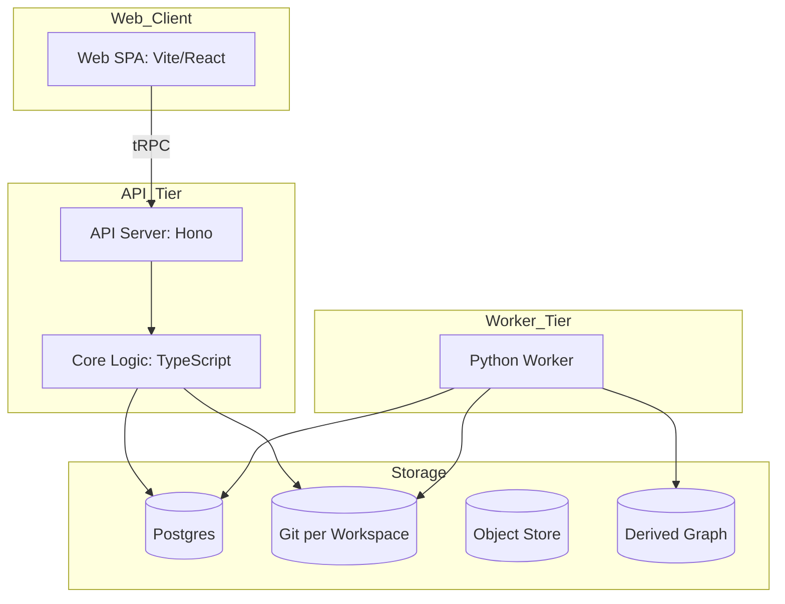
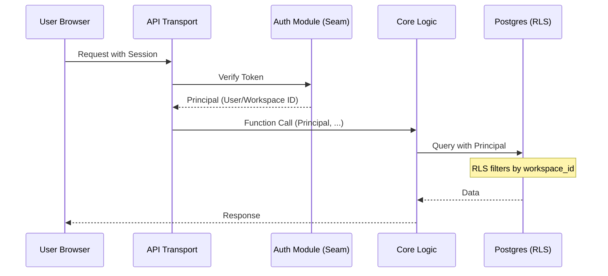

Relevant source files

The following files were used as context for generating this wiki page:

- [packages/design-system/readme.md](packages/design-system/readme.md)
- [AGENTS.md](AGENTS.md)
- [CODING_RULES.md](CODING_RULES.md)
- [apps/docs-site/specs/T-022.md](apps/docs-site/specs/T-022.md)
- [apps/docs-site/specs/T-006.md](apps/docs-site/specs/T-006.md)
- [apps/api/CODING_RULES.md](apps/api/CODING_RULES.md)
- [apps/web/CODING_RULES.md](apps/web/CODING_RULES.md)
- [apps/docs-site/specs/T-064.md](apps/docs-site/specs/T-064.md)

# High-Level Architecture

Better Answers is a company knowledge map for UK SMBs built on the Open Knowledge Framework (OKF) v0.2. The system organizes data into three primary layers: **Sources** (evidence), **Bundles** (OKF concepts), and a derived **Graph**. The architecture prioritizes explainability by ensuring every answer is cited and permission-aware through robust row-level security (RLS) and audit logging.

The system comprises two runtime tiers: a TypeScript-based API server (Hono/Node 24) and a Python-based knowledge worker. These tiers share four primary data stores: Postgres for relational data, an object store for raw documents, Git repositories for workspace versioning, and a derived graph for relationship modeling.

Sources: [AGENTS.md:12-16](AGENTS.md#L12-L16), [packages/design-system/readme.md:4-6](packages/design-system/readme.md#L4-L6)

## System Layout and Runtime Tiers

The project follows a monorepo structure where `apps/` contains deployable units and `packages/` contains shared logic.

This diagram shows the relationship between the two primary runtime tiers and the shared storage backend.
Sources: [AGENTS.md:27-41](AGENTS.md#L27-L41)

### Tier Responsibilities
*  **API Tier (`apps/api`):** Serves as the transport layer. It handles tRPC, MCP, and OpenAPI requests. It remains transport-agnostic, delegating business logic to `packages/core`.
*  **Web Client (`apps/web`):** A single-page React application that communicates with the API exclusively via tRPC.
*  **Worker Tier (`apps/worker`):** Performs heavy-lift tasks including ingestion, conversion, indexing, and derived graph synchronization. It operates as a work loop claiming jobs under a lease.
*  **Core Logic (`packages/core`):** Contains the actual business logic slices. It is transport-agnostic and interacts with store doors.

Sources: [AGENTS.md:27-41](AGENTS.md#L27-L41), [apps/docs-site/specs/T-006.md:180-186](apps/docs-site/specs/T-006.md#L180-L186)

## Data Layers and Knowledge Model

Better Answers implements the OKF v0.2 specification to manage corporate knowledge.

| Layer | Description | Derived Information |
| :--- | :--- | :--- |
| **Sources** | Raw evidence and document bindings. | Document metadata and locators. |
| **Bundles** | The primary knowledge map containing OKF concepts. | IRI identity, evidence citations. |
| **Graph** | Derived relationships and visibility classes. | Traversal paths and access predicates. |
| **Records** | Platform-specific data over the layers. | Audit logs, usage, and guides. |

Sources: [packages/design-system/readme.md:22-24](packages/design-system/readme.md#L22-L24), [apps/docs-site/specs/T-006.md:13-17](apps/docs-site/specs/T-006.md#L13-L17)

### Knowledge Write Path
The "Governed Write" path ensures consistency across Git and Postgres. It uses a per-repository lock to prevent race conditions during updates.

1.  **Git Commit:** The platform creates a commit in the workspace Git repository. The trailer carries `Actor:`, `Audit:`, and `Suggestion:` IDs.
2.  **Postgres Transaction:** A single transaction updates the concept index, bundle commits, audit events, and the graph delta.
3.  **Graph Delta:** The system updates `graph_node` and `graph_edge` tables synchronously within the same transaction to ensure the graph is never behind for an edit.

Sources: [apps/docs-site/specs/T-006.md:107-120](apps/docs-site/specs/T-006.md#L107-L120)

## Security and Identity (The Seam)

The architecture enforces a strict "identity seam" defined in ADR 0009. The system separates the identity provider (Better Auth) from the core business logic.

The identity seam ensures that core business logic only interacts with a `Principal` object, not specific authentication library types.
Sources: [CODING_RULES.md:144-149](CODING_RULES.md#L144-L149), [apps/docs-site/specs/T-022.md:132-140](apps/docs-site/specs/T-022.md#L132-L140)

### Security Rules
*  **Principal Enforcement (`[SEC2]`):** Every function reading or writing tenant data must take a `Principal` (`workspaceId`, `userId`, `role`) as its first parameter.
*  **Row-Level Security (`[SEC3]`):** Every tenant table must use RLS (`withRLS()`). Policies must be tested against unauthorized access (zero-rows test).
*  **Visibility Derivation:** A concept's visibility class is derived from its evidence bindings. Access is governed by an audience predicate (`everyone` vs `groups`).

Sources: [CODING_RULES.md:150-165](CODING_RULES.md#L150-L165), [apps/docs-site/specs/T-006.md:144-154](apps/docs-site/specs/T-006.md#L144-L154)

## Development and Reliability Gates

The project utilizes automated gates to enforce the "constitution" (CODING_RULES.md).

*  **`check` Script:** Every workspace must provide a `check` script that runs linting, type checking, and tests. A suite that runs nothing fails.
*  **Linting Gates:** `oxlint`, `knip` (dead code), and `jscpd` (duplicate code) are used as blocking gates.
*  **Testing Surface:** Tests must cross the same seams that callers do. Mocking internal modules is strictly banned; real Postgres instances (Testcontainers) are used for all data-touching tests.

Sources: [CODING_RULES.md:21-25](CODING_RULES.md#L21-L25), [CODING_RULES.md:83-110](CODING_RULES.md#L83-L110), [apps/docs-site/specs/T-064.md:112-121](apps/docs-site/specs/T-064.md#L112-L121)

## Conclusion

The Better Answers architecture combines the versioning strengths of Git with the relational power and security of Postgres. By enforcing deep modules at clean seams and strictly isolating identity, the system remains maintainable and audit-ready. The derived graph ensures that complex knowledge relationships are available for querying without compromising the integrity of the underlying OKF bundles.

Sources: [apps/docs-site/specs/T-006.md:136-142](apps/docs-site/specs/T-006.md#L136-L142), [CODING_RULES.md:9-15](CODING_RULES.md#L9-L15)
