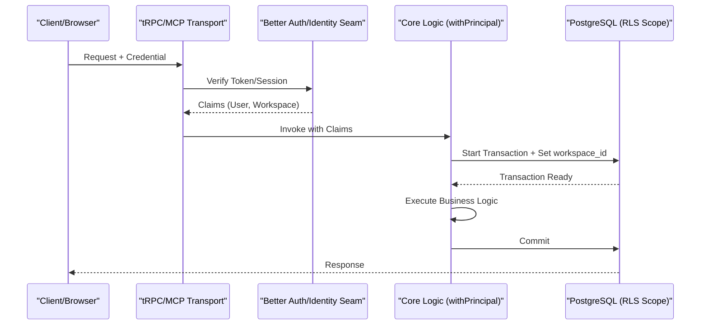
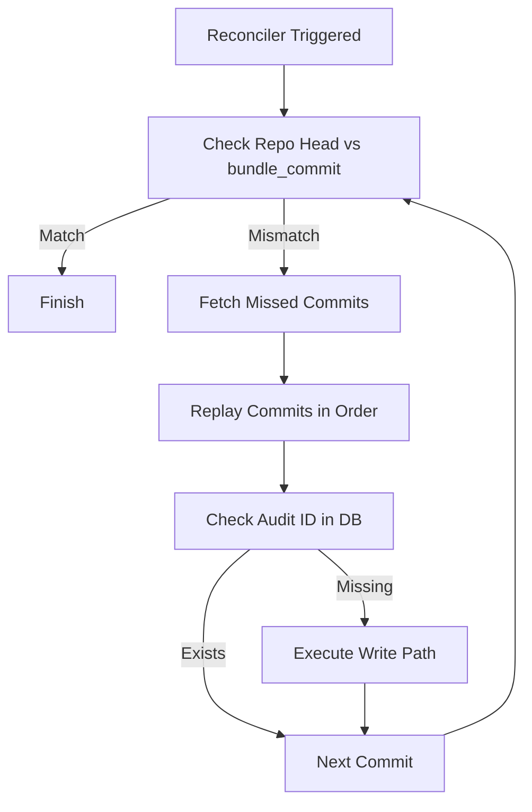

Relevant source files

The following files were used as context for generating this wiki page:

- [SECURITY.md](SECURITY.md)
- [CODING_RULES.md](CODING_RULES.md)
- [apps/docs-site/specs/T-004.md](apps/docs-site/specs/T-004.md)
- [apps/docs-site/specs/T-006.md](apps/docs-site/specs/T-006.md)
- [apps/docs-site/specs/T-022.md](apps/docs-site/specs/T-022.md)
- [cubic.yaml](cubic.yaml)

# Security Model & Multi-Tenancy

The Better Answers security model ensures multi-tenant isolation, data integrity, and strict access control across all knowledge layers. It employs a "Principal-first" architecture where every function reading or writing tenant data requires a verified `Principal` object. The system enforces tenancy at the database level using PostgreSQL Row Level Security (RLS), ensuring that users only access data belonging to their specific workspace.

This model spans identity verification via Better Auth, role-based access control (RBAC), and comprehensive auditing of all governed writes and administrative acts. It is designed to meet WCAG 2.2 AA standards and follows the UK government's accessibility and security requirements for public bodies.

Sources: [README.md:3](README.md#L3), [CODING_RULES.md:162-167](CODING_RULES.md#L162-L167), [apps/docs-site/specs/T-004.md:14-22](apps/docs-site/specs/T-004.md#L14-L22), [apps/docs-site/specs/T-022.md:281-285](apps/docs-site/specs/T-022.md#L281-L285)

## Principal Architecture

Every core function interacting with tenant data must accept a `Principal` as its first parameter. The system derives this `Principal` from verified credentials (bearer tokens or session cookies) and uses it to authorize business logic and predicate data access.

### Principal Types
The system recognizes three distinct kinds of principals:
*  **User Principal:** A signed-in individual associated with a specific workspace.
*  **Platform Principal:** The platform acting as itself for background tasks (e.g., reconciler, automated repairs).
*  **Operator:** A platform administrator with cross-workspace authority, audited under a unique ID.

Sources: [CODING_RULES.md:162-177](CODING_RULES.md#L162-L177), [apps/docs-site/specs/T-004.md:126-135](apps/docs-site/specs/T-004.md#L126-L135), [cubic.yaml:81-91](cubic.yaml#L81-L91)

### Data Flow for Principal Resolution

The diagram shows the lifecycle of a request, demonstrating how credentials are resolved into a scoped transaction.
Sources: [apps/docs-site/specs/T-004.md:126-146](apps/docs-site/specs/T-004.md#L126-L146), [apps/docs-site/specs/T-022.md:139-147](apps/docs-site/specs/T-022.md#L139-L147)

## Multi-Tenancy and Database Security

Better Answers enforces multi-tenancy through a combination of application-level checks and database-level RLS policies. Every tenant table is created `withRLS()` to prevent data leakage.

### Row Level Security (RLS)
The database serves as the ultimate guarantee of isolation. By default, a table with RLS enabled and a non-owner runtime role returns zero rows unless a specific policy grants access. The system establishes the RLS scope (`workspace_id`) at the start of a transaction within the `withPrincipal` wrapper.

*  **Tenant Isolation:** No user can query rows belonging to another `workspace_id`.
*  **Identity Set Exemption:** Certain tables (e.g., workspaces, members) are part of a global "Identity Set" and are exempt from standard RLS to allow for cross-workspace sign-in and discovery.
*  **Worker Constraints:** The background worker's database role is explicitly revoked from reading or writing the identity set to limit the blast radius of potential compromises.

Sources: [CODING_RULES.md:180-197](CODING_RULES.md#L180-L197), [apps/docs-site/specs/T-004.md:148-154](apps/docs-site/specs/T-004.md#L148-L154), [apps/docs-site/specs/T-006.md:112-117](apps/docs-site/specs/T-006.md#L112-L117)

### Visibility Predicates
Visibility is determined by a combination of the publication status, sensitivity, and audience groups. 
| Predicate Component | Description |
| :--- | :--- |
| **Published** | Controls whether content is visible to Viewers. |
| **Sensitivity** | Classifies data (e.g., Public, Internal, Restricted). |
| **Audience** | Restricts access to specific groups within a workspace. |

Sources: [CODING_RULES.md:164-167](CODING_RULES.md#L164-L167), [apps/docs-site/specs/T-006.md:134-142](apps/docs-site/specs/T-006.md#L134-L142)

## Governed Writes and Auditing

The system treats every modification to the knowledge map as a "Governed Write," ensuring full traceability and recoverability.

### Audit Ledger
Every administrative act and governed write is recorded in an append-only `audit_event` table. 
*  **Transaction Integrity:** The act and its corresponding audit event must succeed or fail together within a single database transaction.
*  **Actor Identification:** Actors are identified by a unique `ActorId` (e.g., `human:<id>`, `process:<id>`).
*  **Immutable History:** The database role used by the application is granted only `INSERT` privileges on the audit ledger; `UPDATE` and `DELETE` are revoked.

Sources: [CODING_RULES.md:200-222](CODING_RULES.md#L200-L222), [apps/docs-site/specs/T-006.md:99-105](apps/docs-site/specs/T-006.md#L99-L105)

### The Reconciler
The Reconciler manages the "crash window" between a Git commit and a database write. If a repository head moves forward without a matching `bundle_commit` in PostgreSQL, the Reconciler replays the missed commits to ensure the database remains in sync with the source of truth.

The flow ensures that any interruption during a knowledge map update is automatically resolved.
Sources: [apps/docs-site/specs/T-006.md:107-110](apps/docs-site/specs/T-006.md#L107-L110), [apps/docs-site/specs/T-006.md:195-200](apps/docs-site/specs/T-006.md#L195-L200)

## Security Operations and Disclosure

### Vulnerability Reporting
Security vulnerabilities must be reported directly to `security@better-answers.com`. Public issues for vulnerabilities are prohibited to prevent exploitation before a fix is available. Acknowledgement is provided within three working days.

Sources: [SECURITY.md:3-7](SECURITY.md#L3-L7)

### Secrets Management
Secrets reach the application through a single "Bootstrap Class" seam.
*  **Bootstrap Class:** Read once from the environment (e.g., database DSN, `AUTH_SECRET`) to allow the process to start.
*  **Credential Providers:** All other credentials (e.g., LLM API keys, object store tokens) are stored as hashed, revocable rows in the database and accessed through specific provider slices.
*  **Logging:** Passwords, tokens, and prompt/completion content are strictly banned from log files.

Sources: [CODING_RULES.md:151-160](CODING_RULES.md#L151-L160), [apps/api/CODING_RULES.md:13-20](apps/api/CODING_RULES.md#L13-L20), [apps/docs-site/specs/T-004.md:167-172](apps/docs-site/specs/T-004.md#L167-L172)

## Summary
The Better Answers security model prioritizes strict multi-tenancy through database RLS and an immutable audit trail. By requiring a `Principal` for all tenant data operations and implementing a Reconciler for knowledge map integrity, the system ensures that multi-tenant boundaries are enforced at the architectural level rather than just the interface level.
