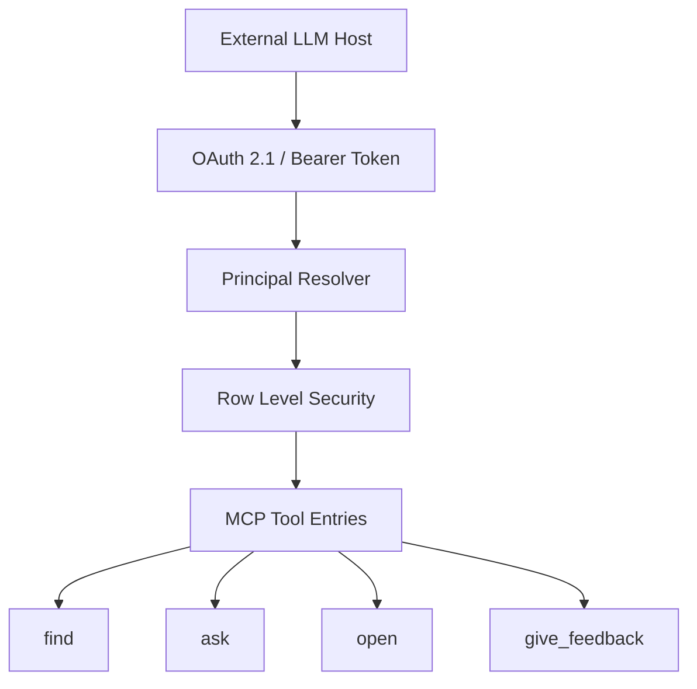
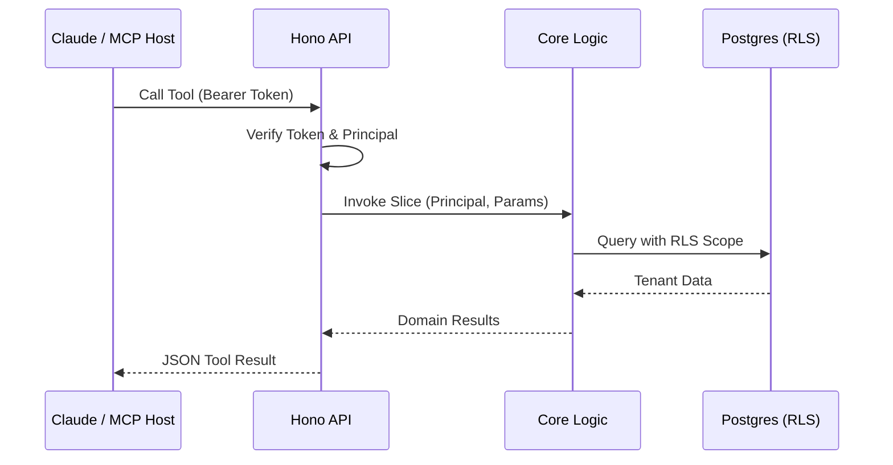

Relevant source files

The following files were used as context for generating this wiki page:

- [AGENTS.md](AGENTS.md)
- [apps/docs-site/specs/T-004.md](apps/docs-site/specs/T-004.md)
- [apps/docs-site/specs/T-045.md](apps/docs-site/specs/T-045.md)
- [apps/docs-site/specs/T-046.md](apps/docs-site/specs/T-045.md)
- [CODING_RULES.md](CODING_RULES.md)
- [packages/design-system/readme.md](packages/design-system/readme.md)

# Agent & MCP Integrations

Agent & MCP Integrations define how Large Language Model (LLM) hosts, such as Claude, interact with the Better Answers platform. The system uses the Model Context Protocol (MCP) to expose business logic as tools that agents can invoke. This integration allows agents to search, retrieve, and act on the company knowledge map while maintaining strict tenant isolation and security boundaries.

The architecture centers on an in-process MCP surface served by the Hono API. External hosts discover the platform through standardized metadata and authenticate via a custom OAuth 2.1 flow. This ensures that every agent call is bound to a specific `Principal` (user and workspace) before accessing any tenant data.

Sources: [AGENTS.md:16-20](AGENTS.md#L16-L20), [apps/docs-site/specs/T-004.md:14-25](apps/docs-site/specs/T-004.md#L14-L25), [packages/design-system/readme.md:47-48](packages/design-system/readme.md#L47-L48)

## MCP Surface Architecture

The MCP surface provides four primary tool entries: `find`, `ask`, `open`, and `give_feedback`. The platform serves these entries as host-agnostic tools that do not require a workspace argument in their signature. The authentication token determines the workspace scope, preventing agents from naming the wrong tenant.

The diagram shows the request flow from an external host through authentication and security layers to the specific MCP tools.
Sources: [apps/docs-site/specs/T-004.md:27-33](apps/docs-site/specs/T-004.md#L27-L33), [apps/docs-site/specs/T-004.md:144-150](apps/docs-site/specs/T-004.md#L144-L150)

### Connection and Discovery
Hosts connect to the platform using the URL `app.<domain>/mcp`. The API provides discovery documents, including the protected-resource metadata and the JSON Web Key Set (JWKS). The platform supports both legacy (2025) and modern (2026) negotiation protocol eras to ensure compatibility with various client versions.

Sources: [apps/docs-site/specs/T-045.md:17-25](apps/docs-site/specs/T-045.md#L17-L25), [apps/docs-site/specs/T-004.md:43-52](apps/docs-site/specs/T-004.md#L43-L52)

## Authentication and Security

Agent security relies on the `Principal` resolver. The system verifies OAuth bearer tokens in-process using the `jose` library. Every call to the `packages/core` capability slices requires a `Principal` as the first parameter.

| Component | Function | Security Enforcement |
| :--- | :--- | :--- |
| **Principal Resolver** | `withPrincipal` | Checks revocation status, workspace membership, and roles. |
| **RLS Policy** | `withRLS()` | Restricts database access at the row level to the active workspace. |
| **Rate Limiter** | Postgres Counters | Limits unauthenticated calls per IP and authenticated calls per token. |
| **SSRF Policy** | Transport Layer | Refuses private, loopback, or local addresses during client metadata fetches. |

Sources: [apps/docs-site/specs/T-004.md:35-41](apps/docs-site/specs/T-004.md#L35-L41), [apps/docs-site/specs/T-004.md:118-124](apps/docs-site/specs/T-004.md#L118-L124), [CODING_RULES.md:139-145](CODING_RULES.md#L139-L145)

### Principal Identification
The system derives an `ActorId` for every agent act. For agents, this ID follows the format `agent:<id>` as defined in ADR 0019. This ID is used for append-only audit logging in the `audit_event` ledger.

Sources: [CODING_RULES.md:176-180](CODING_RULES.md#L176-L180)

## Tool Definitions

The MCP surface exposes structured tools to agents. Every tool entry must include annotations and is prohibited from taking workspace-specific arguments to maintain the security boundary.

*  **`find`**: Searches for concepts within the knowledge map.
*  **`ask`**: Queries the company knowledge base for a cited answer.
*  **`open`**: Retrieves structured fields of a concept, including evidence and trust state, using an IRI or locator.
*  **`give_feedback`**: Allows agents to submit feedback (requires `feedback:write` scope).

Sources: [apps/docs-site/specs/T-004.md:154-158](apps/docs-site/specs/T-004.md#L154-L158), [apps/docs-site/specs/T-004.md:86-95](apps/docs-site/specs/T-004.md#L86-L95)

### Response Contract
The tool response follows a strict contract. Every answer includes a verdict (`ok`, `warn`, or `refuse`), citations, coverage data, and the trust state of the map. Trust states use standardized terms such as "Checked by <person>" or "Out of date."

Sources: [apps/docs-site/specs/T-004.md:158-161](apps/docs-site/specs/T-004.md#L158-L161), [packages/design-system/readme.md:58-62](packages/design-system/readme.md#L58-L62)

## Data Flow and Integration

Agent work often outlives a live session. In these cases, the platform uses a **deferred principal**, which carries a person's authority but expires according to the borrowed authorization.

This diagram illustrates the sequence of an agent tool call being authorized and executed against scoped tenant data.
Sources: [CODING_RULES.md:147-152](CODING_RULES.md#L147-L152), [apps/docs-site/specs/T-004.md:144-152](apps/docs-site/specs/T-004.md#L144-L152)

## Summary

Agent & MCP Integrations enable secure, tenant-aware automation by exposing the Better Answers knowledge map to external LLM hosts. By combining the Model Context Protocol with robust OAuth 2.1 authentication and Row Level Security, the system ensures that agents act only with explicit user authority and within verified workspace boundaries.

Sources: [apps/docs-site/specs/T-004.md:14-25](apps/docs-site/specs/T-004.md#L14-L25)
