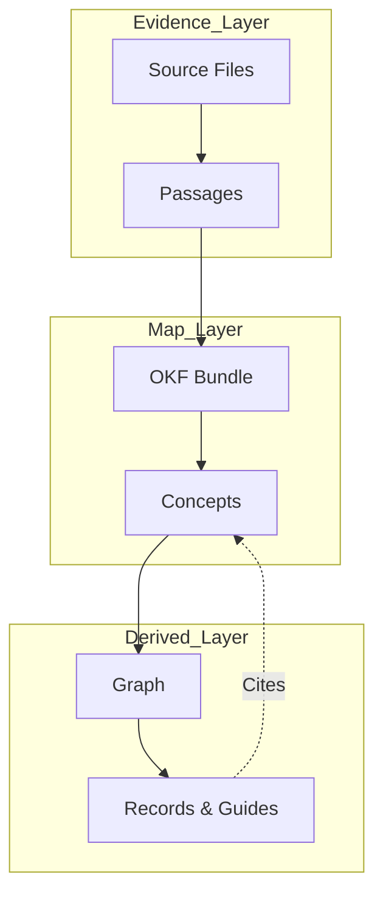
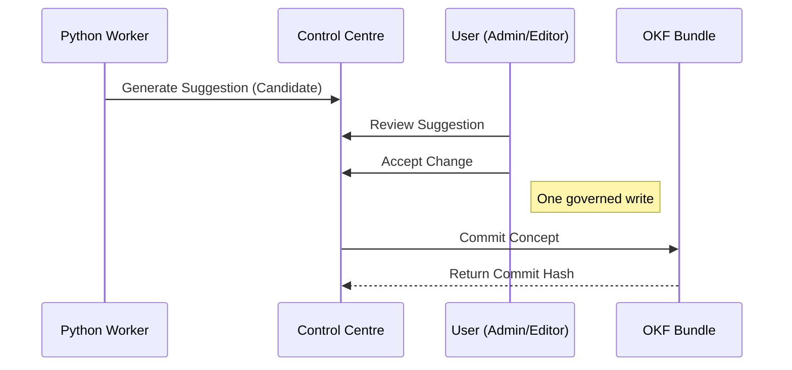
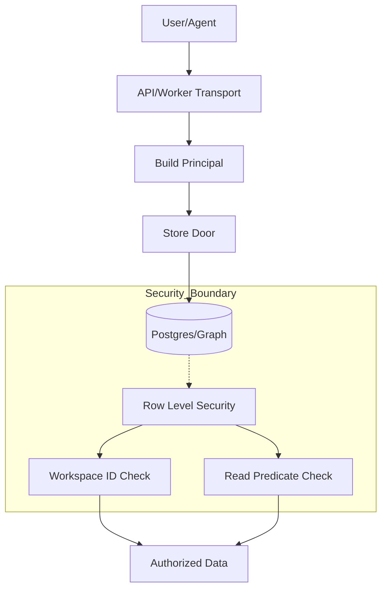

Relevant source files

The following files were used as context for generating this wiki page:

- [packages/design-system/readme.md](packages/design-system/readme.md)
- [AGENTS.md](AGENTS.md)
- [CODING_RULES.md](CODING_RULES.md)
- [README.md](README.md)
- [packages/design-system/ui_kits/platform/data.js](packages/design-system/ui_kits/platform/data.js)
- [packages/core/test/answering.test.ts](packages/core/test/answering.test.ts)
- [packages/design-system/ui_kits/platform/README.md](packages/design-system/ui_kits/platform/README.md)

# The Knowledge Model (OKF v0.2)

The Knowledge Model provides a structured framework for mapping and citing company knowledge for UK SMBs. It operates on the Open Knowledge Format (OKF) v0.2 specification to ensure every answer is cited, permission-aware, and explainable. The model organises data into distinct layers to separate raw evidence from governed company concepts.

Sources: [README.md:3](README.md#L3), [packages/design-system/readme.md:4-5](packages/design-system/readme.md#L4-L5)

## Knowledge Architecture

The system organises knowledge into three primary layers. These layers separate raw data from refined, governed concepts and the relationships derived from them.

*  **Sources (Evidence):** Raw data and passages that provide the basis for knowledge.
*  **Bundles (OKF Concepts):** The mapped company knowledge. This layer contains OKF concepts that form the "map".
*  **Graph (Derived):** The relationships and entities derived from the bundles.

Sources: [packages/design-system/readme.md:52-54](packages/design-system/readme.md#L52-L54), [AGENTS.md:12-13](AGENTS.md#L12-L13)

### Knowledge Flow Diagram
The following diagram illustrates how raw information flows from sources through the OKF bundle to become part of the derived graph.

Sources: [packages/design-system/readme.md:52-55](packages/design-system/readme.md#L52-L55), [AGENTS.md:12-14](AGENTS.md#L12-L14)

## The OKF Bundle and Concepts

The bundle contains concepts only. It excludes UI-specific or product-shaped data, which reside in platform records. Every concept file must pass the "bundle-alone test," ensuring the data remains useful even without the Better Answers platform.

Sources: [CODING_RULES.md:154-162](CODING_RULES.md#L154-L162)

### Spec-Pure Concept Requirements
A concept file follows OKF v0.2 and contains exactly two platform-specific keys:
1.  **`iri`**: Used for identity management.
2.  **`sources[].locator`**: Used for evidence tracking.

Other attributes like typed relations, supersession, and entity equivalence are handled in the graph or within platform records rather than the concept file itself.

Sources: [CODING_RULES.md:164-169](CODING_RULES.md#L164-L169)

## Trust and Governance

The model enforces a strict set of trust words and governance rules to ensure information accuracy. These words appear verbatim in the interface and represent the current state of a concept or passage.

### Trust Word Set
| Trust Word | Description |
| :--- | :--- |
| Checked by `<person>` | Verified by a specific user on a specific date. |
| Checked by the platform | Verified by automated platform processes. |
| Unchecked | Initial state before verification. |
| Changed since checked | A concept that was verified but its source has since changed. |
| Out of date | Information that has expired or is no longer relevant. |
| Draft | Preliminary knowledge not yet published. |
| Restricted | Sensitivity-aware content with limited access. |
| Deprecated | Superseded or removed knowledge. |

Sources: [packages/design-system/readme.md:105-110](packages/design-system/readme.md#L105-L110), [packages/core/test/answering.test.ts:37-75](packages/core/test/answering.test.ts#L37-L75)

### The Write Path
The system implements a "governed write" model. Changes to the knowledge map require a review process before they are committed to the bundle.

Sources: [packages/design-system/ui_kits/platform/README.md:15](packages/design-system/ui_kits/platform/README.md#L15), [packages/design-system/ui_kits/platform/ControlCentre.jsx:13-25](packages/design-system/ui_kits/platform/ControlCentre.jsx#L13-L25), [CODING_RULES.md:112-115](CODING_RULES.md#L112-L115)

## Citation and Evidence

The unit of verification is the **Citation**. A citation anchors a claim to its original source. It consists of four required elements that provide transparency to the reader.

### Citation Components
| Component | Description |
| :--- | :--- |
| **Concept** | The specific OKF concept being cited. |
| **Source** | The original document or binding providing the info. |
| **Locator** | The specific location within the source (e.g., "p.4" or "§7.2"). |
| **Passage** | The actual text quoted from the source. |

Sources: [packages/design-system/readme.md:189-191](packages/design-system/readme.md#L189-L191), [packages/design-system/ui_kits/platform/data.js:15-39](packages/design-system/ui_kits/platform/data.js#L15-L39)

## Data Persistence and RLS

Knowledge data is stored across four distinct stores. Every query is tenant-scoped via the workspace ID, and Row Level Security (RLS) is the primary guarantee of data isolation.

*  **Postgres:** Stores tenant data and metadata.
*  **Object Store:** Holds raw source documents.
*  **Git Repository:** One per workspace to manage OKF bundle versions.
*  **Derived Graph:** A specialised store for knowledge relationships.

Sources: [AGENTS.md:14-15](AGENTS.md#L14-L15), [CODING_RULES.md:21-27](CODING_RULES.md#L21-L27)

### Security Architecture for Data Access
The following diagram shows how the `Principal` and RLS protect tenant data.

Sources: [CODING_RULES.md:21-35](CODING_RULES.md#L21-L35), [CODING_RULES.md:112-118](CODING_RULES.md#L112-L118)

## Summary

The Knowledge Model (OKF v0.2) ensures that company knowledge is not just a collection of strings, but a governed, version-controlled map. By separating evidence from concepts and enforcing strict citation rules, the system maintains a high "trust budget" for its users. All operations follow the principle of "consequence before the click," where the impact of a governed write is clearly stated before any change to the knowledge bundle occurs.

Sources: [packages/design-system/readme.md:4-6](packages/design-system/readme.md#L4-L6), [CODING_RULES.md:154-162](CODING_RULES.md#L154-L162)
