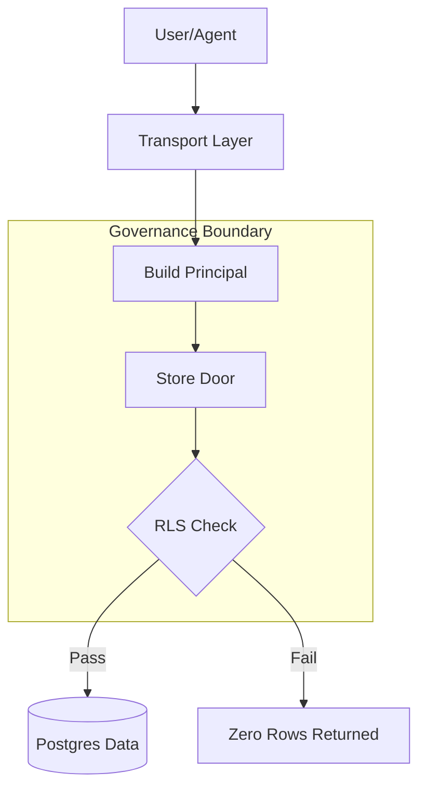
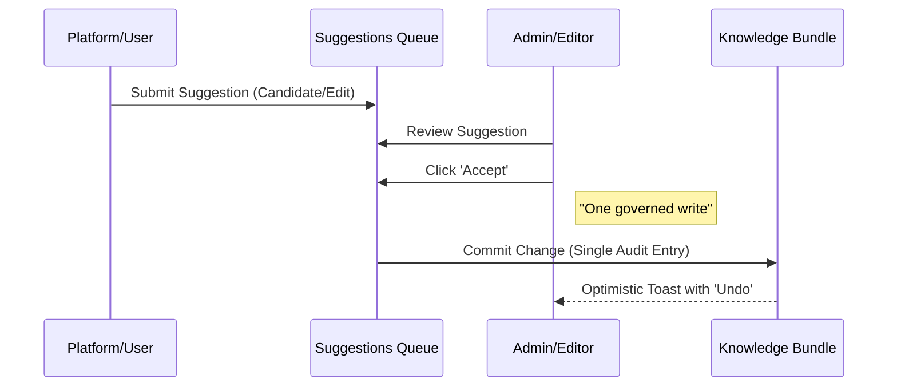

Relevant source files

The following files were used as context for generating this wiki page:

- [packages/design-system/ui_kits/platform/ControlCentre.jsx](packages/design-system/ui_kits/platform/ControlCentre.jsx)
- [packages/design-system/readme.md](packages/design-system/readme.md)
- [CODING_RULES.md](CODING_RULES.md)
- [packages/design-system/ui_kits/platform/data.js](packages/design-system/ui_kits/platform/data.js)
- [packages/design-system/guidelines/kits-adoption.card.html](packages/design-system/guidelines/kits-adoption.card.html)
- [packages/design-system/ui_kits/platform/README.md](packages/design-system/ui_kits/platform/README.md)

# Control Centre & Governance

Control Centre is the primary Admin surface for Better Answers, comprising six specialized screens that manage the lifecycle of company knowledge. It enforces governance through "governed writes," ensuring every change to the knowledge map is audited, permission-aware, and attributed to a specific actor.

The system manages three knowledge layers—sources (evidence), bundles (concepts), and the derived graph—to ensure every answer provided to users is citeable and explainable. Governance rules, such as Row Level Security (RLS) and "consequence before the click," prevent unauthorized access and accidental modifications to sensitive tenant data.

Sources: [packages/design-system/readme.md:46-52](packages/design-system/readme.md#L46-L52), [CODING_RULES.md:21-25](CODING_RULES.md#L21-L25), [packages/design-system/ui_kits/platform/README.md:10-15](packages/design-system/ui_kits/platform/README.md#L10-L15)

## Governance Architecture

Governance in Better Answers rests on strict technical and UX constraints that ensure data integrity and auditability.

### Governed Writes and Auditing
Every modification to the knowledge bundle occurs as a "governed write." This process ensures that:
- Changes enter the bundle as discrete commits.
- Every action is audited under the name of the performing Admin or Editor.
- The system states the consequence of an action (e.g., "One governed write") before the user commits.

Sources: [packages/design-system/readme.md:101-103](packages/design-system/readme.md#L101-L103), [packages/design-system/ui_kits/platform/ControlCentre.jsx:87-89](packages/design-system/ui_kits/platform/ControlCentre.jsx#L87-L89), [CODING_RULES.md:100-105](CODING_RULES.md#L100-L105)

### Data Security (RLS)
The platform enforces a "default-deny" Row Level Security (RLS) policy. Every tenant table carries a `workspace_id`, and every query must pass through a "store door" that validates the `Principal` (user identity and role).

This diagram shows the flow from a request to data access, highlighting the mandatory Principal and RLS verification.
Sources: [CODING_RULES.md:21-35](CODING_RULES.md#L21-L35), [CODING_RULES.md:143-148](CODING_RULES.md#L143-L148)

## Control Centre Modules

The Control Centre is divided into functional screens, each managing a specific aspect of the knowledge lifecycle.

| Screen | Purpose | Primary Actor |
| :--- | :--- | :--- |
| **Sources** | Manages data bindings, ingestion connectors, and publish gates. | Admin |
| **Suggestions** | Reviews candidate concepts and edits arriving from the platform or other users. | Admin/Editor |
| **Knowledge** | Provides a review table over every concept and composition in the map. | Admin/Editor |
| **Questions** | Manages the queue of user questions and answer performance. | Admin/Editor |
| **People** | Manages user roles (Admin, Editor, Viewer) and permissions. | Admin |
| **System** | Configures platform-wide settings like extraction ceilings. | Admin |

Sources: [packages/design-system/readme.md:51-53](packages/design-system/readme.md#L51-L53), [packages/design-system/ui_kits/platform/ControlCentre.jsx:1-250](packages/design-system/ui_kits/platform/ControlCentre.jsx#L1-L250)

### Sources & Bindings
The Sources screen manages "bindings," which connect external data (e.g., SharePoint, HubSpot) to the platform. A binding defines the connector type, credentials, sensitivity levels (Public, Internal, Restricted), and the target audience. Chunks from these sources remain hidden until an Admin publishes the binding.

Sources: [packages/design-system/ui_kits/platform/ControlCentre.jsx:214-225](packages/design-system/ui_kits/platform/ControlCentre.jsx#L214-L225), [packages/design-system/ui_kits/platform/data.js:154-180](packages/design-system/ui_kits/platform/data.js#L154-L180)

### Suggestions Review
The Suggestions screen acts as a triage queue for the "write path." Suggestions can be promotions of questions to permanent answers, candidate concepts from automated extraction, or manual edits.

The sequence above illustrates the transition from a candidate suggestion to a committed bundle entry.
Sources: [packages/design-system/ui_kits/platform/ControlCentre.jsx:15-103](packages/design-system/ui_kits/platform/ControlCentre.jsx#L15-L103), [packages/design-system/ui_kits/platform/README.md:20-22](packages/design-system/ui_kits/platform/README.md#L20-L22)

### Knowledge Management
The Knowledge screen provides a comprehensive view of all concepts. It tracks the "Trust State" of each entry, which is a closed set of terms:
- **Checked by [Person]**: Verified by a human.
- **Checked by the platform**: Machine-verified.
- **Changed since checked**: Source data has evolved.
- **Out of date / Deprecated**: No longer valid.

Sources: [packages/design-system/readme.md:73-80](packages/design-system/readme.md#L73-L80), [packages/design-system/ui_kits/platform/ControlCentre.jsx:155-175](packages/design-system/ui_kits/platform/ControlCentre.jsx#L155-L175)

## Component Governance

The design system enforces governance through specific UI components that prevent developers from deviating from the product's trust and writing rules.

- **`TrustTag`**: Enforces the closed set of trust words found in `CONTEXT.md`.
- **`Citation`**: Standardizes the unit of evidence (concept, source, locator, passage).
- **`Dialog`**: Mandatory for irreversible acts, always stating the consequence (e.g., "Audited under your name").

Sources: [packages/design-system/readme.md:195-208](packages/design-system/readme.md#L195-L208), [packages/design-system/guidelines/kits-adoption.card.html:170-185](packages/design-system/guidelines/kits-adoption.card.html#L170-L185)

## Summary

Control Centre & Governance provides the administrative framework for maintaining a high-trust knowledge map. By combining technical RLS enforcement with a "governed write" workflow, the system ensures that every piece of information presented to users is verifiable, authorized, and transparently managed.
