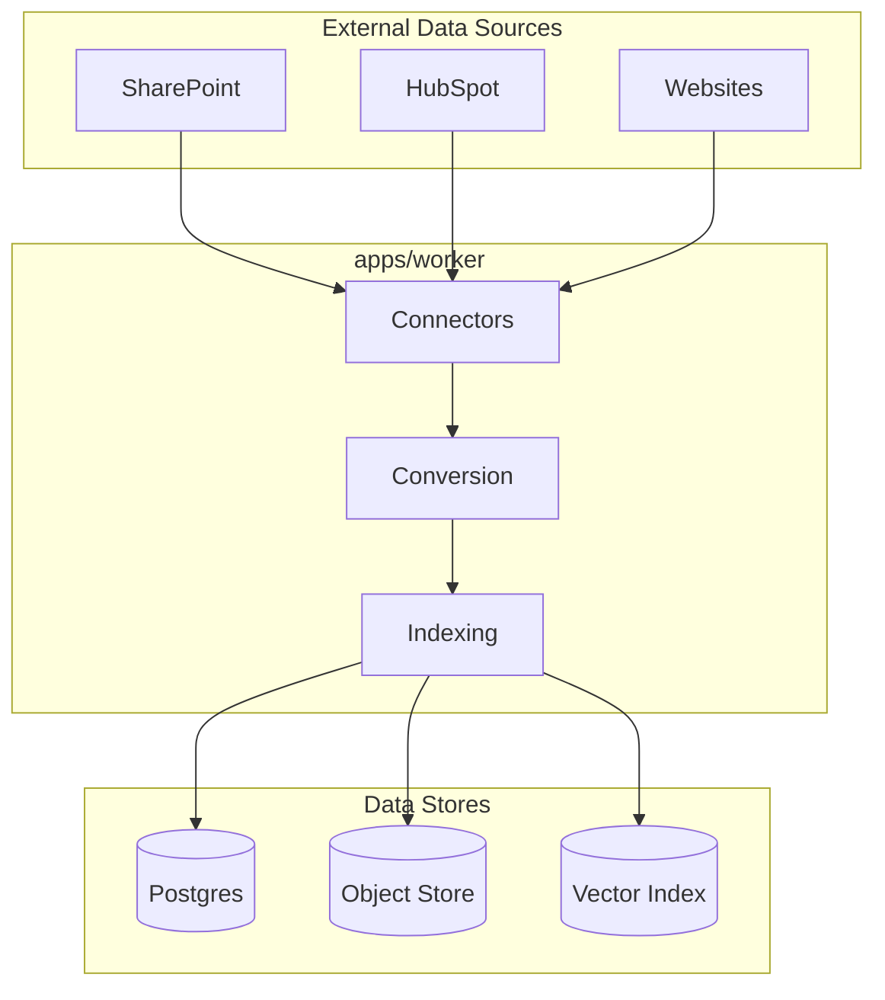
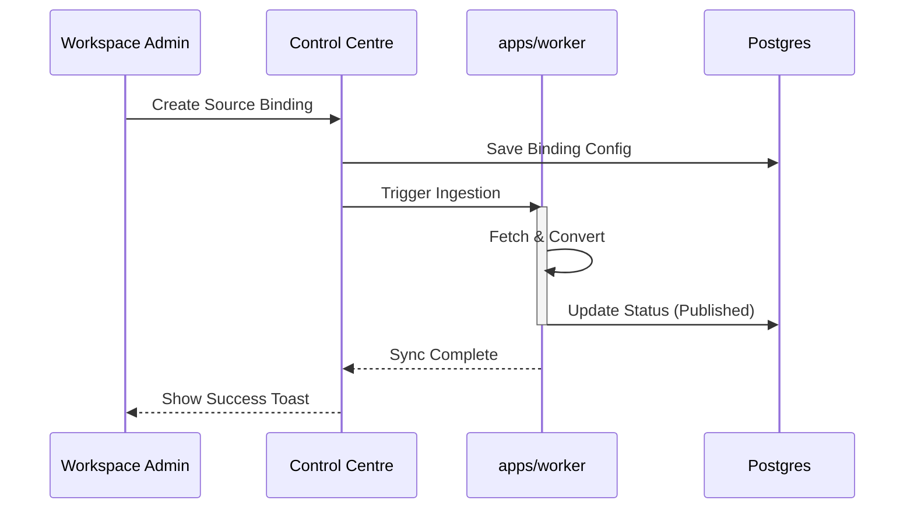

<details>
<summary>Relevant source files</summary>

The following files were used as context for generating this wiki page:

- [AGENTS.md](AGENTS.md)
- [CODING_RULES.md](CODING_RULES.md)
- [packages/design-system/readme.md](packages/design-system/readme.md)
- [packages/design-system/ui_kits/platform/data.js](packages/design-system/ui_kits/platform/data.js)
- [packages/design-system/ui_kits/platform/README.md](packages/design-system/ui_kits/platform/README.md)
- [packages/design-system/guidelines/kits-adoption.card.html](packages/design-system/guidelines/kits-adoption.card.html)
</details>

# Sources & Document Connectors

Sources represent the foundational evidence layer of the Better Answers knowledge map. They provide the raw material and grounding for all cited answers, bundles, and derived graphs. The system uses **Document Connectors** to link external data repositories to a workspace, ensuring that every claim in the platform is traceable to a specific passage in a source document.

Sources: [packages/design-system/readme.md:15-18](packages/design-system/readme.md#L15-L18), [packages/design-system/readme.md:65-68](packages/design-system/readme.md#L65-L68)

## Architecture and Data Flow

The ingestion pipeline transforms raw external data into structured evidence. This process involves the Python worker, which manages the lifecycle of document ingestion, conversion, and indexing.

### Ingestion Pipeline

1.  **Connectors:** Technical interfaces that talk to external APIs (e.g., SharePoint, HubSpot).
2.  **Conversion:** The worker converts various file formats into a standardized text representation.
3.  **Indexing:** The worker segments text into chunks and generates embeddings for vector search.
4.  **Enrichment:** The system identifies entities and concepts within the text to build the knowledge map.



The diagram shows the flow from external data sources through the worker tier into the primary data stores.
Sources: [AGENTS.md:28-28](AGENTS.md#L28), [AGENTS.md:18-20](AGENTS.md#L18-L20)

## Source Bindings

A **Source Binding** is a configuration that connects a specific external resource to a Better Answers workspace. Each binding defines the connector type, the sensitivity of the data, and the synchronization status.

### Binding Attributes

| Attribute | Description |
| :--- | :--- |
| **Connector** | The type of external system (e.g., SharePoint, HubSpot, Website). |
| **Sensitivity** | The access level required (Public, Internal, Restricted). |
| **Status** | The current state of the synchronization (e.g., Published, Waiting to publish). |
| **Document Count** | The total number of documents ingested from the source. |
| **Last Run** | The timestamp of the most recent synchronization. |

Sources: [packages/design-system/ui_kits/platform/data.js:132-166](packages/design-system/ui_kits/platform/data.js#L132-L166)

### Common Connector Types

The system supports several standard connectors to common business data sources.

*  **Website:** Ingests public-facing content via URL crawling.
*  **SharePoint:** Syncs documents from Microsoft 365 environments.
*  **HubSpot:** Extracts data from CRM records (e.g., closed deals).
*  **Referenced Read:** A specialized connector for live, on-demand reading without full ingestion.

Sources: [packages/design-system/ui_kits/platform/data.js:133-165](packages/design-system/ui_kits/platform/data.js#L133-L165)

## Security and Multi-tenancy

Source data is strictly governed by multi-tenancy rules and Row Level Security (RLS). Every document and chunk ingested must carry a `workspace_id` to ensure tenant isolation.

### Security Constraints

*  **RLS Guarantee:** Every tenant table uses `FORCE ROW LEVEL SECURITY`. If no policy matches, the database returns no rows.
*  **Access Predicates:** Every readable unit (chunk or index) carries columns for `published_at`, `sensitivity`, and `audience`.
*  **Principal Scoping:** Every function touching tenant data requires a `Principal` (workspaceId, userId, role) as its first parameter.

Sources: [CODING_RULES.md:43-52](CODING_RULES.md#L43-L52), [CODING_RULES.md:175-182](CODING_RULES.md#L175-L182)

## Interface and Control Centre

The "Sources" screen in the **Control Centre** allows administrators to manage bindings and monitor ingestion health.

### Source Management Interaction

The UI provides specific controls for managing the lifecycle of evidence:
*  **Dropzone:** Used for manual source uploads, styled with specific registration marks and patterns.
*  **Status Indicators:** Verbatim trust words like "Checked by platform," "Unchecked," or "Source moved on."
*  **Selection Bar:** A "select-then-command" pattern for bulk management of documents.



The sequence diagram illustrates the administrative flow for creating and syncing a new source.
Sources: [packages/design-system/ui_kits/platform/README.md:14](packages/design-system/ui_kits/platform/README.md#L14), [packages/design-system/readme.md:52-56](packages/design-system/readme.md#L52-L56), [packages/design-system/guidelines/kits-adoption.card.html:56-56](packages/design-system/guidelines/kits-adoption.card.html#L56)

## Implementation Details

The implementation leverages the `cocoindex` library within the Python worker. The system composes building blocks for commit management, memoization, and stable ID generation.

```yaml
# Example logic for worker ingestion (Conceptual from rules)
ingestion:
  memoization: stable_keys
  concurrency: mount_each_isolation
  timeout: cooperative
  retention: membership_based
```

Sources: [CODING_RULES.md:237-248](CODING_RULES.md#L237-L248)

### Critical Logic Rules

*  **Managed DDL:** The main application owns all Data Definition Language (DDL) changes; `cocoindex` targets are set to `managed_by="user"`.
*  **Forward-only Migrations:** Database schema changes for source tables are forward-only to ensure stability.
*  **Stateful Bindings:** Every stateful service uses bind mounts under `/data/<service>` to persist ingestion metadata.

Sources: [CODING_RULES.md:248-249](CODING_RULES.md#L248-L249), [CODING_RULES.md:273-276](CODING_RULES.md#L273-L276)
