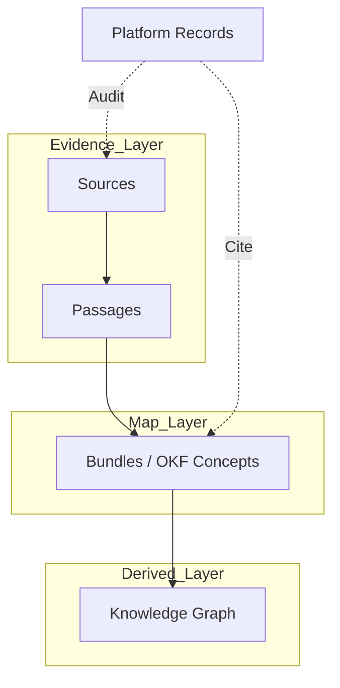
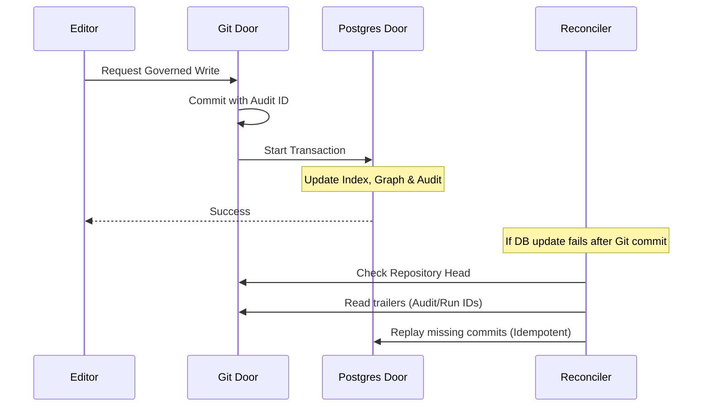

Relevant source files

The following files were used as context for generating this wiki page:

- [AGENTS.md](AGENTS.md)
- [README.md](README.md)
- [packages/design-system/readme.md](packages/design-system/readme.md)
- [apps/docs-site/specs/T-006.md](apps/docs-site/specs/T-006.md)
- [CODING_RULES.md](CODING_RULES.md)
- [apps/docs-site/specs/T-064.md](apps/docs-site/specs/T-064.md)

# Knowledge Maps & OKF

Knowledge Maps in Better Answers represent a living company knowledge repository for UK SMBs. The system builds upon the Open Knowledge Framework (OKF) v0.2 to provide cited, permission-aware, and explainable answers. It organizes data into three distinct layers to ensure evidence-based truth and proper access control.

Sources: [README.md:3-5](README.md#L3-L5), [packages/design-system/readme.md:3-5](packages/design-system/readme.md#L3-L5)

## Knowledge Architecture

The system structures knowledge into three hierarchical layers. This architecture ensures that every claim is grounded in evidence and that derived insights remain traceable to their original sources.

### The Three Knowledge Layers

| Layer | Type | Description |
| :--- | :--- | :--- |
| **Sources** | Evidence | The raw input and evidence passages that support knowledge claims. |
| **Bundles** | OKF Concepts | The central map consisting of OKF-defined concepts and entities. |
| **Graph** | Derived | The derived relationship network and inferred knowledge structures. |

Sources: [AGENTS.md:12-14](AGENTS.md#L12-L14), [packages/design-system/readme.md:28-30](packages/design-system/readme.md#L28-L30)

The following diagram illustrates the flow of data through these layers:

The platform maintains **Records** over these layers, including guides, compositions, usage metrics, and audit logs. These records cite concepts by IRI (Internationalized Resource Identifier) rather than restating them to maintain a single source of truth.

Sources: [packages/design-system/readme.md:28-32](packages/design-system/readme.md#L28-L32), [apps/docs-site/specs/T-006.md:20-22](apps/docs-site/specs/T-006.md#L20-L22)

## Open Knowledge Framework (OKF) Implementation

Better Answers adheres to OKF v0.2 for its core knowledge representation. The implementation prioritizes "pure" concept files to ensure interoperability and clarity.

### Pure Concept Files
Concept files contain only data defined by the OKF v0.2 spec and essential platform identifiers.
*  **IRI**: The unique identity of the concept.
*  **Sources**: Locators for evidence supporting the concept.
*  **Metadata**: Information like `generated.by` and `verified[].by` using ActorIds.

Information regarding supersession, conflicting claims, or complex typed relations is stored in the derived Graph or platform Records rather than the concept files themselves.

Sources: [CODING_RULES.md:417-434](CODING_RULES.md#L417-L434), [apps/docs-site/specs/T-006.md:155-159](apps/docs-site/specs/T-006.md#L155-L159)

### The Bundle-Alone Test
A key or value enters a concept file only if it remains useful to a company without the Better Answers platform or its UI-specific guides. UI-specific logic, such as display sections or audience-specific phrasing, must reside in platform records.

Sources: [CODING_RULES.md:405-415](CODING_RULES.md#L405-L415)

## Data Consistency & Reconciler

The system employs a "Governed Write" path to maintain consistency between the Git-based OKF bundles and the Postgres-based knowledge graph.

### Governed Write Path
Every change to a concept triggers a specific sequence of actions:
1.  **Git Commit**: The change lands as a commit where the person is the author and the platform bot is the committer.
2.  **Audit Event**: A unique ID is minted and included in the Git commit trailers.
3.  **Database Transaction**: A single Postgres transaction updates the concept index, the audit ledger, and the derived graph delta.

Sources: [apps/docs-site/specs/T-006.md:24-30](apps/docs-site/specs/T-006.md#L24-L30), [apps/docs-site/specs/T-006.md:104-125](apps/docs-site/specs/T-006.md#L104-L125)

### The Reconciler
The Reconciler closes the "crash window" between Git commits and database updates. If the repository head moves ahead of the last recorded `bundle_commit` in the database, the Reconciler replays the missed commits. It uses the IDs stored in commit trailers to ensure idempotency, skipping any changes that already landed in the database.

Sources: [apps/docs-site/specs/T-006.md:32-35](apps/docs-site/specs/T-006.md#L32-L35), [apps/docs-site/specs/T-006.md:127-135](apps/docs-site/specs/T-006.md#L127-L135)

Sources: [apps/docs-site/specs/T-006.md:104-135](apps/docs-site/specs/T-006.md#L104-L135)

## Visibility and Permissions

Knowledge Maps enforce strict row-level security (RLS) and visibility derivation to protect sensitive information.

### Visibility Derivation
A concept's visibility class is derived from its underlying evidence:
*  **Inheritance**: A concept's visibility is the most restrictive among the bindings of the evidence it cites.
*  **Audience Groups**: Access is determined by an overlap predicate (`&&`) between the caller's group IDs and the `audience_groups` column.
*  **Restricted Floor**: Certain concept kinds, such as `Person`, are always Restricted regardless of evidence visibility.
*  **Intersection Rule**: If a concept cites evidence from disjoint audiences, the empty intersection forces the concept to a Restricted state.

Sources: [apps/docs-site/specs/T-006.md:49-65](apps/docs-site/specs/T-006.md#L49-L65), [apps/docs-site/specs/T-006.md:143-158](apps/docs-site/specs/T-006.md#L143-L158)

### Principal-Based Access
Every function reading or writing tenant data requires a `Principal` parameter. This object includes the `workspaceId`, `userId`, and `role`. The system tests the read predicate (published, sensitivity, and audience) against columns on the readable unit itself, never against the source binding fields.

Sources: [CODING_RULES.md:300-315](CODING_RULES.md#L300-L315), [apps/docs-site/specs/T-006.md:49-55](apps/docs-site/specs/T-006.md#L49-L55)

## Derived Graph Management

The derived graph is a projection of the OKF bundles. It is never treated as the primary source of truth.

*  **Generations**: Full rebuilds create a new generation of the graph beside the live one. The system flips to the new generation via a single row update.
*  **Sync Rebuilds**: A nightly parser audit in the Python worker cross-checks the app's parse hashes. If a mismatch occurs, it raises a `bundle_health` signal.
*  **Equivalence Testing**: A cross-tier test ensures that a worker-driven rebuild produces an identical generation to the live graph delta produced by the application.

Sources: [apps/docs-site/specs/T-006.md:137-142](apps/docs-site/specs/T-006.md#L137-L142), [apps/docs-site/specs/T-006.md:214-222](apps/docs-site/specs/T-006.md#L214-L222), [apps/docs-site/specs/T-064.md:173-178](apps/docs-site/specs/T-064.md#L173-L178)
