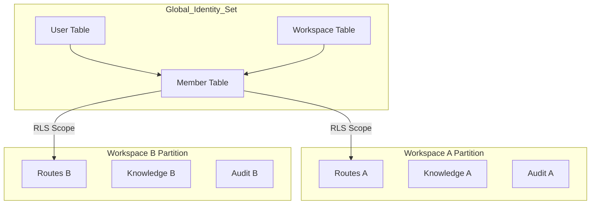
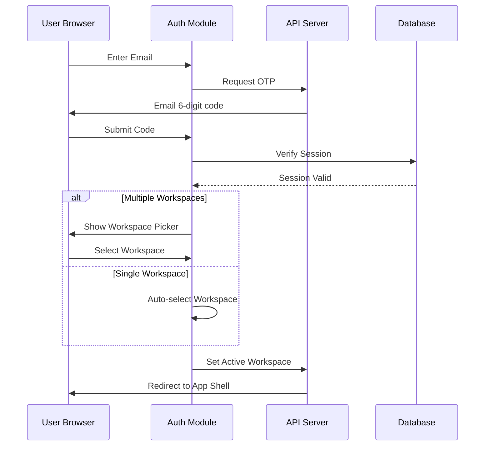

Relevant source files

The following files were used as context for generating this wiki page:

- [apps/docs-site/specs/T-004.md](apps/docs-site/specs/T-004.md)
- [apps/docs-site/specs/T-022.md](apps/docs-site/specs/T-022.md)
- [apps/docs-site/specs/T-006.md](apps/docs-site/specs/T-006.md)
- [apps/docs-site/specs/T-046.md](apps/docs-site/specs/T-046.md)
- [packages/schema/test/rls.test.ts](packages/schema/test/rls.test.ts)
- [CODING_RULES.md](CODING_RULES.md)
- [apps/api/tests/oauth-flow.test.ts](apps/api/tests/oauth-flow.test.ts)
- [packages/design-system/readme.md](packages/design-system/readme.md)

# Workspace & User Management

Workspace & User Management provides the multi-tenant foundation for Better Answers. The system enforces strict isolation between different companies (workspaces) while allowing individual people (users) to maintain memberships across multiple entities. It handles authentication, authorization, role assignments, and workspace-scoped data access via Row Level Security (RLS).

The system architecture follows a "one identity, many memberships" model. A user signs in once to the platform and then selects or is assigned to a specific workspace context. All subsequent interactions are governed by a **Principal** object that encapsulates the user's identity, current workspace, and role permissions.

Sources: [apps/docs-site/specs/T-004.md:14-25](apps/docs-site/specs/T-004.md#L14-L25), [packages/design-system/readme.md:38-40](packages/design-system/readme.md#L38-L40)

## Workspace Architecture

A workspace represents a single company deployment within the platform. Workspaces are platform-provisioned and cannot be created by individual users through self-service. Each workspace possesses its own isolated git repository for knowledge bundles and a dedicated database partition.

### Multi-Tenancy and Isolation

Tenant isolation is enforced at the database level using PostgreSQL Row Level Security (RLS). Every table containing tenant-specific data is created with RLS enabled and a `workspace_id` column. The system uses a specific `app_rt` role for application runtime, which is constrained by RLS policies to prevent cross-tenant data leakage.

*The diagram shows the relationship between global identity tables and workspace-specific partitions isolated by RLS.*

Sources: [apps/docs-site/specs/T-004.md:126-133](apps/docs-site/specs/T-004.md#L126-L133), [packages/schema/test/rls.test.ts:25-30](packages/schema/test/rls.test.ts#L25-L30), [apps/docs-site/specs/T-006.md:20-25](apps/docs-site/specs/T-006.md#L20-L25)

### Workspace Provisioning

The `provisionWorkspace` function in the core workspaces slice executes as a single atomic transaction. It creates the workspace row, initializes the database partition, assigns the first Admin user, and generates the configuration row.

Sources: [apps/docs-site/specs/T-004.md:180-186](apps/docs-site/specs/T-004.md#L180-L186)

## User Management and Roles

Users interact with workspaces based on their assigned roles. The platform defines a closed set of three canonical roles for people:

| Role | Description |
| :--- | :--- |
| **Admin** | Manages workspace system settings, people, and high-level knowledge curation. |
| **Editor** | Responsible for curating knowledge, accepting suggestions, and running business activities. |
| **Viewer** | Accesses knowledge, asks questions, and provides feedback on answers. |

Sources: [packages/design-system/readme.md:38-40](packages/design-system/readme.md#L38-L40), [apps/api/tests/oauth-flow.test.ts:400-410](apps/api/tests/oauth-flow.test.ts#L400-L410)

### Principal Resolution

The **Principal** is the core object for authorization. Transports (like tRPC or MCP) build a Principal from a verified session or bearer token. The system resolves the Principal inside a database transaction to ensure real-time enforcement of role changes or revocations.

1. **Resolver Logic**: The system reads claims (Workspace ID, User ID, Role) from the credential.
2. **Validation**: It verifies the user's membership in the claimed workspace and checks for credential revocation.
3. **Enforcement**: If valid, the transaction sets the RLS scope (`app.workspace_id`) and executes the requested business logic.

Sources: [apps/docs-site/specs/T-004.md:112-124](apps/docs-site/specs/T-004.md#L112-L124), [CODING_RULES.md:202-212](CODING_RULES.md#L202-L212)

## Authentication Flow

Better Answers implements an integrated authentication system using `better-auth`. The system prioritizes passwordless entry via emailed six-digit codes.

### Sign-in and Workspace Selection

The authentication process involves three primary stages:
1. **Sign-In**: Users enter their work email and receive a one-time code.
2. **Workspace Picker**: If a user belongs to multiple workspaces, they must select one. Users with exactly one workspace land in it directly.
3. **Consent**: For OAuth/MCP flows, users provide explicit consent naming the client's real address.

*Sequence diagram illustrating the passwordless sign-in and workspace selection flow.*

Sources: [apps/docs-site/specs/T-022.md:38-52](apps/docs-site/specs/T-022.md#L38-L52), [apps/docs-site/specs/T-046.md:40-55](apps/docs-site/specs/T-046.md#L40-L55)

### Session Revocation

Administrators can revoke a person's credentials as a single act. This revocation:
*  Sets a revocation instant in the database.
*  Invalidates all existing browser sessions.
*  Revokes all access and refresh tokens minted before the revocation instant.

Sources: [apps/docs-site/specs/T-004.md:175-179](apps/docs-site/specs/T-004.md#L175-L179), [apps/api/tests/oauth-flow.test.ts:325-335](apps/api/tests/oauth-flow.test.ts#L325-L335)

## Security and Compliance

The system strictly separates identity data from tenant data.

### Identity Set
The "Identity Set" consists of global tables that lack a `workspace_id` column and are exempt from standard RLS policies to allow the login and picker flows to function. This set includes:
*  `public.workspace`
*  `public.user`
*  `public.member`
*  `public.session`

Sources: [packages/schema/test/rls.test.ts:15-20](packages/schema/test/rls.test.ts#L15-L20), [apps/docs-site/specs/T-004.md:130-140](apps/docs-site/specs/T-004.md#L130-L140)

### Audit Logging
Every workspace action is audited. Audit events land in the same transaction as the acts they describe. Acts are named using the `family.subject.verb` pattern (e.g., `people.member.role_changed`). The audit ledger is append-only, and the database role is restricted from updating or deleting audit rows.

Sources: [CODING_RULES.md:235-250](CODING_RULES.md#L235-L250), [apps/docs-site/specs/T-006.md:65-72](apps/docs-site/specs/T-006.md#L65-L72)

Workspace and user management ensures that Better Answers remains a secure, permission-aware knowledge map where every act is attributable and data is strictly partitioned by workspace.
