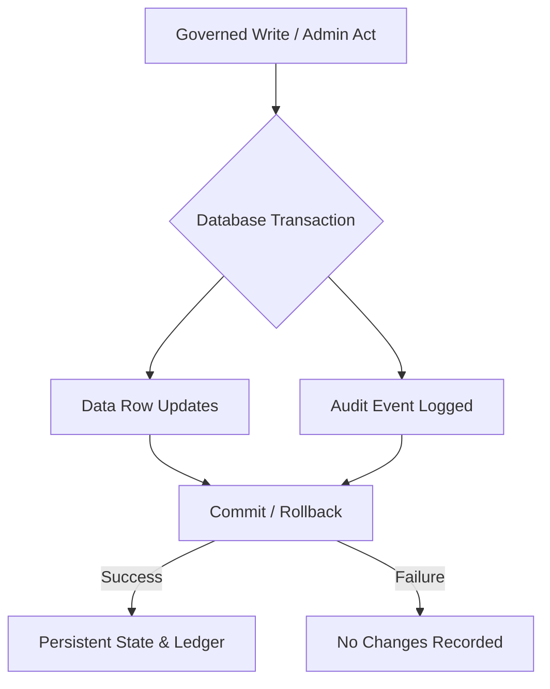
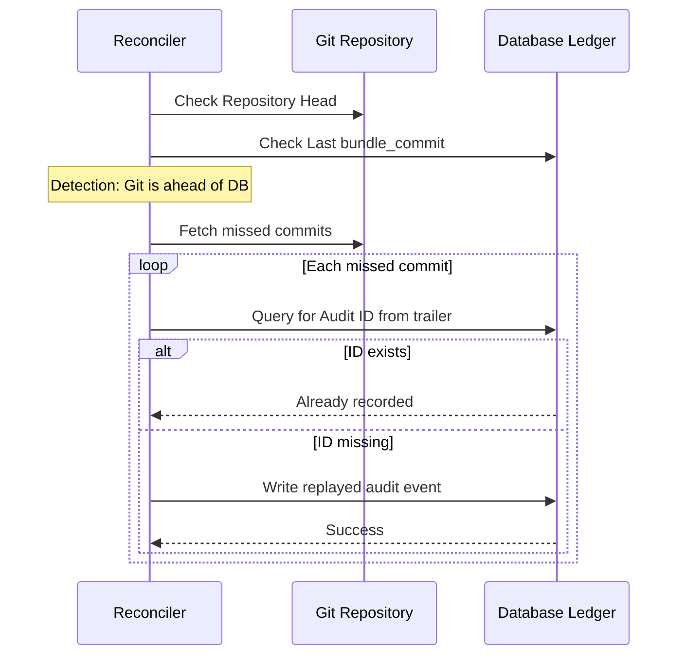

Relevant source files

The following files were used as context for generating this wiki page:

- [CODING_RULES.md](CODING_RULES.md)
- [AGENTS.md](AGENTS.md)
- [apps/docs-site/specs/T-064.md](apps/docs-site/specs/T-064.md)
- [apps/docs-site/specs/T-006.md](apps/docs-site/specs/T-006.md)
- [apps/docs-site/specs/T-045.md](apps/docs-site/specs/T-045.md)
- [apps/api/tests/deploy-tree.test.ts](apps/api/tests/deploy-tree.test.ts)
- [apps/api/tests/coding-rules-tags.test.ts](apps/api/tests/coding-rules-tags.test.ts)

# Audit Trail & Event Logging

The Audit Trail & Event Logging system provides an append-only ledger that records every significant administrative, governed, or platform act within the Better Answers platform. It ensures accountability and traceability by linking every change to a specific actor and transaction. The system enforces strict architectural constraints to prevent data tampering, ensuring that every governed write and its corresponding audit event succeed or fail together as a single atomic unit.

Sources: [CODING_RULES.md:162-165](CODING_RULES.md#L162-L165), [AGENTS.md:12-14](AGENTS.md#L12-L14)

## Core Architecture and Transactional Integrity

The audit system centers on the `audit_event` ledger, which is a tenant-specific table. Every administrative act, governed write, and platform act must write an audit event within the same database transaction as the data changes it describes. This ensures that an act whose event cannot be written does not occur.

The diagram shows the atomic nature of governed writes and audit logging within a single transaction.
Sources: [CODING_RULES.md:166-173](CODING_RULES.md#L166-L173), [apps/docs-site/specs/T-006.md:85-90](apps/docs-site/specs/T-006.md#L85-L90)

### Identity and Actor Attribution
Every audit row identifies the initiator using a kernel-derived `ActorId`. The platform derives this ID from the `Principal` provided during the call. The system supports three primary actor types:
*  **Human**: Represented as `human:<person id>`.
*  **Process**: Represented as `process:better-answers-<purpose>` (e.g., the reconciler).
*  **Agent**: IDs as defined by ADR 0019.

The actor ID is derived by the kernel and is never composed manually. It specifically excludes PII such as emails, display names, or session identifiers to comply with erasure requirements, as the ledger itself is never rewritten.

Sources: [CODING_RULES.md:179-184](CODING_RULES.md#L179-L184), [CODING_RULES.md:200-205](CODING_RULES.md#L200-L205), [apps/docs-site/specs/T-006.md:99-105](apps/docs-site/specs/T-006.md#L99-L105)

## Event Vocabulary and Structure

Audit events follow a strict naming convention: `family.subject.verb`. This hierarchy ensures a typed vocabulary that prevents free-form string entries.

### Event Naming Families
| Family | Description | Examples |
| :--- | :--- | :--- |
| **people** | Acts involving users and memberships | `people.member.role_changed` |
| **knowledge** | Acts involving concepts and suggestions | `knowledge.suggestion.accepted` |
| **sources** | Acts involving data bindings and evidence | `sources.binding.published` |
| **platform** | Internal system operations and reconciliations | `platform.reconciler.replayed` |

Sources: [CODING_RULES.md:174-178](CODING_RULES.md#L174-L178)

### Audit Detail Constraints
The structured detail of an audit event contains record IDs and role words (e.g., Admin, Editor, Viewer). It must never carry:
*  User email addresses.
*  Display names.
*  LLM Prompts or completions.
*  Sensitive content that would require ledger rewriting upon a Right to Erasure request.

Sources: [CODING_RULES.md:193-198](CODING_RULES.md#L193-L198)

## Technical Implementation and Security

### Immutable Ledger
The `audit_event` table is append-only at the database level. The migration process revokes `UPDATE` and `DELETE` privileges for the application's database role. The worker role is granted no privileges on the table, preventing external processes from tampering with the history.

Sources: [CODING_RULES.md:200-203](CODING_RULES.md#L200-L203)

### Caller-Minted Identifiers
To ensure a tight link between the knowledge layer (git) and the database ledger, the writer mints a ULID for the audit event before the write occurs. This ID is included in git commit trailers (e.g., `Audit: <id>`). The database column for the audit event ID has no default value, forcing the application to provide the pre-minted identifier.

Sources: [CODING_RULES.md:204-208](CODING_RULES.md#L204-L208), [apps/docs-site/specs/T-006.md:92-97](apps/docs-site/specs/T-006.md#L92-L97)

### Audit Scoping and Exclusions
The system distinguishes between audit events and other types of logging or record-keeping:
*  **Exclusions**: Read operations do not trigger audit events. Events without a workspace (e.g., sign-in attempts) are logged as standard log lines rather than ledger entries because the ledger is a tenant-specific table.
*  **Separate Records**: The answer audit, system signals, health checks, and backup runs are maintained in their own specialized tables and are not stored in the `audit_event` ledger.

Sources: [CODING_RULES.md:209-215](CODING_RULES.md#L209-L215)

## Recovery and Reconciliation
A reconciler process handles the "crash window" between a git commit and the database transaction. If the repository head is ahead of the last recorded `bundle_commit`, the reconciler replays the missed commits. This process is idempotent, using the `Audit:` trailer IDs to skip events that have already been recorded in the database ledger.

The sequence diagram illustrates the idempotent reconciliation flow used to sync the git history with the database audit trail.
Sources: [apps/docs-site/specs/T-006.md:10-15](apps/docs-site/specs/T-006.md#L10-L15), [apps/docs-site/specs/T-006.md:79-84](apps/docs-site/specs/T-006.md#L79-L84)

## Summary
The Audit Trail & Event Logging module provides the foundational layer for transparency and trust in the Better Answers platform. By enforcing transactional atomicity between data changes and append-only ledger entries, the system ensures that every governed act is permanently recorded and attributed to a verified principal. The use of pre-minted ULIDs and git trailers allows the platform to reconcile state across the database and version control layers, maintaining a consistent history even in the event of process failures.
