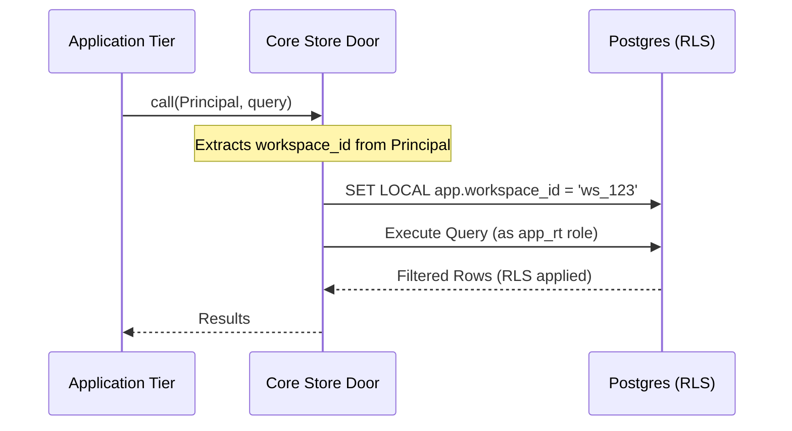

Relevant source files

The following files were used as context for generating this wiki page:

- [CODING_RULES.md](CODING_RULES.md)
- [AGENTS.md](AGENTS.md)
- [packages/schema/test/boundary-schemas.test.ts](packages/schema/test/boundary-schemas.test.ts)
- [packages/schema/scripts/worker-view.ts](packages/schema/scripts/worker-view.ts)
- [apps/api/tests/harness.ts](apps/api/tests/harness.ts)
- [packages/core/package.json](packages/core/package.json)

# Postgres Store & Row-Level Security

Postgres Store & Row-Level Security (RLS) provides the primary data persistence and multi-tenant isolation layer for the Better Answers platform. The system enforces a default-deny policy where every tenant table requires an explicit RLS policy to return rows. Access is mediated through "store doors" in `packages/core/store/`, ensuring that all queries are scoped to a specific workspace via a `Principal` object.

This architecture guarantees that data belonging to one company remains inaccessible to others, even if application-level logic fails to include a workspace filter. The system uses a non-owner database role, `app_rt`, which executes queries after the application sets the local `app.workspace_id` session variable.

Sources: [CODING_RULES.md:21-25](CODING_RULES.md#L21-L25), [AGENTS.md:14-16](AGENTS.md#L14-L16)

## Security Architecture & Principal Enforcement

The security model relies on a `Principal` being passed to every function in `packages/core` that interacts with tenant data. This `Principal` contains the `workspaceId`, `userId`, and `role`. Transports like the API or Worker build this principal, which the data layer then uses to set the Postgres session context.

### Access Flow

The following diagram illustrates how a request from a specific user is scoped to their workspace at the database level.

The application sets `app.workspace_id` using `SET LOCAL` within a transaction. Postgres then evaluates RLS policies against this session variable to filter rows.
Sources: [CODING_RULES.md:26-30](CODING_RULES.md#L26-L30), [apps/api/tests/harness.ts:133-138](apps/api/tests/harness.ts#L133-L138)

### Principal Types
The system distinguishes between two primary types of actors:
| Principal Type | Description |
| :--- | :--- |
| **Deferred Principal** | Carries a person's authority into background jobs or scheduled runs; expires with the session. |
| **Platform Principal** | The platform acting as itself with its own actor ID, used for system-level tasks. |

Sources: [CODING_RULES.md:195-201](CODING_RULES.md#L195-L201), [apps/api/tests/harness.ts:98-101](apps/api/tests/harness.ts#L98-L101)

## Row-Level Security (RLS) Implementation

RLS is the fundamental guarantee for tenant isolation. The project follows a strict set of rules to ensure coverage and prevent data leakage:

*  **Default Deny**: Every tenant table is created `withRLS()`. If no policy is defined, the table returns zero rows under `FORCE ROW LEVEL SECURITY`.
*  **Workspace ID Requirement**: Every table containing tenant data must carry a `workspace_id` column.
*  **Identity Set Exemption**: Tables belonging to the "identity set" (e.g., Better Auth tables) are exempt from workspace-based RLS as they are used to resolve the workspace ID initially.
*  **Partition Isolation**: RLS policies on parent tables do not automatically reach queries aimed directly at children in partitioned tables. Direct denial must be asserted for partition children.

Sources: [CODING_RULES.md:21-35](CODING_RULES.md#L21-L35), [CODING_RULES.md:204-213](CODING_RULES.md#L204-L213)

### Graph Data Security
Graph data, including `graph_node` and `graph_edge`, are treated as standard tenant tables. They carry `workspace_id` and visibility terms (`published_at`, `sensitivity`, `audience`) and are subject to the same RLS enforcement as relational data. Traversal is performed via prepared recursive-CTE templates rather than specialized graph drivers.
Sources: [CODING_RULES.md:37-43](CODING_RULES.md#L37-L43), [packages/schema/test/boundary-schemas.test.ts:100-112](packages/schema/test/boundary-schemas.test.ts#L100-L112)

## Schema Management & Boundary Validation

The system uses `drizzle-orm` for schema definition and `zod` for runtime boundary validation. The `boundary-schemas` registry ensures that every exported `PgTable` has a corresponding Zod schema for `select`, `insert`, and `update` operations.

### Schema Integrity Rules
1.  **Strict Refinement**: A Zod refinement must only narrow the types accepted by the database column; it must never accept data the database would reject.
2.  **Dual-Direction Testing**: Tests assert that every registered table has a boundary and every boundary corresponds to a registered table.
3.  **Worker View Sync**: The Python-based Worker tier imports a generated `worker-view` of the schema to ensure it remains in sync with the TypeScript-defined DDL.

Sources: [packages/schema/test/boundary-schemas.test.ts:10-20](packages/schema/test/boundary-schemas.test.ts#L10-L20), [packages/schema/scripts/worker-view.ts:10-25](packages/schema/scripts/worker-view.ts#L10-L25), [CODING_RULES.md:86-92](CODING_RULES.md#L86-L92)

### Database Components
| Component | Implementation Detail |
| :--- | :--- |
| **Postgres Image** | Official `pgvector` image, pinned in `packages/schema/src/postgres-image.ts`. |
| **Vector Width** | Defined by `EMBEDDING_DIMENSIONS` constant for `index.chunk` embeddings. |
| **Migrations** | Forward-only; managed exclusively by the API tier (`apps/api/src/migrate.ts`). |
| **Role** | `app_rt` is the non-owner role used for application runtime queries. |

Sources: [CODING_RULES.md:247-251](CODING_RULES.md#L247-L251), [packages/schema/test/boundary-schemas.test.ts:117-124](packages/schema/test/boundary-schemas.test.ts#L117-L124), [apps/worker/CODING_RULES.md:8-12](apps/worker/CODING_RULES.md#L8-L12)

## Data Access & Testing

The "Store Door" pattern in `packages/core/store/` provides the only interface for reaching the database. Direct database access or mocking the database in tests is prohibited.

### Testing Requirements
*  **Real Postgres**: Every test touching data runs against a real Postgres instance (via Testcontainers or Docker Compose).
*  **Factory-Based Setup**: Test state is built using domain object factories rather than raw SQL inserts.
*  **Zero-Rows Test**: Every tenant table must have a test proving that no rows are returned when the workspace context is missing.
*  **Security Definer Checks**: Functions using `SECURITY DEFINER` must pin the `search_path`, schema-qualify all objects, and revoke `EXECUTE` from `PUBLIC`.

Sources: [CODING_RULES.md:21-25](CODING_RULES.md#L21-L25), [CODING_RULES.md:65-72](CODING_RULES.md#L65-L72), [CODING_RULES.md:204-215](CODING_RULES.md#L204-L215), [apps/api/CODING_RULES.md:25-30](apps/api/CODING_RULES.md#L25-L30)

### Transactional Integrity
Functions in `packages/core` that perform mutations are expected to be created in the caller's transaction. This ensures that operations across multiple tables (e.g., provisioning a workspace) succeed or fail atomically.
Sources: [apps/api/tests/harness.ts:145-155](apps/api/tests/harness.ts#L145-L155), [CODING_RULES.md:112-115](CODING_RULES.md#L112-L115)

Postgres Store & Row-Level Security ensures robust multi-tenancy by moving the isolation guarantee into the database engine itself. By combining RLS with `Principal`-based store doors and strict schema boundary validation, the system minimizes the risk of unauthorized data access across workspaces.
