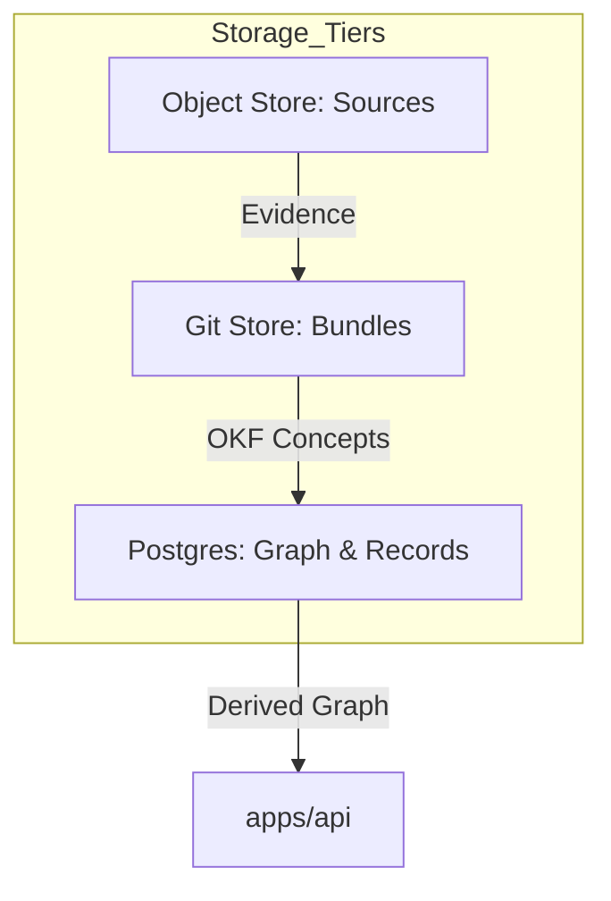
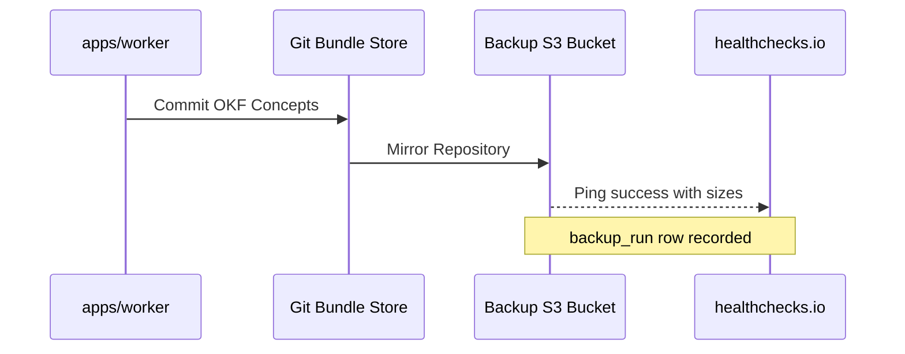

Relevant source files

The following files were used as context for generating this wiki page:

- [AGENTS.md](AGENTS.md)
- [packages/design-system/readme.md](packages/design-system/readme.md)
- [CODING_RULES.md](CODING_RULES.md)
- [deploy/wizard-41.sh](deploy/wizard-41.sh)
- [packages/design-system/guidelines/kits-adoption.card.html](packages/design-system/guidelines/kits-adoption.card.html)

# Git Bundle Store

The Git Bundle Store serves as one of the four primary data stores in the Better Answers platform architecture. It manages a dedicated git repository for every workspace to store knowledge bundles based on the OKF v0.2 specification.

## Introduction

The Git Bundle Store holds the middle layer of the platform's three knowledge layers: **sources** (evidence), **bundles** (OKF concepts), and the **graph** (derived data). The platform uses git to store versioned knowledge maps for UK Small and Medium Businesses (SMBs). Each workspace maintains its own git repository to track these concepts, ensuring that every answer provided by the system is cited and explainable.

The repository structure isolates business logic from transport layers, with the git store specifically supporting the `packages/core` business logic. This store interacts with other system components, including a Postgres database, an object store for source evidence, and a derived graph for relationship sync.

Sources: [AGENTS.md:7-12](AGENTS.md#L7-L12), [packages/design-system/readme.md:12-25](packages/design-system/readme.md#L12-L25)

## Architecture and Data Flow

The Git Bundle Store is governed by strict coding rules that enforce separation of concerns and maintainable structures. It operates within a monorepo layout where `packages/core` provides the "store doors" or capability slices that interact with the git repositories.

### Knowledge Layers
The store manages data transitions between evidence and derived relationships:
1.  **Evidence (Sources):** Raw data stored in the object store.
2.  **Map (Bundles):** OKF v0.2 concepts stored in the Git Bundle Store.
3.  **Derived (Graph):** Relationships synced to specialized graph tables in Postgres.

The diagram shows the data flow from raw evidence in the object store to versioned OKF concepts in Git, which are then derived into a graph structure within Postgres for API consumption.
Sources: [AGENTS.md:7-10](AGENTS.md#L7-L10), [packages/design-system/readme.md:12-16](packages/design-system/readme.md#L12-L16), [CODING_RULES.md:20-25](CODING_RULES.md#L20-L25)

## OKF v0.2 Implementation

Knowledge bundles within the Git store must adhere to the Open Knowledge Format (OKF) v0.2 specification. The store enforces a "bundle-alone" test to ensure that concept files only contain data relevant to the knowledge map, excluding platform-specific UI configurations.

### Concept File Constraints
Concept files stored in Git are limited to:
*  Standard OKF v0.2 definitions.
*  The `iri` key for unique identity.
*  The `sources[].locator` key for linking back to evidence.

The platform explicitly forbids storing platform records—such as guides, sections, or audience definitions—inside the git-managed concept files. These are handled as separate records in the Postgres database.

Sources: [CODING_RULES.md:105-125](CODING_RULES.md#L105-L125), [packages/design-system/readme.md:12-16](packages/design-system/readme.md#L12-L16)

## Integration and Operations

The Git Bundle Store is integrated into the platform's deployment and backup cycles. The `apps/worker` tier (Python) handles the conversion, conversion, and indexing of knowledge from source documents into the Git store.

### Backup and Synchronization
Backup operations for the Git store are automated and include:
*  **Git Mirroring:** A backup service mirrors the git repository to a dedicated mirror bucket.
*  **Retention:** Git backups are retained for 30 days, with first-of-month backups kept for 6 months.
*  **Object Locking:** Backups are stored with object locking in GOVERNANCE mode to prevent accidental deletion.

The sequence diagram illustrates the automated commit and mirroring process, ending with a health check notification to ensure backup integrity.
Sources: [deploy/wizard-41.sh:176-187](deploy/wizard-41.sh#L176-L187), [CODING_RULES.md:143-150](CODING_RULES.md#L143-L150), [AGENTS.md:22-28](AGENTS.md#L22-L28)

## Design System Integration

The Git Bundle Store provides the raw data that populates the design system's knowledge components. Specifically, it feeds the `Citation` and `CoverageBar` components.

| Component | Function | Data Source |
| :--- | :--- | :--- |
| `Citation` | Displays concept, source, locator, and passage. | Git Concept File + Object Store |
| `CoverageBar` | Shows section expectation vs. included concepts. | Git Bundle Metadata |
| `TrustTag` | Displays verification status (e.g., "Checked by platform"). | Platform Audit Records |

Sources: [packages/design-system/guidelines/kits-adoption.card.html:150-165](packages/design-system/guidelines/kits-adoption.card.html#L150-L165), [packages/design-system/readme.md:135-145](packages/design-system/readme.md#L135-L145)

## Maintenance and Security

Access to the Git Bundle Store is mediated by `packages/core` using a `Principal` object. This ensures that every read or write operation is workspace-aware and permissioned. In accordance with platform security rules, secrets like git deploy keys are managed through a dedicated `CredentialsProviderInterface` and are never hardcoded or logged.

Operations such as repo mirroring and restoration are managed via scripts in the `deploy/` directory, which handle host-level cron tasks and WireGuard split-tunneling for secure cross-VPC communication.

Sources: [CODING_RULES.md:85-95](CODING_RULES.md#L85-L95), [deploy/wizard-41.sh:135-150](deploy/wizard-41.sh#L135-L150)
