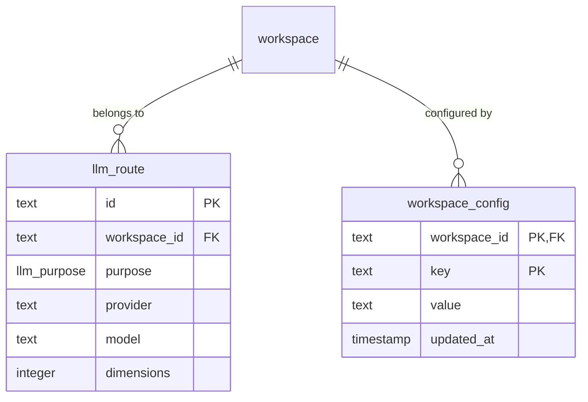
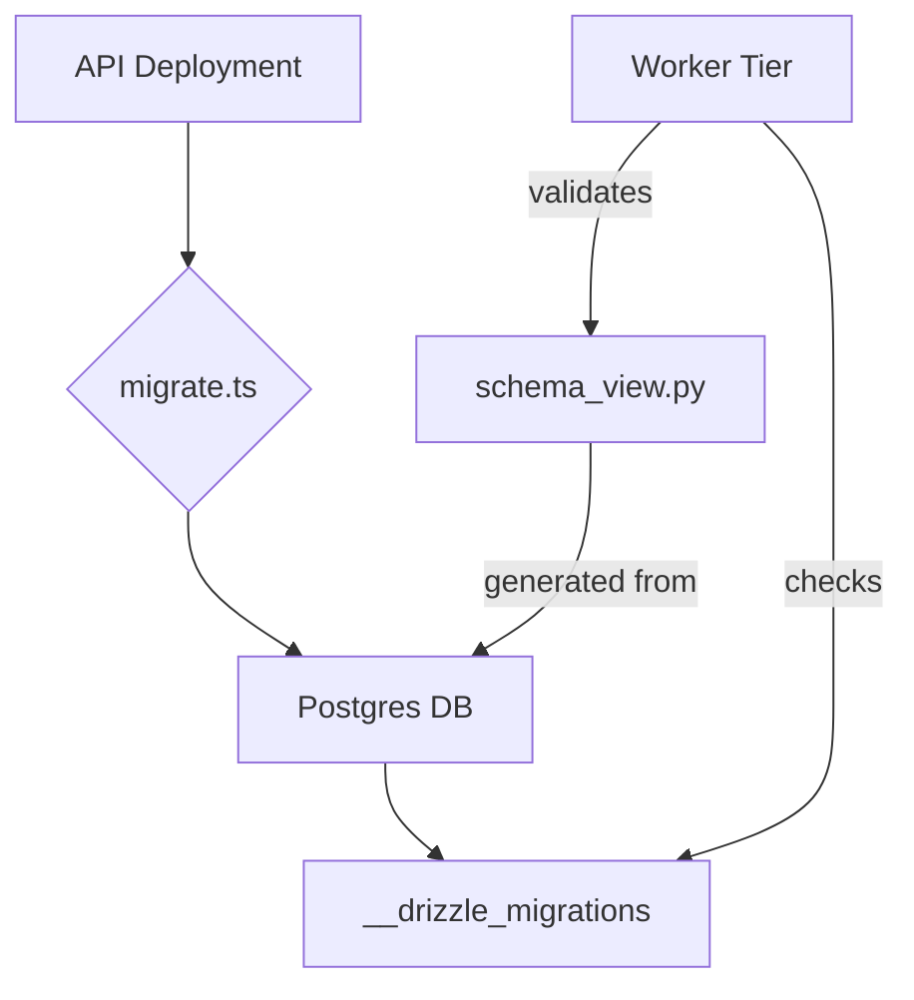

<details>
<summary>Relevant source files</summary>

The following files were used as context for generating this wiki page:

- [packages/schema/src/schema.ts](packages/schema/src/schema.ts)
- [apps/api/src/migrate.ts](apps/api/src/migrate.ts)
- [packages/schema/src/boundary-schemas.ts](packages/schema/src/boundary-schemas.ts)
- [packages/schema/scripts/worker-view.ts](packages/schema/scripts/worker-view.ts)
- [CODING_RULES.md](CODING_RULES.md)
- [apps/worker/CODING_RULES.md](apps/worker/CODING_RULES.md)
- [packages/schema/test/worker-schema-view.test.ts](packages/schema/test/worker-schema-view.test.ts)
</details>

# Drizzle Schema & Migrations

Drizzle ORM manages the database schema and migration lifecycle for the Better Answers platform. The system defines the data model in TypeScript and applies changes through forward-only SQL migrations to ensure consistency across tiers.

The schema enforces strict multi-tenancy. Every tenant table carries a workspace identifier. Row Level Security (RLS) acts as the primary guarantee for data isolation.

## Schema Architecture and Multi-tenancy

The database structure prioritizes data isolation through mandatory Row Level Security (RLS). All tenant tables use the `withRLS()` utility during definition.

### Multi-tenant Data Isolation
Every tenant table carries a `workspace_id`. The system uses a "default-deny" policy for RLS. If a table lacks a specific policy, it returns no rows. The non-owner role `app_rt` reads data using a local `app.workspace_id` variable set from the user's `Principal`.

Sources: [CODING_RULES.md:31-40](CODING_RULES.md#L31-L40), [packages/schema/src/schema.ts:31-36](packages/schema/src/schema.ts#L31-L36)

### Core Tables
The public schema contains tables for routing and configuration.

| Table Name | Description | Key Fields |
| :--- | :--- | :--- |
| `workspace` | The primary tenant entity. | `id` (ULID), `name`, `slug` |
| `llm_route` | Stores LLM provider details per purpose. | `id`, `workspace_id`, `purpose`, `model` |
| `workspace_config` | Stores tenant-specific thresholds. | `workspace_id`, `key`, `value` |

Sources: [packages/schema/src/schema.ts:31-69](packages/schema/src/schema.ts#L31-L69), [packages/schema/src/boundary-schemas.ts:153-165](packages/schema/src/boundary-schemas.ts#L153-L165)



The diagram shows the relationship between core workspace entities and their configurations.
Sources: [packages/schema/src/schema.ts:31-69](packages/schema/src/schema.ts#L31-L69)

## Migration Lifecycle

The `apps/api` tier holds exclusive ownership of the migration process. Other tiers remain read-only.

### Application of Migrations
The `src/migrate.ts` entry point in the API tier runs the migration logic. This process executes to completion before the main application starts. The system uses forward-only migrations. You must roll back by deploying a previous image digest.

Sources: [apps/api/src/migrate.ts:13-18](apps/api/src/migrate.ts#L13-L18), [apps/worker/CODING_RULES.md:7-11](apps/worker/CODING_RULES.md#L7-L11), [CODING_RULES.md:204-206](CODING_RULES.md#L204-L206)

### Migration Flow
1. API tier reads `requireBootstrap` to get connection strings.
2. `migrate()` function executes SQL scripts from the migrations folder.
3. The process exits if migrations fail.
4. The worker tier checks the `__drizzle_migrations` table before starting.



The flowchart illustrates the migration ownership and the synchronization check performed by the worker.
Sources: [apps/api/src/migrate.ts:13-25](apps/api/src/migrate.ts#L13-L25), [apps/worker/CODING_RULES.md:7-11](apps/worker/CODING_RULES.md#L7-L11)

## Boundary Schemas

Boundary schemas provide runtime validation at application seams using Zod. They are derived from Drizzle tables but refined to enforce stricter domain invariants.

### Refinement Rules
Refinements only narrow the underlying table schema. For example, a `text` column in Drizzle becomes a `ULID` regex or a closed `enum` in Zod.
*  `ULID`: Validates workspace and entity identifiers.
*  `ROLES`: Narrows role strings to "Admin", "Editor", or "Viewer".
*  `llm_purpose`: Restricts values to specific AI tasks like "extraction" or "embedding".

Sources: [packages/schema/src/boundary-schemas.ts:25-35](packages/schema/src/boundary-schemas.ts#L25-L35), [packages/schema/src/boundary-schemas.ts:106-111](packages/schema/src/boundary-schemas.ts#L106-L111)

### Data Structure: Schema Registry
The `boundarySchemas` object serves as the central registry for the entire project.

```typescript
export const boundarySchemas = {
  workspace: {
    table: workspace,
    select: workspaceSelect,
    insert: workspaceInsert,
    update: workspaceUpdate,
  },
  // ... other tables
} as const;
```

Sources: [packages/schema/src/boundary-schemas.ts:153-158](packages/schema/src/boundary-schemas.ts#L153-L158)

## Worker Schema Synchronization

The Python-based worker tier cannot import TypeScript schemas directly. It uses a committed "Worker View" to maintain type safety and structural awareness.

### Schema Introspection
A generation script introspects the migrated database using `pg_catalog`. It extracts column names, types, and nullability for all tables in the `public` and `index` schemas.

Sources: [packages/schema/scripts/worker-view.ts:28-40](packages/schema/scripts/worker-view.ts#L28-L40)

### Drift Prevention
The project enforces schema parity through drift tests.
1. The test introspects the real Postgres database.
2. It compares the database state against the committed `schema_view.py`.
3. It validates that all database tables were explicitly declared in TypeScript.
4. If a mismatch occurs, the CI build fails, requiring a regeneration of the worker view.

Sources: [packages/schema/test/worker-schema-view.test.ts:33-40](packages/schema/test/worker-schema-view.test.ts#L33-L40), [packages/schema/scripts/worker-view.ts:56-65](packages/schema/scripts/worker-view.ts#L56-L65)

## Summary

Drizzle Schema & Migrations ensures a single source of truth for the data model while supporting a multi-language architecture. By combining RLS enforcement, Zod boundaries, and automated worker-view synchronization, the project maintains strict data isolation and structural integrity across the API and worker tiers.
