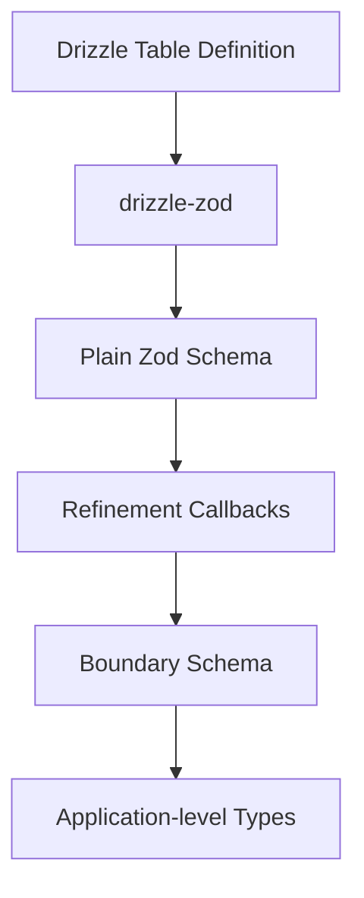
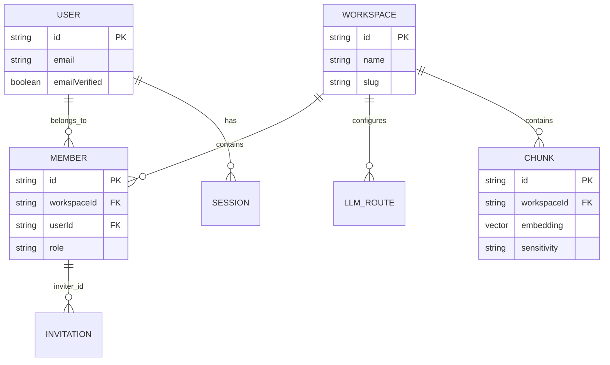
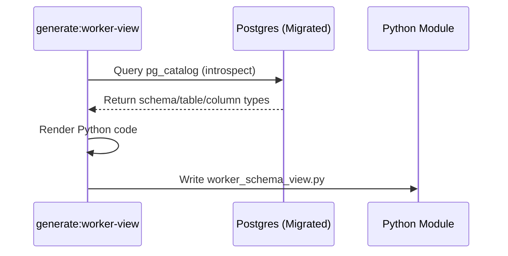

<details>
<summary>Relevant source files</summary>

The following files were used as context for generating this wiki page:

- [packages/schema/src/boundary-schemas.ts](packages/schema/src/boundary-schemas.ts)
- [packages/schema/package.json](packages/schema/package.json)
- [packages/schema/test/boundary-schemas.test.ts](packages/schema/test/boundary-schemas.test.ts)
- [packages/schema/scripts/worker-view.ts](packages/schema/scripts/worker-view.ts)
- [CODING_RULES.md](CODING_RULES.md)
- [AGENTS.md](AGENTS.md)
- [apps/docs-site/specs/T-006.md](apps/docs-site/specs/T-006.md)
</details>

# Relational Schema & Drizzle ORM

The Better Answers project utilizes Drizzle ORM to manage its relational database schema, ensuring type-safe interactions between the application and the PostgreSQL database. The schema is centralized within the `packages/schema` workspace, providing a shared source of truth for the API tier and a generated view for the Python-based worker tier.

Relational data management is governed by strict rules, including mandatory Row Level Security (RLS) and testing against real Postgres instances.

## Core Architecture and Boundary Schemas

The project employs "Boundary Schemas" (ADR 0028) to bridge Drizzle table definitions and application-level types using Zod. These schemas refine Drizzle-generated types to enforce stricter domain constraints, such as ULID formats and specific enum sets for roles and sensitivity levels.



The diagram above illustrates the transformation flow from raw Drizzle table definitions to type-safe application boundaries using Zod refinements.

### Refinement Logic
Refinements only narrow the types generated by Drizzle. For example, `workspaceId` and `userId` strings are branded and validated against ULID regex patterns.
Sources: [packages/schema/src/boundary-schemas.ts:32-35](packages/schema/src/boundary-schemas.ts#L32-L35), [packages/schema/src/boundary-schemas.ts:37-43](packages/schema/src/boundary-schemas.ts#L37-L43)

### The customType Exception
A plain schema replaces the generated field wholesale for `customType` columns like `chunk.embedding`. A callback on a custom column throws at module evaluation, so `z.array(z.number()).length(EMBEDDING_DIMENSIONS)` is used instead.
Sources: [packages/schema/src/boundary-schemas.ts:88-91](packages/schema/src/boundary-schemas.ts#L88-L91), [packages/schema/test/boundary-schemas.test.ts:165-172](packages/schema/test/boundary-schemas.test.ts#L165-L172)

## Data Models and Relationships

The schema covers several functional areas, including identity, workspace configuration, and the knowledge graph.

### Entity Relationship Structure
The identity set (User, Member, Workspace) forms the core of the multi-tenant architecture.



The ER diagram displays the primary relationships between multi-tenant workspaces and identity entities.

### Key Schema Tables
| Table Name | Description | Constraints / Refinements |
| :--- | :--- | :--- |
| `workspace` | Represents a company/tenant. | `id` must be a branded ULID. |
| `member` | Maps users to workspaces with roles. | Roles limited to `Admin`, `Editor`, `Viewer`. |
| `chunk` | Stores knowledge fragments and embeddings. | `sensitivity` limited to `Restricted`, `Internal`, `Public`. |
| `llmRoute` | Configures model providers for specific purposes. | `purpose` includes `extraction`, `enrichment`, `answering`, etc. |
| `audit_event` | Append-only ledger of governed writes. | Revokes `UPDATE` and `DELETE` at the DB level. |

Sources: [packages/schema/src/boundary-schemas.ts:154-206](packages/schema/src/boundary-schemas.ts#L154-L206), [apps/docs-site/specs/T-006.md:209-215](apps/docs-site/specs/T-006.md#L209-L215), [CODING_RULES.md:[AUDIT6]]()

## Database Governance Rules

The project enforces several architectural constraints to maintain data integrity and security.

### Row Level Security (RLS)
Every tenant table must be created `withRLS()`. A zero-rows test must ship with every tenant table to prove that the non-owner runtime role returns no rows by default under `FORCE ROW LEVEL SECURITY`.
Sources: [CODING_RULES.md:[SEC3]]()

### Principal-First Access
Every function in `packages/core` that reads or writes tenant data must take a `Principal` (`workspaceId`, `userId`, `role`) as its first parameter. Data access logic checks the role and the read predicate (published, sensitivity, audience) against the readable unit's columns.
Sources: [CODING_RULES.md:[SEC2]]()

### Postgres testing
The database is never mocked. Every test touching data runs against a real Postgres instance using Testcontainers or the compose database.
Sources: [CODING_RULES.md:[TEST2]]()

## Cross-Tier Schema Synchronization

While the schema is defined in TypeScript, the Python-based `apps/worker` requires a read-only view of the database structure.

### Worker Schema View Generation
A script generates a committed Python module (`TABLES`) by introspecting the migrated database. This module stamps the worker with a `MIGRATION_ID` to ensure it operates on a compatible schema version.



Sources: [packages/schema/scripts/worker-view.ts:31-40](packages/schema/scripts/worker-view.ts#L31-L40), [packages/schema/scripts/worker-view.ts:63-74](packages/schema/scripts/worker-view.ts#L63-L74)

### Table Introspection Query
The worker view generator uses `pg_attribute`, `pg_class`, and `pg_namespace` to retrieve precise column types and nullability constraints.

```typescript
// packages/schema/scripts/worker-view.ts:32-38
const result = await client.query(
    String.raw`SELECT n.nspname AS schema, c.relname AS table, a.attname AS column,
            pg_catalog.format_type(a.atttypid, a.atttypmod) AS type, a.attnotnull AS not_null
       FROM pg_attribute a
       JOIN pg_class c ON c.oid = a.attrelid
       JOIN pg_namespace n ON n.oid = c.relnamespace
      WHERE n.nspname IN ('public', 'index') AND c.relkind IN ('r', 'p')`
);
```

## Schema Enforcement and Testing

Parity assertions ensure that boundary schemas stay synchronized with the underlying Drizzle tables.

*  **Assertion 1:** Every `PgTable` exported by the public entry point must be registered in `boundarySchemas`.
*  **Assertion 2:** The key sets of boundary schemas must agree exactly with generated Drizzle-Zod shapes.
*  **Assertion 3:** Optionality and nullability must match the database columns at runtime.
*  **Assertion 4:** Refinements must only narrow types, proved via real insertion tests.
*  **Assertion 5:** Inferred TypeScript types (e.g., `WorkspaceId` brands) must be pinned.

Sources: [packages/schema/test/boundary-schemas.test.ts:98-135](packages/schema/test/boundary-schemas.test.ts#L98-L135), [packages/schema/src/boundary-schemas.ts:16-25](packages/schema/src/boundary-schemas.ts#L16-L25)

## Summary
The Relational Schema & Drizzle ORM module provides the foundational data structure for Better Answers. By using Drizzle ORM coupled with Zod-based Boundary Schemas, the system ensures that multi-tenant data is strictly typed, secured via RLS, and consistent across both the TypeScript API and Python Worker tiers.
