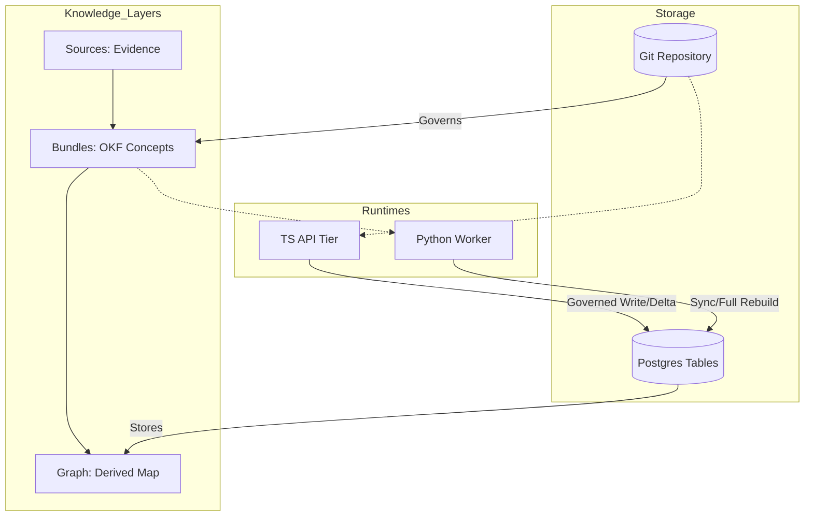
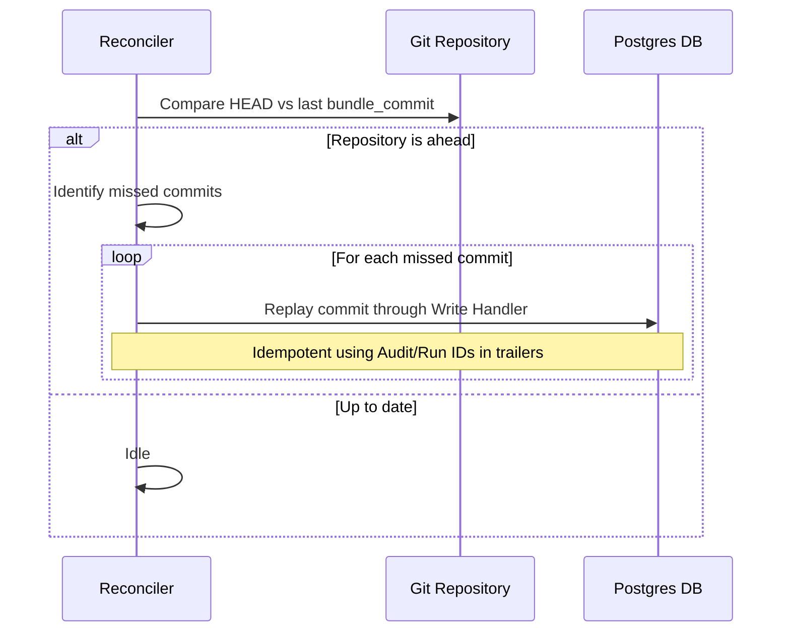

Relevant source files

The following files were used as context for generating this wiki page:

- [AGENTS.md](AGENTS.md)
- [packages/design-system/readme.md](packages/design-system/readme.md)
- [CODING_RULES.md](CODING_RULES.md)
- [apps/docs-site/specs/T-006.md](apps/docs-site/specs/T-006.md)
- [apps/docs-site/specs/T-064.md](apps/docs-site/specs/T-064.md)
- [apps/api/CODING_RULES.md](apps/api/CODING_RULES.md)

# Graph Data Management

Graph Data Management in Better Answers encompasses the derivation, storage, and synchronization of the workspace knowledge map. The graph represents the third layer of the platform's knowledge architecture, derived from **sources** (evidence) and **bundles** (OKF concepts). The system enforces a "derived, never a source of truth" policy, where the graph serves as a performant projection of the underlying Git-backed concept files for use in search, discovery, and answer generation.

The graph architecture relies on two standard Postgres tenant tables managed via Row Level Security (RLS) to ensure data isolation. A Python-based worker tier handles complex graph operations, such as full rebuilds and indexing, while the TypeScript API tier manages real-time deltas during governed writes. This structure ensures the map remains current with every edit while maintaining strict audit trails and permission boundaries.

Sources: [AGENTS.md:8-10](AGENTS.md#L8-L10), [packages/design-system/readme.md:28-31](packages/design-system/readme.md#L28-L31), [apps/docs-site/specs/T-006.md:14-25](apps/docs-site/specs/T-006.md#L14-L25)

## Architecture and Data Flow

The graph system operates across two runtime tiers and four primary stores. The graph itself is stored within Postgres as a set of relational tables that simulate graph structures using recursive Common Table Expressions (CTEs).

The diagram shows the relationship between knowledge layers, the underlying storage mechanisms, and the runtime tiers responsible for updates.
Sources: [AGENTS.md:8-13](AGENTS.md#L8-L13), [apps/docs-site/specs/T-006.md:26-33](apps/docs-site/specs/T-006.md#L26-L33)

### Knowledge Layers
The platform organizes knowledge into a pipeline:
1.  **Sources:** Raw evidence and documents.
2.  **Bundles:** Structured OKF v0.2 concepts stored in Git.
3.  **Graph:** Derived relationships, entity equivalence, and visibility classes.

Sources: [AGENTS.md:8-10](AGENTS.md#L8-L10), [packages/design-system/readme.md:28-31](packages/design-system/readme.md#L28-L31)

## Graph Storage Schema

The graph is implemented using two primary tenant tables: `graph_node` and `graph_edge`. These tables reside in the standard Postgres schema and utilize Row Level Security (RLS) to prevent cross-tenant data leaks.

| Column | Type | Description |
| :--- | :--- | :--- |
| `workspace_id` | UUID / Text | The primary tenant identifier for RLS. |
| `gen` | Text | The generation identifier for full rebuilds. |
| `uid` | Text | Unique identifier for the node or edge. |
| `label` | Enum | The closed set of graph labels (e.g., Concept, Source). |
| `kind` | Text | Indexed property column for entity types. |
| `visibility` | Text | Derived visibility class (Internal, Restricted, Public). |

Sources: [apps/docs-site/specs/T-006.md:142-152](apps/docs-site/specs/T-006.md#L142-L152)

### Relational Graph Implementation
Unlike traditional graph databases, Better Answers avoids Neo4j or Cypher dependencies. Instead, it uses:
*  **Recursive CTEs:** Traversal logic is written as SQL recursive common table expressions.
*  **Tenant Isolation:** `withRLS()` is applied to all graph tables.
*  **Depth Capping:** Traversal depth is capped at 4 by the SQL template.

Sources: [apps/docs-site/specs/T-006.md:38-40](apps/docs-site/specs/T-006.md#L38-L40), [apps/docs-site/specs/T-006.md:154-159](apps/docs-site/specs/T-006.md#L154-L159)

## Synchronization and Reconciler

The platform maintains consistency between the Git-based concepts (Bundles) and the Postgres-based Graph through a **Governed Write** process and a **Reconciler**.

### The Governed Write Path
Every edit to a concept triggers a governed write that spans two stores:
1.  **Git Commit:** The platform bot commits the change to the workspace Git repository.
2.  **Postgres Transaction:** The API tier writes a bundle index row, an `audit_event`, and the **graph delta** in a single transaction.

Sources: [apps/docs-site/specs/T-006.md:26-33](apps/docs-site/specs/T-006.md#L26-L33), [apps/docs-site/specs/T-006.md:120-128](apps/docs-site/specs/T-006.md#L120-L128)

### Reconciler Logic
The Reconciler handles the "crash window" where a Git commit succeeds but the Postgres transaction fails.

The Reconciler ensures the database catches up with the Git repository by replaying missing commits.
Sources: [apps/docs-site/specs/T-006.md:33-36](apps/docs-site/specs/T-006.md#L33-L36), [apps/docs-site/specs/T-006.md:135-140](apps/docs-site/specs/T-006.md#L135-L140)

## Worker Operations

The Python worker tier performs heavy graph operations through a work loop. It claims jobs via a lease/heartbeat mechanism to prevent duplicate processing.

*  **Nightly Parser Audit:** The Python parser cross-checks the API tier's parses hash-by-hash to detect drift.
*  **Full Rebuild:** The worker builds a new graph generation (`gen`) from scratch beside the live one.
*  **Generation Flip:** Once a rebuild is complete, the live generation is updated in a single row change.
*  **Graph Sweep:** A cleanup task that deletes non-live generations.

Sources: [apps/docs-site/specs/T-006.md:179-195](apps/docs-site/specs/T-006.md#L179-L195), [apps/docs-site/specs/T-064.md:142-145](apps/docs-site/specs/T-064.md#L142-L145)

## Visibility and Permissions

Visibility in the graph is derived synchronously during writes. A concept's visibility class is determined by the most restrictive binding of the evidence it cites.

*  **Inheritance:** Access cascades from Binding → Concept → Composition.
*  **Disjoint Audiences:** If a concept cites evidence from two disjoint audiences, the empty intersection forces the unit to `Restricted`.
*  **RLS Policy:** Every query against `graph_node` or `graph_edge` includes a read predicate checking `published_at`, `sensitivity`, and `audience`.

Sources: [apps/docs-site/specs/T-006.md:162-171](apps/docs-site/specs/T-006.md#L162-L171), [CODING_RULES.md:243-255](CODING_RULES.md#L243-L255)

## Summary of Graph Operations

| Command | Tier | Purpose |
| :--- | :--- | :--- |
| `graph-rebuild` | Worker | Initiates a full generation rebuild from Git. |
| `graph-sweep` | Worker | Deletes orphaned graph generations. |
| `graph-counts` | API/Worker | Reports node counts by label for the live generation. |
| `reconcile-watermark` | API | Forces the reconciler to sync DB to Git HEAD. |

Sources: [apps/docs-site/specs/T-006.md:196-203](apps/docs-site/specs/T-006.md#L196-L203)

Graph Data Management ensures the Better Answers platform provides cited, permission-aware answers by treating the graph as a strictly derived, audited, and tenant-isolated projection of the company's knowledge.
