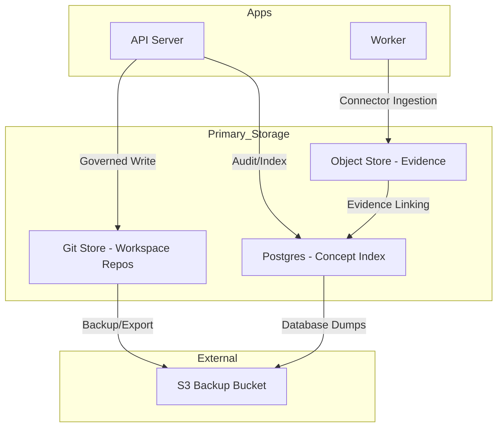

Relevant source files

The following files were used as context for generating this wiki page:

- [AGENTS.md](AGENTS.md)
- [apps/docs-site/operations/coolify.md](apps/docs-site/operations/coolify.md)
- [apps/docs-site/specs/T-006.md](apps/docs-site/specs/T-006.md)
- [apps/docs-site/specs/T-064.md](apps/docs-site/specs/T-064.md)
- [CODING_RULES.md](CODING_RULES.md)
- [deploy/wizard-41.sh](deploy/wizard-41.sh)
- [packages/design-system/readme.md](packages/design-system/readme.md)

# Document & Object Storage

Document & Object Storage manages the lifecycle, persistence, and evidence-tracking for source evidence and concept files within the Better Answers platform. It operates as one of the four primary data stores, alongside Postgres, a derived graph, and per-workspace git repositories. This system handles unstructured evidence data and structured concept files defined by the Open Knowledge Foundation (OKF) v0.2 specification.

Sources: [AGENTS.md:12-14](AGENTS.md#L12-L14), [packages/design-system/readme.md:20-22](packages/design-system/readme.md#L20-L22)

## Architecture and Infrastructure

The storage system follows a multi-tier architecture distributed across two primary virtual private clouds (VPCs). Production data resides on VPC 1, while VPC 2 serves as the orchestrator and git mirror.

### Component Layout

| Component | Role | Hosting Environment |
| :--- | :--- | :--- |
| **Object Store** | Holds unstructured evidence and large blobs | VPC 1 (via Docker Compose) |
| **Git Repository** | Version control for bundles and concept files | VPC 1 (One per workspace) |
| **Git Mirror** | Off-site synchronization of git stores | VPC 2 (`/data/mirror`) |
| **Backup Storage** | S3-compatible storage for database and git dumps | External S3 Provider |

Sources: [AGENTS.md:12-14](AGENTS.md#L12-L14), [apps/docs-site/operations/coolify.md:13-22](apps/docs-site/operations/coolify.md#L13-L22), [deploy/wizard-41.sh:227-240](deploy/wizard-41.sh#L227-L240)

### Storage Data Flow
The following diagram illustrates the flow of data from ingestion through the governing write path to the respective storage layers.

Sources: [AGENTS.md:12-14](AGENTS.md#L12-L14), [apps/docs-site/specs/T-006.md:65-75](apps/docs-site/specs/T-006.md#L65-L75), [apps/docs-site/operations/coolify.md:25-35](apps/docs-site/operations/coolify.md#L25-L35)

## The Governed Write Path

Modifications to the knowledge bundle occur through a "governed write" process. This mechanism ensures that every change is attributable, revertible, and synchronized across the git store and the Postgres index.

### Write Execution Logic
1. **Git Commit**: The actor makes a git commit. The person is the git author, and the platform bot is the committer.
2. **Hash Precondition**: The system checks a hash precondition against the ref under a per-repository lock to prevent overwrites.
3. **Database Transaction**: One Postgres transaction carries the concept index row, the `bundle_commit`, and the `audit_event`.
4. **Idempotency**: The `audit_event` ID is minted before the commit and placed in a `Audit:` trailer within the git commit message to facilitate reconciliation.

Sources: [apps/docs-site/specs/T-006.md:65-75](apps/docs-site/specs/T-006.md#L65-L75), [apps/docs-site/specs/T-006.md:92-95](apps/docs-site/specs/T-006.md#L92-L95)

## Evidence and Documents

Unstructured documents are stored as objects and cited as evidence for concepts. Evidence identity follows the document rather than its location URL.

### Evidence Mapping
*  **Storage Key**: Evidence is keyed by `(workspace_id, source_document_id, locator)`.
*  **Projections**: The `resource` field is a rendered projection off the document.
*  **Access Control**: A `Principal` check is required for every function that reads or writes tenant data, including evidence passages.

Sources: [apps/docs-site/specs/T-006.md:164-166](apps/docs-site/specs/T-006.md#L164-L166), [CODING_RULES.md:155-159](CODING_RULES.md#L155-L159)

## Backup and Recovery

Backups are executed as scheduled jobs that verify uploads against the external bucket and record a `backup_run` row.

### Backup Schedule
*  **Postgres Hourly**: 48-hour retention.
*  **Postgres Daily**: 30-day retention.
*  **Git Dumps**: 30-day retention (with 6-month retention for first-of-month backups).
*  **Object Storage**: Versioning and object lock are enabled on the S3 provider.

Sources: [deploy/wizard-41.sh:230-235](deploy/wizard-41.sh#L230-L235), [apps/docs-site/operations/coolify.md:65-68](apps/docs-site/operations/coolify.md#L65-L68)

### The Reconciler
The reconciler recovers from crashes that occur between a git commit and the Postgres transaction. It identifies if the repository head is ahead of the last `bundle_commit` and replays missed commits. It uses the `Audit:` and `Run:` trailers for idempotency to ensure rows are not duplicated.

Sources: [apps/docs-site/specs/T-006.md:105-110](apps/docs-site/specs/T-006.md#L105-L110)

## Security and Tenancy

Storage isolation is enforced through Postgres Row-Level Security (RLS) and strict actor identification.

*  **RLS Guarantee**: Tenant tables are created `withRLS()`. Under `FORCE ROW LEVEL SECURITY`, a table with no policy returns zero rows to the runtime role.
*  **Principal Kinds**: Access is governed by three principal kinds: User, Platform, and Operator.
*  **Audit Ledger**: The `audit_event` table is append-only by the database. The application role is denied `UPDATE` and `DELETE` privileges.

Sources: [CODING_RULES.md:169-175](CODING_RULES.md#L169-L175), [CODING_RULES.md:197-200](CODING_RULES.md#L197-L200), [CODING_RULES.md:231-235](CODING_RULES.md#L231-L235)

## Summary

The Document & Object Storage system provides a highly available and auditable substrate for the Better Answers knowledge map. By combining git-based versioning with Postgres indexing and S3-compatible object storage, the system ensures data integrity and attribution for every knowledge change. The architecture prioritizes recovery through a dedicated reconciler and strict row-level isolation between workspace tenants.
