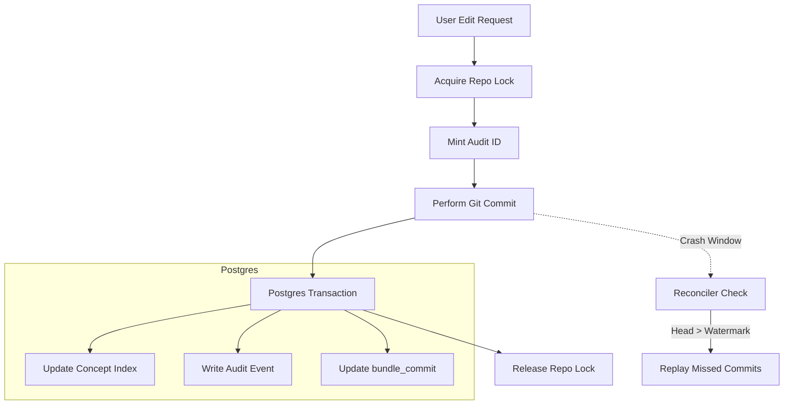

Relevant source files

The following files were used as context for generating this wiki page:

- [AGENTS.md](AGENTS.md)
- [apps/docs-site/specs/T-006.md](apps/docs-site/specs/T-006.md)
- [apps/docs-site/specs/T-064.md](apps/docs-site/specs/T-064.md)
- [CODING_RULES.md](CODING_RULES.md)
- [packages/design-system/readme.md](packages/design-system/readme.md)
- [apps/api/CODING_RULES.md](apps/api/CODING_RULES.md)

# Git Backend per Workspace

The Git backend per workspace provides the primary storage layer for knowledge evidence and concept history within the Better Answers platform. Each workspace maintains its own Git repository to store "bundles" (OKF concepts) as the source of truth, ensuring that every knowledge change is attributable, revertible, and permanent.

This architectural choice supports the platform's knowledge layers: **sources** (evidence) and **bundles** (concepts). The Git backend acts as one of the four core runtime stores, alongside Postgres, an object store, and a derived graph. By using Git, the system ensures that any knowledge landed in the map is a historical fact that cannot be quietly edited without an audit trail.

Sources: [AGENTS.md:12-16](AGENTS.md#L12-L16), [packages/design-system/readme.md:27-31](packages/design-system/readme.md#L27-L31), [apps/docs-site/specs/T-006.md:10-15](apps/docs-site/specs/T-006.md#L10-L15)

## Architecture and Storage Model

The Git backend is structured to provide a unique repository for every company (workspace) hosted on the platform. This ensures physical isolation of knowledge bundles between different tenants.

### The Governed Write Path
Every modification to the knowledge bundle follows a "governed write" process. This process ensures that changes to the Git repository are synchronized with the Postgres database index. The system uses a per-repository lock in the API process to prevent race conditions during concurrent writes.

The sequence for a governed write is:
1. **Git Commit:** The platform makes a commit to the workspace's Git repository. The actual user is recorded as the Git author, while the platform bot is the committer.
2. **Postgres Transaction:** The platform executes a single Postgres transaction containing the concept index, the `bundle_commit` reference, and the `audit_event`.

Sources: [apps/docs-site/specs/T-006.md:24-30](apps/docs-site/specs/T-006.md#L24-L30), [apps/docs-site/specs/T-006.md:87-95](apps/docs-site/specs/T-006.md#L87-L95)

### Commit Metadata and Trailers
To maintain strict auditability, specific metadata is embedded into Git commit trailers. This metadata allows the platform to link Git history directly to the structured audit logs in Postgres.

| Trailer Key | Description |
| :--- | :--- |
| `Actor:` | The ID of the person or process performing the act. |
| `Audit:` | The unique `audit_event` ID minted before the commit. |
| `Run:` | The ID of the specific production run or pipeline job. |
| `Suggestion:` | The ID of the suggestion being accepted into the bundle. |

Sources: [apps/docs-site/specs/T-006.md:96-103](apps/docs-site/specs/T-006.md#L96-L103)

## Reconciler and Data Integrity

The system includes a **reconciler** to handle the "crash window" that occurs if a Git commit succeeds but the subsequent Postgres transaction fails.

### Reconciliation Logic
The reconciler monitors the state of each workspace repository. If it finds the repository head is ahead of the last recorded `bundle_commit` in Postgres, it triggers a replay.
- The reconciler replays missed commits in chronological order (oldest first).
- It uses the `Audit:` trailer ID for idempotency; if the ID already exists in the Postgres ledger, the reconciler skips the commit.
- The reconciler operates under a platform principal (`process:better-answers-reconciler`) to ensure automated fixes are audited separately from human actions.

Sources: [apps/docs-site/specs/T-006.md:104-110](apps/docs-site/specs/T-006.md#L104-L110), [apps/docs-site/specs/T-006.md:18-20](apps/docs-site/specs/T-006.md#L18-L20)

### Transaction Flow
The following diagram illustrates the flow of a governed write and the role of the reconciler in maintaining consistency.

The diagram shows the sequence from user request to the final database update, highlighting the crash window where the reconciler intervenes.
Sources: [apps/docs-site/specs/T-006.md:87-110](apps/docs-site/specs/T-006.md#L87-L110)

## Security and Access Control

Access to the Git backend is governed by the platform's `Principal` model. Every call to the core store doors must include a Principal consisting of a `workspaceId`, `userId`, and `role`.

- **Tenancy Enforcement:** The Git repository path is derived from the `workspaceId` in the Principal. 
- **Attribution:** Git author information is derived from the `ActorId` (e.g., `human:<person id>`).
- **Integrity:** Hash preconditions are checked against the repository ref before any write to ensure users do not overwrite concurrent changes.

Sources: [CODING_RULES.md:144-150](CODING_RULES.md#L144-L150), [apps/docs-site/specs/T-006.md:91-95](apps/docs-site/specs/T-006.md#L91-L95), [apps/docs-site/specs/T-006.md:195-200](apps/docs-site/specs/T-006.md#L195-L200)

## Operational Management

The Git backend is managed through specific operational commands and worker jobs. The worker tier handles nightly audits and full rebuilds of the derived graph from the Git source of truth.

- **Nightly Parser Audit:** The Python parser (in `apps/worker`) cross-checks the app's parse of Git blobs hash-by-hash. If a mismatch is found, it raises a `bundle_health` signal.
- **Lease Mechanism:** Worker jobs claim a lease on workspace processing. If heartbeats stop, the lease expires, allowing another worker to resume.
- **Ops Commands:** The platform provides CLI commands like `reconcile-watermark` to manually trigger the reconciler during disaster recovery or data restoration.

Sources: [apps/docs-site/specs/T-006.md:201-208](apps/docs-site/specs/T-006.md#L201-L208), [apps/docs-site/specs/T-006.md:214-220](apps/docs-site/specs/T-006.md#L214-L220), [apps/api/CODING_RULES.md:9-12](apps/api/CODING_RULES.md#L9-L12)

## Summary

The Git Backend per Workspace serves as the immutable foundation of the Better Answers knowledge map. By utilizing Git repositories as per-tenant stores, the platform achieves versioned, attributable, and recoverable storage for knowledge bundles. The architecture prioritizes data integrity through a governed write path and an automated reconciler that bridges the state between the Git filesystem and the Postgres index.
