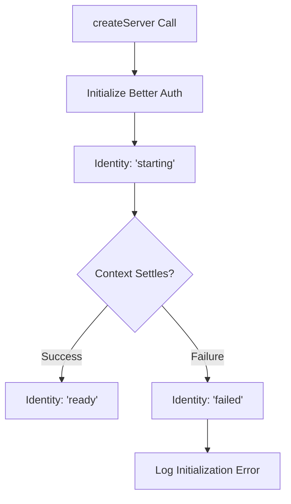
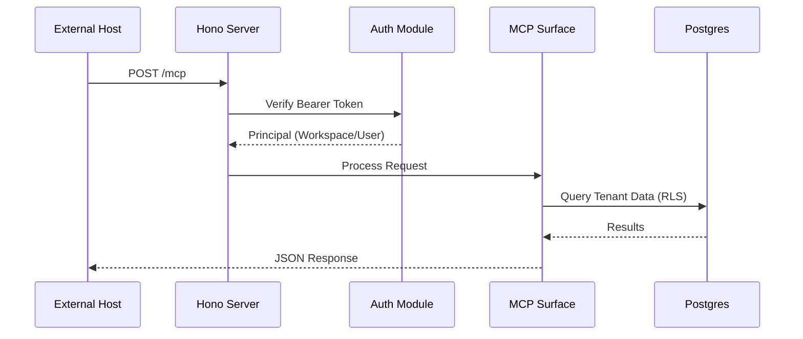

Relevant source files

The following files were used as context for generating this wiki page:

- [apps/api/src/server.ts](apps/api/src/server.ts)
- [apps/api/CODING_RULES.md](apps/api/CODING_RULES.md)
- [apps/api/package.json](apps/api/package.json)
- [apps/api/tests/harness.ts](apps/api/tests/harness.ts)
- [AGENTS.md](AGENTS.md)
- [CODING_RULES.md](CODING_RULES.md)

# API Tier: Hono Server Configuration

The API tier serves as the primary TypeScript deployable for the Better Answers platform. It runs on Node 24 and uses the Hono framework to manage multiple transport surfaces, including tRPC, the Model Context Protocol (MCP), and OpenAPI.

This tier operates directly from source without a build step, utilizing Node 24's ability to strip types at runtime. It functions as the "front door" for external integrations and the web application, communicating with the worker tier through shared data stores rather than direct code imports.

Sources: [apps/api/CODING_RULES.md:7-11](apps/api/CODING_RULES.md#L7-L11), [AGENTS.md:18-21](AGENTS.md#L18-L21)

## Server Architecture and Lifecycle

The server configuration follows a strict "one server, one logger, one config module" rule. The core application is built using a single Hono instance created by a factory function that accepts all necessary dependencies as parameters.

### Dependency Injection Model
The `createServer` function utilizes a `ServerDependencies` object to manage external resources. This ensures that the HTTP surface remains decoupled from specific implementations, facilitating functional testing.

| Dependency | Type | Description |
| :--- | :--- | :--- |
| `database` | `Pool` | PostgreSQL connection pool. |
| `publicUrl` | `string` | The HTTPS origin for the server. |
| `authSecret` | `string` | Secret used for authorization services. |
| `sendEmail` | `EmailSender` | Interface for sending transactional emails. |
| `logger` | `Logger` (pino) | Structured logger for the tier. |

Sources: [apps/api/src/server.ts:16-33](apps/api/src/server.ts#L16-L33), [apps/api/CODING_RULES.md:13-22](apps/api/CODING_RULES.md#L13-L22)

### Initialization Flow
The server initializes its internal services, such as the `Better Auth` identity system, eagerly. It tracks the state of these services to provide accurate health status.

The diagram shows the internal state machine for the authorization server during the startup sequence.
Sources: [apps/api/src/server.ts:48-64](apps/api/src/server.ts#L48-L64)

## Routing and Surfaces

The Hono server mounts several specialized surfaces and routes to handle different platform requirements.

### Health Monitoring
The `/health` endpoint provides status information for automated deployment checks (e.g., Docker). It verifies database connectivity and the readiness of the identity system.

*  **Database Check:** Executes `SELECT 1` to confirm connectivity.
*  **Identity Check:** Waits for the authorization context to settle.
*  **Response Codes:** Returns `200 OK` if all systems are ready, or `503 Service Unavailable` if the database is unreachable or identity initialization failed.

Sources: [apps/api/src/server.ts:68-83](apps/api/src/server.ts#L68-L83)

### MCP and Authorization Routes
The server mounts specific handlers for the Model Context Protocol (MCP) and authentication flows.

*  **Auth Routes:** Mounted at the root `/` to handle sign-in, workspace selection, and consent pages.
*  **MCP Surface:** Mounted at `/mcp`. It uses a token verifier to validate requests before they reach the protocol handlers.
*  **Better Auth Handler:** A catch-all handler (`/*`) that processes remaining requests such as OAuth2 discovery and JWKS endpoints.

Sources: [apps/api/src/server.ts:85-108](apps/api/src/server.ts#L85-L108), [apps/api/src/auth/pages.ts:24-85](apps/api/src/auth/pages.ts#L24-L85)

## Implementation Constraints

The API tier adheres to several critical coding and design rules to ensure maintainability and security.

### Core Coding Rules
*  **Running from Source:** The tier has no `dist/` folder; `src/main.ts` is the entry point.
*  **TypeScript Imports:** All internal imports must include the `.ts` extension for Node resolution.
*  **Testing Surface:** Functional tests must speak HTTP via `server.request()` rather than calling internal functions directly.
*  **Data Access:** Every function touching tenant data must take a `Principal` (containing `workspaceId`, `userId`, and `role`) as its first parameter.

Sources: [apps/api/CODING_RULES.md:7-11, 24-28](apps/api/CODING_RULES.md#L7-L11), [CODING_RULES.md:118-120](CODING_RULES.md#L118-L120)

### Technical Stack
The tier is defined by specific dependencies in `package.json`:
*  **Framework:** `hono` v4.13.5
*  **Runtime:** `@hono/node-server` v2.1.1
*  **Database ORM:** `drizzle-orm` v0.45.2
*  **Validation:** `zod` v4.5.4
*  **Authentication:** `better-auth` v1.7.2

Sources: [apps/api/package.json:20-33](apps/api/package.json#L20-L33)

The sequence diagram illustrates the request flow through the Hono server for an authenticated MCP tool call.
Sources: [apps/api/src/server.ts:91-103](apps/api/src/server.ts#L91-L103), [CODING_RULES.md:118-122](CODING_RULES.md#L118-L122)

## Summary

The API tier's Hono configuration provides a unified entry point for the Better Answers platform. By centralizing dependency management and surface mounting in a single factory function, the architecture supports strict security requirements (like Row Level Security via Principals) while remaining easily testable through HTTP simulation. The server's eager initialization and comprehensive health checks ensure high availability within the deployment stack.
