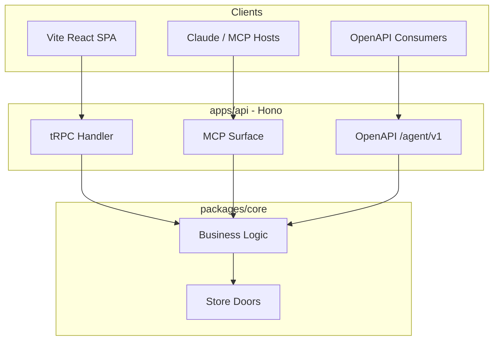
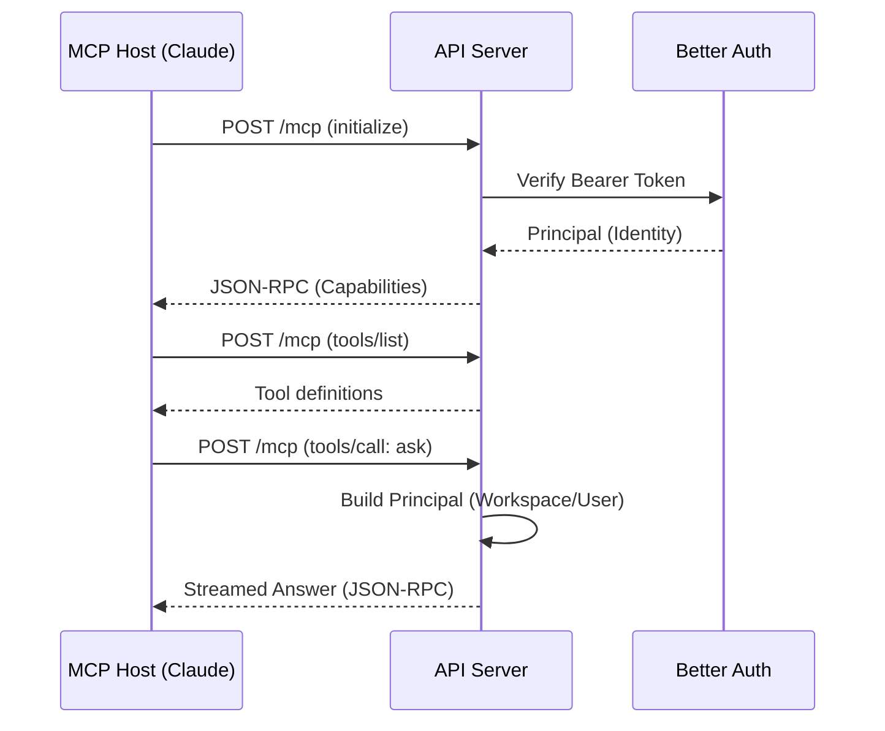

Relevant source files

The following files were used as context for generating this wiki page:

- [AGENTS.md](AGENTS.md)
- [apps/api/CODING_RULES.md](apps/api/CODING_RULES.md)
- [CODING_RULES.md](CODING_RULES.md)
- [apps/api/tests/mcp-surface.test.ts](apps/api/tests/mcp-surface.test.ts)
- [packages/design-system/readme.md](packages/design-system/readme.md)
- [apps/api/src/auth/pages.ts](apps/api/src/auth/pages.ts)
- [apps/api/package.json](apps/api/package.json)

# API Transports: tRPC, OpenAPI & MCP

The `apps/api` workspace serves as the primary "front door" for the Better Answers platform. It manages multiple API transports to provide access for different consumers, including the web frontend, external agents, and legacy integrations. The API is built using Hono on Node 24 and functions as a transport layer that calls into the transport-agnostic business logic in `packages/core`.

Sources: [AGENTS.md:14-15](AGENTS.md#L14-L15), [apps/api/CODING_RULES.md:4-7](apps/api/CODING_RULES.md#L4-L7)

## Transport Architecture

The platform architecture separates the transport layer from core business logic. The `apps/api` tier provides the HTTP surface for four primary transports: tRPC, Model Context Protocol (MCP), OpenAPI, and an agent-specific `/agent/v1` surface.

### Component Relationship
The diagram below shows how different clients interact with the API transports to reach the core business logic.

The API tier is restricted from containing business logic; it must remain a thin layer over `packages/core`.

Sources: [AGENTS.md:14-20](AGENTS.md#L14-L20), [apps/api/CODING_RULES.md:4-7](apps/api/CODING_RULES.md#L4-L7), [CODING_RULES.md:71-75](CODING_RULES.md#L71-L75)

## tRPC Transport

The tRPC transport is the exclusive communication channel for the `apps/web` React single-page application. This transport ensures type-safety across the client-server boundary without a shared build step, though the two packages never import each other directly.

Sources: [AGENTS.md:16](AGENTS.md#L16), [apps/api/CODING_RULES.md:5-7](apps/api/CODING_RULES.md#L5-L7)

## Model Context Protocol (MCP)

The MCP surface allows external AI agents (such as Claude) to interact with the company knowledge map. It supports multiple protocol eras, including `2025-11-25` and `2026-07-28`.

### Core MCP Tools
The MCP transport exposes four canonical tools to authorized hosts:

| Tool | Action | Read-Only |
| :--- | :--- | :--- |
| `find` | Searches for concepts within the knowledge map | Yes |
| `ask` | Requests a cited answer for a specific question | Yes |
| `open` | Retrieves structured content for a specific IRI | Yes |
| `give_feedback` | Submits feedback on provided answers | No |

Sources: [apps/api/tests/mcp-surface.test.ts:108-140](apps/api/tests/mcp-surface.test.ts#L108-L140)

### Connection Flow
The following sequence shows how an MCP host (e.g., Claude) initializes a connection and calls a tool.

The API validates that no MCP tool accepts `workspace`, `bundle`, or `tenant` as arguments; these are derived from the `Principal` built during authentication.

Sources: [apps/api/tests/mcp-surface.test.ts:13-30](apps/api/tests/mcp-surface.test.ts#L13-L30), [apps/api/tests/mcp-surface.test.ts:143-152](apps/api/tests/mcp-surface.test.ts#L143-L152), [CODING_RULES.md:139-142](CODING_RULES.md#L139-L142)

## Authentication & Security

All transports must enforce tenant scoping and authentication. The API tier uses `better-auth` to verify credentials and construct a `Principal`.

### Principal Enforcement
Every function in `packages/core` that touches tenant data requires a `Principal` as its first parameter. The `Principal` contains:
*  `workspaceId`
*  `userId`
*  `role` (Admin, Editor, or Viewer)

Sources: [CODING_RULES.md:139-143](CODING_RULES.md#L139-L143), [packages/design-system/readme.md:32-34](packages/design-system/readme.md#L32-L34)

### Transport Security Rules
*  **Bearer Verification:** Transports verify bearer tokens and build the `Principal`. No `better-auth` types are permitted to leak into `packages/core`.
*  **Rate Limiting:** The MCP surface enforces a per-token counter (e.g., 120 calls). Exceeding this limit returns a `429 Too Many Requests` response.
*  **Revocation Check:** The API performs a per-call revocation check. If a user's credentials are revoked after a token is issued, subsequent API calls return a `401 Unauthorized` status.

Sources: [CODING_RULES.md:51-54](CODING_RULES.md#L51-L54), [apps/api/tests/mcp-surface.test.ts:203-214](apps/api/tests/mcp-surface.test.ts#L203-L214), [apps/api/tests/mcp-surface.test.ts:233-241](apps/api/tests/mcp-surface.test.ts#L233-L241)

## OpenAPI & REST Surface

The OpenAPI surface includes the `/agent/v1` endpoints and serves as the HTTP face for the worker control plane. 

### Implementation Requirements
All modified or new endpoints must adhere to these standards:
1.  **Validation:** Accept request bodies only through runtime validation (e.g., Zod schemas).
2.  **Scoping:** Derive tenant and account access from the authenticated session, never from user-supplied identifiers.
3.  **Status Codes:** Use consistent HTTP status codes for 400, 401, 403, 404, and 500 cases.
4.  **Security:** External services must be reached through HTTPS/TLS.

Sources: [AGENTS.md:14-15](AGENTS.md#L14-L15), [apps/api/CODING_RULES.md:5-7](apps/api/CODING_RULES.md#L5-L7), [CODING_RULES.md:126-133](CODING_RULES.md#L126-L133)

## Summary

The API transport layer in Better Answers is a specialized, thin implementation designed to bridge various client types to core business logic. By segregating tRPC for the web, MCP for AI agents, and OpenAPI for external services, the system maintains high maintainability while enforcing strict security and tenant isolation through the mandatory use of the `Principal` object across all data-touching operations.

Sources: [AGENTS.md:14-22](AGENTS.md#L14-L22), [apps/api/CODING_RULES.md:4-10](apps/api/CODING_RULES.md#L4-L10), [CODING_RULES.md:139-143](CODING_RULES.md#L139-L143)
