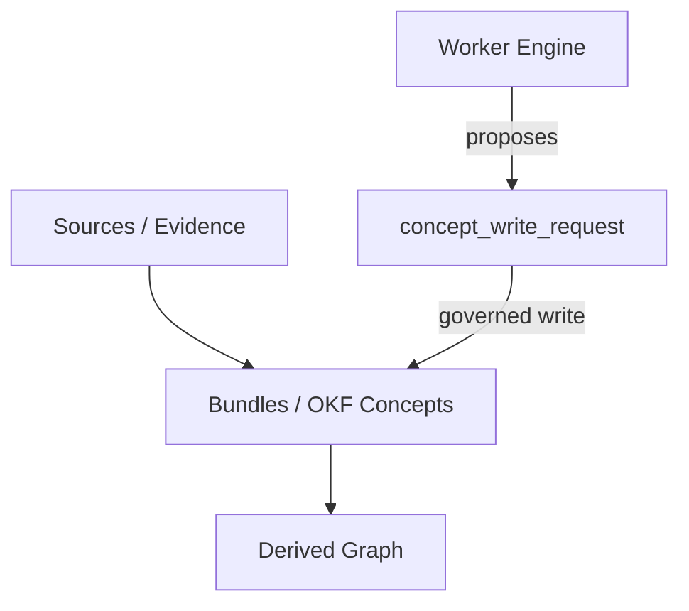

<details>
<summary>Relevant source files</summary>

The following files were used as context for generating this wiki page:

- [apps/worker/src/better\_answers\_worker/\_\_init\_\_.py](apps/worker/src/better_answers_worker/__init__.py)
- [apps/worker/CODING\_RULES.md](apps/worker/CODING_RULES.md)
- [apps/worker/pyproject.toml](apps/worker/pyproject.toml)
- [AGENTS.md](AGENTS.md)
- [CODING\_RULES.md](CODING_RULES.md)
- [apps/worker/src/better\_answers\_worker/schema\_view.py](apps/worker/src/better_answers_worker/schema_view.py)
- [deploy/platform.compose.yaml](deploy/platform.compose.yaml)

</details>

# Python Worker Engine

The Python Worker Engine is a dedicated knowledge processing tier that transforms raw evidence into governed, indexed company knowledge. It operates as a single Python 3.13 container (managed via `uv`) that handles connectors, conversion, enrichment, and graph synchronization. This engine shares a data contract with the API tier but maintains strict code isolation, ensuring it never directly executes migrations or holds master credentials.

Sources: [AGENTS.md:21-23](AGENTS.md#L21-L23), [apps/worker/src/better\_answers\_worker/\_\_init\_\_.py:3-7](apps/worker/src/better\_answers\_worker/\_\_init\_\_.py#L3-L7)

## Architecture and Deployment

The worker engine executes tasks as a separate deployable unit within the platform stack. It connects to the shared Postgres database and an object store but manages its own local state using LMDB for per-binding data and git working trees for workspace-specific knowledge.

### Deployment Flow
The following diagram illustrates the startup and dependency sequence for the worker within the platform stack.

```mermaid
flowchart TD
    M[migrate service] -->|completes| A[api service]
    A -->|healthy| W[worker service]
    W -->|mounts| DB[(Postgres)]
    W -->|mounts| S3[Object Store]
    W -->|read-only| GIT[/data/git]
```

The worker depends on the successful completion of the `migrate` service and the health of the `api` service before it begins processing.
Sources: [deploy/platform.compose.yaml:69-90](deploy/platform.compose.yaml#L69-L90)

### Environment and Security
The worker operates under a "bootstrap-only" configuration model. It only reads the environment variables required to establish initial connectivity (the bootstrap class). All other specific credentials, such as tenant-specific keys, are injected per run by the control plane.

| Configuration | Type | Purpose |
| :--- | :--- | :--- |
| `DATABASE_URL` | String | Connection string for the workspace-scoped worker role. |
| `MAX_CONCURRENT_RUNS` | Integer | Limits processing to one index at a time per 4 GB box. |
| `LMDB_MAX_BYTES` | Integer | 4 GB cap per binding; triggers wipe/reprocess if exceeded. |
| `HF_HUB_OFFLINE` | Boolean | Forces Hugging Face Hub to offline mode after initial warming. |

Sources: [apps/worker/CODING\_RULES.md:12-18](apps/worker/CODING\_RULES.md#L12-L18), [deploy/platform.compose.yaml:81-87](deploy/platform.compose.yaml#L81-L87)

## Knowledge Processing Logic

The worker composes building blocks from `cocoindex` to perform complex indexing tasks. It avoids rebuilding native engine features and instead focuses on implementing custom logic for attempt counts, run keys, and priced-vs-actual token outcomes.

### Data Processing Flow
The worker manages three distinct knowledge layers through its processing pipeline.



The worker transforms evidence into concepts but does not write to the map directly; it proposes changes via specific request rows.
Sources: [AGENTS.md:10-12](AGENTS.md#L10-L12), [apps/worker/CODING\_RULES.md:8-10](apps/worker/CODING\_RULES.md#L8-L10)

### Schema and Data Integrity
The worker maintains a read-only view of the database schema. It refers to a generated `schema_view.py` file which is stamped with a migration ID. The engine refuses to claim jobs if its internal schema stamp does not match the `__drizzle_migrations` table in the database.

*  **Read-Only Knowledge:** The `TABLES` dictionary in `schema_view.py` defines the structure of tables like `index.chunk` and `public.llm_route`.
*  **Vector Operations:** The `index.chunk` table includes a `vector(1024)` embedding field used for search and retrieval.
*  **Migration ID:** Current view is locked to `0006_identity-role-checks`.

Sources: [apps/worker/src/better\_answers\_worker/schema\_view.py:1-20](apps/worker/src/better\_answers\_worker/schema\_view.py#L1-L20), [apps/worker/CODING\_RULES.md:8-10](apps/worker/CODING\_RULES.md#L8-L10)

## Development and Quality Standards

The worker tier follows strict Python development rules to ensure maintainability and technical accuracy.

### Tooling and Testing
*  **Runtime:** Python 3.13 managed by `uv`.
*  **Linting:** `ruff` is used for linting and formatting with `ANN` rules to enforce type signatures.
*  **Static Analysis:** `mypy` runs in `strict` mode over all `src` and `tests` directories.
*  **Testing:** `pytest` handles functional tests, while `mutmut` provides mutation testing to verify test suite effectiveness.

### Tier Rules
1.  **Strict Typing:** `Any` is prohibited in public signatures and requires specific review if used.
2.  **Structured Logging:** The engine uses `structlog` to output JSON to `stdout`. Use of `print` is banned outside of scripts.
3.  **Command Unified Check:** The command `uv run --frozen check` executes all linting, formatting, and testing steps in a single pass.

Sources: [apps/worker/CODING\_RULES.md:20-27](apps/worker/CODING\_RULES.md#L20-L27), [apps/worker/pyproject.toml:23-45](apps/worker/pyproject.toml#L23-L45), [CODING\_RULES.md:105-115](CODING\_RULES.md#L105-L115)

## Component Summary

| Component | File Path | Role |
| :--- | :--- | :--- |
| **Logger** | `src/better_answers_worker/log.py` | Tier-exclusive structured JSON logger. |
| **Config** | `src/better_answers_worker/config.py` | Environment reader for bootstrap credentials. |
| **Schema View** | `src/better_answers_worker/schema_view.py` | Read-only DDL mapping for database interactions. |
| **Check Runner** | `src/better_answers_worker/check.py` | Script for executing the unified `check` suite. |

Sources: [apps/worker/CODING\_RULES.md:12-23](apps/worker/CODING\_RULES.md#L12-L23), [apps/worker/pyproject.toml:10-12](apps/worker/pyproject.toml#L10-L12)

The Python Worker Engine provides the heavy-lifting capabilities of the Better Answers platform, isolating complex Python-based enrichment and indexing logic from the TypeScript API while maintaining a strict, verifiable data contract through shared database schemas.
