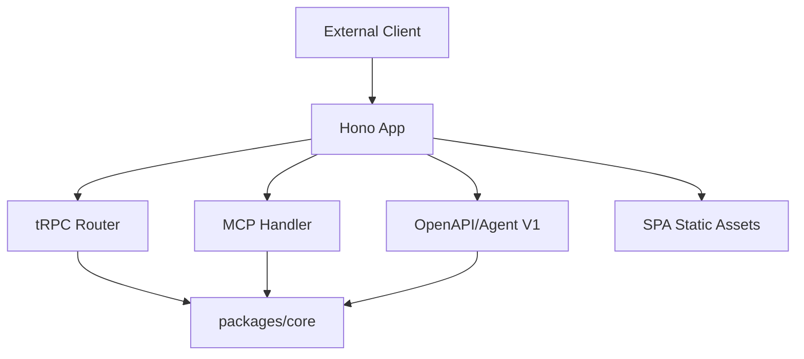
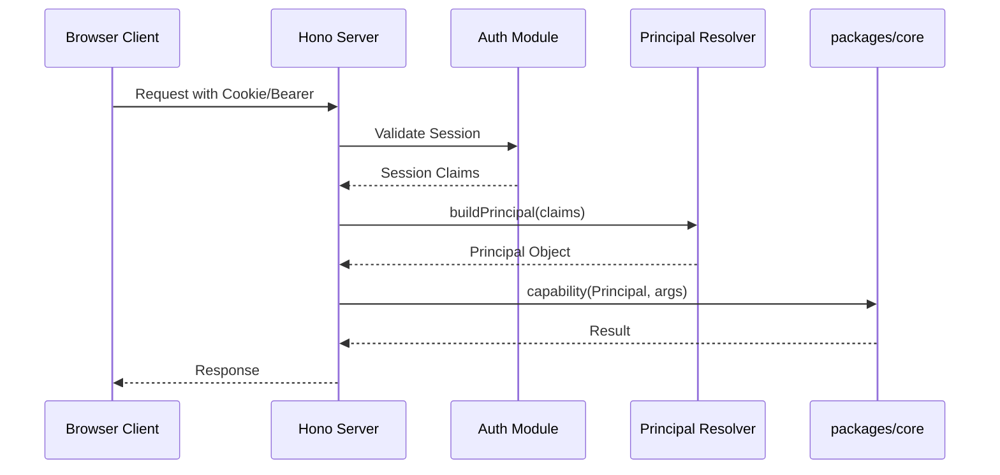

Relevant source files

The following files were used as context for generating this wiki page:

- [AGENTS.md](AGENTS.md)
- [apps/api/CODING_RULES.md](apps/api/CODING_RULES.md)
- [CODING_RULES.md](CODING_RULES.md)
- [apps/docs-site/specs/T-022.md](apps/docs-site/specs/T-022.md)
- [apps/api/package.json](apps/api/package.json)
- [apps/api/tests/mcp-surface.test.ts](apps/api/tests/mcp-surface.test.ts)

# API Tier: Hono & Transports

The API tier serves as the primary TypeScript deployable for the Better Answers platform. It runs a Hono application on Node 24 and acts exclusively as a transport layer, exposing multiple protocol surfaces to external clients and the web frontend. The tier is designed to be transport-agnostic regarding business logic, delegating all domain operations to `packages/core`.

Sources: [AGENTS.md:20](AGENTS.md#L20), [apps/api/CODING_RULES.md:12](apps/api/CODING_RULES.md#L12), [CODING_RULES.md:173](CODING_RULES.md#L173)

## Core Architecture

The API tier follows a strict "Transports Only" philosophy. It encapsulates the Hono application, logging, and configuration within specific modules to ensure a unified entry point and consistent environment handling.

### Server Lifecycle and Configuration
The tier runs directly from source using Node 24's native type stripping, eliminating the need for a `dist/` directory or a separate build step. A single factory function, `createServer(dependencies: ServerDependencies)`, initializes the Hono application. This factory accepts all necessary dependencies, such as connection pools and public origins, as a single typed parameter.

Sources: [apps/api/CODING_RULES.md:7-10](apps/api/CODING_RULES.md#L7-L10), [apps/api/CODING_RULES.md:16-19](apps/api/CODING_RULES.md#L16-L19)

### Transport Layering
The Hono server multiplexes several distinct transport protocols. It routes requests based on hostnames and paths to specific handlers for tRPC, the Model Context Protocol (MCP), and OpenAPI.

The diagram illustrates how the Hono application serves as the front door for multiple protocols before calling business logic in `packages/core`.
Sources: [AGENTS.md:20-21](AGENTS.md#L20-L21), [apps/docs-site/specs/T-022.md:83-88](apps/docs-site/specs/T-022.md#L83-L88)

## Supported Transports

The API tier supports four primary transport surfaces. Each surface serves a specific consumer, from the React single-page app (SPA) to external AI agents.

| Transport | Description | Implementation Detail |
| :--- | :--- | :--- |
| **tRPC** | Primary transport for `apps/web`. | Mounted via `@hono/trpc-server`. |
| **MCP** | Model Context Protocol surface for AI hosts (e.g., Claude). | Implements 2026-07-28 and 2025-11-25 eras. |
| **OpenAPI** | Standard REST/OpenAPI surface. | Exposes `/agent/v1`. |
| **Worker Face** | HTTP control plane for the Python worker. | Provides the interface for worker coordination. |

Sources: [AGENTS.md:20](AGENTS.md#L20), [apps/docs-site/specs/T-022.md:104-105](apps/docs-site/specs/T-022.md#L104-L105), [apps/api/tests/mcp-surface.test.ts:10-15](apps/api/tests/mcp-surface.test.ts#L10-L15)

### Model Context Protocol (MCP) Surface
The MCP surface is a specialized transport that allows AI agents to interact with the workspace map. It supports two protocol versions: the "Modern" 2026-07-28 era and the "Legacy" 2025-11-25 era.

Key MCP tools exposed include:
*  `find`: Queries the knowledge map.
*  `ask`: Requests a cited answer for a specific question.
*  `open`: Retrieves structured content for a specific IRI.
*  `give_feedback`: Records human or agent feedback on answers.

Sources: [apps/api/tests/mcp-surface.test.ts:98-100](apps/api/tests/mcp-surface.test.ts#L98-L100), [apps/api/tests/mcp-surface.test.ts:133-145](apps/api/tests/mcp-surface.test.ts#L133-L145)

## Authentication and Security Seams

Security is enforced at the transport boundary before passing control to business logic.

### Session to Principal Conversion
The API tier is responsible for verifying bearer tokens or cookies and constructing a `Principal` object. Every call to `packages/core` functions that read or write tenant data requires this `Principal` as its first parameter. The `Principal` includes the `workspaceId`, `userId`, and `role`.

Sources: [CODING_RULES.md:173-176](CODING_RULES.md#L173-L176), [apps/docs-site/specs/T-022.md:107-110](apps/docs-site/specs/T-022.md#L107-L110)

### Identity Seam
Better Auth is used for session management but is kept strictly behind an identity seam. The auth module in `apps/api/src/auth/` is the only location allowed to import `better-auth` packages. This ensures that the core business logic remains unaware of the specific identity provider implementation.

Sources: [CODING_RULES.md:330-335](CODING_RULES.md#L330-L335), [apps/docs-site/specs/T-022.md:92-95](apps/docs-site/specs/T-022.md#L92-L95)

The sequence shows the transformation of transport-level credentials into a domain-level Principal.
Sources: [CODING_RULES.md:173-177](CODING_RULES.md#L173-L177), [apps/docs-site/specs/T-022.md:107-113](apps/docs-site/specs/T-022.md#L107-L113)

## Testing and Quality Gates

The API tier maintains high reliability through functional tests that exercise the real HTTP surface.

### Testing Requirements
*  **HTTP Seam:** Tests reach the application through `server.request(...)` rather than calling internal functions directly.
*  **Real Infrastructure:** Data-touching tests must use a real Postgres instance (via Testcontainers), never mocks.
*  **Zero Swallowing:** All `catch` blocks must either handle the error or include a comment explaining why the error is safe to lose.

Sources: [apps/api/CODING_RULES.md:22-26](apps/api/CODING_RULES.md#L22-L26), [CODING_RULES.md:162-164](CODING_RULES.md#L162-L164)

### Dependency and Versioning
All dependencies, including Docker images and model dimensions, are pinned to specific versions or digests. Image references for the API and worker are deployed by digest, and the API Tier `package.json` pins all runtime libraries strictly.

Sources: [CODING_RULES.md:278-280](CODING_RULES.md#L278-L280), [apps/api/package.json:28-44](apps/api/package.json#L28-L44)

## Summary
The API Tier serves as a robust gateway for the Better Answers platform. By combining Hono's high-performance routing with strict protocol separation and security seams, it ensures that external transport concerns never leak into the core business logic. The architecture prioritizes functional testing and strict dependency management to maintain stability across its multiple communication surfaces.
