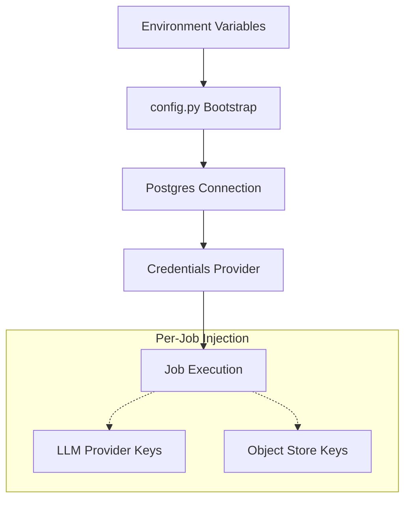
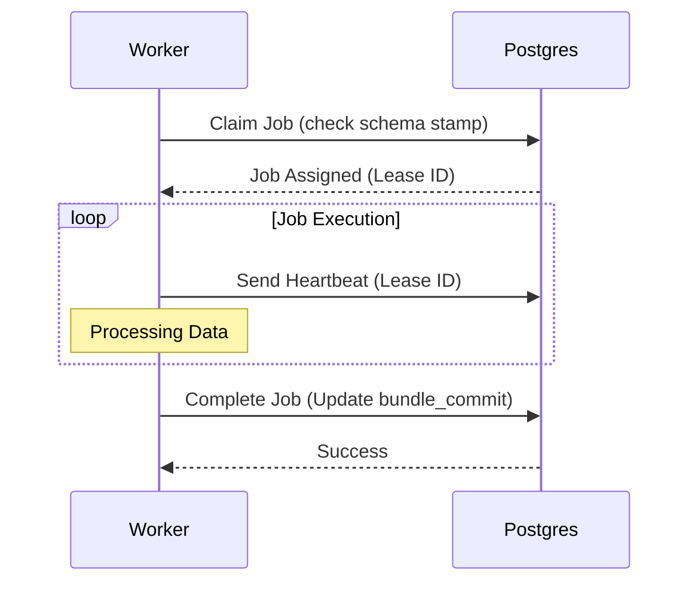

Relevant source files

The following files were used as context for generating this wiki page:

- [apps/worker/src/better_answers_worker/config.py](apps/worker/src/better_answers_worker/config.py)
- [apps/worker/pyproject.toml](apps/worker/pyproject.toml)
- [apps/worker/CODING_RULES.md](apps/worker/CODING_RULES.md)
- [AGENTS.md](AGENTS.md)
- [CODING_RULES.md](CODING_RULES.md)
- [apps/docs-site/specs/T-006.md](apps/docs-site/specs/T-006.md)
- [apps/docs-site/specs/T-064.md](apps/docs-site/specs/T-064.md)

# Worker Tier: Python Job Processing

The Worker Tier is a Python 3.13 application responsible for long-running knowledge tasks, including connectors, data conversion, indexing, and graph synchronization. It operates as a background processor that interacts with shared stores—Postgres and an object store—while remaining strictly separated from the TypeScript-based API tier. The worker performs derived knowledge operations such as enrichment and ontology tooling, ensuring the company knowledge map remains synchronized with source evidence.

Sources: [AGENTS.md:36-37](AGENTS.md#L36-L37), [apps/worker/pyproject.toml:6](apps/worker/pyproject.toml#L6)

## Architecture and Design Principles

The worker follows a "deep module" design where complex implementations sit behind small, well-defined interfaces. It adheres to strict environmental and security constraints to prevent credential leakage and ensure database integrity.

### Strict Tier Separation
The worker never performs database migrations. The TypeScript API application owns all schema changes via `__drizzle_migrations`. The worker verifies its schema stamp against this table and refuses to claim jobs if a mismatch occurs. Furthermore, the worker is not an [OKF (Open Knowledge Framework)](#okf-integration) writer; it proposes changes through `concept_write_request` rows which the API tier subsequently governs.

Sources: [apps/worker/CODING_RULES.md:8-11](apps/worker/CODING_RULES.md#L8-L11), [CODING_RULES.md:7-11](CODING_RULES.md#L7-L11)

### Security and Configuration
The worker utilizes a bootstrap class for initial configuration. `config.py` is the only module permitted to read the environment. All other credentials (LLM providers, object stores) are stored as rows in Postgres and injected into the process per run by the control plane. This ensures the worker never holds a "master key" for the entire infrastructure.

Sources: [apps/worker/CODING_RULES.md:13-18](apps/worker/CODING_RULES.md#L13-L18), [CODING_RULES.md:188-193](CODING_RULES.md#L188-L193)

The diagram shows how the worker bootstraps from environment variables to reach Postgres, then retrieves job-specific credentials via a provider.
Sources: [apps/worker/CODING_RULES.md:13-18](apps/worker/CODING_RULES.md#L13-L18), [CODING_RULES.md:188-193](CODING_RULES.md#L188-L193)

## Job Processing and Work Loop

The worker runs a continuous work loop that claims tasks based on a lease system. Each job verified by the worker is subject to a heartbeat mechanism. If heartbeats stop, the lease expires and the job becomes available for other workers.

### Primary Job Types
The worker is responsible for several critical maintenance and derivation tasks:
*  **Nightly Parser Audit:** The Python parser cross-checks hashes produced by the TypeScript app to detect inconsistencies.
*  **Full Graph Rebuild:** Syncs the derived graph by writing a new generation of nodes and edges beside the live ones.
*  **Graph Sweep:** Deletes non-live graph generations.
*  **Reconcile Watermark:** Replays missed git commits to synchronize the database with the repository state.

Sources: [apps/docs-site/specs/T-006.md:162-167](apps/docs-site/specs/T-006.md#L162-L167), [apps/docs-site/specs/T-006.md:175-178](apps/docs-site/specs/T-006.md#L175-L178)

### Job Claiming Logic

The sequence shows the worker claiming a job, maintaining a lease via heartbeats, and completing the task.
Sources: [apps/docs-site/specs/T-006.md:168-171](apps/docs-site/specs/T-006.md#L168-L171), [apps/worker/CODING_RULES.md:10-11](apps/worker/CODING_RULES.md#L10-L11)

## Technical Stack and Tooling

The worker is built using modern Python 3.13 standards and managed via the `uv` workspace tool.

### Development and Quality Gates
The `check` command is the primary gate for code quality. It executes the following tools:
*  **Ruff:** Performs linting and formatting.
*  **Mypy:** Enforces strict typing across all public boundaries.
*  **Pytest:** Runs functional tests against real Postgres instances (Testcontainers).
*  **Mutmut:** Performs mutation testing to validate test suite effectiveness.

Sources: [apps/worker/CODING_RULES.md:21-25](apps/worker/CODING_RULES.md#L21-L25), [apps/worker/pyproject.toml:13-40](apps/worker/pyproject.toml#L13-L40)

### Logging and Observability
The worker uses `structlog` for structured JSON logging to `stdout`. Use of standard `print` statements is banned outside of scripts. Prompts and LLM completion content are strictly excluded from logs to prevent data leakage.

Sources: [apps/worker/CODING_RULES.md:14-15](apps/worker/CODING_RULES.md#L14-L15), [CODING_RULES.md:179-184](CODING_RULES.md#L179-L184)

### Configuration Parameters
| Parameter | Description | Source |
| :--- | :--- | :--- |
| `DATABASE_URL` | DSN for the `worker_rt` role connection. | [deploy/wizard-41.sh:227](deploy/wizard-41.sh#L227) |
| `WORKER_DATABASE_URL` | Specific connection string for worker operations. | [deploy/wizard-41.sh:227](deploy/wizard-41.sh#L227) |
| `OTEL_EXPORTER_OTLP_ENDPOINT` | Endpoint for OpenTelemetry export (if configured). | [CODING_RULES.md:180](CODING_RULES.md#L180) |

## OKF Integration

The worker is a consumer of the Open Knowledge Framework (OKF) v0.2. It focuses on the derivation of knowledge layers rather than the authoring of primary concepts.

### Derived Graph Generation
The worker generates a derived graph that is never considered a primary source of truth. It uses generations to handle full rebuilds. A cross-tier rebuild-equivalence test ensures that the worker can perfectly reproduce the graph state based solely on the git bundle and Postgres records.

Sources: [apps/docs-site/specs/T-006.md:124-129](apps/docs-site/specs/T-006.md#L124-L129), [apps/docs-site/specs/T-006.md:204-208](apps/docs-site/specs/T-006.md#L204-L208)

### Indexing Constraints
When indexing concepts for retrieval, the worker is constrained to index the **body only**. Frontmatter keys are excluded to ensure machine identifiers (like IRIs) do not pollute the vector space or retrieval results.

Sources: [apps/docs-site/specs/T-006.md:172-173](apps/docs-site/specs/T-006.md#L172-L173)

## Conclusion
The Python worker tier provides the heavy-lifting capabilities for the Better Answers platform. By adhering to strict separation from the API tier and using a lease-based job system, it ensures scalable and reliable processing of UK SMB knowledge maps. The tier's reliance on functional testing and strict typing ensures that complex derivations like graph syncs remain predictable and verifiable.

Sources: [AGENTS.md:36-37](AGENTS.md#L36-L37), [apps/docs-site/specs/T-006.md:204-208](apps/docs-site/specs/T-006.md#L204-L208)
