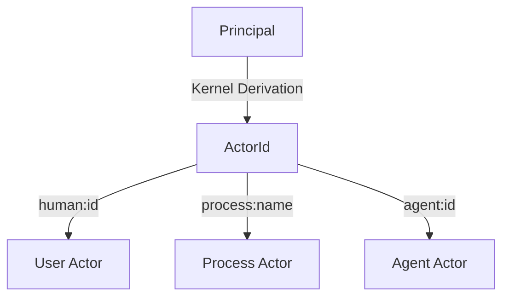
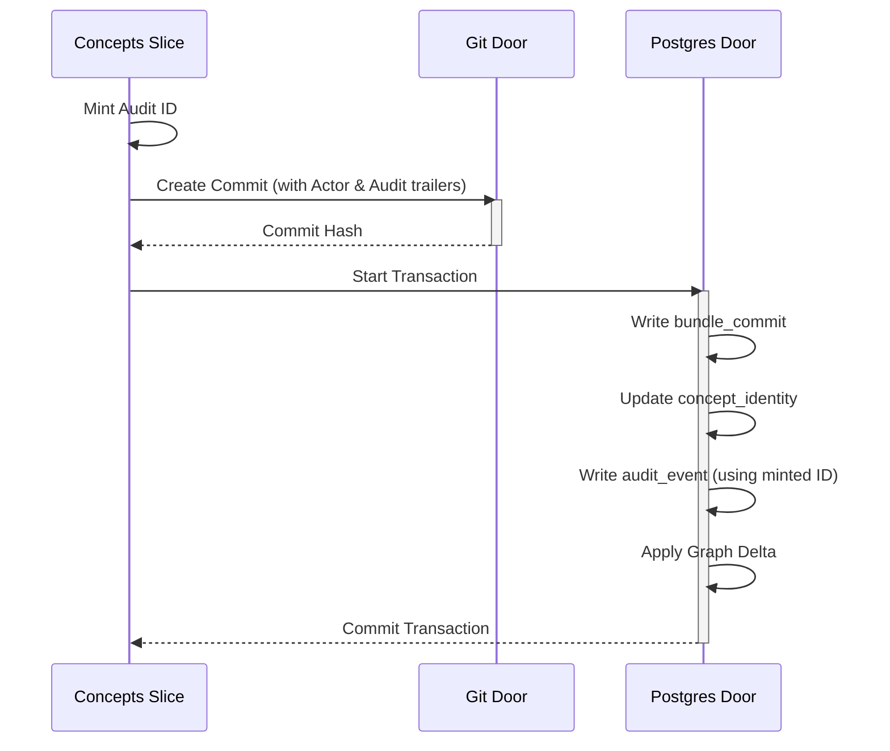

Relevant source files

The following files were used as context for generating this wiki page:

- [packages/core/src/kernel/actor.ts](packages/core/src/kernel/actor.ts)
- [packages/core/src/kernel/principal.ts](packages/core/src/kernel/principal.ts)
- [packages/core/src/answering/index.ts](packages/core/src/answering/index.ts)
- [AGENTS.md](AGENTS.md)
- [CODING_RULES.md](CODING_RULES.md)
- [apps/docs-site/specs/T-006.md](apps/docs-site/specs/T-006.md)
- [apps/docs-site/specs/T-064.md](apps/docs-site/specs/T-064.md)

# Core Logic: Packages/Core

The `packages/core` module contains the central business logic of the Better Answers platform. It functions as a transport-agnostic layer that `apps/api` calls to perform operations across the system's four primary data stores: Postgres, an object store, git repositories, and the derived graph. By centralizing logic here, the system ensures that domain rules, such as security predicates and audit requirements, remain consistent regardless of whether a request originates from a human user, a background worker, or an automated agent.

This package organizes logic into capability slices. Each slice defines its own interface and manages internal helpers or store doors to fulfill business requirements. The core logic enforces a strict security model where every function reading or writing tenant data requires a `Principal` object. This architecture ensures that Row-Level Security (RLS) and permission checks are applied at the lowest possible layer of the application logic.

Sources: [AGENTS.md](AGENTS.md), [CODING_RULES.md:38-40](CODING_RULES.md#L38-L40), [CODING_RULES.md:162-165](CODING_RULES.md#L162-L165)

## Security and Identity: The Principal Model

Security in `packages/core` relies on the `Principal` as the primary authorization token. Every core function interacting with workspace data must accept a `Principal` as its first parameter. The system uses this object to verify roles, check action thresholds, and apply read predicates (e.g., published status, sensitivity, and audience) during data access.

The platform recognizes three distinct kinds of principals:
*  **User Principal**: A person signed into a specific workspace.
*  **Platform Principal**: The platform acting autonomously with its own actor identity.
*  **Operator**: A platform administrator with authority across multiple workspaces.

Sources: [CODING_RULES.md:162-172](CODING_RULES.md#L162-L172), [apps/docs-site/specs/T-006.md:65-67](apps/docs-site/specs/T-006.md#L65-L67)

### Actor Derivation
The system derives an `ActorId` from a `Principal` using a dedicated kernel function. This `ActorId` is used in the audit ledger and git commit trailers to provide a permanent, non-PII reference to the entity that performed an action.

The diagram shows the transformation of a security Principal into a specific ActorId used for auditing and git history.
Sources: [CODING_RULES.md:183-188](CODING_RULES.md#L183-L188), [apps/docs-site/specs/T-006.md:65-68](apps/docs-site/specs/T-006.md#L65-L68)

## Capability Slices

Core logic is partitioned into slices that own specific domains of the product. These slices are transport-agnostic and are exported through a central map for consumption by other packages.

### Concepts Slice
The concepts slice manages the knowledge bundle, including writes to the git repository and Postgres index. It coordinates governed writes, which involve creating git commits followed by atomic database updates.

*  **Governed Write**: Ensures a git commit and database record land together. The slice mints an audit ID before the commit so it can be included in the git trailer for reconciler idempotency.
*  **Visibility Cascade**: Synchronously recomputes access classes when bindings change, ensuring Restricted concepts remain invisible to unauthorized users.

Sources: [apps/docs-site/specs/T-006.md:55-63](apps/docs-site/specs/T-006.md#L55-L63), [apps/docs-site/specs/T-006.md:121-125](apps/docs-site/specs/T-006.md#L121-L125)

### Audit Slice
The audit slice provides the interface for writing to the append-only `audit_event` ledger. It ensures that governed writes are recorded in the same database transaction as the data changes they describe.

| Component | Responsibility |
| :--- | :--- |
| **Audit Event** | Records an act, its target, the actor, and structured details. |
| **Audit Doors** | Provides specific entry points for user-driven and platform-driven acts. |
| **Reconciler** | Replays missed git commits to sync the database after a crash. |

Sources: [CODING_RULES.md:177-181](CODING_RULES.md#L177-L181), [apps/docs-site/specs/T-006.md:129-132](apps/docs-site/specs/T-006.md#L129-L132)

## Data Flow: Governed Write Pattern

The governed write is a critical pattern in `packages/core` that maintains synchronization between the git-based knowledge source and the Postgres search index.

This sequence diagram illustrates the atomic coordination between git storage and the relational database during a knowledge update.
Sources: [apps/docs-site/specs/T-006.md:121-128](apps/docs-site/specs/T-006.md#L121-L128), [CODING_RULES.md:177-180](CODING_RULES.md#L177-L180)

## Implementation Constraints

The development of `packages/core` follows strict design and testing rules defined in the repository constitution:

1.  **Deep Modules**: Slices must present a small interface over a large implementation to hide complexity from callers. Sources: [CODING_RULES.md:6-10](CODING_RULES.md#L6-L10)
2.  **No Mocking**: Core logic tests must run against real infrastructure, specifically a real Postgres instance (via Testcontainers) and real git repositories. Sources: [CODING_RULES.md:31-33](CODING_RULES.md#L31-L33), [CODING_RULES.md:43-44](CODING_RULES.md#L43-L44)
3.  **Result Objects**: Functions return `Result<>` types instead of throwing errors. Sources: [CODING_RULES.md:139-141](CODING_RULES.md#L139-L141)
4.  **Audit Integrity**: Every governed write must fail if its corresponding audit event cannot be written. Sources: [CODING_RULES.md:177-181](CODING_RULES.md#L177-L181)

## Conclusion
`packages/core` represents the authoritative implementation of the Better Answers domain model. By enforcing the `Principal` pattern and governed write sequences, it guarantees data integrity and security across multiple storage backends. This layer ensures that the living knowledge map remains consistent, explainable, and fully audited as the system evolves.
