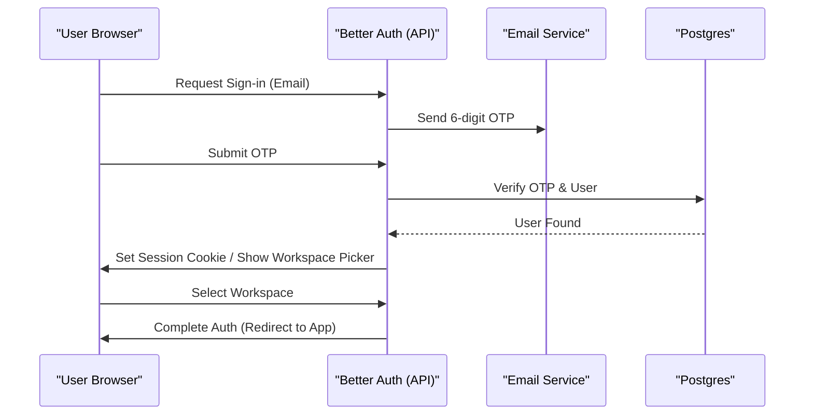

Relevant source files

The following files were used as context for generating this wiki page:

- [apps/docs-site/specs/T-004.md](apps/docs-site/specs/T-004.md)
- [apps/docs-site/specs/T-022.md](apps/docs-site/specs/T-022.md)
- [apps/docs-site/specs/T-045.md](apps/docs-site/specs/T-045.md)
- [apps/docs-site/specs/T-046.md](apps/docs-site/specs/T-045.md)
- [CODING_RULES.md](CODING_RULES.md)
- [packages/design-system/readme.md](packages/design-system/readme.md)

# Authentication & Access Control

Authentication and access control in Better Answers provide a secure, multi-tenant environment where every action is attributed to a verified identity. The system leverages **Better Auth** as an in-process authorization server to manage sessions and OAuth 2.1 flows, ensuring that users are confined to their specific workspaces through **Postgres Row Level Security (RLS)**.

The architecture enforces a "one identity, many memberships" model. Users sign in once via email-based six-digit codes and then select a workspace, which establishes a `Principal` context for all subsequent database transactions. This ensures that permissions are verified at the database level rather than just the application layer.

Sources: [apps/docs-site/specs/T-004.md:16-30](apps/docs-site/specs/T-004.md#L16-L30), [apps/docs-site/specs/T-022.md:21-35](apps/docs-site/specs/T-022.md#L21-L35)

## Core Concepts & Architecture

### The Principal
A `Principal` is the fundamental security context for every operation. It is derived from a verified session or bearer token and includes the user's ID, their active workspace ID, and their assigned role. The system supports three primary kinds of principals:
- **User Principal**: A person signed into a specific workspace.
- **Platform Principal**: The platform acting as itself for system tasks.
- **Operator**: A platform administrator with cross-workspace authority.

Sources: [CODING_RULES.md:217-230](CODING_RULES.md#L217-L230), [apps/docs-site/specs/T-004.md:79-90](apps/docs-site/specs/T-004.md#L79-L90)

### Multi-Tenancy via RLS
Better Answers uses Postgres Row Level Security to isolate tenant data. Every function in `packages/core` must take a `Principal` as its first parameter. The system uses this principal to set the RLS scope at the start of a database transaction, ensuring the user can only access rows belonging to their active workspace.

Sources: [CODING_RULES.md:209-216](CODING_RULES.md#L209-L216), [apps/docs-site/specs/T-004.md:126-135](apps/docs-site/specs/T-004.md#L126-L135)

## Authentication Flow

The authentication process utilizes email-based One-Time Passwords (OTP) and an optional workspace picker.

### Sign-in Sequence
The following diagram illustrates the lifecycle of a user authentication request:

Sources: [apps/docs-site/specs/T-004.md:94-118](apps/docs-site/specs/T-004.md#L94-L118), [apps/docs-site/specs/T-022.md:37-53](apps/docs-site/specs/T-022.md#L37-L53)

### OAuth 2.1 & MCP
The platform acts as an OAuth 2.1 authorization server to support Model Context Protocol (MCP) clients, such as Claude.
- **Discovery**: Clients discover the server via `/.well-known/` and `app.<domain>/mcp`.
- **Identity**: Clients identify themselves via public metadata documents rather than manual registration.
- **Tokens**: Tokens are bound to a specific workspace and include a refresh mechanism that lasts for 90 days.

Sources: [apps/docs-site/specs/T-004.md:66-77](apps/docs-site/specs/T-004.md#L66-L77), [apps/docs-site/specs/T-045.md:23-35](apps/docs-site/specs/T-045.md#L23-L35)

## Access Control Levels

Better Answers defines a closed set of roles that govern user capabilities within a workspace.

| Role | Description | Access Scope |
| :--- | :--- | :--- |
| **Admin** | Workspace administrator | Full control over people, sources, and system settings. |
| **Editor** | Content curator | Can create and edit knowledge, suggestions, and guides. |
| **Viewer** | Knowledge consumer | Read-only access to published answers and guides. |

Sources: [packages/design-system/readme.md:46-50](packages/design-system/readme.md#L46-L50), [apps/docs-site/specs/T-004.md:255-265](apps/docs-site/specs/T-004.md#L255-L265)

### Trusted Words for Sensitivity
Access control is also expressed through "Trust Words" that appear verbatim in the UI to signal the status of information:
- **Restricted**: Limited to specific roles or internal audiences.
- **Internal**: Visible to all workspace members.
- **Public**: Broadly accessible (where configured).
- **Draft/Deprecated**: Indicates lifecycle status affecting visibility.

Sources: [packages/design-system/readme.md:60-68](packages/design-system/readme.md#L60-L68), [CODING_RULES.md:212-214](CODING_RULES.md#L212-L214)

## Security Safeguards

### Secrets Management
Secrets reach the code through a single "bootstrap class" handled by the typed config module. All other credential classes (ingestion, LLM provider, etc.) are stored as hashed rows in the database and accessed through a credentials provider that audits every access decision.
Sources: [CODING_RULES.md:195-207](CODING_RULES.md#L195-L207)

### Ingress & Rate Limiting
To prevent abuse, the platform implements multiple layers of rate limiting:
- **Unauthenticated Limits**: Keyed by client IP address for sign-in and OAuth endpoints.
- **Token Limits**: Keyed by token/session inside Postgres for authenticated traffic.
- **SSRF Protection**: The metadata fetcher refuses private, loopback, or link-local addresses.

Sources: [apps/docs-site/specs/T-004.md:168-185](apps/docs-site/specs/T-004.md#L168-L185), [apps/docs-site/specs/T-045.md:105-115](apps/docs-site/specs/T-045.md#L105-L115)

### Audit Logs
Every governed write, Admin act, or platform act must write an audit event within the same database transaction.
- **Format**: `family.subject.verb` (e.g., `people.member.role_changed`).
- **Persistence**: The `audit_event` table is append-only; `UPDATE` and `DELETE` operations are revoked from the application role.

Sources: [CODING_RULES.md:246-270](CODING_RULES.md#L246-L270), [apps/docs-site/specs/T-004.md:267-273](apps/docs-site/specs/T-004.md#L267-L273)

## Summary
Authentication and access control are anchored by the `Principal` resolver and enforced by Postgres RLS. By centralizing all logic into a single origin (`app.`) and using in-process Better Auth, the system minimizes architectural complexity while maintaining strict tenant isolation and providing a robust audit trail for every action.
Sources: [apps/docs-site/specs/T-045.md:15-22](apps/docs-site/specs/T-045.md#L15-L22), [CODING_RULES.md:233-242](CODING_RULES.md#L233-L242)
