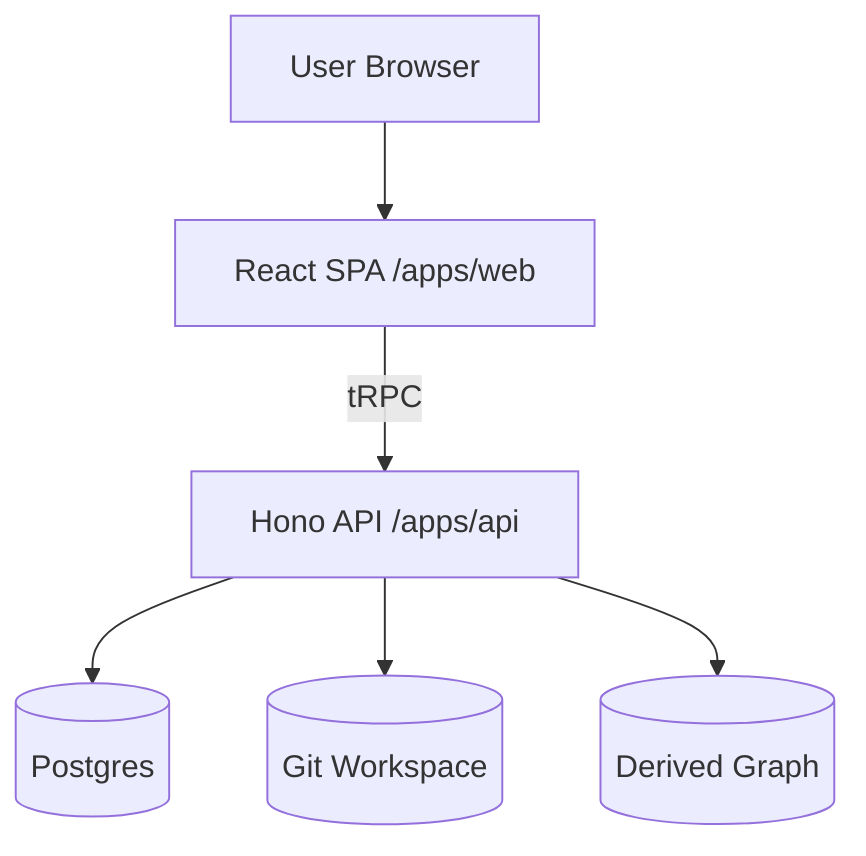
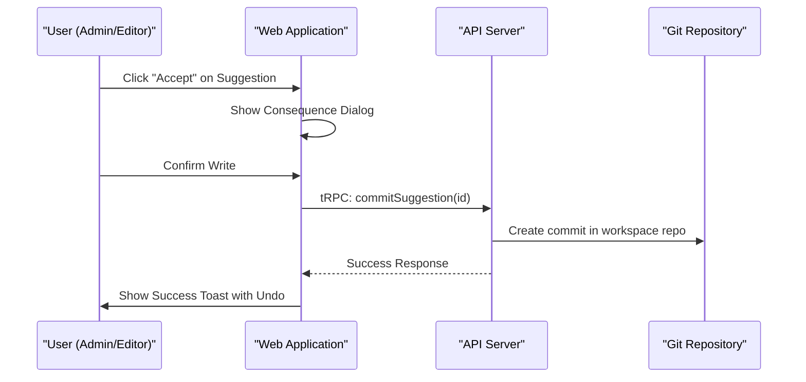

Relevant source files

The following files were used as context for generating this wiki page:

- [apps/web/vite.config.ts](apps/web/vite.config.ts)
- [apps/web/package.json](apps/web/package.json)
- [packages/design-system/readme.md](packages/design-system/readme.md)
- [AGENTS.md](AGENTS.md)
- [apps/api/CODING_RULES.md](apps/api/CODING_RULES.md)
- [packages/design-system/ui_kits/platform/README.md](packages/design-system/ui_kits/platform/README.md)

# React SPA Web Application

The Better Answers web application provides a browser-based interface for interacting with the company knowledge map. It functions as a Single-Page Application (SPA) built using React and Vite, serving as the primary surface for users to ask questions, search knowledge layers, and manage the platform via the Control Centre.

Sources: [apps/web/vite.config.ts:6-7](apps/web/vite.config.ts#L6-L7), [packages/design-system/readme.md:32-37](packages/design-system/readme.md#L32-L37), [AGENTS.md:21-22](AGENTS.md#L21-L22)

## Architecture and Technical Stack

The web application resides in the `apps/web/` directory and operates as a standalone browser package. It communicates exclusively with the API tier via tRPC and maintains a strict separation of concerns by never importing code directly from the API tier.

Sources: [apps/web/vite.config.ts:6-7](apps/web/vite.config.ts#L6-L7), [apps/api/CODING_RULES.md:3-5](apps/api/CODING_RULES.md#L3-L5), [AGENTS.md:21-22](AGENTS.md#L21-L22)

### Core Technologies
The application utilizes the following core technology stack:
- **Framework**: React 19
- **Build Tool**: Vite 8
- **Language**: TypeScript 7
- **Communication**: tRPC (to `apps/api`)
- **Type Checking**: tsc (no-emit)

Sources: [apps/web/package.json:20-33](apps/web/package.json#L20-L33), [apps/api/CODING_RULES.md:3-5](apps/api/CODING_RULES.md#L3-L5)

### Data Flow Diagram
The following diagram illustrates the high-level communication flow between the SPA and the backend infrastructure.

The SPA acts as a consumer of the API tier, which handles all business logic and data persistence.
Sources: [apps/web/vite.config.ts:6-7](apps/web/vite.config.ts#L6-L7), [AGENTS.md:2-5](AGENTS.md#L2-L5)

## Design System Integration

The application interface adheres to a rigid design system defined in `packages/design-system`. This system provides the visual register, typography, and reusable component primitives.

### Visual Foundations
The UI follows a "blueprint" aesthetic characterized by square corners, hairline borders, and registration marks.

| Element | Specification |
| :--- | :--- |
| **Typography** | Geist (sans) and Geist Mono |
| **Primary Color** | Ink Blue `#2e4bd4` (interactive only) |
| **Grid** | 32px modular grid |
| **Corners** | Square (0px radius) |
| **Casing** | Sentence case everywhere |

Sources: [packages/design-system/readme.md:104-142](packages/design-system/readme.md#L104-L142), [packages/design-system/readme.md:78-83](packages/design-system/readme.md#L78-L83)

### Component Architecture
The application composes screens from five categories of design system components:

1.  **Core**: Inputs, buttons, and basic form controls.
2.  **Display**: Cards, frames, and tables for data presentation.
3.  **Feedback**: Dialogs, toasts, and tooltips.
4.  **Knowledge**: Specialized components like `Citation` and `CoverageBar`.
5.  **Texture**: Visual elements like `GridPattern` and `DotPattern`.

Sources: [packages/design-system/readme.md:195-202](packages/design-system/readme.md#L195-L202), [packages/design-system/ui_kits/platform/README.md:1-5](packages/design-system/ui_kits/platform/README.md#L1-L5)

## Primary Application Surfaces

The application is organized into distinct surfaces that cater to different user roles (Admin, Editor, Viewer).

### User Surfaces
- **Ask**: A question-and-answer interface that provides cited answers from the knowledge map.
- **Search**: A discovery tool that returns hits categorized by knowledge layer (Sources, Bundles, Graph).
- **Guides**: Assembled knowledge layers providing "Brief" and "Detail" views over concepts.

Sources: [packages/design-system/readme.md:32-37](packages/design-system/readme.md#L32-L37), [packages/design-system/ui_kits/platform/README.md:8-11](packages/design-system/ui_kits/platform/README.md#L8-L11)

### Control Centre
The Control Centre is the administrative surface for curating knowledge and managing the system. It consists of six screens:

| Screen | Purpose |
| :--- | :--- |
| **Sources** | Manages document bindings and indexing states. |
| **Suggestions** | Queue for reviewing and committing knowledge changes (the "write path"). |
| **Knowledge** | Table view of every concept and composition in the map. |
| **Questions** | Management of user-submitted questions. |
| **People** | Access control for Admin, Editor, and Viewer roles. |
| **System** | Technical platform monitoring and configuration. |

Sources: [packages/design-system/readme.md:38-40](packages/design-system/readme.md#L38-L40), [packages/design-system/ui_kits/platform/README.md:12-15](packages/design-system/ui_kits/platform/README.md#L12-L15)

## Interaction Logic and State

The application implements specific UX patterns mandated by the repository's coding rules and Architecture Decision Records (ADRs).

### The "One Governed Write" Pattern
Knowledge updates follow a strict review-and-commit flow. When a user accepts a suggestion, the application triggers a "governed write" that is audited under the user's name and committed to the workspace's git-based bundle.

Sources: [packages/design-system/readme.md:20-22](packages/design-system/readme.md#L20-L22), [packages/design-system/ui_kits/platform/README.md:22-24](packages/design-system/ui_kits/platform/README.md#L22-L24), [packages/design-system/readme.md:11-13](packages/design-system/readme.md#L11-L13)

### Performance and Accessibility
- **Latency Budget**: The application aims for low latency; answers stream to the UI to provide immediate feedback.
- **Keyboard Budget**: High-frequency actions are accessible via keyboard shortcuts.
- **Accessibility**: Components use GOV.UK semantics and meet WCAG 2.2 AA standards.

Sources: [packages/design-system/readme.md:11-13](packages/design-system/readme.md#L11-L13), [packages/design-system/readme.md:162-164](packages/design-system/readme.md#L162-L164)

## Summary

The React SPA is the primary interface for the Better Answers platform, built with a focus on precision, grounded evidence, and strict architectural separation. It translates the design system's "blueprint" philosophy into a functional tool for knowledge mapping and retrieval, ensuring every answer is cited and every administrative action is audited.

Sources: [packages/design-system/readme.md:1-5](packages/design-system/readme.md#L1-L5), [AGENTS.md:2-5](AGENTS.md#L2-L5)
