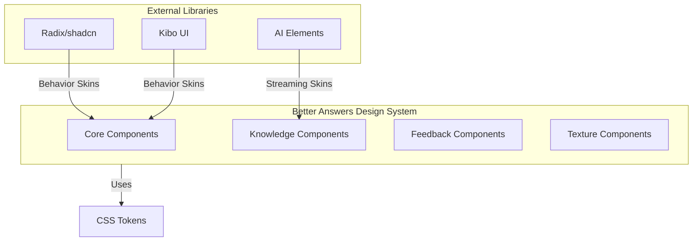

<details>
<summary>Relevant source files</summary>

The following files were used as context for generating this wiki page:

- [packages/design-system/readme.md](packages/design-system/readme.md)
- [packages/design-system/tokens/tailwind-bridge.css](packages/design-system/tokens/tailwind-bridge.css)
- [packages/design-system/SKILL.md](packages/design-system/SKILL.md)
- [packages/design-system/guidelines/kits-adoption.card.html](packages/design-system/guidelines/kits-adoption.card.html)
- [packages/design-system/tokens/blueprint.css](packages/design-system/tokens/blueprint.css)
- [packages/design-system/tokens/colors.css](packages/design-system/tokens/colors.css)
- [CODING_RULES.md](CODING_RULES.md)

</details>

# Design System & CSS Tokens

The Better Answers design system provides a living company knowledge map interface for UK SMBs. It operates as a modular "blueprint" rather than a traditional dashboard, emphasizing precision, confidence, and grounded evidence through strict visual and content rules. The system serves the hosted product at `better-answers.com` and enforces the domain glossary defined in `CONTEXT.md` to ensure interface language consistency.

Sources: [packages/design-system/readme.md:3-33](packages/design-system/readme.md#L3-L33), [CODING_RULES.md:144-148](CODING_RULES.md#L144-L148)

## Visual Foundations and Architecture

The design system adopts a quiet, dense, and mechanical register. It utilizes a modular grid based on a 32px module (`--grid-module`), which is visually represented by a `GridPattern` substrate. UI elements are treated as objects on this grid, often featuring square corners and hairline borders.

### The Blueprint Register

*  **Modular Grid:** A 32px or 64px pitch substrate draws behind every screen.
*  **Square Corners:** All radius ramps resolve to `0`, except for loading spinners and radio buttons.
*  **Registration Marks:** Centered `+` marks at the corners of board-level objects like primary buttons, figures, and specific cards.
*  **Hairlines:** Surfaces use 1px borders (`--border-subtle`) instead of shadows or gradients to define depth.

Sources: [packages/design-system/readme.md:83-112](packages/design-system/readme.md#L83-L112), [packages/design-system/readme.md:126-136](packages/design-system/readme.md#L126-L136)

### Component Architecture and Adoption

The system categorizes components by concern and integrates external kits by skinning their behavior with Better Answers tokens.



The diagram shows how external UI kits provide complex behaviors (focus traps, streaming) while the internal system applies the Better Answers visual register and semantic meaning through CSS tokens.
Sources: [packages/design-system/guidelines/kits-adoption.card.html:150-240](packages/design-system/guidelines/kits-adoption.card.html#L150-L240)

## CSS Token System

The design system relies on a central token architecture imported via `styles.css`. These tokens govern color, typography, spacing, and specific visual traits like "blueprint" registration marks.

### Color and Semantic Palette
The system uses a cool grey ramp for structure and a single interactive accent color.

| Semantic Use | Token / Hex | Description |
| :--- | :--- | :--- |
| Page Surface | `#fcfcfd` | The base substrate color. |
| Text Primary | `#17191c` | The standard high-contrast text. |
| Brand Accent | `#2e4bd4` | Ink blue; restricted to interactive elements like links and focus rings. |
| Warning | `#a55d09` | Used as a label tint alongside explicit text. |
| Danger | `#c0362c` | Used for error states or destructive actions. |

Sources: [packages/design-system/readme.md:114-124](packages/design-system/readme.md#L114-L124), [packages/design-system/tokens/tailwind-bridge.css:56-100](packages/design-system/tokens/tailwind-bridge.css#L56-L100)

### Typography
The system uses the **Geist** font family for all interfaces, with **Geist Mono** reserved for identity, machine strings, and citation markers.

*  **Interface Body:** 14px text.
*  **Reader Prose:** 16px text with 1.65 line height on a 68ch measure.
*  **Weights:** Only 400, 500, and 600 weights are permitted.
*  **Casing:** Sentence case is used globally, except for 11px micro-labels which use tracked uppercase.

Sources: [packages/design-system/readme.md:126-134](packages/design-system/readme.md#L126-L134), [packages/design-system/tokens/tailwind-bridge.css:122-132](packages/design-system/tokens/tailwind-bridge.css#L122-L132)

## Component Specification

Components are built as single `.jsx` files with sibling `.d.ts` and `.prompt.md` files, styled exclusively through CSS custom properties.

### Specialized Knowledge Components
Unlike generic kits, the Better Answers system includes components that encode specific domain rules from `CONTEXT.md` and Architecture Decision Records (ADRs).

*  **TrustTag:** Implements the closed set of trust words (e.g., "Checked by platform", "Out of date").
*  **Citation:** Represents the unit a reader checks, including concept, source, locator, and passage.
*  **CoverageBar:** Visualizes the gap between expected knowledge and included evidence.
*  **Frame:** The blueprint primitive; a transparent drawing with registration marks.

Sources: [packages/design-system/readme.md:215-235](packages/design-system/readme.md#L215-L235), [packages/design-system/components/knowledge/knowledge.card.html:70-95](packages/design-system/components/knowledge/knowledge.card.html#L70-L95)

### Texture and Substrate
Texture is treated as semantic information rather than decoration.

| Component | Ported From | Usage Rule |
| :--- | :--- | :--- |
| `GridPattern` | Magic UI | Draws the page substrate at 32px pitch. |
| `DotPattern` | Magic UI | Indicates empty states or drop zones (nothing here yet). |
| `NoiseTexture` | Magic UI | Applied to dark/accent surfaces at 3.5–5% for grain. |

Sources: [packages/design-system/readme.md:144-158](packages/design-system/readme.md#L144-L158), [packages/design-system/components/texture/texture.card.html:70-150](packages/design-system/components/texture/texture.card.html#L70-L150)

## Framework Integration (Tailwind Bridge)

The `tokens/tailwind-bridge.css` file maps Better Answers tokens to the standard variable names expected by `shadcn`, `Kibo UI`, and `AI Elements`. This allows external components to adopt the system's styling automatically.

```css
/* packages/design-system/tokens/tailwind-bridge.css:40-52 */
:root {
  --background: var(--surface-page);
  --foreground: var(--text-primary);
  --card: var(--surface-card);
  
  /* Solid default button — near-black, per our register */
  --primary: var(--control-primary-bg);
  --primary-foreground: var(--control-primary-fg);
  
  /* brand accent exposed for custom use */
  --brand: var(--accent-600);
}
```

### Motion and Interaction
Motion is rationed to ensure performance and accessibility.
*  **Standard Curve:** `cubic-bezier(.2,0,.13,1)`.
*  **Durations:** 80ms to 240ms range.
*  **Rules:** No bounce, no spring, and no parallax. Continuous motion is strictly limited to streaming answers.
*  **Accessibility:** `prefers-reduced-motion` collapses all durations to 1ms.

Sources: [packages/design-system/readme.md:183-191](packages/design-system/readme.md#L183-L191), [packages/design-system/tokens/tailwind-bridge.css:176-184](packages/design-system/tokens/tailwind-bridge.css#L176-L184)

## Accessibility and Semantics

The design system enforces **WCAG 2.2 AA** standards and requires testing with screen readers and keyboards.

*  **Keyboard Budget:** Every common action must have a keystroke.
*  **Native Semantics:** Components utilize GOV.UK Design System semantics (e.g., `SummaryList`, `Details`) without the specific branding.
*  **State Transparency:** Trust and status signals are never communicated by color alone; they must use explicit text tags.
*  **Disclosure Model:** Interfaces follow a "disclosure, not layers" approach, typically limiting navigation to two levels for Viewers to minimize cognitive load.

Sources: [CODING_RULES.md:168-185](CODING_RULES.md#L168-L185), [packages/design-system/readme.md:196-199](packages/design-system/readme.md#L196-L199)
