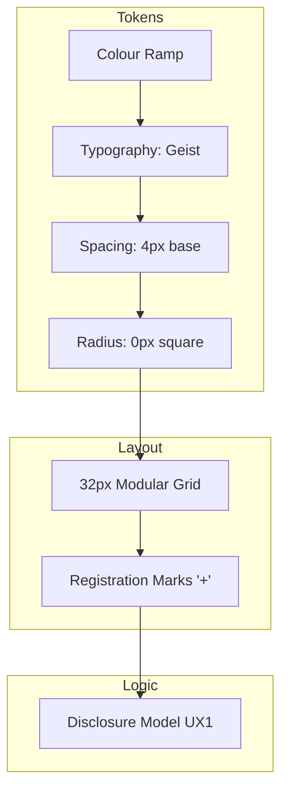
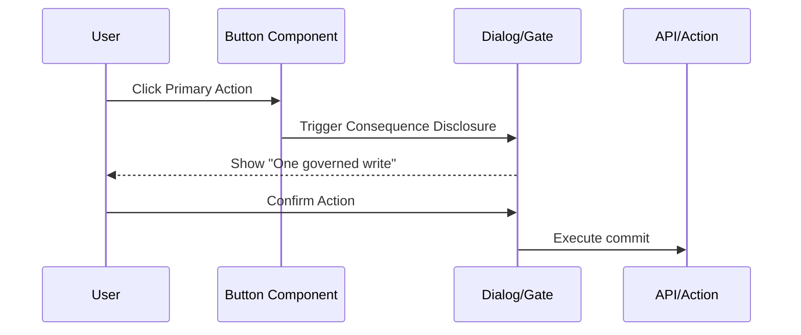
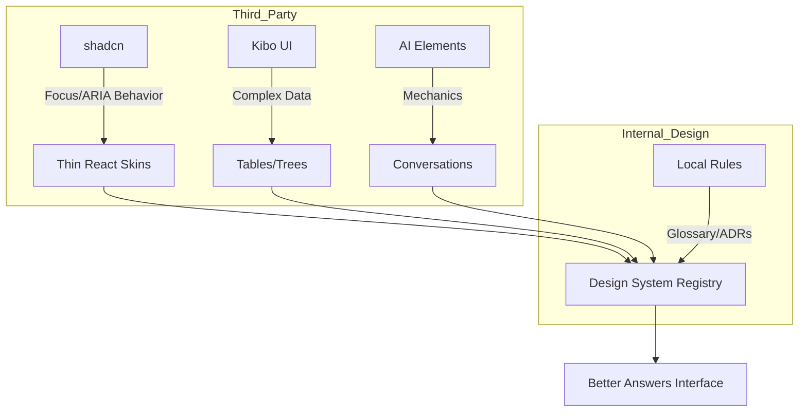

Relevant source files

The following files were used as context for generating this wiki page:

- [packages/design-system/readme.md](packages/design-system/readme.md)
- [packages/design-system/components/core/core.card.html](packages/design-system/components/core/core.card.html)
- [packages/design-system/components/display/display.card.html](packages/design-system/components/display/display.card.html)
- [packages/design-system/components/knowledge/knowledge.card.html](packages/design-system/components/knowledge/knowledge.card.html)
- [packages/design-system/components/feedback/feedback.card.html](packages/design-system/components/feedback/feedback.card.html)
- [packages/design-system/tokens/tailwind-bridge.css](packages/design-system/tokens/tailwind-bridge.css)
- [packages/design-system/guidelines/kits-adoption.card.html](packages/design-system/guidelines/kits-adoption.card.html)

# Reusable UI Components

Reusable UI components form the interface layer for Better Answers. These components implement a "blueprint" visual register characterized by square corners, hairline borders, and modular grid registration. The system enforces strict terminology from the project glossary and follows specific UX rules regarding disclosure and latency.

The component library serves the hosted product at `better-answers.com`. It provides a quiet, mechanical aesthetic using the Geist and Geist Mono typefaces. The architecture prioritizes precise trust indicators and clear evidence-based knowledge representation over decorative elements.

Sources: [packages/design-system/readme.md:1-20](packages/design-system/readme.md#L1-L20), [packages/design-system/readme.md:120-140](packages/design-system/readme.md#L120-L140)

## Visual Foundations and Tokens

The design system uses a 32px modular grid as its substrate. Components register against this grid using optional "+" marks on corners. Colors follow a cool grey ramp for structure with ink blue (`#2e4bd4`) reserved exclusively for interactive elements.

The diagram shows the relationship between low-level design tokens and high-level layout rules that govern component behavior.
Sources: [packages/design-system/readme.md:120-170](packages/design-system/readme.md#L120-L170), [packages/design-system/tokens/tailwind-bridge.css:80-90](packages/design-system/tokens/tailwind-bridge.css#L80-L90)

### Key Token Categories
| Category | Values / Rules | File Reference |
| :--- | :--- | :--- |
| **Radius** | Always `0px` (Square), except for radio and loading spinner. | `tailwind-bridge.css:87` |
| **Grid** | 32px module (`--grid-module`), 64px for wide layouts. | `readme.md:126` |
| **Primary Color** | Ink Blue `#2e4bd4` (Interactive only). | `readme.md:132` |
| **Typography** | Geist (Interface/Prose), Geist Mono (Machine strings). | `readme.md:143` |

Sources: [packages/design-system/readme.md:126-150](packages/design-system/readme.md#L126-L150), [packages/design-system/tokens/tailwind-bridge.css:87](packages/design-system/tokens/tailwind-bridge.css#L87)

## Core Components

Core components handle basic user input and primary actions. They include `Button`, `Input`, `Select`, and `Switch`. The system enforces a specific hierarchy where the `primary` button is the only solid object on a screen, used for committing actions.

### Button Variations
Buttons support several variants to represent different levels of action:
*  **Primary:** Solid near-black object with registration marks.
*  **Accent:** Solid ink blue for specific gate actions.
*  **Secondary/Ghost:** Outline or transparent for non-primary actions.
*  **Danger:** Red for destructive acts like "Deprecate".

Sources: [packages/design-system/components/core/core.card.html:84-100](packages/design-system/components/core/core.card.html#L84-L100), [packages/design-system/readme.md:158-164](packages/design-system/readme.md#L158-L164)

### Data Flow: Action Execution

Components ensure "Consequence before the click" by disclosing effects in labels or adjacent text.
Sources: [packages/design-system/readme.md:96-98](packages/design-system/readme.md#L96-L98), [packages/design-system/components/feedback/feedback.card.html:125-138](packages/design-system/components/feedback/feedback.card.html#L125-L138)

## Display and Knowledge Components

Display components manage data presentation, while Knowledge components are specialized for citing evidence and showing coverage.

### Specialized Components
*  **TrustTag:** Implements a closed set of trust words (e.g., "Checked by <person>", "Unchecked", "Out of date").
*  **Citation:** The primary unit for checking evidence. It displays concept, source, locator, and passage in a single disclosure.
*  **CoverageBar:** Visualizes the ratio of included concepts versus expected concepts in a section.
*  **Frame:** A transparent line-drawing primitive that carries registration marks for diagrams or page regions.

Sources: [packages/design-system/readme.md:213-233](packages/design-system/readme.md#L213-L233), [packages/design-system/components/knowledge/knowledge.card.html:84-105](packages/design-system/components/knowledge/knowledge.card.html#L84-L105)

### Trust States Table
| State | Label / Requirement | Source |
| :--- | :--- | :--- |
| `checked` | Includes person name and date. | `CONTEXT.md` / `readme.md` |
| `unchecked` | Default for new or unverified data. | `readme.md:65` |
| `out-of-date` | Indicates source has changed. | `readme.md:65` |
| `restricted` | Sensitivity indicator. | `readme.md:65` |

Sources: [packages/design-system/readme.md:64-70](packages/design-system/readme.md#L64-L70), [packages/design-system/components/display/display.card.html:98-105](packages/design-system/components/display/display.card.html#L98-L105)

## Feedback and Navigation

Feedback components handle asynchronous events and complex user confirmations.

### Disclosure and Hierarchy
The system uses `Details` and `Dialog` components to manage information density. Per rule `[UX1]`, the first view shows only what is needed to judge, with one disclosure level revealing more. Modals are reserved for irreversible acts.

*  **NotificationBanner:** Used for status updates (info, warning, danger).
*  **Toast:** Provides optimistic feedback for actions (e.g., "12 concepts accepted") with an Undo option.
*  **SideNav:** Organizes the platform into Screens (not sections), such as Sources, Knowledge, and Suggestions.

Sources: [packages/design-system/readme.md:200-203](packages/design-system/readme.md#L200-L203), [packages/design-system/components/feedback/feedback.card.html:88-100](packages/design-system/components/feedback/feedback.card.html#L88-L100), [packages/design-system/components/navigation/navigation.card.html:95-125](packages/design-system/components/navigation/navigation.card.html#L95-L125)

## Adoption Strategy

The design system adopts third-party libraries for complex behaviors while maintaining local control over product meaning.

The adoption rule states: "They own behavior; we own meaning."
Sources: [packages/design-system/guidelines/kits-adoption.card.html:125-180](packages/design-system/guidelines/kits-adoption.card.html#L125-L180)

### Component Ownership Registry
| Category | Adoption Strategy | Target Components |
| :--- | :--- | :--- |
| **Behavior** | Re-base shadcn as thin skins. | Dialog, Select, Tooltip, Tabs. |
| **Complexity** | Install Kibo UI and set radius to 0. | Table, Tree, Dropzone, Spinner. |
| **Meaning** | Hand-written (Never use kit version). | TrustTag, Citation, CoverageBar, SideNav. |

Sources: [packages/design-system/guidelines/kits-adoption.card.html:130-170](packages/design-system/guidelines/kits-adoption.card.html#L130-L170)

## Implementation Summary

Better Answers UI components serve as an exact implementation of the `CONTEXT.md` glossary and ADR-defined knowledge structures. By combining a rigid modular grid, square geometry, and a strict closed set of trust terminology, the system ensures technical accuracy and user confidence in the knowledge map. Component behavior prioritizes evidence citation and low-latency feedback over aesthetic flourish.

Sources: [packages/design-system/readme.md:22-35](packages/design-system/readme.md#L22-L35), [packages/design-system/readme.md:110-120](packages/design-system/readme.md#L110-L120)
