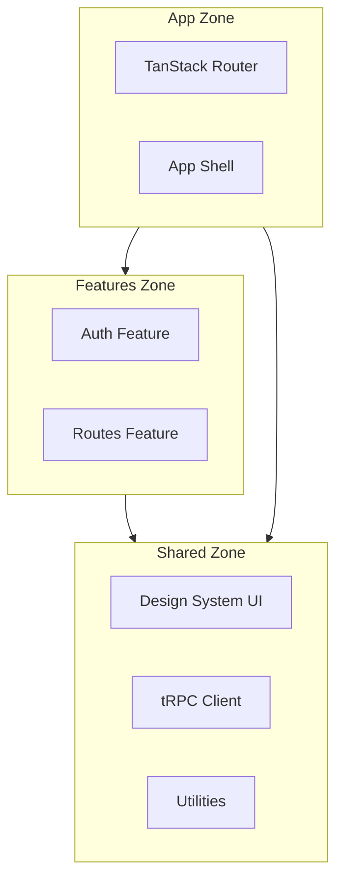
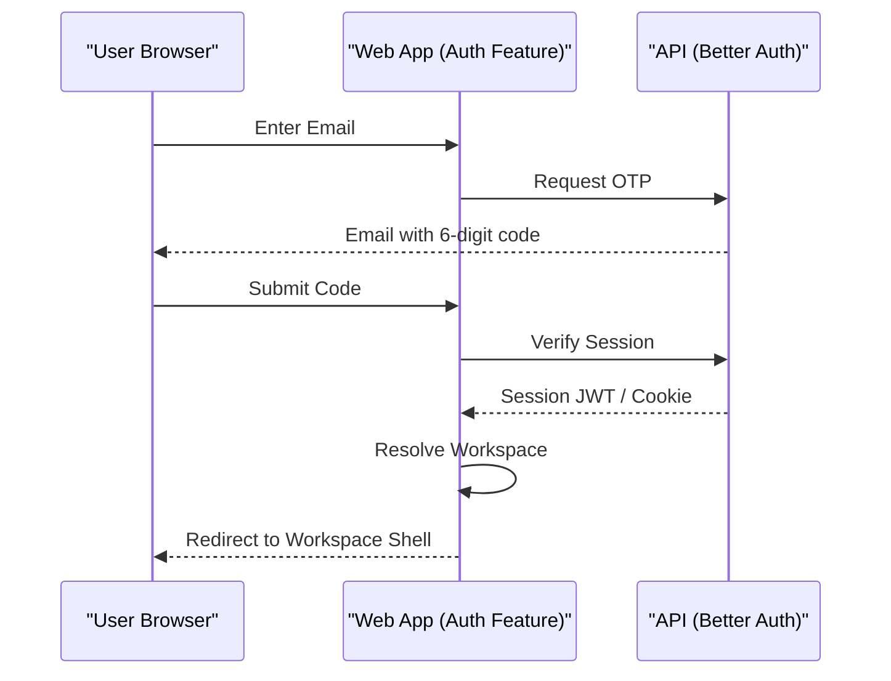

Relevant source files

The following files were used as context for generating this wiki page:

- [apps/web/CODING_RULES.md](apps/web/CODING_RULES.md)
- [AGENTS.md](apps/web/AGENTS.md)
- [apps/docs-site/specs/T-022.md](apps/docs-site/specs/T-022.md)
- [apps/docs-site/specs/T-064.md](apps/docs-site/specs/T-064.md)
- [apps/docs-site/specs/T-046.md](apps/docs-site/specs/T-046.md)
- [packages/design-system/readme.md](packages/design-system/readme.md)

# Web App Structure & Zones

The Better Answers web application is a Single-Page Application (SPA) built with Vite and React. It operates within a multi-tier architecture, communicating exclusively with the API tier via tRPC. The application adheres to a strict structural model divided into three primary zones: `app/`, `features/`, and `shared/`.

This structure enforces a unidirectional dependency flow (app → features → shared) to ensure maintainability and prevent circular dependencies. The web app is designed as a "blueprint" rather than a traditional dashboard, utilizing a modular grid system and technical typography to support professional knowledge workers.

Sources: [apps/web/CODING_RULES.md:5-15](apps/web/CODING_RULES.md#L5-L15), [AGENTS.md:27-30](AGENTS.md#L27-L30), [packages/design-system/readme.md:92-95](packages/design-system/readme.md#L92-L95)

## Architectural Zones

The application source code under `src/` is partitioned into three distinct zones, each with a specific responsibility.

### Zone Definitions

| Zone | Path | Responsibility |
| :--- | :--- | :--- |
| **App** | `src/app/` | Composes the application, handles routing, and defines the global shell. |
| **Features** | `src/features/` | Owns specific product concerns (e.g., auth, routes) and their respective API requests. |
| **Shared** | `src/shared/` | The common ground containing reusable UI components, API clients, and utilities. |

Sources: [apps/web/CODING_RULES.md:7-11](apps/web/CODING_RULES.md#L7-L11), [apps/docs-site/specs/T-064.md:120-125](apps/docs-site/specs/T-064.md#L120-L125)

### Dependency Flow

The application enforces a strict unidirectional dependency graph. A feature cannot import another feature. If two features must share logic or components, that code must be moved to the `shared/` zone. Imports crossing zone boundaries use the `@/<zone>/...` alias format to enable linting enforcement via `no-restricted-imports`.

The diagram shows the allowed import directions between architectural zones.
Sources: [apps/web/CODING_RULES.md:11-15](apps/web/CODING_RULES.md#L11-L15), [apps/docs-site/specs/T-022.md:255-260](apps/docs-site/specs/T-022.md#L255-L260)

## Core Frameworks & Routing

The web app utilizes specific libraries for routing, state management, and API communication.

### Routing Strategy
The application uses **TanStack Router**. It implements a `defaultErrorComponent` (found at `src/app/failed-screen.tsx`) to ensure that if a screen throws an error, the application shell, navigation, and landmarks remain functional.
Sources: [apps/web/CODING_RULES.md:32-37](apps/web/CODING_RULES.md#L32-L37), [apps/docs-site/specs/T-022.md:250-252](apps/docs-site/specs/T-022.md#L250-L252)

### API Communication (tRPC)
`src/shared/api/trpc.ts` is the sole entry point for API interaction. It imports the API definition as a type only (`import type`) to ensure zero runtime coupling between the web and API tiers. The built bundle contains no reference to the API source code.
Sources: [apps/web/CODING_RULES.md:25-30](apps/web/CODING_RULES.md#L25-L30), [apps/docs-site/specs/T-022.md:253-255](apps/docs-site/specs/T-022.md#L253-L255)

## Authentication & Tenancy

Authentication is isolated within the `src/features/auth/` directory. This is the only location allowed to import `better-auth` or its plugins. Higher-level zones interact with terms like "workspaces" and "roles" rather than raw authentication endpoints.

### Authentication Flow

The authentication process uses emailed OTP codes and scopes the session to a specific workspace.
Sources: [apps/web/CODING_RULES.md:17-21](apps/web/CODING_RULES.md#L17-L21), [apps/docs-site/specs/T-022.md:40-55](apps/docs-site/specs/T-022.md#L40-L55), [apps/docs-site/specs/T-046.md:40-50](apps/docs-site/specs/T-046.md#L40-L50)

## Design System & UI Components

The application adopts a specific "blueprint" register, prioritizing density and precision.

### UI Composition
Components are sourced from three primary registries:
1. **shadcn/ui**: Owns core behaviors (dialogs, selects, tooltips).
2. **Kibo UI**: Provides complex structural components (tables, trees, snippets).
3. **AI Elements**: Handles streaming AI interactions (conversations, reasoning).

The platform skins these components using a Tailwind v4 bridge to ensure they adhere to the project's visual tokens (e.g., square corners, ink blue interactive accents).
Sources: [packages/design-system/readme.md:104-108](packages/design-system/readme.md#L104-L108), [packages/design-system/guidelines/kits-adoption.card.html:150-165](packages/design-system/guidelines/kits-adoption.card.html#L150-L165)

### Platform-Specific Components
Certain components are custom-built to encode specific domain rules from the glossary (`CONTEXT.md`):
*  **TrustTag**: Displays a closed set of trust words.
*  **Citation**: Renders concept, source, locator, and passage information.
*  **Frame**: A blueprint object with registration marks (`+` signs) on corners.
Sources: [packages/design-system/readme.md:112-120](packages/design-system/readme.md#L112-L120), [packages/design-system/guidelines/kits-adoption.card.html:190-205](packages/design-system/guidelines/kits-adoption.card.html#L190-L205)

## Coding Rules & Implementation Standards

*  **Case Sensitivity**: All files and folders under `src/` use `kebab-case` to ensure cross-platform compatibility.
*  **Naming**: The project strictly uses the word **workspace** instead of "organization" or "account" in the UI.
*  **Accessibility**: Every interactive element must meet WCAG 2.2 AA standards, utilizing native roles and focus orders.
*  **Latency**: Common actions must respond within 100ms (optimistically), and lists must load in under one second.
Sources: [apps/web/CODING_RULES.md:22-24](apps/web/CODING_RULES.md#L22-L24), [packages/design-system/readme.md:38-42](packages/design-system/readme.md#L38-L42), [CODING_RULES.md:270-285](CODING_RULES.md#L270-L285)

## Summary

The Better Answers web app structure is a highly disciplined environment defined by strictly enforced zones and unidirectional data flow. By centralizing authentication, isolating API types, and utilizing a standardized design system across specialized features, the architecture maintains a clear separation of concerns while providing a consistent, accessible interface for knowledge management.
