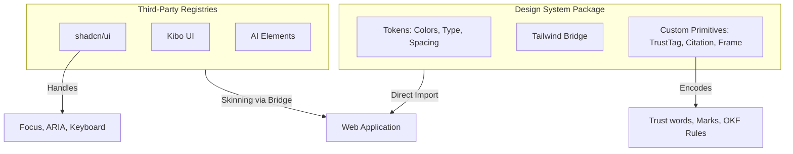

Relevant source files

The following files were used as context for generating this wiki page:

- [packages/design-system/readme.md](packages/design-system/readme.md)
- [packages/design-system/SKILL.md](packages/design-system/SKILL.md)
- [packages/design-system/tokens/tailwind-bridge.css](packages/design-system/tokens/tailwind-bridge.css)
- [packages/design-system/guidelines/kits-adoption.card.html](packages/design-system/guidelines/kits-adoption.card.html)
- [apps/web/src/index.css](apps/web/src/index.css)
- [CODING_RULES.md](CODING_RULES.md)
- [packages/design-system/package.json](packages/design-system/package.json)

# Design System & Aesthetic Principles

The Better Answers design system provides a "quiet, dense, and mechanical" interface for a living company knowledge map. It defines the brand and interface system for the hosted product, ensuring technical accuracy, density, and clarity across all surfaces. The system prioritizes functional meaning over decorative elements, utilizing a blueprint-inspired aesthetic with a modular grid and strict typographic rules.

This design system integrates with third-party registries like shadcn, Kibo UI, and AI Elements to manage complex behaviors while maintaining internal control over domain-specific meaning, trust vocabulary, and visual registration.
Sources: [packages/design-system/readme.md:1-10](packages/design-system/readme.md#L1-L10), [packages/design-system/readme.md:105-110](packages/design-system/readme.md#L105-L110), [packages/design-system/SKILL.md](packages/design-system/SKILL.md)

## Visual Foundations & Register

The aesthetic register is described as a **blueprint**, not a dashboard. The system employs square corners, hairline borders, and registration marks to create a dense, mechanical feel.

### The Modular Grid
Layouts sit on a 32px module (`--grid-module`), with 64px modules used for wide layouts. A `GridPattern` draws the pitch behind the page so the substrate and content align.
Sources: [packages/design-system/readme.md:112-117](packages/design-system/readme.md#L112-L117)

### Registration Marks
A `+` mark at 7px arms is centered on the corners of specific board-level objects. These marks are rationed to prevent visual clutter:
*  **Allowed**: Page regions, module frames, diagrams, cards that are direct grid children, and primary buttons.
*  **Disallowed**: Inputs, selects, tags, table rows, or objects inside a parent that already carries marks.
Sources: [packages/design-system/readme.md:144-155](packages/design-system/readme.md#L144-L155)

### Visual Style Properties

| Property | Value / Constraint |
| :--- | :--- |
| **Corners** | Square (0px radius) for all objects except loading spinners and radios. |
| **Borders** | 1px `--border-subtle` or `--border-default`. Never 2px except focus rings (2px) and tab underlines (1.5px). |
| **Shadows** | Five low-alpha steps; primarily used for dialogs, dropdowns, and popovers. |
| **Imagery** | None. No photography or illustrations are shipped with the product. |
| **Emoji** | Never used in the interface, empty states, or documentation. |
Sources: [packages/design-system/readme.md:139-143](packages/design-system/readme.md#L139-L143), [packages/design-system/readme.md:162-164](packages/design-system/readme.md#L162-L164), [packages/design-system/readme.md:204-206](packages/design-system/readme.md#L204-L206), [packages/design-system/readme.md:88-90](packages/design-system/readme.md#L88-L90)

## Color System & Theming

The system uses a cool grey ramp for structural elements and a single interactive accent color.

*  **Structural Colors**: Page `#fcfcfd`, cards `#ffffff`, lines `#dfe1e6`, text `#17191c`.
*  **Accent Color**: Ink blue `#2e4bd4` (mapped to `brand` in the Tailwind bridge). This color is strictly for interactive elements: links, focus rings, and accent buttons.
*  **Semantic Colors**: Green, Amber, Red, and Violet are used for status labels only.
*  **Dark Theme**: Activated via `[data-theme="dark"]`, setting the page to `#0b0c0e`. It uses a full alias flip for color values.
Sources: [packages/design-system/readme.md:118-126](packages/design-system/readme.md#L118-L126), [packages/design-system/tokens/tailwind-bridge.css:84-102](packages/design-system/tokens/tailwind-bridge.css#L84-L102)

### Surface Textures
The system uses three rationed textures ported from Magic UI to provide depth without decoration:

| Component | Usage |
| :--- | :--- |
| `GridPattern` | Page substrate, one per screen, 32px pitch. |
| `DotPattern` | Bounded empty areas (empty states, drop zones). Indicates "nothing here yet". |
| `NoiseTexture` | 3.5–5% opacity on dark and accent surfaces only. |
Sources: [packages/design-system/readme.md:172-181](packages/design-system/readme.md#L172-L181)

## Typography & Content Standards

Typography is driven by the **Geist** and **Geist Mono** families. 

*  **Geist (Sans)**: Interface body (14px) and reader prose (16px).
*  **Geist Mono**: Machine strings (IRIs, citation markers), tabular figures, and the wordmark.
*  **Weights**: Only 400, 500, and 600 weights are used.
Sources: [packages/design-system/readme.md:128-135](packages/design-system/readme.md#L128-L135), [apps/web/src/index.css:26-44](apps/web/src/index.css#L26-L44)

### Content Rules
All interface text follows strict semantic and tonal rules defined in the project glossary (`CONTEXT.md`).

*  **Verbatim Trust Words**: A closed set including "Checked by the platform", "Unchecked", "Out of date", and "Restricted".
*  **Tone**: Precise and grounded. Use counts ("Three passages") rather than hedging ("A few").
*  **Casing**: Sentence case for headings and buttons. Micro-labels (11px) use all-caps with tracking.
*  **Person**: Second person for user actions ("you asked"); third person for the platform. Never "we".
Sources: [packages/design-system/readme.md:58-75](packages/design-system/readme.md#L58-L75), [packages/design-system/readme.md:80-82](packages/design-system/readme.md#L80-L82)

## Component Architecture

Better Answers utilizes a hybrid approach to components, separating behavior from meaning.

The design system separates technical behavior (registries) from domain meaning (custom primitives).
Sources: [packages/design-system/guidelines/kits-adoption.card.html:15-20](packages/design-system/guidelines/kits-adoption.card.html#L15-L20), [packages/design-system/readme.md:231-248](packages/design-system/readme.md#L231-L248)

### Kit Adoption Strategy
The system follows a "Take the behavior, keep our skin" rule:

| Category | Component Examples | Strategy |
| :--- | :--- | :--- |
| **Behavioral Skins** | Dialog, Select, Tabs, Popover | Take Radix-based components from shadcn; skin via Tailwind Bridge. |
| **Complex Primitives** | Table, Tree, Code Block, Kbd | Take outright from Kibo UI; set radius to 0. |
| **AI/Ask Surface** | Conversation, Prompt Input, Plan | Take from AI Elements for streaming mechanics. |
| **Product Meaning** | `TrustTag`, `Citation`, `Frame`, `Icon` | **Ours only.** Never use kit versions as they violate domain glossary rules. |
Sources: [packages/design-system/guidelines/kits-adoption.card.html:60-155](packages/design-system/guidelines/kits-adoption.card.html#L60-L155)

### Tailwind Bridge
The `tailwind-bridge.css` file maps third-party registry variable names to internal design system tokens. This allows shadcn and Kibo components to automatically adopt the "Better Answers" aesthetic without editing their source files.
Sources: [packages/design-system/tokens/tailwind-bridge.css:1-40](packages/design-system/tokens/tailwind-bridge.css#L1-L40)

## Accessibility & Performance

The design system enforces compliance with **WCAG 2.2 AA** and **GOV.UK semantics**.

*  **Focus**: Always visible 2px `--accent-200` ring with a 1px `--accent-600` edge.
*  **Motion**: Rationed to 80–240ms durations with a single `cubic-bezier(.2,0,.13,1)` curve. `prefers-reduced-motion` collapses durations to 1ms.
*  **Disclosure Model ([UX1])**: Interfaces show primary info first, use one level of disclosure for details, and place actions beside the disclosure.
*  **Latency Budget ([UX2])**: Lists must load under 1 second; actions must respond within 100ms; answers must stream.
Sources: [packages/design-system/readme.md:196-203](packages/design-system/readme.md#L196-L203), [CODING_RULES.md:465-485](CODING_RULES.md#L465-L485), [packages/design-system/tokens/tailwind-bridge.css:179-195](packages/design-system/tokens/tailwind-bridge.css#L179-L195)

## Iconography & Logo

### Iconography
Interface icons are strictly limited to the **Phosphor** set at 16px (interface) or 18–20px (empty states).
*  **Weight**: Regular weight is standard; Bold is for active nav items.
*  **Restrictions**: Never use duotone. Icons must always accompany a label or `aria-label`.
Sources: [packages/design-system/readme.md:208-220](packages/design-system/readme.md#L208-L220)

### Logo/Wordmark
The project currently has no graphic logo. The identity is represented by a wordmark:
*  **String**: `better-answers` (always lower case, hyphenated).
*  **Type**: Geist Mono 500, −0.02em tracking.
Sources: [packages/design-system/readme.md:222-227](packages/design-system/readme.md#L222-L227), [packages/design-system/assets/README.md:5-10](packages/design-system/assets/README.md#L5-L10)

The design system ensures that every interface decision is grounded in the product's written rules and domain glossary, providing a consistent and technically precise experience across the platform.
