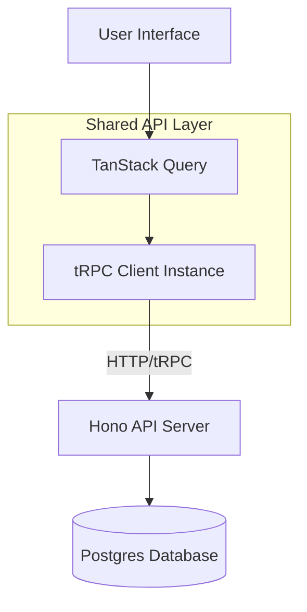
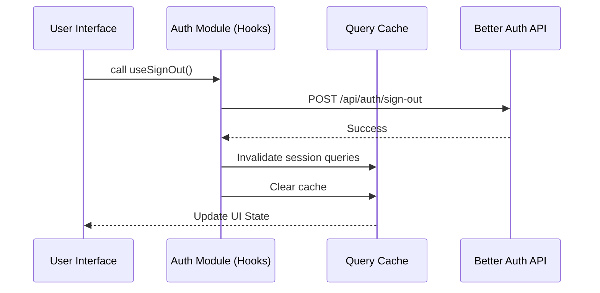

Relevant source files

The following files were used as context for generating this wiki page:

- [apps/web/src/shared/api/trpc.ts](apps/web/src/shared/api/trpc.ts)
- [apps/web/src/shared/api/query-client.ts](apps/web/src/shared/api/trpc.ts)
- [apps/docs-site/specs/T-022.md](apps/docs-site/specs/T-022.md)
- [apps/web/package.json](apps/web/package.json)
- [apps/web/CODING_RULES.md](apps/web/CODING_RULES.md)
- [apps/docs-site/specs/T-046.md](apps/docs-site/specs/T-046.md)

# Frontend API Client & State Management

The frontend architecture utilizes a centralized API client and state management system built on **tRPC** and **TanStack Query**. This structure ensures type safety across the network boundary by sharing types between the API and the web application without introducing runtime coupling. The system manages server state, authentication sessions, and workspace-scoped data fetching.

Sources: [apps/docs-site/specs/T-022.md:25-30](apps/docs-site/specs/T-022.md#L25-L30), [apps/web/CODING_RULES.md:24-28](apps/web/CODING_RULES.md#L24-L28)

## Architecture Overview

The system follows a strict layering strategy where `apps/web` communicates with `apps/api` exclusively over tRPC. The frontend is organized into three zones: `src/app/` (composition), `src/features/` (concerns/requests), and `src/shared/` (common infrastructure). State management is divided between server state (via TanStack Query) and authentication state (via Better Auth).

### Data Flow Diagram

The following diagram illustrates the request flow from the User Interface to the Backend API via the tRPC client and TanStack Query.

Sources: [apps/web/CODING_RULES.md:8-13](apps/web/CODING_RULES.md#L8-L13), [apps/docs-site/specs/T-022.md:126-130](apps/docs-site/specs/T-022.md#L126-L130)

## tRPC Client Implementation

The tRPC client is implemented as a single typed instance located in `src/shared/api/trpc.ts`. To maintain zero runtime coupling, this file imports the backend's `AppRouter` exclusively as a type. The client does not import values or code from the backend. The endpoint path is stated as a string rather than imported.

### Configuration Rules
*  **Type-Only Imports**: The client must only use `import type` for `@better-answers/api` symbols.
*  **Single File Boundary**: `src/shared/api/trpc.ts` is the only file permitted to name the API package.
*  **Feature Colocation**: Request declarations are colocated within the features that own them, while the shared layer provides the client instance.

Sources: [apps/web/CODING_RULES.md:24-28](apps/web/CODING_RULES.md#L24-L28), [apps/docs-site/specs/T-022.md:175-179](apps/docs-site/specs/T-022.md#L175-L179)

## State Management

State management leverages the `@trpc/tanstack-react-query` integration to synchronize server state with the UI.

### TanStack Query Integration
The application uses a single `QueryClient` to manage caching and synchronization. Features define their own `queryOptions` and `mutationOptions` factories. This approach removes the need for global providers for specific data slices like authentication, instead relying on the unified query cache.

| Component | Library / Package | Responsibility |
| :--- | :--- | :--- |
| Query Client | `@tanstack/react-query` | Global cache and state synchronization. |
| tRPC Client | `@trpc/client` | Type-safe transport layer. |
| Router | `@tanstack/react-router` | Navigation and route-based state. |

Sources: [apps/web/package.json:28-32](apps/web/package.json#L28-L32), [apps/docs-site/specs/T-046.md:20-25](apps/docs-site/specs/T-046.md#L20-L25)

### Authentication State
Authentication state is managed through the Better Auth client. The system uses thin hooks written as TanStack Query factories. These hooks close over a module-level `authClient` constant. Key operations, such as setting an active workspace, trigger cache invalidation for related queries like sessions and organization lists.

Sources: [apps/docs-site/specs/T-046.md:52-58](apps/docs-site/specs/T-046.md#L52-L58), [apps/docs-site/specs/T-046.md:76-80](apps/docs-site/specs/T-046.md#L76-L80)

## Error Handling and Transitions

The frontend manages API errors using TanStack Router's `defaultErrorComponent`. This ensures that if a screen fails to fetch data or throws an error, the shell's navigation and frame remain functional. API mutation functions are configured to throw errors so they can be captured by Query's status checks, which are then used by UI components to display appropriate feedback (e.g., rate limiting messages).

Sources: [apps/web/CODING_RULES.md:30-36](apps/web/CODING_RULES.md#L30-L36), [apps/docs-site/specs/T-046.md:72-75](apps/docs-site/specs/T-046.md#L72-L75)

## Summary

The frontend API client and state management strategy prioritizes type safety and modularity. By combining tRPC's type inference with TanStack Query's caching capabilities, the project achieves a reactive UI that remains decoupled from backend implementation details. The reliance on centralized query keys and automated cache invalidation ensures data consistency across workspace transitions and authentication events.
