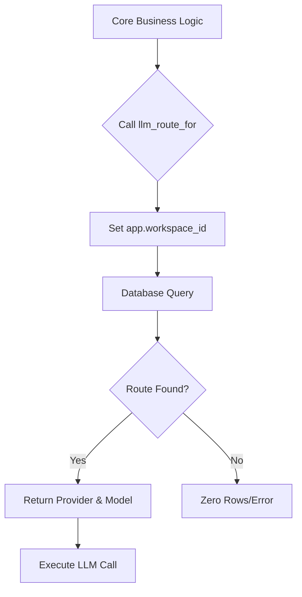
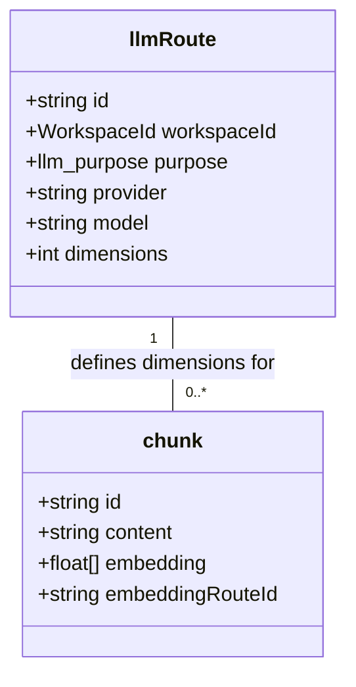

Relevant source files

The following files were used as context for generating this wiki page:

- [packages/core/test/llm-routing.contract.test.ts](packages/core/test/llm-routing.contract.test.ts)
- [packages/schema/src/boundary-schemas.ts](packages/schema/src/boundary-schemas.ts)
- [packages/schema/test/boundary-schemas.test.ts](packages/schema/test/boundary-schemas.test.ts)
- [CODING_RULES.md](CODING_RULES.md)
- [AGENTS.md](AGENTS.md)
- [contracts/llm-routing/cases.json](contracts/llm-routing/cases.json)

# LLM Integrations & Routing

LLM Integrations & Routing manages how Large Language Model (LLM) calls direct to specific providers and models based on the workspace and intended purpose. This system ensures that different tasks, such as answering questions or generating embeddings, use appropriate models while maintaining strict workspace isolation and auditability. The architecture relies on a language-neutral contract to ensure parity between the TypeScript API and the Python worker tiers.

Sources: [packages/core/test/llm-routing.contract.test.ts:11-16](packages/core/test/llm-routing.contract.test.ts#L11-L16), [AGENTS.md:21-25](AGENTS.md#L21-L25)

## LLM Routing Architecture

The routing system determines the specific model and provider for an LLM call at runtime. The database resolves these routes via the `llm_route_for` function, ensuring that each workspace has exactly one defined route per purpose. This resolution respects Row Level Security (RLS) and is validated through a shared contract between the API and Worker tiers.

### Routing Data Model

The `llmRoute` table stores the configuration for specific LLM integrations. Every route belongs to a workspace and defines a unique purpose.

| Field | Type | Description |
| :--- | :--- | :--- |
| `id` | `string` | Unique identifier for the route. |
| `workspaceId` | `WorkspaceId` | The ULID of the workspace owning the route. |
| `purpose` | `llm_purpose` | The specific task (e.g., extraction, answering). |
| `provider` | `string` | The LLM provider (e.g., Mistral, OpenAI). |
| `model` | `string` | The specific model identifier. |
| `dimensions` | `number \| null` | The vector width for embedding models. |

Sources: [packages/schema/src/boundary-schemas.ts:50-58](packages/schema/src/boundary-schemas.ts#L50-L58), [packages/core/test/llm-routing.contract.test.ts:25-32](packages/core/test/llm-routing.contract.test.ts#L25-L32)

### LLM Purposes

The system categorizes LLM calls into five distinct purposes:
- **extraction**: Pulling concepts from source documents.
- **enrichment**: Adding detail or metadata to existing knowledge.
- **answering**: Generating prose responses for user queries.
- **judging**: Evaluating the quality or relevance of knowledge.
- **embedding**: Generating vector representations for semantic search.

Sources: [packages/core/test/llm-routing.contract.test.ts:24](packages/core/test/llm-routing.contract.test.ts#L24), [packages/schema/src/boundary-schemas.ts:182-192](packages/schema/src/boundary-schemas.ts#L182-L192)

## Data Flow and Resolution

Routing resolution occurs within the database layer to maintain a single source of truth across all platform tiers.

The diagram shows how the core logic requests a route, which is then resolved by the database using the active workspace context.
Sources: [packages/core/test/llm-routing.contract.test.ts:65-75](packages/core/test/llm-routing.contract.test.ts#L65-L75)

### Contract Testing and Multi-Tier Parity

To prevent drift between the TypeScript API (`apps/api`) and the Python worker (`apps/worker`), the system uses a language-neutral fixture in `contracts/llm-routing/cases.json`. Both tiers run contract tests against this fixture to prove they resolve the same routes for the same inputs.

- **TypeScript Implementation**: Uses `vitest` and `drizzle-orm` to verify route resolution.
- **Python Implementation**: Proves the worker reads `llm_route_for` identically.

Sources: [packages/core/test/llm-routing.contract.test.ts:11-16](packages/core/test/llm-routing.contract.test.ts#L11-L16), [CODING_RULES.md:144-150](CODING_RULES.md#L144-L150)

## Security and Observability

### Principal and Audit Logging

Every LLM call is associated with a `Principal` (workspace, user, and role). The system logs every model call with the following metadata:
- Workspace ID and Purpose
- Route and Model used
- Token usage and call duration
- Priced cost and Outcome

Prompt and completion content are never entered into the general application logs or the OTLP exporter to ensure data privacy. The answer audit is stored in a dedicated table with a specific retention period.

Sources: [CODING_RULES.md:118-125](CODING_RULES.md#L118-L125), [CODING_RULES.md:140-143](CODING_RULES.md#L140-L143)

### Constraints and Invariants

The routing system enforces several strict invariants to ensure stability:
1. **Uniqueness**: A workspace cannot have two different routes for the same purpose.
2. **Narrowing Refinements**: Boundary schemas for LLM routes use Zod to validate that provider and model names are non-empty and that embedding dimensions are positive.
3. **RLS Guarantee**: Queries for routes automatically filter by the `app.workspace_id` set in the transaction, preventing cross-tenant data leaks.

Sources: [packages/core/test/llm-routing.contract.test.ts:80-90](packages/core/test/llm-routing.contract.test.ts#L80-L90), [packages/schema/src/boundary-schemas.ts:50-58](packages/schema/src/boundary-schemas.ts#L50-L58), [CODING_RULES.md:37-45](CODING_RULES.md#L37-L45)

## Embedding Management

Embedding routes are unique because they define the `EMBEDDING_DIMENSIONS`. The `chunk` table, which stores knowledge fragments, enforces that the `embedding` vector length exactly matches the dimensions defined in the route. This is validated at the boundary before data reaches the database.

The class diagram illustrates the relationship between LLM routes and knowledge chunks, where the route dictates the expected vector size.
Sources: [packages/schema/src/boundary-schemas.ts:77-80](packages/schema/src/boundary-schemas.ts#L77-L80), [packages/schema/test/boundary-schemas.test.ts:243-255](packages/schema/test/boundary-schemas.test.ts#L243-L255)

LLM Integrations & Routing provides a governed, auditable path for all AI interactions, ensuring that models are used consistently across the platform while strictly separating data between different company workspaces.
