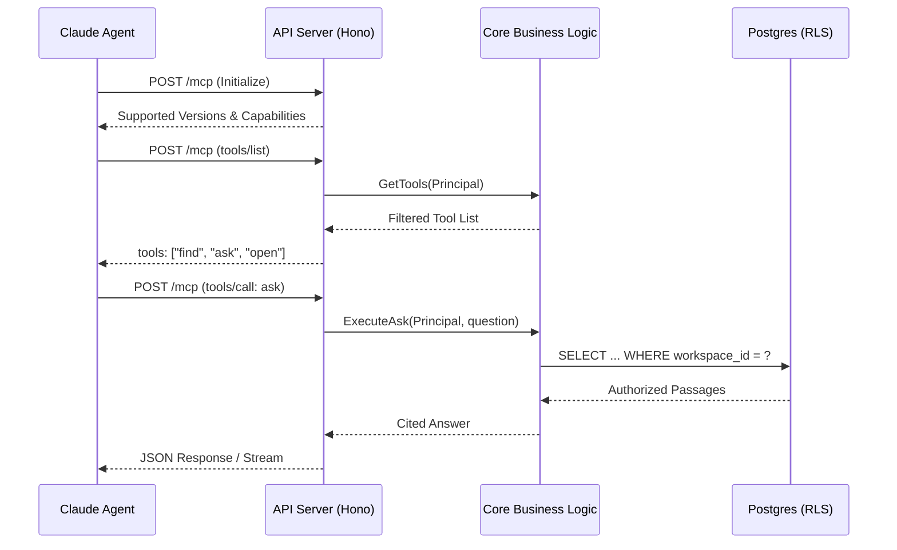
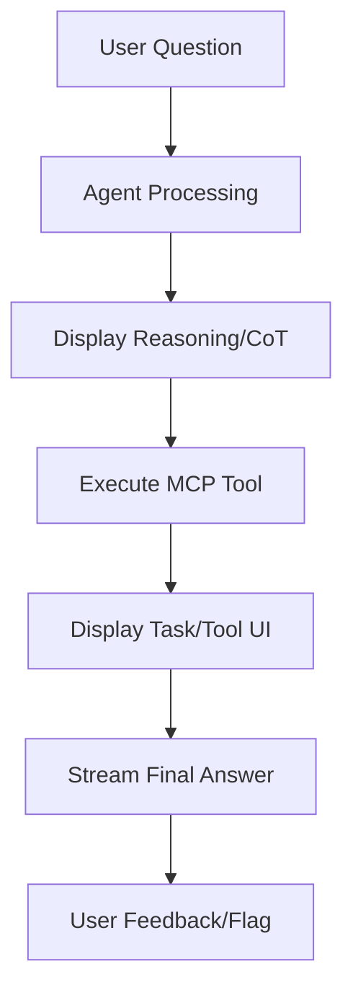

Relevant source files

The following files were used as context for generating this wiki page:

- [AGENTS.md](AGENTS.md)
- [packages/design-system/readme.md](packages/design-system/readme.md)
- [apps/api/tests/mcp-surface.test.ts](apps/api/tests/mcp-surface.test.ts)
- [CODING_RULES.md](CODING_RULES.md)
- [packages/design-system/guidelines/kits-adoption.card.html](packages/design-system/guidelines/kits-adoption.card.html)
- [apps/api/CODING_RULES.md](apps/api/CODING_RULES.md)
- [README.md](README.md)

# Claude Agentic Tooling & Workflow

The Claude Agentic Tooling & Workflow provides a structured environment for AI agents to interact with the Better Answers knowledge map and supports developers using Claude for repository maintenance. This system exposes a Model Context Protocol (MCP) surface for external agents while enforcing a "skills-based" workflow for internal development agents.

Sources: [README.md:3-5](README.md#L3-L5), [AGENTS.md:1-10](AGENTS.md#L1-L10), [packages/design-system/readme.md:25-28](packages/design-system/readme.md#L25-L28)

## Model Context Protocol (MCP) Surface

The project implements the Model Context Protocol (MCP) to provide a standardized interface for external agents. This surface allows agents to query the knowledge map, request answers, and provide feedback on results. The API tier (`apps/api`) handles these requests via the `/mcp` and `/agent/v1` endpoints.

Sources: [AGENTS.md:34-36](AGENTS.md#L34-L36), [apps/api/CODING_RULES.md:8-9](apps/api/CODING_RULES.md#L8-L9), [apps/api/tests/mcp-surface.test.ts:16-20](apps/api/tests/mcp-surface.test.ts#L16-L20)

### Protocol Eras and Compatibility
The system supports multiple protocol versions to ensure compatibility with different Claude runtimes:
*  **2025-11-25 (Legacy):** Supports bare initialization and basic tool listing without metadata envelopes.
*  **2026-07-28 (Modern):** Supports structured envelopes, cache hints, and protocol version negotiation.

Sources: [apps/api/tests/mcp-surface.test.ts:32-60](apps/api/tests/mcp-surface.test.ts#L32-L60), [apps/api/tests/mcp-surface.test.ts:250-255](apps/api/tests/mcp-surface.test.ts#L250-L255)

### MCP Toolset
The platform exposes four primary tools to authorized agents. Each tool operates under strict workspace scoping and tenant-specific Row Level Security (RLS).

| Tool Name | Action | Parameters | Description |
| :--- | :--- | :--- | :--- |
| `find` | Searches | `query` (string) | Searches for concepts or documents within the authorized workspace. |
| `ask` | Generates | `question` (string) | Returns a cited answer derived from the knowledge map. |
| `open` | Retrieves | `iri` (string) | Returns structured content for a specific Internationalized Resource Identifier. |
| `give_feedback` | Submits | `iri`, `verdict`, `reason` | Records agent or human feedback regarding a specific answer or concept. |

Sources: [apps/api/tests/mcp-surface.test.ts:105-115](apps/api/tests/mcp-surface.test.ts#L105-L115), [apps/api/tests/mcp-surface.test.ts:145-160](apps/api/tests/mcp-surface.test.ts#L145-L160), [CODING_RULES.md:16-22](CODING_RULES.md#L16-L22)

### MCP Interaction Flow
The following diagram illustrates how an external agent negotiates a session and calls a tool through the API.

The interaction starts with protocol negotiation, followed by tool discovery and execution, all bound by the `Principal` context which enforces security.
Sources: [apps/api/tests/mcp-surface.test.ts:110-140](apps/api/tests/mcp-surface.test.ts#L110-L140), [CODING_RULES.md:120-130](CODING_RULES.md#L120-L130), [AGENTS.md:34-35](AGENTS.md#L34-L35)

## Developer-Agent Workflow

For developers working within the repository, the project defines a "Skills" architecture. This workflow ensures that Claude (or other IDE-based agents) follows project-specific rules for coding, modeling, and documentation.

Sources: [AGENTS.md:3-10](AGENTS.md#L3-L10), [packages/design-system/SKILL.md:1-5](packages/design-system/SKILL.md#L1-L5)

### Skill Loading and Application
Before performing tasks, you must load the relevant skill using the `@tanstack/intent` package. Skills provide guided instructions located in `SKILL.md` or `.claude/agents/` files.

1.  List available local skills: `pnpm dlx @tanstack/intent@latest list`.
2.  Load the specific skill for the task: `pnpm dlx @tanstack/intent@latest load <package>#<skill>`.
3.  Follow the guidance in the loaded `SKILL.md` during implementation.

Sources: [AGENTS.md:3-9](AGENTS.md#L3-L9)

### Task Management (Ordna)
The project uses **ordna** for internal task tracking rather than GitHub Issues. Tasks live as git blobs at `refs/ordna/tasks/<id>`. Agents interact with these tasks using the `ordna` CLI.

*  **Triage Labels:** Tasks use specific tags: `needs-triage`, `needs-info`, `ready-for-agent`, `ready-for-human`, and `wontfix`.
*  **Wayfinding:** Maps and tickets reside as markdown files under `.scratch/<effort>/`.

Sources: [AGENTS.md:52-60](AGENTS.md#L52-L60)

### Code Exploration Policy
Agents must prioritize **jCodeMunch-MCP** for repository navigation.
*  **Standard Action:** Use `resolve_repo` and `index_folder` to ensure the project is indexed.
*  **Search:** Use `route` or `menu` to find code structures.
*  **Reading:** Only use the `Read` tool immediately before an `Edit` or `Write` operation.

Sources: [AGENTS.md:66-88](AGENTS.md#L66-L88)

## Agent Interface & UI Components

The project employs specialized UI components to visualize agent activity and reasoning. These are primarily sourced from the **AI Elements** kit and skinned to match the project's blueprint aesthetic.

Sources: [packages/design-system/guidelines/kits-adoption.card.html:125-135](packages/design-system/guidelines/kits-adoption.card.html#L125-L135), [packages/design-system/readme.md:130-145](packages/design-system/readme.md#L130-L145)

### AI Visualization Components
The system uses the following components to handle agentic data:
*  **Conversation & Message:** Handles stream-safe rendering and scroll anchoring for agent responses.
*  **Reasoning & Chain of Thought:** Displays the "What it could not answer" logic and internal agent processing steps.
*  **Task & Tool:** Visualizes agent activity over the MCP surface.
*  **Plan & Queue:** Manages and displays multi-step agent work.

Sources: [packages/design-system/guidelines/kits-adoption.card.html:130-143](packages/design-system/guidelines/kits-adoption.card.html#L130-L143), [packages/design-system/ui_kits/platform/README.md:10-15](packages/design-system/ui_kits/platform/README.md#L10-L15)

### Agent Workflow Visualization
This flowchart demonstrates how agent reasoning and tool usage are displayed to the user.

The UI provides transparency into the agent's "Chain of Thought" and specific tool invocations before delivering the final answer.
Sources: [packages/design-system/guidelines/kits-adoption.card.html:125-145](packages/design-system/guidelines/kits-adoption.card.html#L125-L145), [packages/design-system/ui_kits/platform/README.md:25-30](packages/design-system/ui_kits/platform/README.md#L25-L30)

## Security and Access Control

Agents are subject to the same security constraints as human users. Every call requires a `Principal` containing a `workspaceId`, `userId`, and `role`.

Sources: [CODING_RULES.md:120-125](CODING_RULES.md#L120-L125), [apps/api/tests/mcp-surface.test.ts:165-170](apps/api/tests/mcp-surface.test.ts#L165-L170)

### Token and Ceiling Management
*  **Agent Tokens:** Tokens are scoped to specific bindings and carries the `offline_access` scope if required.
*  **Rate Limiting:** Every call is counted against the token. If the limit (e.g., 120 calls) is reached, the system returns a `429 Too Many Requests` status.
*  **Revocation:** If a person's credentials are revoked, any associated agent tokens are invalidated on the next call.

Sources: [apps/api/tests/mcp-surface.test.ts:165-180](apps/api/tests/mcp-surface.test.ts#L165-L180), [apps/api/tests/mcp-surface.test.ts:205-215](apps/api/tests/mcp-surface.test.ts#L205-L215), [CODING_RULES.md:110-115](CODING_RULES.md#L110-L115)

### Authorization Checks
The system performs two levels of authorization:
1.  **Transport Level:** The API tier verifies the bearer token and constructs the `Principal`.
2.  **Data Level:** The Postgres Row Level Security (RLS) ensures the agent only sees rows where the `workspace_id` matches the `Principal`.

Sources: [CODING_RULES.md:15-20](CODING_RULES.md#L15-L20), [CODING_RULES.md:120-124](CODING_RULES.md#L120-L124), [apps/api/tests/mcp-surface.test.ts:80-90](apps/api/tests/mcp-surface.test.ts#L80-L90)

## Summary

Claude Agentic Tooling & Workflow integrates external AI capabilities through a standardized MCP surface while enforcing a strict development workflow for internal agents. By combining specialized AI UI components with robust security protocols like RLS and Principal-based authorization, the system ensures that agent activity remains transparent, cited, and secure within the UK SMB knowledge map domain.

Sources: [README.md:3-5](README.md#L3-L5), [AGENTS.md:1-5](AGENTS.md#L1-L5), [CODING_RULES.md:120-125](CODING_RULES.md#L120-L125)
