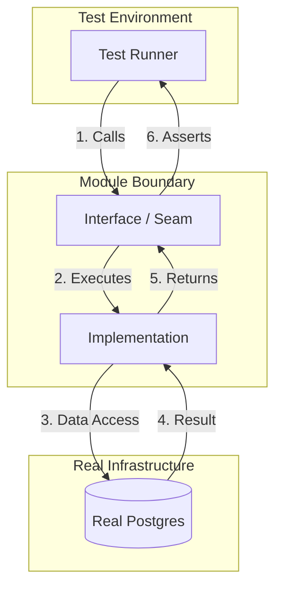
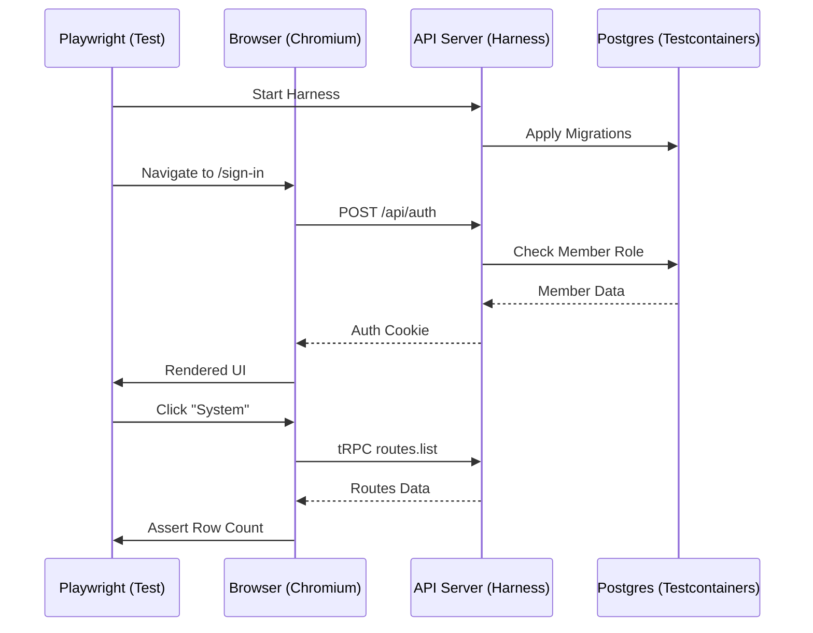

Relevant source files

The following files were used as context for generating this wiki page:

- [CODING_RULES.md](CODING_RULES.md)
- [apps/api/CODING_RULES.md](apps/api/CODING_RULES.md)
- [apps/docs-site/specs/T-064.md](apps/docs-site/specs/T-064.md)
- [apps/docs-site/specs/T-022.md](apps/docs-site/specs/T-022.md)
- [apps/api/tests/deploy-tree.test.ts](apps/api/tests/deploy-tree.test.ts)
- [apps/docs-site/specs/T-004.md](apps/docs-site/specs/T-004.md)

# Functional Testing & Real Postgres Requirements

Functional testing ensures that system modules operate correctly through their defined interfaces rather than their internal implementation details. The project mandates that every test touching data must run against a real Postgres instance, using either Testcontainers or a shared compose database. This requirement eliminates risks associated with mocking database behavior and ensures that Row Level Security (RLS) and complex queries are validated in an environment that matches production.

Sources: [CODING_RULES.md:31-33](CODING_RULES.md#L31-L33), [apps/api/CODING_RULES.md:20-22](apps/api/CODING_RULES.md#L20-L22)

## Testing Philosophy and Interface Surfaces

Tests must exercise a module through its public interface to ensure stability and allow for internal refactoring without breaking the test suite. The project identifies specific "test surfaces" for different workspaces:

*  **API (`apps/api`):** The primary interface is the endpoint reached via `app.request()`.
*  **Worker (`apps/worker`):** The interface is the job or module entry point.
*  **Web (`apps/web`):** The interface is a served build driven by a browser (e.g., Playwright) or a rendered component through Testing Library.
*  **Core (`packages/core`):** Entry points named in the package's `exports` map serve as the interface.

Sources: [CODING_RULES.md:22-30](CODING_RULES.md#L22-L30), [apps/api/CODING_RULES.md:22-24](apps/api/CODING_RULES.md#L22-L24), [apps/docs-site/specs/T-064.md:522-525](apps/docs-site/specs/T-064.md#L522-L525)

### The Seam Model
A "seam" represents the boundary a caller crosses. Testing past this seam indicates that a module is improperly shaped and requires redesign.

This diagram illustrates the flow of a functional test crossing the module seam to interact with real infrastructure.
Sources: [CODING_RULES.md:10-18](CODING_RULES.md#L10-L18), [apps/docs-site/specs/T-064.md:520-525](apps/docs-site/specs/T-064.md#L520-L525)

## Real Postgres Requirements

The database is never mocked. Using a real Postgres instance ensures that database-level logic, such as Row Level Security (RLS) and migrations, is functionally verified.

### Key Database Testing Rules
*  **RLS Coverage:** Every tenant table must ship with a "zero-rows" test to prove that RLS correctly returns no rows when accessed by a non-owner role with no policy.
*  **Setup via Factories:** Test state is built using factories that return domain objects instead of raw SQL inserts.
*  **Tenant Isolation:** Tests must verify that a role naming another tenant or reaching a partition directly is refused.

Sources: [CODING_RULES.md:32-33](CODING_RULES.md#L32-L33), [CODING_RULES.md:41-42](CODING_RULES.md#L41-L42), [CODING_RULES.md:112-118](CODING_RULES.md#L112-L118), [apps/api/CODING_RULES.md:20-22](apps/api/CODING_RULES.md#L20-L22)

### Functional Testing Requirements Table

| Workspace | Test Surface (Seam) | Infrastructure Requirement |
| :--- | :--- | :--- |
| `apps/api` | HTTP Request (`app.request`) | Testcontainers or Compose Postgres |
| `apps/worker` | Job entry point / Module | Real Postgres (no monkeypatching) |
| `apps/web` | Served build in browser | Playwright + API Harness + Postgres |
| `packages/core` | Exports map entry points | Real Postgres + Real Store Doors |

Sources: [CODING_RULES.md:22-33](CODING_RULES.md#L22-L33), [apps/docs-site/specs/T-064.md:520-535](apps/docs-site/specs/T-064.md#L520-L535)

## Forbidden Mocking Practices

The project maintains a strict "no-mocking" policy for internal code to prevent fragile tests that hide integration errors.

*  **Internal Code:** Module mocking (e.g., `vi.mock`, `jest.mock`, or Python `monkeypatch` of project modules) is banned and enforced via linting.
*  **External Services:** Services like LLMs or SaaS APIs are replaced with in-memory implementations behind an adapter rather than being mocked at the library level.
*  **Monkeypatching:** In Python, a `conftest` guard refuses `monkeypatch` calls targeting modules within the worker package.

Sources: [CODING_RULES.md:35-40](CODING_RULES.md#L35-L40), [apps/docs-site/specs/T-064.md:630-635](apps/docs-site/specs/T-064.md#L630-L635)

## Browser-Based Functional Testing

For the web workspace, functional testing involves driving the served application through a browser. This ensures the entire stack, from UI to database, is operational.

### Browser Testing Flow
1.  Start the API server harness over a Testcontainers Postgres.
2.  Serve the built SPA (Single Page Application).
3.  Drive a browser (Chromium) to interact with the UI.
4.  Assert outcomes based on accessible roles and names rather than test IDs.

Sources: [apps/docs-site/specs/T-022.md:235-245](apps/docs-site/specs/T-022.md#L235-L245), [apps/docs-site/specs/T-064.md:435-445](apps/docs-site/specs/T-064.md#L435-L445)

This diagram shows the end-to-end flow of a browser-based functional test.
Sources: [apps/docs-site/specs/T-022.md:235-245](apps/docs-site/specs/T-022.md#L235-L245), [apps/docs-site/specs/T-004.md:382-390](apps/docs-site/specs/T-004.md#L382-L390)

## Testing Constraints and Gates

Testing is integrated into the `check` command, which serves as a gate for all code changes. A suite that fails to find any tests must result in a failure to prevent silent rot.

*  **Failure on Emptiness:** A test script never passes if it finds no tests.
*  **CI Constraints:** Focused tests (e.g., `test.only`) are forbidden in CI environments.
*  **Both-Ways Assertion:** For pairs like registries or migration journals, tests must assert membership in both directions to find missing or orphaned entries.

Sources: [CODING_RULES.md:45-47](CODING_RULES.md#L45-L47), [CODING_RULES.md:65-71](CODING_RULES.md#L65-L71), [apps/docs-site/specs/T-064.md:150-160](apps/docs-site/specs/T-064.md#L150-L160)

## Summary

Functional testing with real Postgres ensures that the Better Answers platform remains stable and secure. By prioritizing testing at the interface and banning internal mocks, the project guarantees that core features like Row Level Security and tenant isolation are always verified against a production-representative database environment. Every gate in the development process, from pre-commit hooks to CI, enforces these requirements to maintain codebase integrity.

Sources: [CODING_RULES.md:20-40](CODING_RULES.md#L20-L40), [apps/api/CODING_RULES.md:20-25](apps/api/CODING_RULES.md#L20-L25), [apps/docs-site/specs/T-064.md:36-40](apps/docs-site/specs/T-064.md#L36-L40)
