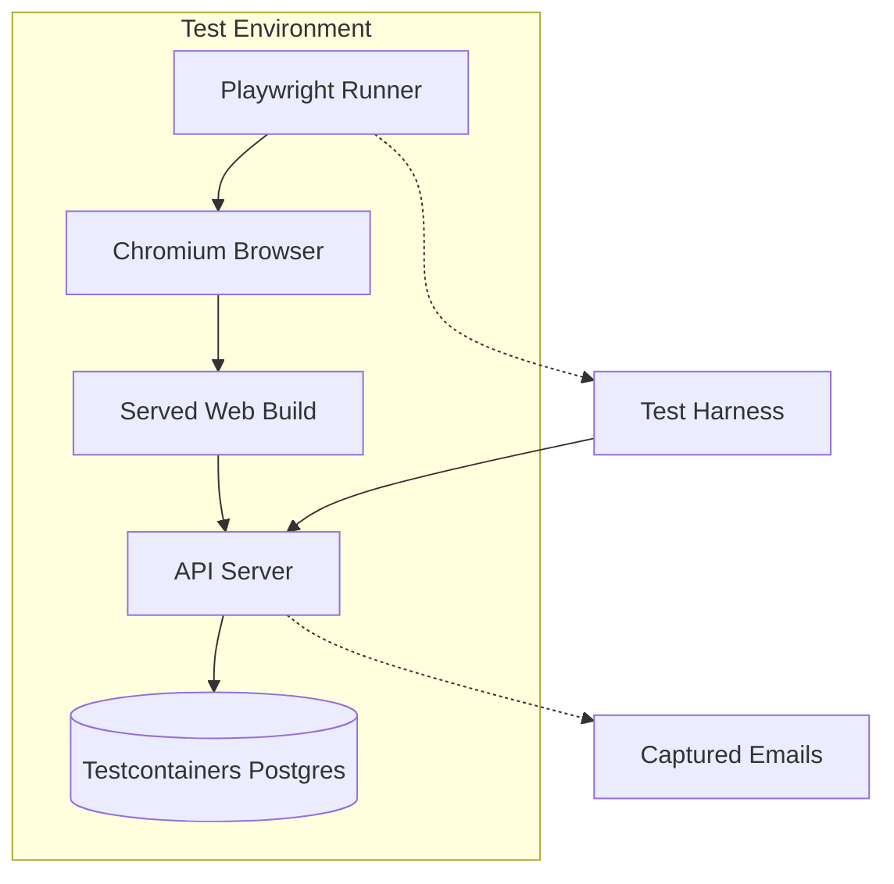
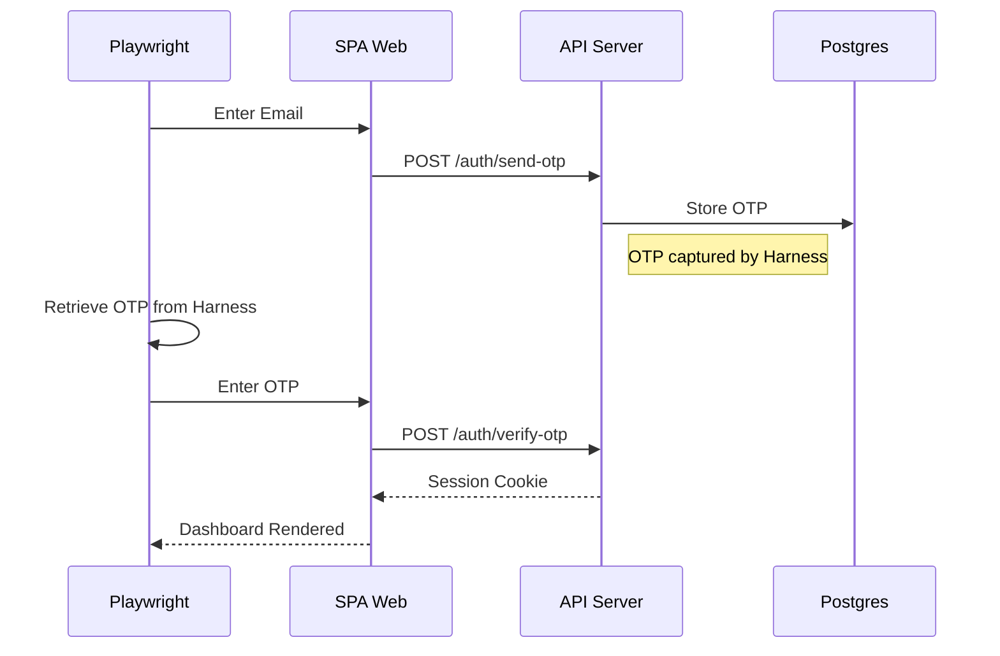

<details>
<summary>Relevant source files</summary>

The following files were used as context for generating this wiki page:

- [AGENTS.md](AGENTS.md)
- [CODING_RULES.md](CODING_RULES.md)
- [apps/docs-site/specs/T-064.md](apps/docs-site/specs/T-064.md)
- [apps/docs-site/specs/T-022.md](apps/docs-site/specs/T-022.md)
- [apps/docs-site/specs/T-006.md](apps/docs-site/specs/T-006.md)
- [apps/web/package.json](apps/web/package.json)

</details>

# Playwright E2E Browser Suite

The Playwright E2E Browser Suite serves as the primary functional testing interface for the `apps/web` workspace. It validates the complete system stack by driving a served build of the Single Page App (SPA) through a real browser against the actual API server and a Testcontainers Postgres database. This suite ensures that user-facing features, such as sign-in flows and workspace management, operate correctly across all architectural layers.

Sources: [CODING_RULES.md:19-22](CODING_RULES.md#L19-L22), [apps/docs-site/specs/T-022.md:214-220](apps/docs-site/specs/T-022.md#L214-L220)

## Architecture and Test Seams

The suite operates at the highest "seam" of the project, exercising the module through the browser interface. The environment consists of the built SPA served on a loopback port, which the Playwright test runner interacts with directly.



The diagram shows the end-to-end flow where Playwright drives a browser to interact with the SPA, which communicates with the API and database.

Sources: [CODING_RULES.md:20-22](CODING_RULES.md#L20-L22), [apps/docs-site/specs/T-022.md:214-220](apps/docs-site/specs/T-022.md#L214-L220)

### Core Components

*  **Test Harness:** Provisions workspaces, creates users, and seeds routes for isolation between tests.
*  **Fixture-Based Addresses:** Each test receives a unique client address to prevent coupling caused by per-IP rate counters.
*  **Captured Emails:** The harness captures sign-in codes during the authentication flow, allowing the test to retrieve them and proceed without a live email provider.
*  **Accessibility Gate:** The suite integrates `axe-core/playwright` to enforce WCAG 2.2 AA compliance during functional runs.

Sources: [apps/docs-site/specs/T-064.md:126-130](apps/docs-site/specs/T-064.md#L126-L130), [apps/docs-site/specs/T-022.md:255-259](apps/docs-site/specs/T-022.md#L255-L259), [apps/web/package.json:34](apps/web/package.json#L34)

## Execution and Gating Rules

The suite is a mandatory gate in the project's Continuous Integration (CI) pipeline. Specific rules prevent silent failures or partial test runs.

### Integrity Rules

| Rule | Description | Source |
| :--- | :--- | :--- |
| **Forbid Focused Tests** | The `forbidOnly` configuration fails the suite in CI if a test is left focused (`.only`). | [CODING_RULES.md:58-60](CODING_RULES.md#L58-L60) |
| **Strict Success** | A test script fails if it matches no test files; it never passes for finding nothing. | [CODING_RULES.md:58-60](CODING_RULES.md#L58-L60) |
| **Real Infrastructure** | Tests must use a real Postgres instance; mocking internal modules is strictly banned. | [CODING_RULES.md:27-33](CODING_RULES.md#L27-L33) |
| **Accessibility Check** | Every interactive element must be tested with a keyboard and screen reader via Axe. | [CODING_RULES.md:191-196](CODING_RULES.md#L191-L196) |

### Command Reference

To run the full suite from the `apps/web` directory:

```bash
pnpm run e2e
```

This command triggers a production build before starting the Playwright tests.

Sources: [apps/web/package.json:13](apps/web/package.json#L13), [apps/docs-site/specs/T-064.md:131-133](apps/docs-site/specs/T-064.md#L131-L133)

## Authentication and Isolation

Authentication tests use the platform's standard email-code flow. The harness provides an API to sign in with captured codes and manage workspace membership during the test execution.



The sequence illustrates how Playwright uses the test harness to bypass external email delivery by capturing OTPs directly from the test environment.

Sources: [apps/docs-site/specs/T-022.md:214-220](apps/docs-site/specs/T-022.md#L214-L220), [apps/docs-site/specs/T-064.md:126-130](apps/docs-site/specs/T-064.md#L126-L130)

## Project Skills for Agents

Agents working on the browser suite must load the specific project skill located at `.claude/skills/browser-suite/`. This skill defines conventions for:
*  Using roles and accessible names (locators) instead of Test IDs.
*  Implementing auto-retrying matchers rather than timed waits.
*  API-first setup where the browser is reserved only for the specific behavior under test.
*  Parallel isolation for performance.

Sources: [AGENTS.md:58-61](AGENTS.md#L58-L61), [apps/docs-site/specs/T-064.md:126-130](apps/docs-site/specs/T-064.md#L126-L130)

The Playwright E2E Browser Suite ensures that all business logic in `packages/core` and transport logic in `apps/api` correctly surface through the `apps/web` interface. By enforcing real infrastructure usage and accessibility standards, it provides a final verification step for the project's "better answers" guarantee.
