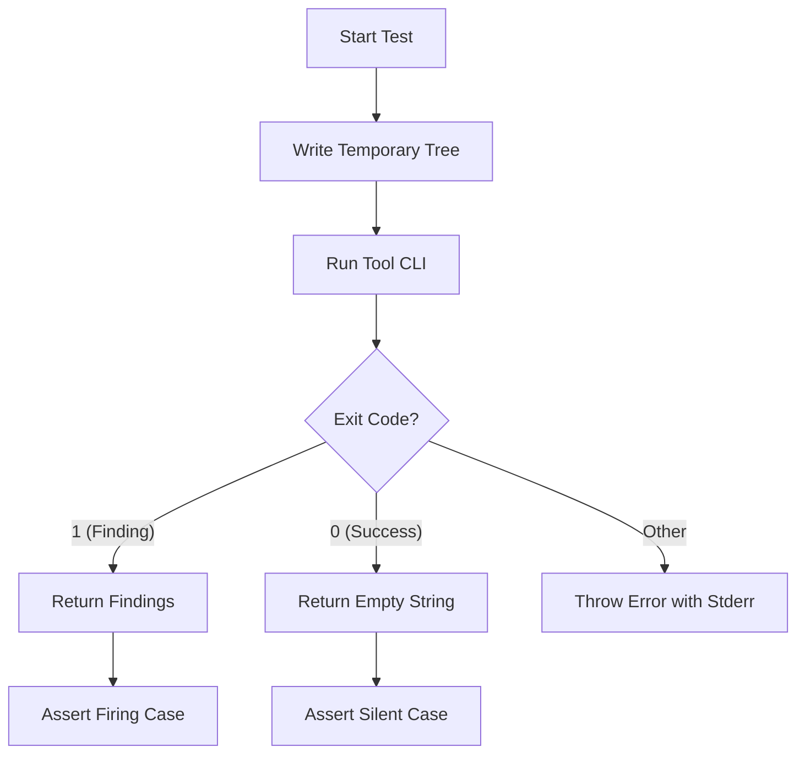

Relevant source files

The following files were used as context for generating this wiki page:

- [CODING_RULES.md](CODING_RULES.md)
- [apps/docs-site/specs/T-064.md](apps/docs-site/specs/T-064.md)
- [packages/devtools/README.md](packages/devtools/README.md)
- [packages/devtools/lifts/anti-slop/THIRD_PARTY_NOTICES.md](packages/devtools/lifts/anti-slop/THIRD_PARTY_NOTICES.md)
- [packages/devtools/test/throwaway-tree.test.ts](packages/devtools/test/throwaway-tree.test.ts)
- [apps/api/tests/coding-rules-tags.test.ts](apps/api/tests/coding-rules-tags.test.ts)
- [cubic.yaml](cubic.yaml)

# Linting, Oxlint, and Anti-Slop Rules

Linting in the Better Answers project functions as a mandatory gate within the `check` script rather than a mere reporting tool. The project uses Oxlint as its primary linter for TypeScript and JavaScript, supplemented by custom plugins and the lifted `anti-slop` rule set. These tools enforce the [Coding Rules](#coding-rules) (the constitution) and ensure architectural boundaries are maintained.

The linting architecture relies on `@better-answers/devtools` to provide a "throwaway-tree" runner. This runner ensures that linting rules are functionally tested by asserting where they fire and where they stay silent. This prevents the "silent pass" failure mode where a tool fails to run but the suite reports success.

Sources: [CODING_RULES.md:89-106](CODING_RULES.md#L89-L106), [apps/docs-site/specs/T-064.md:12-25](apps/docs-site/specs/T-064.md#L12-L25), [packages/devtools/README.md:1-15](packages/devtools/README.md#L1-L15)

## Core Tooling and Architecture

The linting system is composed of several integrated tools that run during the `check` phase and as pre-commit hooks via `lefthook`.

### Components of the Linting Gate

| Tool | Scope | Purpose |
| :--- | :--- | :--- |
| **Oxlint** | TypeScript / JS | Primary linter; replaces many ESLint rules for performance. |
| **Anti-Slop** | TypeScript / JS | Lifted plugin for rejecting low-evidence code patterns. |
| **Better-Answers Plugin** | Project-wide | Custom rules enforcing `CODING_RULES.md` and ADRs. |
| **Knip** | Workspace-wide | Detects unused files, exports, and dependencies. |
| **jscpd** | Source & Tests | Detects and refuses code clones (copy-paste). |
| **Ruff** | Python | Linter and formatter for the worker tier. |

Sources: [apps/docs-site/specs/T-064.md:27-45](apps/docs-site/specs/T-064.md#L27-L45), [packages/devtools/README.md:36-42](packages/devtools/README.md#L36-L42), [CODING_RULES.md:173-177](CODING_RULES.md#L173-L177)

### Throwaway-Tree Runner
The `throwaway-tree.ts` runner in `packages/devtools` is the foundation of lint rule testing. It writes a temporary file structure, runs a tool CLI, and asserts the output.

The runner ensures that if a tool (like Oxlint) fails to parse a config, it throws an error instead of passing silently.
Sources: [packages/devtools/README.md:9-25](packages/devtools/README.md#L9-L25), [packages/devtools/test/throwaway-tree.test.ts:16-25](packages/devtools/test/throwaway-tree.test.ts#L16-L25)

## Anti-Slop Plugin
The `anti-slop` plugin is a third-party snapshot (lift) of opinionated rules that reject "low-evidence" patterns. It is located at `packages/devtools/lifts/anti-slop/`.

### Snapshot Details
- **Upstream:** `dmmulroy/anti-slop`
- **Rules included:** 15 rules from upstream `src/` (excluding `effect/` rules).
- **Modification Policy:** No source edits are allowed; severity is controlled via `.oxlintrc.json`.
- **Licence:** MIT.

Sources: [packages/devtools/lifts/anti-slop/THIRD_PARTY_NOTICES.md:1-25](packages/devtools/lifts/anti-slop/THIRD_PARTY_NOTICES.md#L1-L25)

### Verification
Every TypeScript workspace runs `oxlint --config ../../.oxlintrc.json .` which loads this plugin. Functional tests verify the plugin's loading by resolving `jsPlugins` specifiers and running against a throwaway tree.
Sources: [packages/devtools/lifts/anti-slop/THIRD_PARTY_NOTICES.md:43-52](packages/devtools/lifts/anti-slop/THIRD_PARTY_NOTICES.md#L43-L52)

## Project-Specific Lint Rules
Custom rules in `packages/devtools/lint-rules/` enforce internal architecture and coding standards. These rules cite specific rule tags from `CODING_RULES.md`.

### Key Enforcements
- **Shadowing:** Refuses two tests with identical titles to prevent one test from shadowing another.
- **Error Handling:** Refuses empty `catch` blocks; swallowed errors must carry a comment explaining why.
- **Async Safety:** Refuses floating promises unless explicitly marked with `void`.
- **Layering:** Enforces the `app -> features -> shared` directionality in `apps/web`.
- **Identity Seam:** Bans `better-auth` imports outside the designated auth module.

Sources: [apps/docs-site/specs/T-064.md:139-148](apps/docs-site/specs/T-064.md#L139-L148), [cubic.yaml:89-105](cubic.yaml#L89-L105), [CODING_RULES.md:168-172](CODING_RULES.md#L168-L172)

## Configuration and CI Integration

### .oxlintrc.json
This file is the central configuration for Oxlint. It loads `jsPlugins` from the local `packages/devtools` workspace.
Sources: [packages/devtools/README.md:36-40](packages/devtools/README.md#L36-L40)

### Lefthook (Pre-commit)
`lefthook` executes linting commands on staged files before a commit lands.
- **TypeScript:** Runs `oxlint` on staged `.ts` and `.tsx` files.
- **Python:** Runs `ruff` via `uv` in the worker tier.
- **Formatting:** Formats staged files and re-stages them automatically.

Sources: [apps/docs-site/specs/T-064.md:161-172](apps/docs-site/specs/T-064.md#L161-L172)

### Automated AI Review (Cubic)
The project uses `cubic.yaml` to configure AI-based linting and review. Cubic is instructed to enforce the "constitution" (`CODING_RULES.md`) and report findings that rest on rule tags.
Sources: [cubic.yaml:23-55](cubic.yaml#L23-L55)

## Rule Tagging System
The project uses a tagging system (e.g., `[SEC2]`, `[TEST3]`) to link code and tests to the global coding rules. The test `apps/api/tests/coding-rules-tags.test.ts` enforces `[COMMENT2]`, ensuring tags appear only in permitted locations.

| Allowed Locations for Tags | Forbidden Locations for Tags |
| :--- | :--- |
| `CODING_RULES.md` / ADRs / Specs | Application Source Code (`src/`) |
| `cubic.yaml` / `.oxlintrc.json` | Dockerfiles / CI Workflows |
| Test files (`.test.ts`) | Deployment configuration |
| Documentation (`docs/`, READMEs) | Workspace configuration (`package.json`) |

Sources: [apps/api/tests/coding-rules-tags.test.ts:16-55](apps/api/tests/coding-rules-tags.test.ts#L16-L55)

## Summary of Linting Procedures
Linting ensures code quality and architectural integrity through automated gates. By utilizing Oxlint with custom plugins and a hardened test runner, the project guarantees that every rule is active and verified. The inclusion of `anti-slop` provides a baseline of strict patterns, while custom rules protect project-specific seams and invariants.
