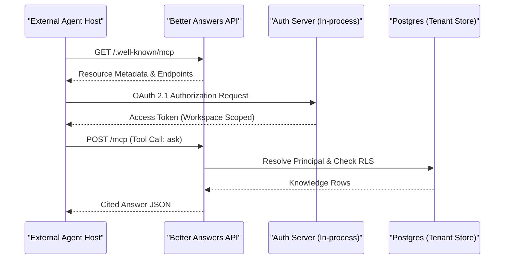
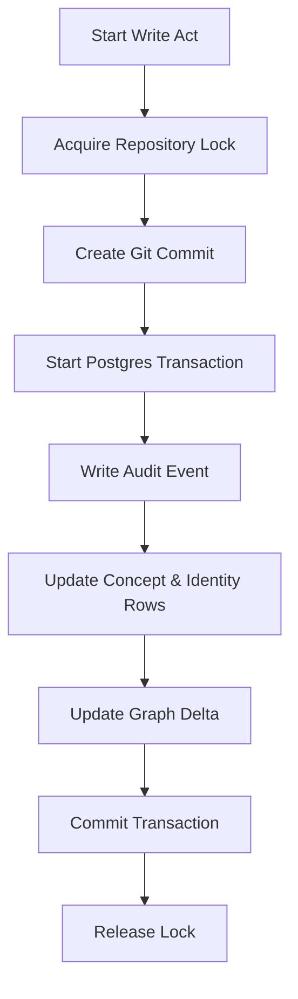

Relevant source files

The following files were used as context for generating this wiki page:

- [AGENTS.md](AGENTS.md)
- [apps/docs-site/specs/T-004.md](apps/docs-site/specs/T-004.md)
- [apps/docs-site/specs/T-006.md](apps/docs-site/specs/T-006.md)
- [apps/docs-site/specs/T-045.md](apps/docs-site/specs/T-045.md)
- [CODING_RULES.md](CODING_RULES.md)
- [packages/design-system/readme.md](packages/design-system/readme.md)

# AI Agent Integrations

AI Agent Integrations provide the mechanisms for external agents and internal automated processes to interact with the Better Answers knowledge map. External agents connect via the Model Context Protocol (MCP) surface, while internal agents and the reconciler manage knowledge maintenance, derivation, and audit tasks. The system uses a strictly governed write path and a unified identity model to ensure every agent act is cited, permission-aware, and explainable.

Sources: [README.md](README.md), [AGENTS.md:7-13](AGENTS.md#L7-L13), [apps/docs-site/specs/T-004.md:16-22](apps/docs-site/specs/T-004.md#L16-L22)

## Model Context Protocol (MCP) Surface

The MCP surface allows external hosts, such as Claude, to interact with workspace knowledge through a set of standardized tools. Better Answers operates as its own OAuth 2.1 authorization server to manage these connections.

### Connection and Discovery
External hosts discover the authorization server through a hand-written protected-resource document. Hosts identify themselves using public metadata documents rather than static registration. The MCP surface answers on the application origin at `app.<domain>/mcp`.

Sources: [apps/docs-site/specs/T-004.md:16-22](apps/docs-site/specs/T-004.md#L16-L22), [apps/docs-site/specs/T-045.md:15-20](apps/docs-site/specs/T-045.md#L15-L20)

### Surface Capabilities
The surface exposes four primary host-agnostic entries. These entries do not take workspace arguments because the scope is determined by the agent's token.

| Entry | Type | Description |
| :--- | :--- | :--- |
| `find` | Tool | Searches the knowledge map for concepts. |
| `ask` | Tool | Requests a cited answer from the knowledge map. |
| `open` | Tool | Returns structured frontmatter, body, and trust state for a specific IRI or locator. |
| `give_feedback` | Tool | Submits feedback on answers; requires `feedback:write` scope. |

Sources: [apps/docs-site/specs/T-004.md:83-92](apps/docs-site/specs/T-004.md#L83-L92), [apps/docs-site/specs/T-006.md:27-31](apps/docs-site/specs/T-006.md#L27-L31)

### MCP Interaction Flow
The following diagram illustrates how an external agent host connects and interacts with the Better Answers surface.

Sources: [apps/docs-site/specs/T-004.md:16-22](apps/docs-site/specs/T-004.md#L16-L22), [apps/docs-site/specs/T-004.md:83-92](apps/docs-site/specs/T-004.md#L83-L92)

## Internal Agents and Reconciler

Internal agents perform automated maintenance tasks, including graph derivation and audit cross-checks. These agents act under a **Platform Principal** with their own actor IDs.

### The Reconciler
The reconciler recovers the "crash window" between a git commit and a database write. If the repository head is ahead of the last `bundle_commit` in the database, the reconciler replays missed commits in order. It uses trailer IDs (Audit, Suggestion, Run) from git commits to ensure idempotency during replay.

Sources: [apps/docs-site/specs/T-006.md:17-21](apps/docs-site/specs/T-006.md#L17-L21), [apps/docs-site/specs/T-006.md:66-72](apps/docs-site/specs/T-006.md#L66-L72)

### Work Loop Jobs
Internal worker agents run on a continuous loop to process the following job kinds:
*  **Nightly Parser Audit**: A Python-based auditor cross-checks the application tier's parse results by comparing hashes.
*  **Full Rebuild**: Synchronously regenerates the graph generation to ensure the derived graph matches the source of truth in git.
*  **Reconcile Watermark**: An on-demand reconciler run triggered during restoration or recovery.

Sources: [apps/docs-site/specs/T-006.md:103-112](apps/docs-site/specs/T-006.md#L103-L112)

## Identity and Access Control

All agent acts are governed by the `Principal` model, which establishes row-level security (RLS) and audit requirements.

### Agent Principal Types
Agents fall into specific categories within the `Principal` and `ActorId` models:
*  **Agent Actor**: An external agent identified by its own ID as shaped by ADR 0019.
*  **Platform Principal**: The platform acting as itself for automated background tasks.
*  **Deferred Principal**: Authority carried from a named person into work that outlives their session (e.g., a background job).

Sources: [CODING_RULES.md:144-152](CODING_RULES.md#L144-L152), [CODING_RULES.md:183-188](CODING_RULES.md#L183-L188)

### Security Constraints
*  **Principal-first**: Every internal function reading or writing tenant data must take a `Principal` as its first parameter.
*  **Read Predicates**: Agents are subject to visibility checks (published, sensitivity, audience) tested against columns on the readable unit, not source bindings.
*  **Token Isolation**: Access tokens are bound to a specific workspace and person; they are never valid across multiple tenants.

Sources: [CODING_RULES.md:139-143](CODING_RULES.md#L139-L143), [apps/docs-site/specs/T-004.md:20-22](apps/docs-site/specs/T-004.md#L20-L22)

## Governed Write Path

When an agent (or human) modifies the knowledge map, the system follows a strictly ordered write path to ensure consistency between git and the database.

Sources: [apps/docs-site/specs/T-006.md:58-65](apps/docs-site/specs/T-006.md#L58-L65)

### Commit Metadata
The governed write path ensures that git commits for agent acts include specific trailers used for auditing and reconciliation.
*  **Actor**: Identifies the agent or person initiating the change.
*  **Audit**: Carries the `audit_event` ID minted before the commit.
*  **Suggestion/Run**: Identifies the automated process or suggestion accepted.

Sources: [apps/docs-site/specs/T-006.md:58-65](apps/docs-site/specs/T-006.md#L58-L65)

## Conclusion
AI Agent Integrations in Better Answers bridge external tools and internal automation through a unified, secure architecture. By enforcing the Model Context Protocol for external hosts and a strictly reconciled governed write path for internal agents, the platform ensures that all automated knowledge changes remain explainable, cited, and isolated within tenant boundaries.
