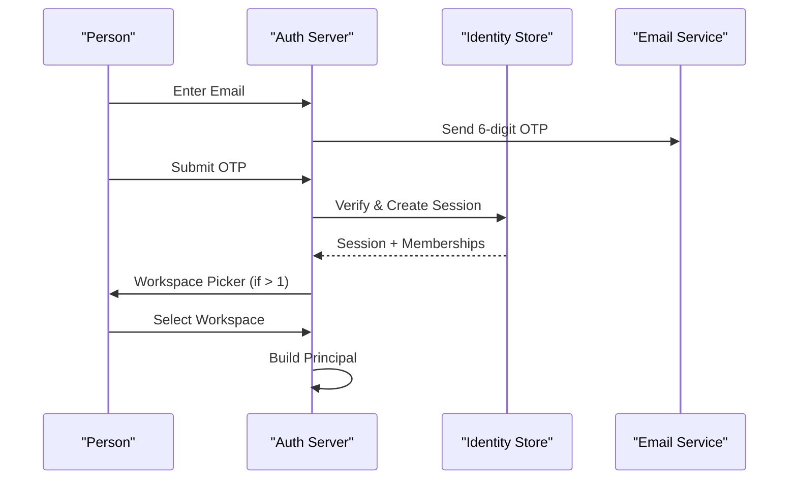
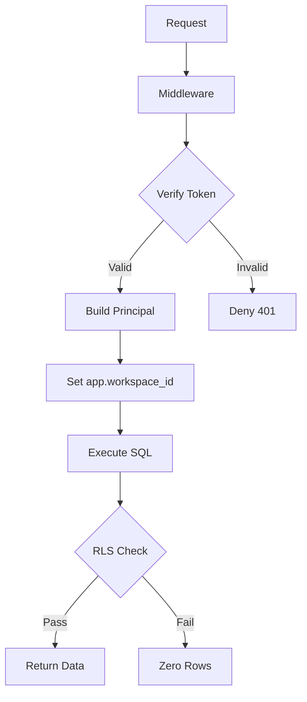

<details>
<summary>Relevant source files</summary>

The following files were used as context for generating this wiki page:

- [apps/api/src/auth/auth.ts](apps/api/src/auth/auth.ts)
- [packages/schema/migrations/0004_identity-set.sql](packages/schema/migrations/0004_identity-set.sql)
- [apps/api/src/auth/pages.ts](apps/api/src/auth/pages.ts)
- [packages/schema/src/boundary-schemas.ts](packages/schema/src/boundary-schemas.ts)
- [apps/api/tests/oauth-flow.test.ts](apps/api/tests/oauth-flow.test.ts)
- [CODING_RULES.md](CODING_RULES.md)
</details>

# Authentication & Identity Tables

The authentication system manages user identity, workspace membership, and OAuth 2.1 authorization. It acts as the identity provider for the platform, utilizing the `better-auth` framework to handle email-code logins, session management, and secure token issuance.

The identity tables form a dedicated "identity set" within the Postgres store. These tables are read by key before a workspace context is established, allowing the system to resolve workspace identifiers for multi-tenant data access.

Sources: [apps/api/src/auth/auth.ts:46-51](apps/api/src/auth/auth.ts#L46-L51), [CODING_RULES.md:DESIGN4](CODING_RULES.md:DESIGN4)

## Identity Architecture

The architecture separates identity management from tenant-specific business logic. The system builds a `Principal` object from transport-layer credentials, which contains the user ID, workspace ID, and role. This principal then governs all downstream data access.

### Authentication Flow
The authentication flow uses email-based One-Time Passwords (OTP). Users receive a six-digit code via email to verify their identity. Once verified, the user picks a workspace if they belong to multiple organizations.



Sources: [apps/api/src/auth/pages.ts:33-58](apps/api/src/auth/pages.ts#L33-L58), [apps/api/src/auth/auth.ts:205-215](apps/api/src/auth/auth.ts#L205-L215), [CODING_RULES.md:SEC2](CODING_RULES.md:SEC2)

## Data Schema: The Identity Set

The identity set consists of tables managed by `better-auth` along with platform-specific extensions for workspaces and memberships.

### Core Identity Tables
| Table | Description |
| --- | --- |
| `user` | Stores primary user data, including name, email, and email verification status. |
| `session` | Manages active sessions, linking users to specific IPs and user agents. |
| `workspace` | Represents a company or organization; contains name, slug, and logo. |
| `member` | Links users to workspaces with specific roles (Admin, Editor, Viewer). |
| `account` | Links local users to external OAuth provider accounts. |

Sources: [packages/schema/migrations/0004_identity-set.sql:26-250](packages/schema/migrations/0004_identity-set.sql#L26-L250), [packages/schema/src/boundary-schemas.ts:107-118](packages/schema/src/boundary-schemas.ts#L107-L118)

### OAuth 2.1 Tables
The system implements a full OAuth 2.1 authorization server to support Model Context Protocol (MCP) clients and other integrations.

| Table | Purpose |
| --- | --- |
| `oauth_client` | Stores registered OAuth clients and their metadata (redirect URIs, scopes). |
| `oauth_access_token` | Tracks issued access tokens, lifetimes, and associated scopes. |
| `oauth_refresh_token` | Manages refresh tokens for long-lived offline access. |
| `oauth_consent` | Records user approval for specific clients to access workspace data. |
| `jwks` | Stores JSON Web Keys used for signing and verifying JWTs. |

Sources: [packages/schema/migrations/0004_identity-set.sql:63-176](packages/schema/migrations/0004_identity-set.sql#L63-L176), [apps/api/src/auth/auth.ts:245-285](apps/api/src/auth/auth.ts#L245-L285)

## Security Controls

The authentication system enforces strict security boundaries through Row Level Security (RLS) and cryptographic verification.

### Row Level Security (RLS)
Every tenant table carries a `workspace_id`. RLS acts as the primary guarantee for data isolation. The `app_rt` role accesses the store with a local `app.workspace_id` variable set from the `Principal`.



Sources: [CODING_RULES.md:DESIGN4](CODING_RULES.md:DESIGN4), [apps/api/src/auth/auth.ts:16-25](apps/api/src/auth/auth.ts#L16-L25)

### Role Management
The system defines a closed set of three platform roles:
1.  **Admin**: Full control over workspace settings, members, and knowledge.
2.  **Editor**: Can curate knowledge and manage sources.
3.  **Viewer**: Can ask questions and view published knowledge.

Sources: [packages/schema/src/boundary-schemas.ts:117](packages/schema/src/boundary-schemas.ts#L117), [apps/api/src/auth/auth.ts:133-138](apps/api/src/auth/auth.ts#L133-L138)

## Principal Resolution

Transports (MCP, OpenAPI, tRPC) verify the bearer token and construct a `Principal`. The principal resolution logic ensures that if a user's credentials are revoked, the session is invalidated immediately on the next call.

```typescript
// Sources: apps/api/src/auth/auth.ts:168-175
user: {
  additionalFields: {
    // ADR 0018's revocation instant; written by the platform, never by the person.
    credentialsRevokedAt: { type: "date", required: false, input: false },
  },
}
```

- **Deferred Principal**: Carries authority into background jobs or scheduled runs; expires with the original authority.
- **Platform Principal**: Used for internal platform actions with its own unique actor ID.

Sources: [CODING_RULES.md:SEC2](CODING_RULES.md:SEC2), [apps/api/src/auth/auth.ts:21-25](apps/api/src/auth/auth.ts#L21-L25)

## Rate Limiting

The identity system includes database-backed rate limiting to protect sign-in and token endpoints. Limits are applied based on both the client IP (derived from the `CF-Connecting-IP` header) and the specific email identifier used in sign-in attempts.

Sources: [apps/api/tests/oauth-flow.test.ts:295-325](apps/api/tests/oauth-flow.test.ts#L295-L325), [apps/api/src/auth/auth.ts:176-186](apps/api/src/auth/auth.ts#L176-L186)

Summary: Authentication & Identity Tables establish the security foundation of the project by isolating tenant data and managing secure user sessions. By leveraging the Better Auth framework and Postgres RLS, the system ensures that every data access is explicitly tied to a verified identity and workspace context.
