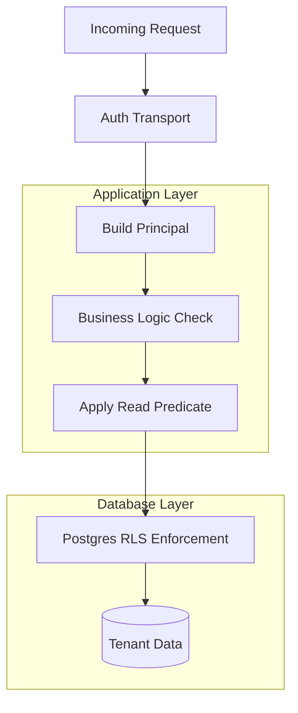
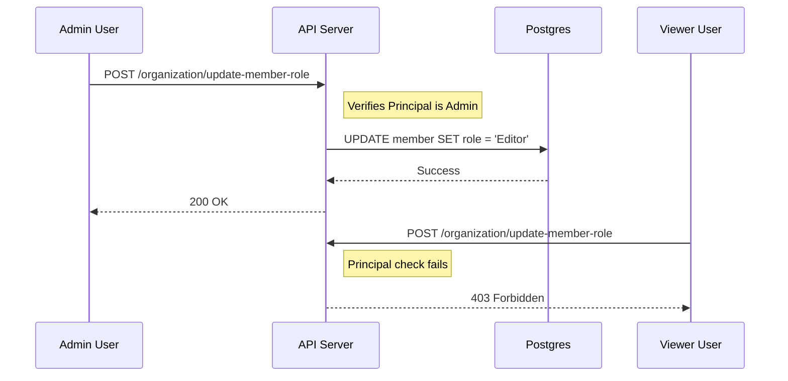

Relevant source files

The following files were used as context for generating this wiki page:

- [CODING_RULES.md](CODING_RULES.md)
- [AGENTS.md](AGENTS.md)
- [apps/api/CODING_RULES.md](apps/api/CODING_RULES.md)
- [apps/api/tests/oauth-flow.test.ts](apps/api/tests/oauth-flow.test.ts)
- [packages/design-system/readme.md](packages/design-system/readme.md)
- [apps/api/src/auth/pages.ts](apps/api/src/auth/pages.ts)

# Principals & Authorization Model

The Principals & Authorization Model defines how the Better Answers platform identifies actors and enforces access control across its multi-tenant architecture. The system uses a `Principal` object to carry identity context—including `workspaceId`, `userId`, and `role`—into every business logic function that accesses tenant data. This model ensures that every data operation is permission-aware, explainable, and strictly isolated between workspaces.

Authorization relies on a "default-deny" strategy enforced through Row Level Security (RLS) in the database and read predicates applied in the application layer. The platform distinguishes between human users curating knowledge and automated agents accessing the map via the Model Context Protocol (MCP).

Sources: [packages/design-system/readme.md:4-7](packages/design-system/readme.md#L4-L7), [CODING_RULES.md:144-147](CODING_RULES.md#L144-L147)

## The Principal Object

A `Principal` is the primary identity token used within `packages/core`. Every function reading or writing tenant data accepts a `Principal` as its first parameter. The transport layer builds this object after verifying bearer tokens, ensuring business logic remains agnostic of the underlying authentication library.

Sources: [CODING_RULES.md:144-147](CODING_RULES.md#L144-L147), [CODING_RULES.md:38-40](CODING_RULES.md#L38-L40)

### Principal Types

The platform supports two distinct kinds of principals to handle different execution contexts:

| Type | Description |
| :--- | :--- |
| **Deferred Principal** | Carries a named person's authority into background jobs, scheduled runs, or replays. It expires with the borrowed authority. |
| **Platform Principal** | Represents the platform acting as itself. It uses a unique actor ID and has no direct person behind the action. |

Sources: [CODING_RULES.md:151-155](CODING_RULES.md#L151-L155)

### Principal Structure

The `Principal` must contain the following fields to satisfy authorization checks:
*  `workspaceId`: The unique identifier for the company/tenant.
*  `userId`: The unique identifier for the actor.
*  `role`: The assigned permission level (e.g., Admin, Editor, Viewer).

Sources: [CODING_RULES.md:144-146](CODING_RULES.md#L144-L146)

## Authorization Layers

Better Answers employs a multi-layered authorization strategy to guarantee tenant isolation and data sensitivity compliance.

The diagram shows the flow of an authenticated request through application-level checks down to database-level RLS enforcement.
Sources: [CODING_RULES.md:14-20](CODING_RULES.md#L14-L20), [CODING_RULES.md:144-147](CODING_RULES.md#L144-L147)

### Row Level Security (RLS)
RLS acts as the final guarantee for tenant isolation. Every tenant-specific table is created with `FORCE ROW LEVEL SECURITY`. Policies use `SET LOCAL app.workspace_id` (derived from the `Principal`) to filter rows. If no policy is matched, the database returns zero rows by default.

Sources: [CODING_RULES.md:18-24](CODING_RULES.md#L18-L24)

### Read Predicates
Beyond tenant isolation, the platform enforces a **read predicate** based on the readable unit's metadata. This predicate is tested against specific columns on the unit:
*  `published_at`: Controls visibility based on publication status.
*  `sensitivity`: Filters data by classification (Restricted, Internal, Public).
*  `audience`: Restricts data to specific intended groups.

Sources: [CODING_RULES.md:144-149](CODING_RULES.md#L144-L149), [packages/design-system/readme.md:31-33](packages/design-system/readme.md#L31-L33)

## Roles and Permissions

The platform uses a closed set of roles for both people and agents. Roles are checked at the business logic entry points and determine the available action thresholds.

### Canonical Roles
| Role | Context | Typical Capabilities |
| :--- | :--- | :--- |
| **Admin** | Human | Full Control Centre access; system configuration; ceiling management. |
| **Editor** | Human | Knowledge curation; governed writes; suggestion management. |
| **Viewer** | Human | Ask and Search access; limited to two levels of disclosure. |
| **Agent** | Automated | MCP-bound access; scoped by binding tokens. |

Sources: [packages/design-system/readme.md:28-29](packages/design-system/readme.md#L28-L29), [apps/api/src/auth/pages.ts:88-89](apps/api/src/auth/pages.ts#L88-L89), [CODING_RULES.md:144-146](CODING_RULES.md#L144-L146)

### Role Management Sequence

Human users manage workspace roles through the "People" screen in the Control Centre. The transition of roles is governed by strict authorization rules.

This diagram illustrates an Admin successfully upgrading a role while a Viewer is denied the same action.
Sources: [apps/api/tests/oauth-flow.test.ts:356-375](apps/api/tests/oauth-flow.test.ts#L356-L375)

## Authentication Flow

Better Answers utilizes `better-auth` for identity management. The authentication process mints tokens that are audience-bound (e.g., to the MCP URL) and include workspace claims.

### Sign-in and Consent
1.  **Email Code**: The user enters a work email to receive a six-digit code.
2.  **Workspace Selection**: If the user belongs to multiple workspaces, they must choose one.
3.  **Consent**: The user explicitly grants permissions (scopes) to a client.

Sources: [apps/api/src/auth/pages.ts:33-85](apps/api/src/auth/pages.ts#L33-L85), [apps/api/tests/oauth-flow.test.ts:98-105](apps/api/tests/oauth-flow.test.ts#L98-L105)

### Scopes
The platform supports standard OAuth scopes to restrict application access:
*  `knowledge:read`: Access to the company's knowledge map.
*  `feedback:write`: Ability to send feedback on answers.
*  `offline_access`: Permanent connection via refresh tokens.

Sources: [apps/api/tests/oauth-flow.test.ts:60-64](apps/api/tests/oauth-flow.test.ts#L60-L64), [apps/api/src/auth/pages.ts:79-82](apps/api/src/auth/pages.ts#L79-L82)

## Summary
The Principals & Authorization Model ensures that all operations within Better Answers are performed by identified actors within a strictly governed workspace context. By combining mandatory `Principal` parameters, multi-layered RLS, and explicit read predicates, the system maintains high standards for data security and tenant isolation.
