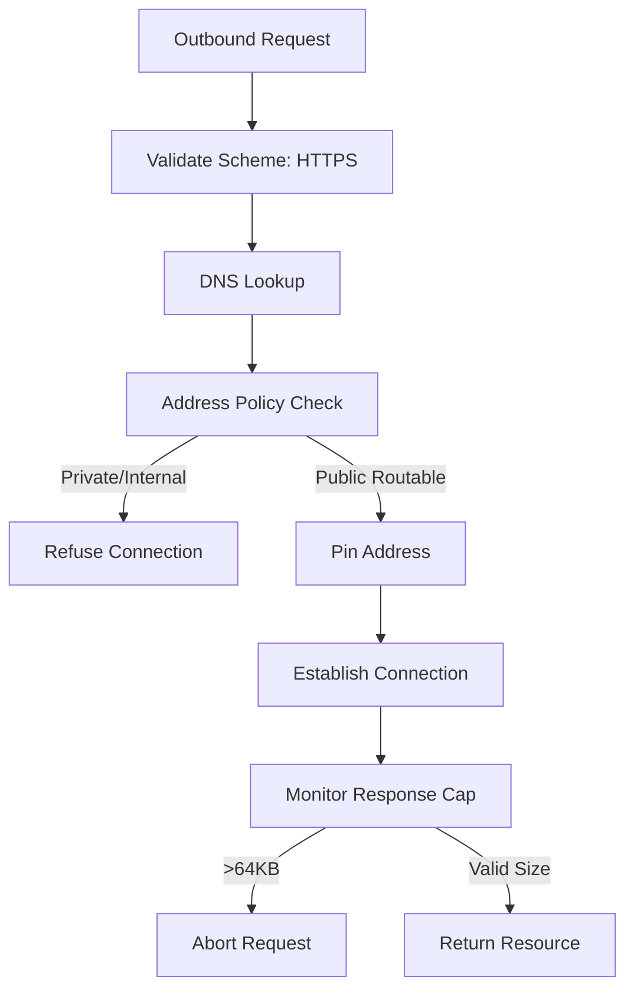
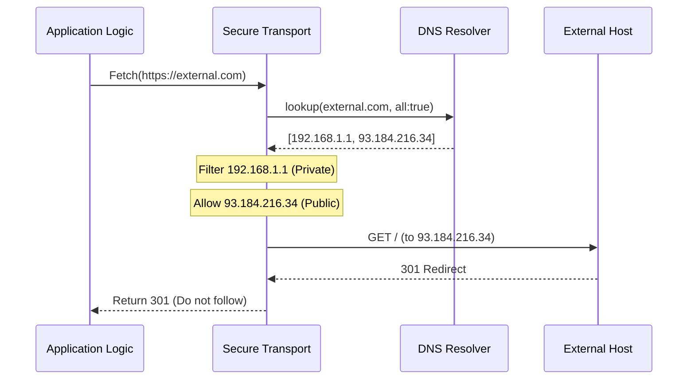

Relevant source files

The following files were used as context for generating this wiki page:

- [apps/api/lifts/better-auth-cimd-node/THIRD_PARTY_NOTICES.md](apps/api/lifts/better-auth-cimd-node/THIRD_PARTY_NOTICES.md)
- [CODING_RULES.md](apps/api/CODING_RULES.md)
- [cubic.yaml](cubic.yaml)
- [deploy/wizard-41.sh](deploy/wizard-41.sh)
- [apps/api/CODING_RULES.md](apps/api/CODING_RULES.md)

# SSRF Protection & Network Policies

Better Answers implements strict network policies and Server-Side Request Forgery (SSRF) protections to secure communications between the platform and external services. These policies govern how the system resolves addresses, establishes connections, and handles data from remote resources, specifically within the `apps/api` tier and its authentication modules.

The project mandates that all network requests use HTTPS/TLS and undergo rigorous validation of target addresses. This includes refusing non-publicly routable hosts and enforcing strict timeouts and response caps to prevent resource exhaustion and internal network scanning.

Sources: [cubic.yaml:142](cubic.yaml#L142), [apps/api/lifts/better-auth-cimd-node/THIRD_PARTY_NOTICES.md:21-25](apps/api/lifts/better-auth-cimd-node/THIRD_PARTY_NOTICES.md#L21-L25)

## SSRF Mitigation Architecture

The SSRF protection layer sits between the application business logic and the physical network. It overrides default transport behaviors, particularly within lifted third-party components like `@better-auth/cimd`, to ensure every outbound request complies with the project's security standards.

The diagram shows the validation sequence for outbound requests, including address filtering and response size enforcement.
Sources: [apps/api/lifts/better-auth-cimd-node/THIRD_PARTY_NOTICES.md:21-25](apps/api/lifts/better-auth-cimd-node/THIRD_PARTY_NOTICES.md#L21-L25)

### Host and Address Validation
The platform refuses any resolved address that is not public-routable. This block includes:
*  Private and loopback addresses.
*  Link-local and CGNAT (Shared address space).
*  Documentation and multicast ranges.
*  6to4, NAT64, and Teredo forms that embed restricted addresses.

The system pins the resolved address for the duration of the connection using the original Host and SNI (Server Name Indication) to prevent DNS rebinding attacks.

Sources: [apps/api/lifts/better-auth-cimd-node/THIRD_PARTY_NOTICES.md:22-23](apps/api/lifts/better-auth-cimd-node/THIRD_PARTY_NOTICES.md#L22-L23)

## Transport and Connection Policies

The platform enforces specific constraints on the HTTP protocol and connection lifecycle to mitigate scanning and exhaustion risks.

### Protocol Constraints
| Constraint | Policy |
| :--- | :--- |
| **Supported Schemes** | HTTPS only |
| **HTTP Methods** | GET and HEAD only |
| **Redirect Handling** | Returned to caller; never followed automatically (Cap 0) |
| **Timeout** | 10 seconds |
| **Response Cap** | 64 KB |

Sources: [apps/api/lifts/better-auth-cimd-node/THIRD_PARTY_NOTICES.md:21-25](apps/api/lifts/better-auth-cimd-node/THIRD_PARTY_NOTICES.md#L21-L25)

### DNS Resolution
In the `better-auth-cimd-node` lift, the `lookup` callback is modified to honor the `all` flag passed by Node.js. This ensures compatibility with `autoSelectFamily` and prevents `ERR_INVALID_IP_ADDRESS` errors while maintaining the ability to filter every resolved address in a multi-address response.

Sources: [apps/api/lifts/better-auth-cimd-node/THIRD_PARTY_NOTICES.md:18-21](apps/api/lifts/better-auth-cimd-node/THIRD_PARTY_NOTICES.md#L18-L21)

## External Service Security

Security policies extend to the infrastructure level, governing how the platform interacts with cloud providers and external tools.

### Firewall and Ingress
The project employs a "default-deny" posture for network ingress. For instance, VPS deployments at IONOS are restricted to inbound SSH only from specific authorized IPs or internal VPC addresses.
*  **VPC 1 (Production):** Accessible via SSH only from authorized developer IPs and VPC 2.
*  **Cloudflare Tunnels:** Used to expose application hostnames (app, mcp, agent) without opening public firewall ports.

Sources: [deploy/wizard-41.sh:255-257](deploy/wizard-41.sh#L255-L257), [deploy/wizard-41.sh:276-281](deploy/wizard-41.sh#L276-L281)

### Secrets and Credentials
Credentials for external services (LLMs, object stores, SMTP) are never read directly from the environment at the call site. Instead, they are accessed through a `CredentialsProviderInterface` and are stored hashed with lookup prefixes.
*  **HTTPS Enforcement:** All external AI and SaaS API calls must use HTTPS/TLS.
*  **Logging:** Prompt and completion content are strictly excluded from structured loggers to prevent data leakage.

Sources: [CODING_RULES.md:142](CODING_RULES.md#L142), [CODING_RULES.md:158-164](CODING_RULES.md#L158-L164), [cubic.yaml:142](cubic.yaml#L142)

## Testing and Verification

SSRF policies are validated through functional tests that exercise refusal paths. These tests ensure the system correctly identifies and blocks:
1.  Invalid URL schemes (e.g., `http://`, `file://`).
2.  Disallowed HTTP methods (e.g., `POST`, `DELETE`).
3.  Every non-public address class.
4.  Requests exceeding the 64 KB response cap or 10-second timeout.
5.  Automatic redirect following.

Sources: [apps/api/lifts/better-auth-cimd-node/THIRD_PARTY_NOTICES.md:31-33](apps/api/lifts/better-auth-cimd-node/THIRD_PARTY_NOTICES.md#L31-L33)

The sequence diagram illustrates how the transport layer intercepts DNS results and enforces the redirect policy.
Sources: [apps/api/lifts/better-auth-cimd-node/THIRD_PARTY_NOTICES.md:21-25](apps/api/lifts/better-auth-cimd-node/THIRD_PARTY_NOTICES.md#L21-L25)

## Summary
SSRF Protection and Network Policies in Better Answers are centered on a zero-trust approach to outbound requests. By enforcing HTTPS, filtering all DNS resolutions against a public-only allowlist, and capping request duration and size, the platform protects internal infrastructure from exploitation via external resource fetching. These policies are enforced at the transport level and verified by mandatory security tests.
