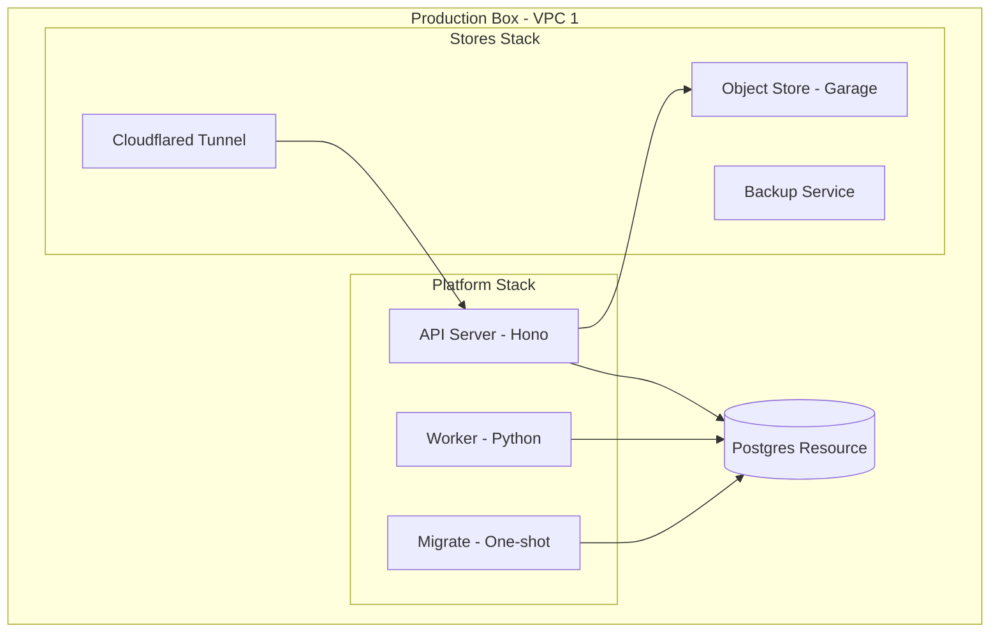
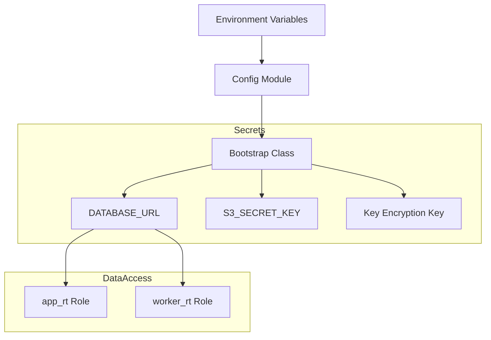

Relevant source files

The following files were used as context for generating this wiki page:

- [deploy/platform.compose.yaml](deploy/platform.compose.yaml)
- [deploy/stores.compose.yaml](deploy/stores.compose.yaml)
- [apps/docs-site/operations/coolify.md](apps/docs-site/operations/coolify.md)
- [deploy/wizard-41.sh](deploy/wizard-41.sh)
- [AGENTS.md](AGENTS.md)
- [CODING_RULES.md](CODING_RULES.md)

# Docker Compose & Platform Stacks

Better Answers employs a multi-stack Docker Compose architecture to manage its runtime environment. The system splits infrastructure into two primary stacks: the `stores` stack, which contains long-lived data services, and the `platform` stack, which contains the application logic. This separation ensures that application redeployments do not disrupt core data storage and ingress services.

The deployment targets two distinct Virtual Private Clouds (VPCs). VPC 1 hosts the production environment, including the Postgres resource, `stores` stack, and `platform` stack. VPC 2 serves as the orchestrator host (Coolify) and a restore target for monthly drills.
Sources: [apps/docs-site/operations/coolify.md:12-20](apps/docs-site/operations/coolify.md#L12-L20), [deploy/platform.compose.yaml:1-5](deploy/platform.compose.yaml#L1-L5)

## Stack Architecture and Separation

The architecture isolates stateful storage services from stateless application services. This allows the application tier to be updated or rolled back by changing image digests without affecting the underlying database or object store.

The diagram shows the relationship between the separate Compose stacks and the primary Postgres resource on the production box.
Sources: [apps/docs-site/operations/coolify.md:32-45](apps/docs-site/operations/coolify.md#L32-L45), [deploy/platform.compose.yaml:45-125](deploy/platform.compose.yaml#L45-L125)

### Stack Definitions

| Stack | Compose File | Responsibility | Deployment Lifecycle |
| :--- | :--- | :--- | :--- |
| **Stores** | `stores.compose.yaml` | Object storage (Garage), Ingress (Cloudflared), and Backups. | Long-lived; rarely redeployed. |
| **Platform** | `platform.compose.yaml` | Database migrations, API service (Hono), and Knowledge Worker (Python). | Redeployed on every release via digest. |

Sources: [deploy/platform.compose.yaml:1-5](deploy/platform.compose.yaml#L1-L5), [apps/docs-site/operations/coolify.md:32-42](apps/docs-site/operations/coolify.md#L32-L42)

## Platform Stack Components

The Platform stack manages the lifecycle of the application tier through three primary services that follow a strict dependency order.
Sources: [deploy/platform.compose.yaml:12-16](deploy/platform.compose.yaml#L12-L16)

### 1. Migrate Service
The `migrate` service is a one-shot container that executes Drizzle migrations. It includes DDL for the database, indexing, and graph tables. It must complete successfully before the API or Worker services start.
Sources: [deploy/platform.compose.yaml:47-66](deploy/platform.compose.yaml#L47-L66)

### 2. API Service
The `api` service runs the TypeScript Hono application on Node 24. It serves the Single-Page App (SPA), the authorization server, and the MCP surface. It connects to the database using the `app_rt` role, which is restricted from performing DDL operations.
Sources: [deploy/platform.compose.yaml:68-106](deploy/platform.compose.yaml#L68-L106), [apps/docs-site/operations/coolify.md:162-167](apps/docs-site/operations/coolify.md#L162-L167)

### 3. Worker Service
The knowledge worker is a Python-based service that handles indexing, enrichment, and graph derivation. It is declared behind the `pipeline` profile and is not started by default. It requires the API service to be healthy before starting.
Sources: [deploy/platform.compose.yaml:116-150](deploy/platform.compose.yaml#L116-L150), [AGENTS.md:25-27](AGENTS.md#L25-L27)

## Service Configuration and Resource Limits

Every service in the production environment carries explicit memory limits to ensure the total consumption does not exceed the 4 GB box capacity.
Sources: [deploy/platform.compose.yaml:26-31](deploy/platform.compose.yaml#L26-L31), [apps/docs-site/operations/coolify.md:180-185](apps/docs-site/operations/coolify.md#L180-L185)

### Resource Limit Allocations

| Service | Memory Limit | Notes |
| :--- | :--- | :--- |
| **Postgres** | 1,024 MB | Set in the orchestrator (Coolify). |
| **API** | 512 MB | Shared with SPA and MCP surface. |
| **Worker** | 1,536 MB | Includes 1,536 MB swap allowance (`memswap_limit`). |
| **Migrate** | 512 MB | One-shot; exits after completion. |
| **Object Store** | 384 MB | Garage service in stores stack. |

Sources: [apps/docs-site/operations/coolify.md:180-185](apps/docs-site/operations/coolify.md#L180-L185), [deploy/platform.compose.yaml:153-162](deploy/platform.compose.yaml#L153-L162)

## Security and Principal Mapping

Docker Compose environment variables handle the "Bootstrap" class of secrets. These are the minimum credentials required for a service to reach its infrastructure.
Sources: [CODING_RULES.md:118-124](CODING_RULES.md#L118-L124), [deploy/platform.compose.yaml:33-43](deploy/platform.compose.yaml#L33-L43)

Configuration follows the `[SEC1]` rule, where only the bootstrap class of secrets reaches the process through environment variables.
Sources: [CODING_RULES.md:118-124](CODING_RULES.md#L118-L124), [deploy/platform.compose.yaml:33-43](deploy/platform.compose.yaml#L33-L43), [deploy/wizard-41.sh:318-323](deploy/wizard-41.sh#L318-L323)

## Deployment Procedures

Deployments use image digests rather than tags to prevent accidental updates and ensure consistency across worktrees.
Sources: [deploy/platform.compose.yaml:7-10](deploy/platform.compose.yaml#L7-L10), [deploy/wizard-41.sh:332-337](deploy/wizard-41.sh#L332-L337)

1. **Build:** The `build.yml` workflow pushes three images (API, Worker, Backup) to GitHub Container Registry (ghcr.io).
2. **Promote:** The `release.yml` workflow patches the digest environment variables on the Coolify resource.
3. **Migrate:** The stack executes `migrate` to update the schema using the `MIGRATE_DATABASE_URL` (owner DSN).
4. **Deploy:** The `api` service restarts, followed by the `worker` service if the pipeline profile is active.

Sources: [deploy/platform.compose.yaml:47-150](deploy/platform.compose.yaml#L47-L150), [deploy/wizard-41.sh:332-348](deploy/wizard-41.sh#L332-L348)

## Summary

The Docker Compose configuration for Better Answers prioritizes stack isolation and resource predictability. By separating the `stores` and `platform` stacks, the system enables safe application updates via image digests. Strict memory limits and non-privileged database roles for runtime services enforce the project's security and stability requirements.
Sources: [deploy/platform.compose.yaml:1-10](deploy/platform.compose.yaml#L1-L10), [apps/docs-site/operations/coolify.md:1-20](apps/docs-site/operations/coolify.md#L1-L20), [CODING_RULES.md:144-150](CODING_RULES.md#L144-L150)
