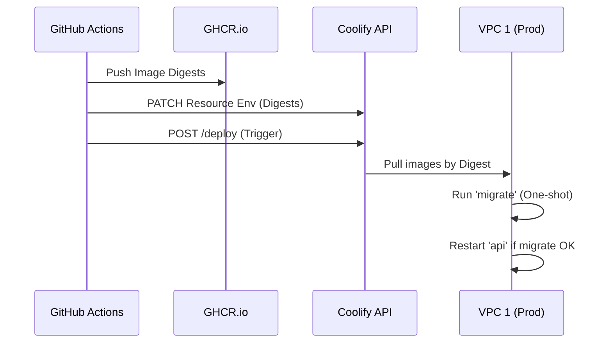

<details>
<summary>Relevant source files</summary>

The following files were used as context for generating this wiki page:

- [deploy/wizard-41.sh](deploy/wizard-41.sh)
- [apps/docs-site/operations/coolify.md](apps/docs-site/operations/coolify.md)
- [deploy/platform.compose.yaml](deploy/platform.compose.yaml)
- [apps/api/tests/deploy-tree.test.ts](apps/api/tests/deploy-tree.test.ts)
- [AGENTS.md](AGENTS.md)
- [CODING_RULES.md](CODING_RULES.md)
</details>

# Deployment with Coolify

Better Answers uses Coolify as a pinned orchestrator to manage infrastructure across two virtual private clouds (VPCs). The deployment follows a two-tier runtime architecture sharing four stores: Postgres, an object store, a git repository per workspace, and a derived graph. The system enforces strict isolation where the orchestrator manages production resources over SSH, while ingress is handled exclusively via Cloudflare tunnels.

Sources: [AGENTS.md:10-12](AGENTS.md#L10-L12), [apps/docs-site/operations/coolify.md:14-15](apps/docs-site/operations/coolify.md#L14-L15)

## Infrastructure Architecture

The estate consists of two IONOS VPS instances (4 vCPU, 4 GB RAM, 120 GB NVMe each) that cannot be resized. VPC 1 hosts production stacks and the primary database, while VPC 2 hosts the Coolify orchestrator, a git mirror, and a restore target for drills.

```mermaid
flowchart TD
    subgraph VPC1[VPC 1: Production]
        PG[Postgres Resource]
        SS[Stores Stack]
        PS[Platform Stack]
        Data[/data/git]
    end

    subgraph VPC2[VPC 2: Control Plane]
        Coolify[Coolify Orchestrator]
        Mirror[Git Mirror]
        Drill[Restore Target]
    end

    subgraph Edge[Cloudflare Edge]
        Tunnel[Cloudflare Tunnel]
    end

    User((User)) --> Edge
    Edge -- Tunneling --> PS
    Coolify -- SSH Management --> VPC1
    PS -- Push --> Mirror
```

Sources: [apps/docs-site/operations/coolify.md:20-30](apps/docs-site/operations/coolify.md#L20-L30), [deploy/wizard-41.sh:220-230](deploy/wizard-41.sh#L220-L230)

### Host Configuration
- **VPC 1 (Production):** Runs the `stores` and `platform` stacks. It includes a 4 GB swap file to support memory-intensive worker tasks.
- **VPC 2 (Orchestrator):** Runs Coolify with `AUTOUPDATE=false`. It serves as the target for monthly `restore-drill.sh` runs.
- **Connectivity:** 80 and 443 ports are closed on both boxes. All ingress traffic arrives through `cloudflared`.

Sources: [apps/docs-site/operations/coolify.md:22-42](apps/docs-site/operations/coolify.md#L22-L42), [deploy/platform.compose.yaml:104-106](deploy/platform.compose.yaml#L104-L106)

## Component Stacks

Deployment logic is separated into two Docker Compose stacks to isolate long-lived storage services from frequently updated application code.

### Stores Stack (`deploy/stores.compose.yaml`)
This stack contains the supporting infrastructure:
- **Object Store:** Garage (S3-compatible).
- **Ingress:** `cloudflared` for the Cloudflare tunnel.
- **Backup:** The `backup` service, which runs by image digest.

Sources: [apps/docs-site/operations/coolify.md:52-56](apps/docs-site/operations/coolify.md#L52-L56), [apps/api/tests/deploy-tree.test.ts:70-75](apps/api/tests/deploy-tree.test.ts#L70-L75)

### Platform Stack (`deploy/platform.compose.yaml`)
The application services deploy by digest, promoted via GitHub Actions `release.yml`.

| Service | Role | Memory Limit |
| :--- | :--- | :--- |
| `migrate` | One-shot Drizzle migrations and `replay-erasures`. | 512 MB |
| `api` | Hono server (Node 24) for SPA, OAuth, and MCP. | 512 MB |
| `worker` | Python 3.13 knowledge worker (declared, profile-gated). | 1.5 GB |

Sources: [deploy/platform.compose.yaml:32-45](deploy/platform.compose.yaml#L32-L45), [deploy/platform.compose.yaml:55-70](deploy/platform.compose.yaml#L55-L70), [apps/docs-site/operations/coolify.md:58-62](apps/docs-site/operations/coolify.md#L58-L62)

## Ingress and Security

The system utilizes three specific hostnames routed through a single Cloudflare tunnel to `http://app:3000`.

### Hostname Routing
1. **App Hostname (`app.<apex>`):** Serves the SPA, health checks, MCP, and OAuth endpoints.
2. **Agent Hostname (`agent.<apex>`):** Restricted to `/agent/v1/*` for share agents.
3. **Apex Hostname (`<apex>`):** Serves concept IRIs and returns 404 for other requests.

Sources: [apps/docs-site/operations/coolify.md:80-95](apps/docs-site/operations/coolify.md#L80-L95), [deploy/platform.compose.yaml:85-95](deploy/platform.compose.yaml#L85-L95)

### Rate Limiting
Cloudflare WAF rate limiting rules are mandatory.
- **Free Plan:** Uses one combined rule with an OR expression for path groups.
- **Pro Plan:** Required before the first client credential exists. It uses separate rules for credential writes and discovery.

Sources: [apps/docs-site/operations/coolify.md:105-115](apps/docs-site/operations/coolify.md#L105-L115), [deploy/wizard-41.sh:275-285](deploy/wizard-41.sh#L275-L285)

## Deployment Procedure

The deployment follows a manual wizard-driven setup for initial estate creation, followed by automated CI/CD for releases.

### Initial Setup Sequence
1. **Escrow Vault:** Create a password manager vault for APP_KEY, KEK, and backup credentials.
2. **Host Setup:** Execute `/root/deploy/host-setup.sh` on both VPCs to configure swap, SSH keys, and the git mirror user.
3. **Registry:** Configure `ghcr.io` pull credentials in Coolify for both servers.
4. **Postgres Role Provisioning:** The database resource owner must manually grant `LOGIN` to `app_rt` and `worker_rt` roles.

Sources: [deploy/wizard-41.sh:170-185](deploy/wizard-41.sh#L170-L185), [deploy/wizard-41.sh:232-245](deploy/wizard-41.sh#L232-L245), [apps/docs-site/operations/coolify.md:145-155](apps/docs-site/operations/coolify.md#L145-L155)

### Release Flow



Sources: [deploy/platform.compose.yaml:5-10](deploy/platform.compose.yaml#L5-L10), [apps/docs-site/operations/coolify.md:165-175](apps/docs-site/operations/coolify.md#L165-L175)

## Monitoring and Health

The system implements a "dead-man's switch" monitoring pattern using `healthchecks.io`.

- **Scheduler & Backups:** Daily and hourly pings from the `backup` service and Coolify instance backups.
- **Restore Drill:** A monthly ping from the `restore-drill.sh` script on VPC 2.
- **Uptime Probe:** On Free plans, VPC 2 probes VPC 1 via host cron every 5 minutes and pings the `uptime` check.
- **Notifications:** Alerts are sent to a "second channel" (SMS or chat app) so that silence is distinguishable from health.

Sources: [deploy/wizard-41.sh:385-400](deploy/wizard-41.sh#L385-L400), [apps/docs-site/operations/coolify.md:120-130](apps/docs-site/operations/coolify.md#L120-L130)

Deployment completeness is validated by a restore drill. No client data is permitted on the production box until a `restore-drill.sh` run has finished successfully on VPC 2.

Sources: [deploy/wizard-41.sh:425-435](deploy/wizard-41.sh#L425-L435), [CODING_RULES.md:195-200](CODING_RULES.md#L195-L200)
