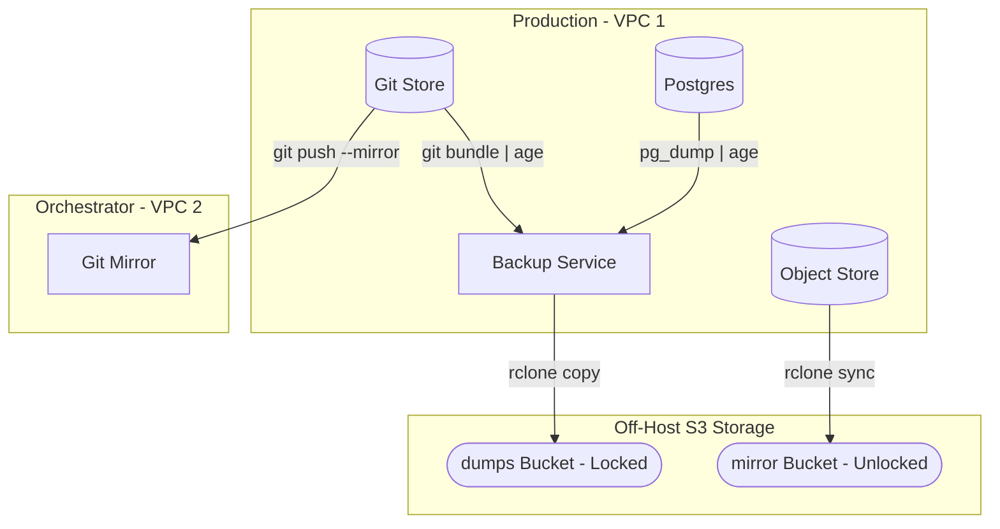
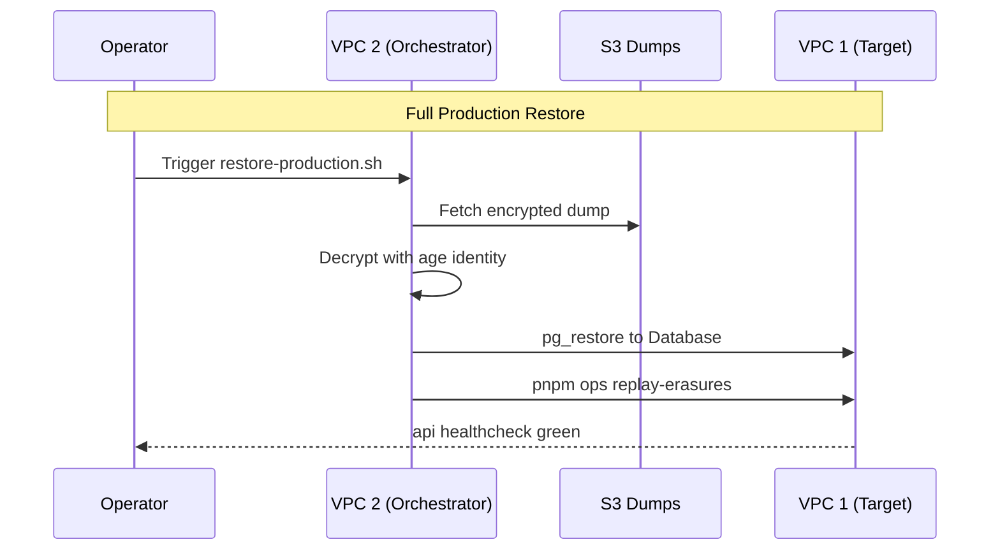

Relevant source files

The following files were used as context for generating this wiki page:

- [apps/docs-site/operations/BACKUPS.md](apps/docs-site/operations/BACKUPS.md)
- [apps/docs-site/operations/RUNBOOK.md](apps/docs-site/operations/RUNBOOK.md)
- [deploy/wizard-41.sh](deploy/wizard-41.sh)
- [apps/api/tests/deploy-tree.test.ts](apps/api/tests/deploy-tree.test.ts)
- [apps/docs-site/operations/coolify.md](apps/docs-site/operations/coolify.md)
- [CODING_RULES.md](CODING_RULES.md)

# Backup Strategy & Disaster Recovery

The Backup Strategy and Disaster Recovery (DR) system ensures data durability and service continuity for the platform. It uses a combination of automated dumps, object store mirroring, and client-side encryption to protect primary data stores including Postgres, Git repositories, and object store blobs. The strategy relies on two off-host S3 buckets located outside the primary hosting infrastructure to prevent total data loss during provider failure.

Operational procedures distinguish between the public operational map and a private "estate" half containing sensitive credentials. The system is built to survive the loss of either primary production boxes or the orchestrator, using a monthly "restore drill" to verify the recovery time objective (RTO) and recovery point objective (RPO) against a synthetic dataset.

Sources: [apps/docs-site/operations/BACKUPS.md:7-14](apps/docs-site/operations/BACKUPS.md#L7-L14), [apps/docs-site/operations/RUNBOOK.md:7-14](apps/docs-site/operations/RUNBOOK.md#L7-L14)

## Backup Architecture and Storage Matrix

The platform distributes data across two off-host buckets: `dumps` and `mirror`. The `dumps` bucket uses versioning and object lock in governance mode to prevent accidental or malicious deletion. The `mirror` bucket handles personal data subject to erasure requests, where deletions propagate to ensure compliance.

### Data Flow for Backup Jobs

The following diagram illustrates the flow from primary stores to the encrypted off-host backup buckets.

The diagram shows the backup service encrypting database and git bundles before uploading to the locked `dumps` bucket, while the object store is synced directly to the `mirror` bucket.
Sources: [apps/docs-site/operations/BACKUPS.md:16-24](apps/docs-site/operations/BACKUPS.md#L16-L24), [deploy/wizard-41.sh:197-205](deploy/wizard-41.sh#L197-L205)

### Storage Matrix and Retention

| Store | Content | Method | Schedule | Retention |
| :--- | :--- | :--- | :--- | :--- |
| **Postgres** | `public`, `index`, Auth | `pg_dump` + `age` | Hourly | 48h (hourly), 30d (daily), 6m (monthly) |
| **Git Store** | Bare repos | `git bundle` + `age` | Nightly | 30d (nightly), 6m (monthly) |
| **Object Store** | Uploads, normalized text | `rclone sync` | Nightly | Live + 30d non-current versions |
| **Coolify** | Orchestrator DB & Env | Instance Backup | Daily | 30 days |

Sources: [apps/docs-site/operations/BACKUPS.md:27-42](apps/docs-site/operations/BACKUPS.md#L27-L42), [apps/docs-site/operations/BACKUPS.md:65-68](apps/docs-site/operations/BACKUPS.md#L65-L68)

## Encryption and Identity Management

All data in the `dumps/` bucket is client-side encrypted using `age`. The private key for this identity is stored in an escrow vault. For unattended restore drills, a copy of the private key resides in a root-only file on the orchestrator box (VPC 2).

- **Encryption Tool:** `age`
- **Identity Storage:** Escrow vault + root-only file on VPC 2 (`/etc/better-answers/backup-age.key`).
- **Secret Classes:** The system separates credentials into classes (LLM, repository, object store) to prevent scope creep during a compromise.

Sources: [apps/docs-site/operations/BACKUPS.md:21-24](apps/docs-site/operations/BACKUPS.md#L21-L24), [deploy/wizard-41.sh:209-214](deploy/wizard-41.sh#L209-L214), [CODING_RULES.md:200-205](CODING_RULES.md#L200-L205)

## Recovery Procedures

Recovery follows a specific order to ensure data consistency, particularly regarding personal data erasure requests that may have occurred after the last successful dump.

### Recovery Execution Order

1. **Restore Postgres:** Restore from the latest dump and immediately replay all erasure requests completed after that dump.
2. **Reconcile Git:** Check bundle commit watermarks against git store heads.
3. **Resync Graph:** Rebuild the graph from git repositories and records.
4. **Pipeline State:** Rebind LMDBs and reprocess from the object store.
5. **Clean Orphans:** List and sweep object-store blobs with no catalog row.

Sources: [apps/docs-site/operations/BACKUPS.md:76-81](apps/docs-site/operations/BACKUPS.md#L76-L81), [apps/api/tests/deploy-tree.test.ts:107-111](apps/api/tests/deploy-tree.test.ts#L107-L111)

### Restore Scenarios

The sequence shows the mandatory step of replaying erasures before the API is allowed to return to a healthy state.
Sources: [apps/docs-site/operations/BACKUPS.md:83-88](apps/docs-site/operations/BACKUPS.md#L83-L88), [apps/api/tests/deploy-tree.test.ts:100-106](apps/api/tests/deploy-tree.test.ts#L100-L106)

## Failure Detection and Signals

The system uses "dead-man's switches" for every scheduled job. If a job fails or the server is down, the monitoring service (healthchecks.io) alerts the technical team via a second communication channel (SMS or chat).

### Key Health Signals
- **Missed Pings:** Alerts triggered by `pg-hourly`, `nightly`, or `drill` job silence.
- **Disk Usage:** Alerts if `/data` partitions exceed 80% capacity.
- **Uptime Probes:** Probes on `/health` and MCP discovery paths.
- **Restore Drill Results:** Monthly recording of RTO/RPO and erasure rehearsal outcomes.

Sources: [apps/docs-site/operations/BACKUPS.md:112-120](apps/docs-site/operations/BACKUPS.md#L112-L120), [apps/docs-site/operations/coolify.md:104-108](apps/docs-site/operations/coolify.md#L104-L108)

## Disaster Recovery Scenarios

| Scenario | Action | Escalation |
| :--- | :--- | :--- |
| **VPC 1 Down** | Reboot or build new box; run `restore-production.sh`. | Tech contact within 1 hour. |
| **VPC 2 Down** | Reinstall orchestrator; restore instance backup; re-escrow SSH keys. | Second escrow holder for vault. |
| **Host Compromise** | Isolate box; rotate every host-side credential; restore older dump. | Tech contact immediately. |
| **Dual Box Loss** | Setup new VPC 1 & 2; run full restore from escrowed secrets. | Second escrow holder; client contact. |

Sources: [apps/docs-site/operations/RUNBOOK.md:18-30](apps/docs-site/operations/RUNBOOK.md#L18-L30), [apps/docs-site/operations/RUNBOOK.md:86-90](apps/docs-site/operations/RUNBOOK.md#L86-L90)

## Conclusion

The backup and disaster recovery strategy prioritizes the protection of client data through immutable, encrypted off-site storage. By mandating regular restore drills and strict recovery orders, the platform ensures that even in the event of total infrastructure loss, data can be recovered while maintaining compliance with privacy and erasure requirements.
