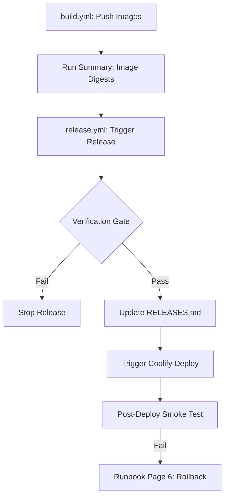
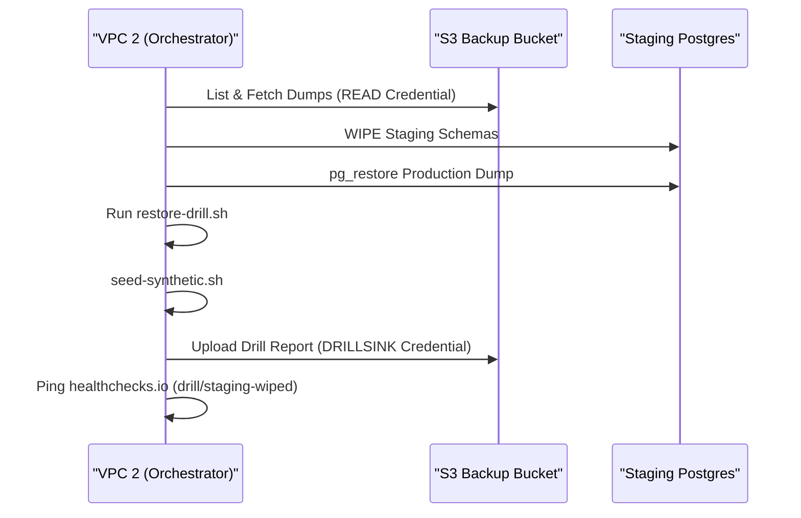

Relevant source files

The following files were used as context for generating this wiki page:

- [deploy/RELEASES.md](deploy/RELEASES.md)
- [apps/api/tests/deploy-tree.test.ts](apps/api/tests/deploy-tree.test.ts)
- [apps/docs-site/operations/RUNBOOK.md](apps/docs-site/operations/RUNBOOK.md)
- [apps/docs-site/operations/coolify.md](apps/docs-site/operations/coolify.md)
- [deploy/wizard-41.sh](deploy/wizard-41.sh)
- [CODING_RULES.md](CODING_RULES.md)
- [apps/docs-site/specs/T-064.md](apps/docs-site/specs/T-064.md)

# Release Management & Verification

Release Management & Verification encompasses the processes, tools, and gates that ensure stable deployment and operational integrity of the platform. The system uses immutable image digests, automated verification gates, and a structured recovery protocol to maintain the production environment.

The release workflow is governed by the `release.yml` GitHub action, which appends promotion records to a central ledger and triggers deployments via Coolify. Verification is enforced through comprehensive CI gates, including static analysis and a monthly "restore drill" that validates the integrity of backups and the deployment tree.

## Release Process Architecture

The release process prioritizes immutability by deploying services using specific Docker image digests rather than tags. The `release.yml` workflow manages the promotion of these digests from the build stage to production.

The diagram shows the progression from build to post-deployment verification.
Sources: [deploy/RELEASES.md:1-5](deploy/RELEASES.md#L1-L5), [apps/docs-site/operations/RUNBOOK.md:86-95](apps/docs-site/operations/RUNBOOK.md#L86-L95), [apps/api/tests/deploy-tree.test.ts:98-106](apps/api/tests/deploy-tree.test.ts#L98-L106)

### Promotion Ledger (RELEASES.md)
Every promotion to production is recorded in `deploy/RELEASES.md`. This file serves as the audit trail for the platform stack and provides the necessary data for rapid rollbacks.

| Field | Description |
| --- | --- |
| **When (UTC)** | The timestamp of the release in ISO 8601 format. |
| **By** | The identifier of the actor who triggered the release. |
| **api** | The `sha256` digest of the API service image. |
| **worker** | The `sha256` digest of the worker service image. |
| **Rode on** | The verification basis (e.g., "pre-client: any green build" or a specific drill report). |

Sources: [deploy/RELEASES.md:8-15](deploy/RELEASES.md#L8-L15)

## Verification Gates

Verification is enforced at multiple stages to ensure code quality, security, and operational readiness. Every tool defined in the `check` script acts as a gate; a finding from any tool fails the branch.

### Static Analysis and Linting Gates
The project employs several tools to enforce maintainability and prevent regressions:
*  **Oxlint**: Enforces repository-specific rules and identifies "slop" or anti-patterns.
*  **Knip**: Identifies unused files, dependencies, and exports to prevent code rot.
*  **jscpd**: Detects code duplication, requiring deliberate exclusions with documented reasons.
*  **Lefthook**: Provides pre-commit hooks that format and lint staged files locally.

Sources: [CODING_RULES.md:46-59](CODING_RULES.md#L46-L59), [apps/docs-site/specs/T-064.md:38-60](apps/docs-site/specs/T-064.md#L38-L60)

### Deployment Tree Verification
The `deploy-tree.test.ts` suite validates the integrity of the deployment configuration. It ensures that:
*  Scripts in the `deploy/` directory parse correctly.
*  No placeholders like `<read on the day>` exist in production config files.
*  Explicit memory limits are set for all VPC services.
*  The production restore script is free of "traps" like staging wipe commands.

Sources: [apps/api/tests/deploy-tree.test.ts:33-96](apps/api/tests/deploy-tree.test.ts#L33-L96)

## Operational Verification: The Restore Drill

The Restore Drill is the primary mechanism for verifying backup integrity and recovery procedures. It must run successfully before any client data is placed on the box.

The sequence illustrates the monthly automated verification of the recovery path.
Sources: [apps/docs-site/operations/RUNBOOK.md:126-138](apps/docs-site/operations/RUNBOOK.md#L126-L138), [deploy/wizard-41.sh:220-229](deploy/wizard-41.sh#L220-L229)

### Drill Acceptance Criteria
1.  **Backup Accessibility**: The `rclone` READ credential must be able to list and fetch dumps from the S3 bucket.
2.  **Schema Integrity**: The drill must wipe existing staging schemas (`public`, `index`, `drizzle`) before restoration.
3.  **Data Consistency**: The restored data must be compatible with the current deployment tree.
4.  **Reporting**: A report must be uploaded to the `drills/` bucket prefix.
5.  **Clean State**: The drill must end by wiping the restored data and pinging the `staging-wiped` dead-man check.

Sources: [apps/docs-site/operations/RUNBOOK.md:126-138](apps/docs-site/operations/RUNBOOK.md#L126-L138), [apps/api/tests/deploy-tree.test.ts:79-85](apps/api/tests/deploy-tree.test.ts#L79-L85)

## Rollback and Recovery

Rollbacks are treated as a release of the previously known-good state. The system identifies the rollback target using the row preceding the current failure in `RELEASES.md`.

### Rollback Procedure
1.  **Identify Target**: Locate the previous successful entry in `deploy/RELEASES.md`.
2.  **Trigger Release**: Execute the `release` workflow using the digests from the target row.
3.  **Audit**: Mark the release as a hotfix/rollback in the `rehearsed_by` field.
4.  **Verify**: Confirm the `/health` endpoint returns `200` within 30 minutes.

If a migration cannot be reversed, the recovery path switches to a full restore from the last hourly dump using `restore-production.sh`.

Sources: [apps/docs-site/operations/RUNBOOK.md:86-100](apps/docs-site/operations/RUNBOOK.md#L86-L100), [deploy/RELEASES.md:1-5](deploy/RELEASES.md#L1-L5)

Release Management ensures that every promotion to production is verified, documented, and recoverable. By mandating successful restore drills and enforcing strict CI gates, the system protects against data loss and deployment-time regressions.
