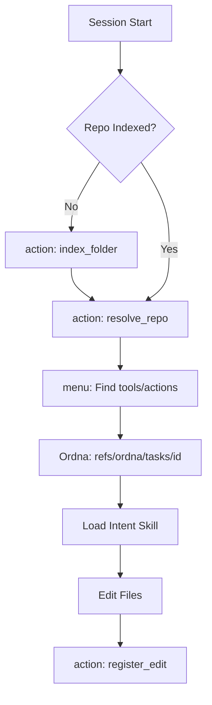
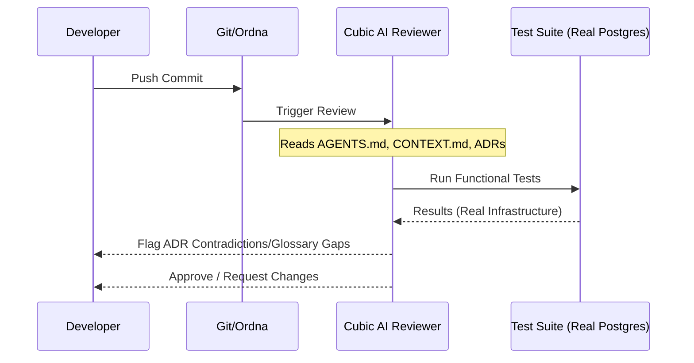

<details>
<summary>Relevant source files</summary>

The following files were used as context for generating this wiki page:

- [AGENTS.md](AGENTS.md)
- [CODING_RULES.md](CODING_RULES.md)
- [package.json](package.json)
- [cubic.yaml](cubic.yaml)
- [apps/api/CODING_RULES.md](apps/api/CODING_RULES.md)
- [packages/design-system/SKILL.md](packages/design-system/SKILL.md)
</details>

# Developer Environment & Ordna Workflow

The Better Answers developer environment integrates automated AI governance, domain-driven coding standards, and a specialized git-based task management system called Ordna. This workflow ensures that every contribution aligns with the project's architecture decision records (ADRs) and the unified domain glossary found in `CONTEXT.md`.

The environment operates across a monorepo structure where TypeScript and Python tiers coexist. Developers and AI agents follow strict protocols for skill loading, testing against real infrastructure, and task execution using git namespace refs rather than traditional files on disk for the work queue.

Sources: [AGENTS.md:1-20](AGENTS.md#L1-L20), [README.md:1-10](README.md#L1-L10)

## Workspace Layout and Tooling

The repository is organized into deployable applications and shared packages. Node.js 24 and Python 3.13 serve as the primary runtimes, managed via `pnpm` and `uv` respectively.

### Repository Structure

| Path | Primary Technology | Responsibility |
| :--- | :--- | :--- |
| `apps/api/` | Hono on Node 24 | TypeScript API tier, tRPC, OpenAPI, and worker control plane. |
| `apps/web/` | Vite React SPA | Frontend interface communicating solely via tRPC. |
| `apps/worker/` | Python 3.13 (uv) | Knowledge worker for connectors, indexing, and graph sync. |
| `packages/core/` | TypeScript | Transport-agnostic business logic and store access. |
| `ordna` | Git Namespace | Work queue stored at `refs/ordna/tasks/<id>`. |
| `deploy/` | Docker Compose | Deployment configuration and setup wizards. |

Sources: [AGENTS.md:22-38](AGENTS.md#L22-L38), [package.json:20-25](package.json#L20-L25)

### Workspace Verification

The project uses `oxlint` and `oxfmt` for rapid linting and formatting. The root `check` command executes all tier-specific checks, including TypeScript type checking and Python `uv` frozen checks.

```json
"scripts": {
  "check": "pnpm run format:check && pnpm -r --no-bail --if-present run check && (cd apps/worker && uv run --frozen check)",
  "lint": "oxlint",
  "format": "oxfmt"
}
```

Sources: [package.json:5-10](package.json#L5-L10)

## Ordna Task Workflow

Ordna serves as the internal issue tracker. Unlike traditional trackers that use markdown files or external databases, Ordna stores build tasks as git blobs. GitHub Issues remains the public-facing surface, while Ordna manages the internal work queue.

### Triage and Lifecycle

Tasks in Ordna use specific tags to manage the handover between AI agents and human developers.

*  `needs-triage`: Initial state for new tasks.
*  `needs-info`: Blocked by missing requirements.
*  `ready-for-agent`: Tasks suitable for AI automation.
*  `ready-for-human`: Tasks requiring manual intervention.
*  `wontfix`: Discarded tasks.

Sources: [AGENTS.md:46-55](AGENTS.md#L46-L55)

### Task Interaction Flow

The following diagram illustrates how a developer interacts with Ordna and the indexing system:



The diagram shows the sequence from confirming repository indexing to registering file edits after performing a task.
Sources: [AGENTS.md:57-80](AGENTS.md#L57-L80), [AGENTS.md:46-50](AGENTS.md#L46-L50)

## AI Governance and Review

Every pull request is governed by AI reviewers configured via `cubic.yaml`. The review process enforces strict adherence to the project's "Constitution" (found in `CODING_RULES.md`).

### Review Sensitivity and Rules

The AI reviewer prioritizes structural maintainability and security over cosmetic nits. It specifically flags:
*  **Contradictions to ADRs**: Any change contradicting an Architectural Decision Record must be accompanied by a new ADR.
*  **Domain Glossary Violations**: New terms must be settled in `CONTEXT.md` before appearing in code.
*  **AI Slop**: Fabricated changes or placeholder text.
*  **Deep Modules**: The reviewer flags wide interfaces over thin behavior, favoring deep implementation behind small interfaces.

Sources: [cubic.yaml:10-50](cubic.yaml#L10-L50), [CODING_RULES.md:9-15](CODING_RULES.md#L9-L15)

### Automated Verification Pipeline



This diagram depicts the automated review loop where the AI reviewer validates code against both written standards and functional tests.
Sources: [cubic.yaml:30-45](cubic.yaml#L30-L45), [CODING_RULES.md:58-65](CODING_RULES.md#L58-L65)

## Testing Standards

The environment enforces high-fidelity testing. Mocking internal modules or the database is prohibited.

*  **Real Postgres**: Every test touching data must use a real Postgres instance (Testcontainers or Compose).
*  **Interface Seams**: Tests must only exercise modules through their public exports, not their internals.
*  **Mutation Testing**: Stryker (TypeScript) and mutmut (Python) run on a schedule to maintain test quality.
*  **Membership Checks**: Tests assert membership in both directions for registries and journals to prevent orphans.

Sources: [CODING_RULES.md:58-95](CODING_RULES.md#L58-L95), [apps/api/CODING_RULES.md:19-25](apps/api/CODING_RULES.md#L19-L25)

## Intent Skills

Before editing files, developers use the TanStack Intent CLI to load specific guidance modules called "Skills."

1.  **List Skills**: `pnpm dlx @tanstack/intent@latest list` to see local skills.
2.  **Load Skill**: `pnpm dlx @tanstack/intent@latest load <package>#<skill>`.
3.  **Follow Guidance**: The loaded `SKILL.md` provides domain-specific rules for the task.

Sources: [AGENTS.md:1-12](AGENTS.md#L1-L12), [packages/design-system/SKILL.md](packages/design-system/SKILL.md)
