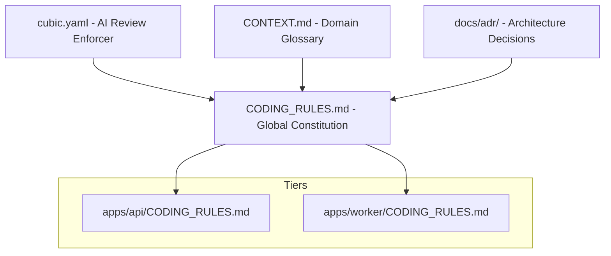
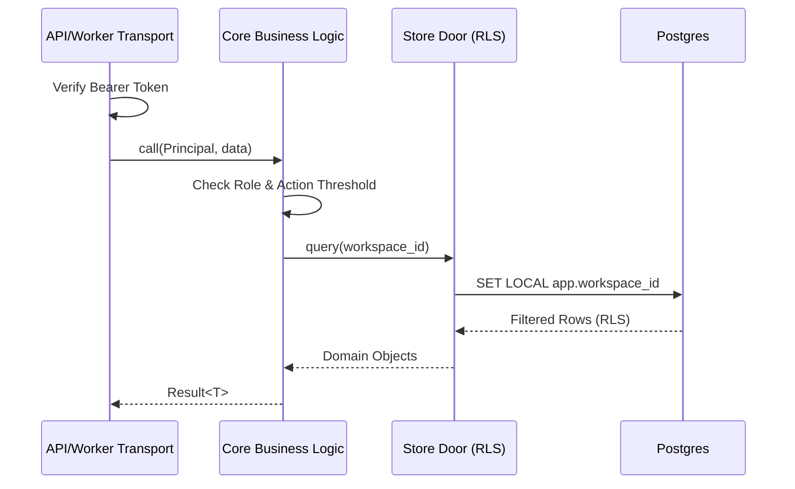

Relevant source files

The following files were used as context for generating this wiki page:

- [CODING\_RULES.md](CODING_RULES.md)
- [apps/api/CODING\_RULES.md](apps/api/CODING_RULES.md)
- [apps/worker/CODING\_RULES.md](apps/worker/CODING_RULES.md)
- [cubic.yaml](cubic.yaml)
- [packages/design-system/readme.md](packages/design-system/readme.md)
- [AGENTS.md](AGENTS.md)

# Strict Coding Guidelines

Strict Coding Guidelines constitute the "constitution" of the Better Answers repository. These rules govern every workspace and tier to ensure architectural integrity, multi-tenant security, and maintainability. The project prioritizes deep modules with small interfaces, pragmatic test coverage, and a strict adherence to a centralized domain glossary.

The following diagram illustrates the hierarchy of governing documents and how they apply across the project architecture.

Sources: [CODING\_RULES.md:1-5](CODING\_RULES.md#L1-L5), [cubic.yaml:23-45](cubic.yaml#L23-L45), [AGENTS.md:15-22](AGENTS.md#L15-L22)

## Architectural Design Principles

The architecture emphasizes "Deep Modules" where a small interface hides a large implementation. A module's interface must contain everything a caller needs to know, including types, invariants, and performance characteristics.

### Module and Interface Rules
*  **Deep Modules**: Design for small interfaces over large implementations. If removing a module causes its complexity to reappear across callers, the module has earned its place.
*  **Seams**: Introduce seams only when logic already varies across them (e.g., a second provider).
*  **Dependencies**: Accept dependencies as parameters and return results instead of producing side effects.

Sources: [CODING\_RULES.md:7-22](CODING\_RULES.md#L7-L22), [cubic.yaml:47-50](cubic.yaml#L47-L50)

## Multi-Tenancy and Security

Better Answers enforces strict tenant isolation through Row Level Security (RLS) and mandatory `Principal` objects.

### Data Isolation (RLS)
Every tenant table is created using `withRLS()`, which implements a default-deny policy. Tables return no rows unless the `app.workspace_id` is set from a verified `Principal`. The `app_rt` role performs reads, and one zero-rows test per tenant table is required as proof of isolation.

### The Principal Pattern
Every function in `packages/core` that touches tenant data must take a `Principal` as its first parameter. 

| Principal Type | Description |
| :--- | :--- |
| **Deferred Principal** | Carries a person's authority into background jobs; expires with the authority. |
| **Platform Principal** | The platform acting as itself with its own actor ID; no person behind it. |

Sources: [CODING\_RULES.md:24-46](CODING\_RULES.md#L24-L46), [CODING\_RULES.md:144-160](CODING\_RULES.md#L144-L160)

### Security Flow for Data Access
The following sequence diagram shows the mandatory check for a Principal before data access.

Sources: [CODING\_RULES.md:24-46](CODING\_RULES.md#L24-L46), [CODING\_RULES.md:144-160](CODING\_RULES.md#L144-L160)

## Testing Standards

The project mandates functional tests through public interfaces and bans the mocking of internal code.

*  **No Internal Mocking**: The use of `vi.mock` or `jest.mock` on internal modules is banned and lint-enforced via `anti-slop/no-module-mocking`.
*  **Real Infrastructure**: All tests touching data must run against a real Postgres instance (Testcontainers). The database is never mocked.
*  **Functional Focus**: Tests for `apps/api` target the endpoint (`app.request()`), while `apps/worker` tests target job entry points.
*  **Mutation Testing**: Stryker and mutmut run on a schedule to monitor falling mutation scores.

Sources: [CODING\_RULES.md:58-95](CODING\_RULES.md#L58-L95), [apps/api/CODING\_RULES.md:23-29](apps/api/CODING\_RULES.md#L23-L29)

## Language-Specific Guidelines

The repository utilizes a polyglot stack with specific constraints for TypeScript and Python.

### TypeScript and Node.js
*  **Strict Mode**: `strict` and `noUncheckedIndexedAccess` must be enabled.
*  **Error Handling**: Errors are returned as `Result<>`. The `catch` block is reserved for external libraries via `normalizeError`.
*  **No Build Step**: `apps/api` runs directly from source using Node 24 type-stripping; intra-repository imports must include the `.ts` extension.

### Python
*  **Tooling**: Use Python 3.13 and the `uv` workspace.
*  **Typing**: Every public function must be typed. The use of `Any` requires justification during code review.

Sources: [CODING\_RULES.md:113-128](CODING\_RULES.md#L113-L128), [apps/api/CODING\_RULES.md:7-13](apps/api/CODING\_RULES.md#L7-L13), [apps/worker/CODING\_RULES.md:22-26](apps/worker/CODING\_RULES.md#L22-L26)

## Content and UX Fundamentals

Code must obey the domain glossary defined in `CONTEXT.md`. Interfaces follow a strict disclosure model to manage complexity.

### The Glossary and Tone
*  **Glossary Binding**: If a word is in `CONTEXT.md`, it must be used verbatim (e.g., "Workspace" instead of "Organization").
*  **Trust Words**: Only use the closed set of trust tags (e.g., "Checked by <person>", "Unchecked", "Out of date"). Never use "verified" or "trusted".
*  **Emoji**: Emoji are strictly banned from the interface, empty states, and documentation.

### UX Disclosure Model [UX1]
Every reader-facing surface follows a two-level disclosure model:
1.  **First View**: Shows only what is needed to judge (claim + trust words).
2.  **Disclosure**: Reveals details (verifier, date, evidence passage).
3.  **Action**: Sits beside the disclosure with the consequence stated before the click.

Sources: [packages/design-system/readme.md:46-77](packages/design-system/readme.md#L46-L77), [CODING\_RULES.md:204-213](CODING\_RULES.md#L204-L213)

## AI Review and Enforcer (Cubic)

The `cubic.yaml` file configures AI review behavior, ensuring that automated reviews cite specific coding rules.

| Rule Name | Enforced Behavior |
| :--- | :--- |
| **Pragmatic Coverage** | Flag changes to core logic without tests; do not require tests for metadata. |
| **Maintainability** | Flag files exceeding 1,000 lines or ad-hoc conditionals in shared flows. |
| **AI Slop** | Flag placeholder text, fake data, or narrating comments that restate code. |
| **API Auth/Validation** | Flag endpoints missing Zod validation or tenant scoping. |

Sources: [cubic.yaml:70-136](cubic.yaml#L70-L136)

Strict Coding Guidelines ensure that Better Answers remains a secure, multi-tenant knowledge platform where architectural decisions are documented in ADRs and enforced through both automated linting and manual peer review. Citing specific rule tags (e.g., `[SEC2]`, `[DESIGN1]`) in pull requests is mandatory to maintain this standard.
