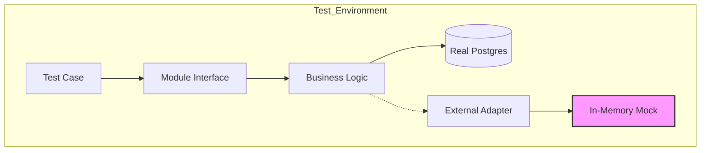
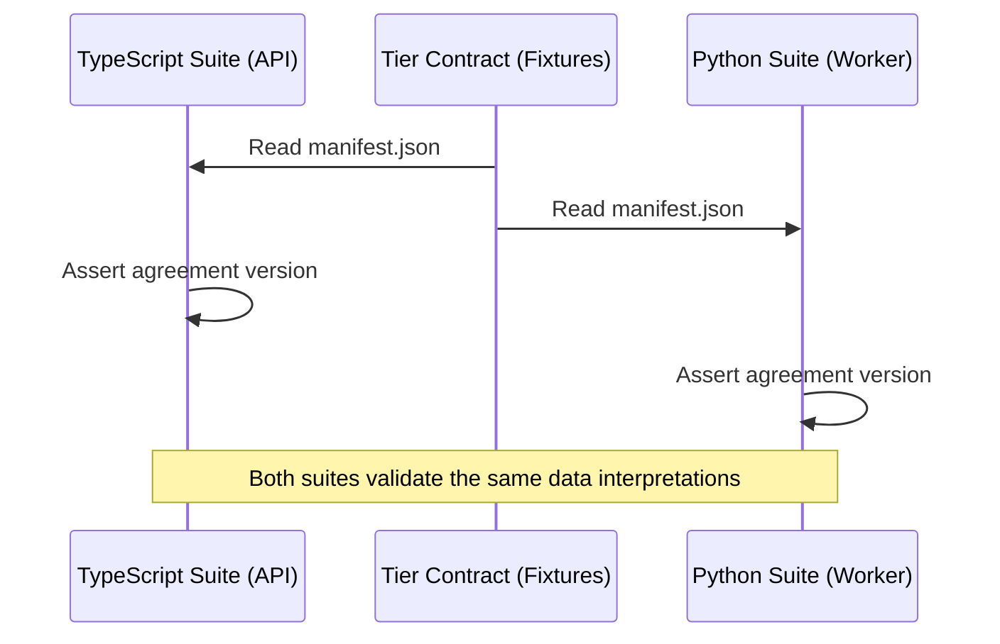

Relevant source files

The following files were used as context for generating this wiki page:

- [CODING_RULES.md](CODING_RULES.md)
- [apps/api/CODING_RULES.md](apps/api/CODING_RULES.md)
- [apps/worker/CODING_RULES.md](apps/worker/CODING_RULES.md)
- [contracts/README.md](contracts/README.md)
- [apps/worker/pyproject.toml](apps/worker/pyproject.toml)
- [package.json](package.json)
- [cubic.yaml](cubic.yaml)

# Full-Stack Testing Strategies

The Better Answers testing strategy prioritizes functional tests that exercise modules through their public interfaces against real infrastructure. This approach ensures that tests validate actual system behavior rather than implementation details or mocks. The strategy spans three primary tiers: the TypeScript API, the Python Worker, and the React Web application, all bound by a language-neutral tier contract.

Sources: [CODING_RULES.md:46-48](CODING_RULES.md#L46-L48), [AGENTS.md:18-35](AGENTS.md#L18-L35)

## Core Testing Principles

The project enforces strict rules to ensure test reliability and maintainability.

### Interface-Driven Testing
Tests exercise a module through the same seam that callers use. For `apps/api`, tests target endpoints; for `apps/worker`, tests target job or module entry points. Unit tests of internal helpers or private functions are discouraged. If testing through the interface is difficult, you must reshape the module.

Sources: [CODING_RULES.md:6-14](CODING_RULES.md#L6-L14), [CODING_RULES.md:46-53](CODING_RULES.md#L46-L53)

### Real Infrastructure and No Mocking
The system never mocks Postgres; every data-touching test runs against a real database instance using Testcontainers or a compose database. The project bans the mocking of internal modules (e.g., `vi.mock`). External services, such as LLMs or SaaS APIs, are replaced by in-memory implementations behind their respective adapters.

Sources: [CODING_RULES.md:55-61](CODING_RULES.md#L55-L61), [apps/api/CODING_RULES.md:17-19](apps/api/CODING_RULES.md#L17-L19)

### Factory-Based State Setup
Tests build state using factories that return domain objects. You must not use raw database inserts for test setup.

Sources: [CODING_RULES.md:63-64](CODING_RULES.md#L63-L64)

The diagram shows the test boundary where only external services are mocked, while the database and internal logic remain real.

## Tier-Specific Strategies

Each tier implements the core principles using tools appropriate for its language and environment.

| Tier | Primary Tooling | Strategy Focus |
| :--- | :--- | :--- |
| **API** (`apps/api`) | Vitest, Hono | Tests speak HTTP via `server.request()` to cross the application seam. |
| **Worker** (`apps/worker`) | pytest, Testcontainers | Validates knowledge connectors and indexing jobs against isolated database instances. |
| **Web** (`apps/web`) | Vitest, React Testing Library | Asserts user-visible interaction and state changes; avoids pure rendering tests. |
| **Schema** (`packages/schema`) | adversarial RLS tests | Asserts that Row Level Security (RLS) correctly denies unauthorized access. |

Sources: [apps/api/CODING_RULES.md:17-23](apps/api/CODING_RULES.md#L17-L23), [apps/worker/pyproject.toml:13-20](apps/worker/pyproject.toml#L13-L20), [apps/web/package.json:20-30](apps/web/package.json#L20-L30), [CODING_RULES.md:104-110](CODING_RULES.md#L104-L110)

### Cross-Tier Contract Testing
The `contracts/` directory contains language-neutral fixtures used by both TypeScript and Python tiers. This ensures that the API and Worker agree on database functions and data interpretations.
*  **sql-function**: Tests database behavior called by both tiers.
*  **fixtured**: Golden vectors read and interpreted identically by both suites.
*  **generated**: Produced from a single source to fixture meanings across tiers.

Sources: [contracts/README.md:1-20](contracts/README.md#L1-L20)

The sequence diagram illustrates how separate language suites synchronize their expectations using the shared contract.

## Quality and Coverage Enforcement

The project uses automated tools to maintain a high standard of test quality.

### Mutation Testing
Mutation testing runs on a scheduled basis (weekly or nightly) to evaluate test suite effectiveness.
*  **TypeScript**: Uses Stryker.
*  **Python**: Uses mutmut.
A falling mutation score triggers a manual task to improve coverage.

Sources: [CODING_RULES.md:68-72](CODING_RULES.md#L68-L72), [apps/worker/pyproject.toml:44-50](apps/worker/pyproject.toml#L44-L50)

### AI-Driven Review
The AI reviewer (Cubic) enforces pragmatic test coverage during Pull Requests. It flags changes to core business logic or UI behavior that lack corresponding success/failure path tests. It also rejects tests that only assert "existence" or use excessive mocking.

Sources: [cubic.yaml:81-93](cubic.yaml#L81-L93)

### The `check` Command
The root `package.json` provides a `check` script that executes all tier-specific linting, type checking, and testing commands. In the worker tier, `uv run --frozen check` runs ruff, mypy, and pytest sequentially.

Sources: [package.json:4-12](package.json#L4-L12), [apps/worker/CODING_RULES.md:14-16](apps/worker/CODING_RULES.md#L14-L16)

## Summary of Testing Constraints

Tests must follow specific naming and structure rules to remain valid:
*  **Titles**: Test titles state system behavior for specific users, not function names.
*  **Membership**: When a list names members (like migrations), tests must assert membership in both directions to find both missing items and orphans.
*  **Security**: Every privilege or RLS policy requires a functional test that proves it denies unauthorized paths.

Sources: [CODING_RULES.md:66-67](CODING_RULES.md#L66-L67), [CODING_RULES.md:74-78](CODING_RULES.md#L74-L78), [CODING_RULES.md:104-115](CODING_RULES.md#L104-L115)
